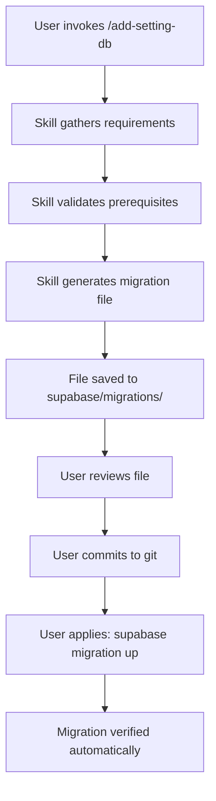

# Enhancement Summary: `/add-setting-db` Skill v2.0.0

**Date**: 2026-02-28
**Version**: 2.0.0 (from 1.0.0)
**Type**: Major Enhancement

---

## 🎯 What Was Enhanced

The `/add-setting-db` skill now **automatically generates production-ready migration files** instead of outputting SQL snippets for manual execution.

---

## 📊 Before vs After

| Aspect | Before (v1.0.0) | After (v2.0.0) |
|--------|-----------------|----------------|
| **Output** | SQL snippets in console | Complete migration file |
| **File Location** | N/A | `F:/jhapp/cleanmatex/supabase/migrations/` |
| **Naming** | Manual | Auto-numbered: `XXXX_add_setting_*.sql` |
| **Validation** | Manual execution | Built into migration |
| **Verification** | Manual queries | Built into migration |
| **Rollback** | Not documented | Documented in migration |
| **Version Control** | No | Yes - committed to git |
| **Deployment** | Manual copy-paste | `supabase migration up` |
| **Team Collaboration** | Difficult | Easy via git |
| **Auditability** | Limited | Full git history |

---

## 🚀 New Workflow



### Commands

```bash
# 1. Invoke skill
/add-setting-db

# 2. Review generated file
cat F:/jhapp/cleanmatex/supabase/migrations/0088_add_setting_*.sql

# 3. Apply migration
cd F:/jhapp/cleanmatex
supabase migration up

# 4. Commit to git
git add supabase/migrations/0088_*.sql
git commit -m "feat(settings): Add new setting"
git push
```

---

## 📄 Migration File Structure

Each generated migration file contains **7 sections**:

### 1. Header
```sql
-- ================================================================
-- Migration: Add Setting - MAX_CONCURRENT_ORDERS
-- ================================================================
-- Purpose: Maximum concurrent orders
-- Created: 2026-02-28
-- Components: Catalog, Profiles (2), Flags (NO), Plans (NO)
```

### 2. Section 1: Validation
- Setting existence check
- Category validation
- Profile validation
- Feature flag validation

### 3. Section 2: Catalog Entry
- Main setting definition
- All metadata (bilingual)
- Behavior flags
- UI hints

### 4. Section 3: Profile Values (Optional)
- Regional/segment defaults
- Override reasons
- Multiple profiles

### 5. Section 4: Feature Flags (Optional)
- Feature flag creation
- Dependency configuration

### 6. Section 5: Plan Mappings (Optional)
- Plan-specific values
- Limit configuration

### 7. Section 6: Verification
- Post-insert validation
- Success reporting
- Component counting

### 8. Section 7: Rollback
- Commented rollback instructions
- Undo SQL

---

## ✨ Key Features

### 🔢 Auto-Numbering
- Detects latest migration number
- Auto-increments to next available
- Example: `0087` → `0088`

### 📛 Smart Naming
- Sanitizes setting code for filename
- Format: `XXXX_add_setting_{sanitized_code}.sql`
- Example: `MAX_CONCURRENT_ORDERS` → `0088_add_setting_workflow_orders_max_concurrent.sql`

### ✅ Built-in Validation
- Pre-flight checks before insertion
- Prevents duplicate settings
- Validates foreign keys
- Clear error messages

### 🔍 Verification
- Post-insert validation
- Counts components created
- Confirms success
- Fails if catalog entry missing

### 🔄 Documented Rollback
- Rollback SQL included (commented)
- Reverse operation instructions
- Verification queries
- Safe undo process

---

## 📦 Files Updated

### 1. `skill.md` (Enhanced)
- Added Step 9: Generate Migration File
- Added complete migration template
- Added auto-detection logic
- Added example migrations
- Updated version to 2.0.0

### 2. `QUICK_START.md` (Enhanced)
- Updated workflow diagram
- Added migration file verification steps
- Added git commit instructions
- Added benefits section
- Updated checklist

### 3. `CHANGELOG.md` (New)
- Complete version history
- Detailed before/after comparison
- Benefits documentation
- Troubleshooting guide

### 4. `ENHANCEMENT_SUMMARY.md` (New - this file)
- High-level overview
- Quick reference
- Migration examples

---

## 🎁 Benefits

### For Developers
✅ No manual SQL copy-paste
✅ Consistent format
✅ Version controlled
✅ Easy to review
✅ Safe rollback

### For Teams
✅ Collaborative via git
✅ Code review in PRs
✅ Shared understanding
✅ No knowledge silos

### For Operations
✅ Repeatable deployments
✅ Environment consistency
✅ Automated pipelines
✅ Clear audit trail

### For Business
✅ Faster feature delivery
✅ Lower error rates
✅ Better compliance
✅ Reduced risk

---

## 📝 Example Output

When you run `/add-setting-db`, you'll see:

```
════════════════════════════════════════════════════════
✅ MIGRATION FILE GENERATED SUCCESSFULLY!
════════════════════════════════════════════════════════

Setting Code: MAX_CONCURRENT_ORDERS
Migration File: 0088_add_setting_workflow_orders_max_concurrent.sql
Location: F:/jhapp/cleanmatex/supabase/migrations/

📋 Components Included:
  ✓ Catalog Entry: YES
  ✓ Profile Values: 2 profiles
  ✓ Feature Flags: NO
  ✓ Plan Mappings: NO

📄 Migration File Sections:
  ✓ Section 1: Validation
  ✓ Section 2: Catalog Entry
  ✓ Section 3: Profile Values
  ✓ Section 6: Verification
  ✓ Section 7: Rollback

🎯 Next Steps:
  1. Review: cat F:/jhapp/cleanmatex/supabase/migrations/0088_*.sql
  2. Apply: supabase migration up
  3. Test: SELECT * FROM fn_stng_resolve_all_settings(...)
  4. Commit: git add supabase/migrations/0088_*.sql
  5. Deploy: Push to staging, then production
════════════════════════════════════════════════════════
```

---

## 🧪 Testing the Enhancement

### Local Test

```bash
# 1. Run skill
/add-setting-db

# 2. Verify file generated
ls -lh F:/jhapp/cleanmatex/supabase/migrations/0088_*.sql

# 3. Check file contents
cat F:/jhapp/cleanmatex/supabase/migrations/0088_*.sql | grep -E "^-- ===="

# 4. Apply migration
cd F:/jhapp/cleanmatex
supabase migration up

# 5. Verify in database
psql -c "SELECT * FROM sys_tenant_settings_cd WHERE setting_code = 'your.code';"
```

---

## 📚 Documentation

All documentation has been updated to reflect v2.0.0:

- ✅ `skill.md` - Full skill guide
- ✅ `QUICK_START.md` - Quick reference
- ✅ `CHANGELOG.md` - Version history
- ✅ `ENHANCEMENT_SUMMARY.md` - This file

---

## 🔗 Related Resources

- [Supabase Migrations](https://supabase.com/docs/guides/cli/local-development#database-migrations)
- [Settings Architecture](../../docs/dev/settings/architecture.md)
- [7-Layer Resolution](../../docs/dev/settings/resolution.md)
- [Database Conventions](../../.claude/docs/database_conventions.md)

---

## 📞 Support

- **GitHub Issues**: Report bugs or request features
- **Platform Team**: Contact for complex scenarios
- **Documentation**: See `/add-setting-db/skill.md` for full guide

---

## 🎉 Summary

The enhanced `/add-setting-db` skill v2.0.0 transforms setting creation from a **manual, error-prone process** into a **streamlined, version-controlled workflow** that generates production-ready migration files.

**Key Improvement**: From manual SQL execution → Automated migration file generation

**Impact**: Faster, safer, more collaborative setting creation

**Adoption**: Use `/add-setting-db` - migration files are now the default output!

---

**Version**: 2.0.0
**Date**: 2026-02-28
**Status**: ✅ Production Ready
