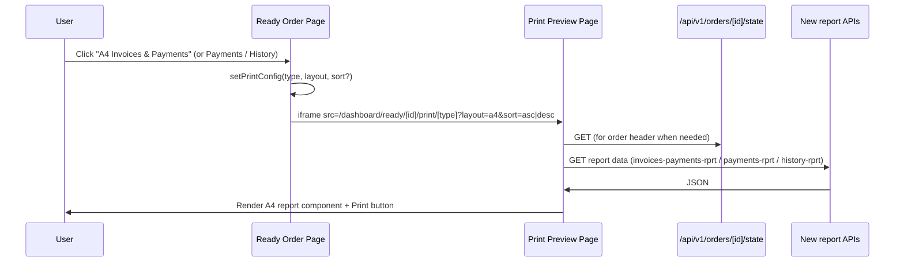

# A4 Order Reports – Preview/Print on Ready Order Page

## Naming rule (report-implement-or-build)

**New reports:** All new report **components**, **tools**, **screens**, **UI**, **API route paths**, **type/route segment values**, and **file names** must end with `**rprt**`.

- **Components:** `OrderInvoicesPaymentsPrintRprt`, `OrderPaymentsPrintRprt`, `OrderHistoryPrintRprt`
- **Files:** `order-invoices-payments-print-rprt.tsx`, `order-payments-print-rprt.tsx`, `order-history-print-rprt.tsx`
- **Route/type values:** `invoices-payments-rprt`, `payments-rprt`, `history-rprt`
- **API paths:** `report/invoices-payments-rprt`, `report/payments-rprt`
- **i18n keys (report UI):** e.g. `printInvoicesPaymentsA4Rprt`, `printOrderHistoryA4Rprt`

## Context

- **Page:** [web-admin/app/dashboard/ready/[id]/page.tsx](web-admin/app/dashboard/ready/[id]/page.tsx) — Ready order detail; already has four print buttons (receipt/order-details × thermal/A4) that open an iframe to the print route.
- **Print route:** [web-admin/app/dashboard/ready/[id]/print/[type]/page.tsx](web-admin/app/dashboard/ready/[id]/print/[type]/page.tsx) — `type` is `receipt` | `order-details`; supports `?layout=thermal|a4`; loads order via `/api/v1/orders/[id]/state` and renders [OrderReceiptPrint](web-admin/src/features/orders/ui/order-receipt-print.tsx) or [OrderDetailsPrint](web-admin/src/features/orders/ui/order-details-print.tsx). Uses shared print CSS variables and `@page` (A4 or 80mm).
- **Data:** Order state from existing state API. Invoices: `getInvoicesForOrder(orderId)` in [invoice-service](web-admin/lib/services/invoice-service.ts). Payments per invoice: `getPaymentHistory(invoiceId)` in [payment-service](web-admin/lib/services/payment-service.ts). Payments for order: `getPaymentsForOrder(orderId)` (ordered by `created_at` desc). Order history: `OrderService.getOrderHistory(orderId, tenantId)` via [GET /api/v1/orders/[id]/history](web-admin/app/api/v1/orders/[id]/history/route.ts) (from `org_order_history`, `done_at` desc).

## 1. Reports to implement

| Report                        | Description                                                       | Data source                                                                      | Sort                                                                 |
| ----------------------------- | ----------------------------------------------------------------- | -------------------------------------------------------------------------------- | -------------------------------------------------------------------- |
| **Order Invoices & Payments** | A4: order header + list of invoices with their payment lines      | `getInvoicesForOrder` + `getPaymentHistory(invoiceId)` per invoice               | Invoices by created_at desc; payments per invoice by created_at desc |
| **Order Payments**            | A4: order header + all payments for the order                     | `getPaymentsForOrder(orderId)`                                                   | Date: **Desc** (newest first) or **Asc** (oldest first)              |
| **Order History**             | A4: order header + timeline (action_type, from/to, done_at, etc.) | Existing `GET /api/v1/orders/[id]/history`                                       | Date desc (already)                                                  |
| **Suggested extra**           | **Order Status Timeline**                                         | `org_order_status_history` (from_status, to_status, changed_at, changed_by_name) | Date desc. Optional in scope.                                        |

All reports are **A4 only**; reuse existing print variables and `@page { size: A4 }` from the print page.

## 2. Architecture

- **Same page** = Ready order detail. New buttons live in the same “Actions” block (below existing print buttons), opening the **same iframe modal** with a new `printConfig` that includes the new report type and optional `sort`.
- **Route:** Reuse `ready/[id]/print/[type]` and extend `type` to: `receipt` | `order-details` | `invoices-payments-rprt` | `payments-rprt` | `history-rprt`. For `payments-rprt`, support `?sort=asc|desc` (default `desc`).
- **APIs:** Add two report data endpoints (history API exists; report endpoint for history-rprt can proxy or reuse it):
  - `GET /api/v1/orders/[id]/report/invoices-payments-rprt` — returns `{ order, invoices: [{ ...invoice, payments: [...] }] }` (order from state or minimal order; invoices from `getInvoicesForOrder`; payments from `getPaymentHistory` per invoice). Tenant from session.
  - `GET /api/v1/orders/[id]/report/payments-rprt?sort=asc|desc` — returns `{ order, payments }`; order from state (minimal); payments from `getPaymentsForOrder` with sort applied (see below). Tenant from session.
  - For `history-rprt`: keep using `GET /api/v1/orders/[id]/history`; print page fetches it when `type === 'history-rprt'` and also needs minimal order (e.g. orderNo, customer) from state API for the header.

## 3. Backend changes

- **Payment sort:** [getPaymentsForOrder](web-admin/lib/services/payment-service.ts) currently uses `orderBy: { created_at: 'desc' }`. Add an optional parameter (e.g. `sortOrder: 'asc' | 'desc'`) and pass it to `orderBy` so the payments report can request ascending or descending by date (use `created_at` or `paid_at` if preferred; keep one consistent field).
- **Report APIs (new):**
  - **Invoices-payments-rprt:** In a new route handler (e.g. `report/invoices-payments-rprt/route.ts`), get tenant from auth/session, load order (state API or minimal from DB with tenant), call `getInvoicesForOrder(id)`, then for each invoice call `getPaymentHistory(invoice.id)`. Return JSON suitable for the Invoices & Payments report (order header + list of invoices with nested payments). Enforce tenant (e.g. via existing tenant context / RLS).
  - **Payments-rprt:** Same auth/tenant; new route `report/payments-rprt/route.ts`; load minimal order; call `getPaymentsForOrder(id, sortOrder)` (once the service supports sort); return `{ order, payments }`.

## 4. Frontend – Ready order page

- In [web-admin/app/dashboard/ready/[id]/page.tsx](web-admin/app/dashboard/ready/[id]/page.tsx):
  - Extend `printConfig` state to allow new types: `invoices-payments-rprt` | `payments-rprt` | `history-rprt` and for `payments-rprt` an optional `sort: 'asc' | 'desc'`.
  - Add buttons (grouped under a “Reports” or “A4 reports” label if desired):
    - “A4 Invoices & Payments” → `openPrintPreview('invoices-payments-rprt', 'a4')`
    - “A4 Payments (newest first)” → `openPrintPreview('payments-rprt', 'a4', 'desc')`
    - “A4 Payments (oldest first)” → `openPrintPreview('payments-rprt', 'a4', 'asc')`
    - “A4 Order History” → `openPrintPreview('history-rprt', 'a4')`
  - Iframe `src` when `type` is `payments-rprt`: include `&sort=asc` or `&sort=desc` in the URL. Other report types use existing `?layout=a4` (all new reports use A4).

## 5. Frontend – Print page

- In [web-admin/app/dashboard/ready/[id]/print/[type]/page.tsx](web-admin/app/dashboard/ready/[id]/print/[type]/page.tsx):
  - Allow `type` in `PrintType`: `receipt` | `order-details` | `invoices-payments-rprt` | `payments-rprt` | `history-rprt`.
  - For `invoices-payments-rprt` | `payments-rprt` | `history-rprt`: force `layout = 'a4'` (ignore thermal).
  - Data loading:
    - For `receipt` and `order-details`: keep current fetch to `/api/v1/orders/[id]/state` and map to `ReadyOrder`.
    - For `invoices-payments-rprt`: fetch `/api/v1/orders/[id]/report/invoices-payments-rprt`; render `OrderInvoicesPaymentsPrintRprt` with returned payload.
    - For `payments-rprt`: fetch `/api/v1/orders/[id]/report/payments-rprt?sort=asc|desc` (from `searchParams`); render `OrderPaymentsPrintRprt`.
    - For `history-rprt`: fetch `/api/v1/orders/[id]/state` (for header) and `/api/v1/orders/[id]/history`; render `OrderHistoryPrintRprt`.
  - Reuse the same `<style>` block and `@page { size: A4 }` for these types; no new layout options for these reports.

## 6. New print components (A4) – all names end with `rprt`

- **OrderInvoicesPaymentsPrintRprt** — Component and file `order-invoices-payments-print-rprt.tsx`. Props: `{ data: { order, invoices } }` where each invoice has a `payments` array. Header: order no, customer; then for each invoice: invoice no, date, totals, status; then table or list of payments (date, amount, method). Use `.print-document`, `.print-header`, `.print-section`, `.print-footer` and existing CSS variables from the print page.
- **OrderPaymentsPrintRprt** — Component and file `order-payments-print-rprt.tsx`. Props: `{ order, payments, sortOrder }`. Header: order no, customer; table: date, amount, method, type, etc., ordered by date (already sorted from API). Same class names and A4 styling.
- **OrderHistoryPrintRprt** — Component and file `order-history-print-rprt.tsx`. Props: `{ order, history }`. Header: order no, customer; timeline/list: `done_at`, `action_type`, `from_value`, `to_value` (and optional user). Same print classes and A4 styling.

Place components under `web-admin/src/features/orders/ui/`: `order-invoices-payments-print-rprt.tsx`, `order-payments-print-rprt.tsx`, `order-history-print-rprt.tsx`. Use existing i18n (e.g. `orders`, `workflow.ready`, `common`) plus new keys only where needed.

## 7. i18n

- Reuse `common.print`, `common.loading`, `common.thanks` and existing `workflow.ready` keys where possible.
- Add under `workflow.ready.actions` (or similar) keys for the new report buttons (keys end with `Rprt` for report UI), e.g.:
  - `printInvoicesPaymentsA4Rprt`: "Print Invoices & Payments (A4)"
  - `printPaymentsA4DescRprt`: "Print Payments (A4, newest first)"
  - `printPaymentsA4AscRprt`: "Print Payments (A4, oldest first)"
  - `printOrderHistoryA4Rprt`: "Print Order History (A4)"
- Add any new section titles used only in reports (e.g. “Invoices & Payments”, “Payments”, “Order History”) in the same namespace or `orders`/`billing` as appropriate. Search [web-admin/messages/en.json](web-admin/messages/en.json) and [web-admin/messages/ar.json](web-admin/messages/ar.json) for existing keys before adding.

## 8. Suggested extra report (optional)

- **Order Status Timeline (A4):** Data from `org_order_status_history` (from_status, to_status, changed_at, changed_by_name) for the order. Per naming rule: type `status-timeline-rprt`, API `GET /api/v1/orders/[id]/report/status-timeline-rprt`, component **OrderStatusTimelinePrintRprt**, file `order-status-timeline-print-rprt.tsx`. Useful for workflow audit separate from general “order history”.

## 9. File summary (all report names end with `rprt`)

| Area                                                                                                                 | Action                                                                                                                                                                                    |
| -------------------------------------------------------------------------------------------------------------------- | ----------------------------------------------------------------------------------------------------------------------------------------------------------------------------------------- |
| [web-admin/app/dashboard/ready/[id]/page.tsx](web-admin/app/dashboard/ready/[id]/page.tsx)                           | Extend printConfig with types `invoices-payments-rprt`, `payments-rprt`, `history-rprt`; add 4 report buttons; iframe URL with optional `sort`                                            |
| [web-admin/app/dashboard/ready/[id]/print/[type]/page.tsx](web-admin/app/dashboard/ready/[id]/print/[type]/page.tsx) | Support types `invoices-payments-rprt`, `payments-rprt`, `history-rprt`; A4-only; fetch report APIs; render OrderInvoicesPaymentsPrintRprt, OrderPaymentsPrintRprt, OrderHistoryPrintRprt |
| New API routes under `web-admin/app/api/v1/orders/[id]/`                                                             | `report/invoices-payments-rprt/route.ts`, `report/payments-rprt/route.ts` (history data from existing `history/route.ts`)                                                                 |
| [web-admin/lib/services/payment-service.ts](web-admin/lib/services/payment-service.ts)                               | Add optional `sortOrder` to `getPaymentsForOrder`                                                                                                                                         |
| New components in `web-admin/src/features/orders/ui/`                                                                | `order-invoices-payments-print-rprt.tsx`, `order-payments-print-rprt.tsx`, `order-history-print-rprt.tsx` (components: PrintRprt)                                                         |
| [web-admin/messages/en.json](web-admin/messages/en.json), [web-admin/messages/ar.json](web-admin/messages/ar.json)   | New button keys ending with `Rprt` (e.g. `printInvoicesPaymentsA4Rprt`); reuse existing where possible                                                                                    |

## 10. Best practices applied

- **Tenant:** All report APIs use session tenant and existing service layer (withTenantContext / getTenantIdFromSession); no new DB access without tenant.
- **Reuse:** Same print route, same iframe modal, same CSS variables and `@page` A4; same i18n pattern.
- **Single place for print styling:** All A4 report components use the same `.print-document` / `.print-header` / `.print-section` / `.print-footer` classes and variables defined in the print page (see [print-customization-guide.md](docs/dev/print-customization-guide.md)).
- **Bilingual:** New copy in both en.json and ar.json; RTL respected via existing `useRTL` in print components where needed.
- **No DB reset or migrations** required; only new API routes and optional `sortOrder` on existing service.
