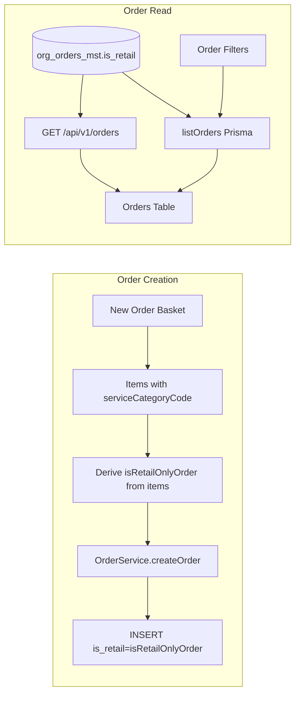

# Add is_retail Column to org_orders_mst

## Context

Retail orders (all items with `service_category_code === 'RETAIL_ITEMS'`) are currently detected by iterating items. Adding `is_retail` on the order provides:

- Single source of truth for existing orders
- Efficient filtering (`WHERE is_retail = true`) without joining items
- Simpler reporting and analytics
- Consistency with `is_order_quick_drop` pattern on the same table

**Scope**: New Order UI (basket) continues to derive `isRetailOnlyOrder` from items since no order exists yet. The column is used everywhere after order creation.

## Implementation

### 1. Database Migration

Create `supabase/migrations/0104_add_is_retail_to_org_orders_mst.sql`:

- Add column: `is_retail BOOLEAN NOT NULL DEFAULT false`
- Backfill existing retail orders:
  ```sql
  UPDATE org_orders_mst o
  SET is_retail = true
  WHERE o.service_category_code = 'RETAIL_ITEMS'
    AND NOT EXISTS (
      SELECT 1 FROM org_order_items_dtl oi
      WHERE oi.order_id = o.id AND oi.tenant_org_id = o.tenant_org_id
        AND (oi.service_category_code IS NULL OR oi.service_category_code != 'RETAIL_ITEMS')
    );
  ```
- Add partial index for filter performance: `CREATE INDEX idx_orders_is_retail ON org_orders_mst(tenant_org_id, is_retail) WHERE is_retail = true;`
- `COMMENT ON COLUMN org_orders_mst.is_retail IS 'True when order contains only retail items (RETAIL_ITEMS); skips laundry workflow.';`

### 2. OrderService: Set is_retail on Insert

In [web-admin/lib/services/order-service.ts](web-admin/lib/services/order-service.ts):

- In `insertPayload` (~line 326), add: `is_retail: isRetailOnlyOrder`

### 3. Prisma Schema

In [web-admin/prisma/schema.prisma](web-admin/prisma/schema.prisma), add to `org_orders_mst` model (near `is_order_quick_drop`):

```prisma
is_retail                       Boolean?                          @default(false)
```

Then run `npx prisma generate` after migration is applied.

### 4. TypeScript Types

- [web-admin/types/order.ts](web-admin/types/order.ts): Add `is_retail?: boolean` to `Order` and `OrderListItem` interfaces
- Regenerate Supabase types after migration: `supabase gen types typescript` (or use MCP) so [web-admin/types/database.generated.ts](web-admin/types/database.generated.ts) includes `is_retail` for `org_orders_mst`

### 5. Order Filters: Schema and Data Layer

- [web-admin/lib/validations/order-schema.ts](web-admin/lib/validations/order-schema.ts): Add `isRetail: z.enum(['true', 'false']).optional()` to `orderFiltersSchema`
- [web-admin/types/order.ts](web-admin/types/order.ts): Add `isRetail?: 'true' | 'false'` to `OrderFilters`
- [web-admin/lib/db/orders.ts](web-admin/lib/db/orders.ts) in `listOrders`:
  - Destructure `isRetail` from filters
  - Add `if (isRetail === 'true') where.is_retail = true; if (isRetail === 'false') where.is_retail = false;`
  - In `orderList` mapping, add `is_retail: order.is_retail ?? false`

### 6. Orders Page and Filters Bar

- [web-admin/app/dashboard/orders/page.tsx](web-admin/app/dashboard/orders/page.tsx): Add `isRetail?: string` to `OrdersSearchParams` and pass `isRetail: params.isRetail` to filters
- [web-admin/app/dashboard/orders/components/order-filters-bar.tsx](web-admin/app/dashboard/orders/components/order-filters-bar.tsx): Add retail filter dropdown:
  - Options: All / Retail only / Services only
  - Use `handleFilterChange('isRetail', value)` with values `''`, `'true'`, `'false'`
  - Include `isRetail` in clear-filters check

### 7. Orders Table: Display Retail Badge

- [web-admin/app/dashboard/orders/components/orders-simple-table.tsx](web-admin/app/dashboard/orders/components/orders-simple-table.tsx): In the status/customer cell area, show a small "Retail" badge when `order.is_retail === true` (reuse `t('retail')` or `tCommon('retail')` from messages)

### 8. API GET /api/v1/orders

- [web-admin/app/api/v1/orders/route.ts](web-admin/app/api/v1/orders/route.ts): Add `is_retail` to `baseSelect`, add optional `is_retail` query param support: when `is_retail=true` filter `.eq('is_retail', true)`, when `is_retail=false` filter `.eq('is_retail', false)`

### 9. Order Detail Page (Optional)

- [web-admin/app/dashboard/orders/[id]/order-detail-client.tsx](web-admin/app/dashboard/orders/[id]/order-detail-client.tsx): If order data includes `is_retail`, show "Retail Order" badge in header. Ensure `getOrderById` in lib/db/orders or the detail API returns `is_retail` (Prisma includes all columns by default).

### 10. deduct_retail_stock_for_order

- No change needed. The RPC `deduct_retail_stock_for_order` uses item data to determine what to deduct. `is_retail` on the order is redundant for this logic; keeping current behavior is correct.

### 11. i18n

- Reuse `retail` key from [web-admin/messages/en.json](web-admin/messages/en.json) (already at `newOrder.retail` or similar). Add `orders.retailOnly` and `orders.servicesOnly` for filter options if not present. Search existing keys first per project rules.

### 12. Documentation

- Update [docs/features/010_advanced_orders/NEW_ORDER_QUICK_REFERENCE.md](docs/features/010_advanced_orders/NEW_ORDER_QUICK_REFERENCE.md) and [NEW_ORDER_PAGE_DOCUMENTATION.md](docs/features/010_advanced_orders/NEW_ORDER_PAGE_DOCUMENTATION.md) to mention `is_retail` column and that it is set at creation for retail-only orders.

## Data Flow



## Files to Modify

| File                                                                                                                                   | Change                                                |
| -------------------------------------------------------------------------------------------------------------------------------------- | ----------------------------------------------------- |
| `supabase/migrations/0104_add_is_retail_to_org_orders_mst.sql`                                                                         | New migration: add column, backfill, index, comment   |
| [web-admin/lib/services/order-service.ts](web-admin/lib/services/order-service.ts)                                                     | Add `is_retail: isRetailOnlyOrder` to insertPayload   |
| [web-admin/prisma/schema.prisma](web-admin/prisma/schema.prisma)                                                                       | Add `is_retail` to org_orders_mst                     |
| [web-admin/types/order.ts](web-admin/types/order.ts)                                                                                   | Add `is_retail` to Order, OrderListItem, OrderFilters |
| [web-admin/lib/validations/order-schema.ts](web-admin/lib/validations/order-schema.ts)                                                 | Add isRetail to orderFiltersSchema                    |
| [web-admin/lib/db/orders.ts](web-admin/lib/db/orders.ts)                                                                               | Add is_retail filter and mapping in listOrders        |
| [web-admin/app/dashboard/orders/page.tsx](web-admin/app/dashboard/orders/page.tsx)                                                     | Add isRetail to search params and filters             |
| [web-admin/app/dashboard/orders/components/order-filters-bar.tsx](web-admin/app/dashboard/orders/components/order-filters-bar.tsx)     | Add retail filter dropdown                            |
| [web-admin/app/dashboard/orders/components/orders-simple-table.tsx](web-admin/app/dashboard/orders/components/orders-simple-table.tsx) | Show retail badge when is_retail                      |
| [web-admin/app/api/v1/orders/route.ts](web-admin/app/api/v1/orders/route.ts)                                                           | Add is_retail to select and query filter              |
| [web-admin/app/dashboard/orders/[id]/order-detail-client.tsx](web-admin/app/dashboard/orders/[id]/order-detail-client.tsx)             | Optional: show retail badge in header                 |
| [web-admin/messages/en.json](web-admin/messages/en.json), [ar.json](web-admin/messages/ar.json)                                        | Add filter labels if needed                           |
| docs (NEW*ORDER*.md)                                                                                                                   | Document is_retail column                             |

## Testing Checklist

- Create retail-only order via New Order; verify `is_retail = true` in DB
- Create service order; verify `is_retail = false`
- Filter orders by "Retail only"; verify only retail orders
- Filter by "Services only"; verify no retail orders
- Verify retail badge in orders table
- Verify GET /api/v1/orders?is_retail=true returns only retail orders
- Run `npm run build` and fix any type errors
- Run `npm run check:i18n` after translation changes
