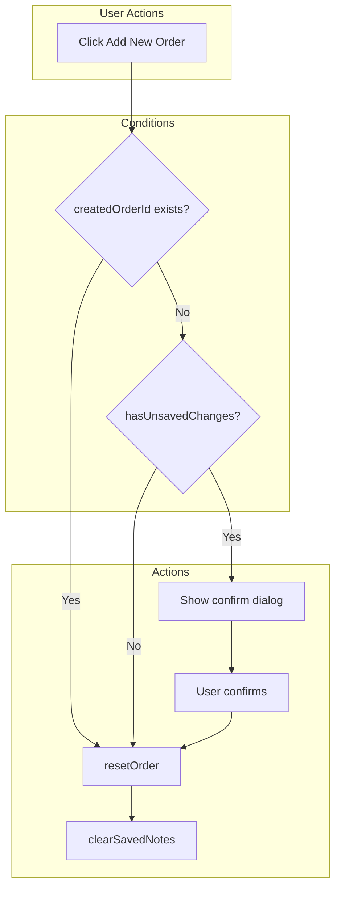

# Add New Order Button - Implementation Plan

## Summary

Add an "Add New Order" button that lets users start a fresh order without navigating away. The button will appear in the New Order screen with scenario-specific behavior: no confirmation after successful creation, confirmation when unsaved changes exist, and straightforward reset when empty.

## Context

- **Existing infrastructure**: `resetOrder()` in [use-new-order-state.ts](web-admin/src/features/orders/hooks/use-new-order-state.ts) dispatches `RESET_ORDER`, clearing customer, items, notes, readyByAt, createdOrderId while preserving catalog data (categories/products).
- **Current post-creation**: [new-order-content.tsx](web-admin/src/features/orders/ui/new-order-content.tsx) lines 404-414 show only "Go to Order" (or "Go to Preparation" / "Go to Processing") in a blue footer bar.
- **Unsaved logic**: [use-unsaved-changes.ts](web-admin/src/features/orders/hooks/use-unsaved-changes.ts) considers unsaved when `items.length > 0 || notes.trim() || customer !== null`.

## Scenarios

| Scenario            | Condition                         | Button Behavior                                                        |
| ------------------- | --------------------------------- | ---------------------------------------------------------------------- |
| **Post-success**    | `createdOrderId` is set           | Show button; click resets immediately (no confirm)                     |
| **Unsaved changes** | Items, notes, or customer present | Show button; click opens confirmation dialog                           |
| **Empty**           | No items, no customer, no notes   | Button optional (can show for consistency; reset is effectively no-op) |

## Implementation

### 1. Add i18n Keys

Add to `newOrder` namespace in both [en.json](web-admin/messages/en.json) and [ar.json](web-admin/messages/ar.json):

- `addNewOrder`: "Add New Order" / "إضافة طلب جديد"
- `warnings.discardAndNewOrder`: "You have unsaved changes. Discard and start a new order?" / Arabic equivalent
- `warnings.discardAndNewOrderTitle`: "Discard changes?" / Arabic equivalent

Reuse `common.cancel` and `common.confirm` (or `common.discard`) for dialog buttons if they exist; otherwise add dialog-specific labels.

### 2. Place "Add New Order" Button

**Primary placement**: In [new-order-content.tsx](web-admin/src/features/orders/ui/new-order-content.tsx), in the right sidebar:

- **When `createdOrderId` exists** (post-creation): Add "Add New Order" as a secondary/outline button alongside "Go to Order". Layout: two buttons stacked or side-by-side (RTL-aware). Clicking resets (`resetOrder()` + `clearSavedNotes()`).
- **When editing (no createdOrderId)**: Add "Add New Order" as a secondary button in the Order Summary panel header area or above the submit bar. Click triggers confirmation flow.

Use a single button that changes behavior based on state: if `createdOrderId` → direct reset; else if `hasUnsavedChanges` → show confirm dialog; else → direct reset.

### 3. Confirmation Dialog Flow

When user clicks "Add New Order" and there are unsaved changes:

1. Show confirmation using `CmxAlertDialog` (from `@ui/feedback/components/cmx-alert-dialog`) with `variant="warning"`, `open`, `onConfirm`, `onCancel`.
2. On confirm: call `state.resetOrder()`, `clearSavedNotes()` (if applicable), close dialog.
3. On cancel: close dialog only.

Alternatively use `window.confirm()` for consistency with other flows (e.g. [customer-addresses-section](web-admin/app/dashboard/customers/[id]/components/customer-addresses-section.tsx)), but `CmxAlertDialog` provides better UX and i18n.

### 4. Handler Logic

```ts
const handleAddNewOrder = useCallback(() => {
  if (state.state.createdOrderId) {
    // Post-success: no confirmation
    state.resetOrder();
    clearSavedNotes?.();
    return;
  }
  const hasUnsaved =
    state.state.items.length > 0 ||
    (state.state.notes?.trim().length ?? 0) > 0 ||
    state.state.customer !== null;
  if (hasUnsaved) {
    setShowDiscardConfirm(true);
  } else {
    state.resetOrder();
  }
}, [state, clearSavedNotes]);
```

On confirm from dialog:

```ts
const handleConfirmDiscard = useCallback(() => {
  state.resetOrder();
  clearSavedNotes?.();
  setShowDiscardConfirm(false);
}, [state, clearSavedNotes]);
```

### 5. Notes Persistence

When resetting via "Add New Order", call `clearSavedNotes()` (from [use-notes-persistence](web-admin/src/features/orders/hooks/use-notes-persistence.ts) - exposed via `useNotesPersistence` in new-order-content) so the next order does not load the discarded notes.

### 6. UI Placement Detail

In [new-order-content.tsx](web-admin/src/features/orders/ui/new-order-content.tsx):

- **Post-creation block (lines 404-414)**: Replace single button with a flex container:
  - "Add New Order" (secondary/outline, `variant="secondary"` or outline)
  - "Go to Order" (primary, existing behavior)
  - Order: "Add New Order" first (LTR) so it’s the primary action for starting another order; "Go to Order" second.
- **Persistent placement**: Add "Add New Order" in the Order Summary area (e.g. compact link or icon button in header) so it’s available when there is no `createdOrderId`. This avoids users having to submit or navigate to see the option.

Recommended: Show "Add New Order" in both:

1. Post-creation footer (next to "Go to Order")
2. Order Summary panel header (small link/button) when not in post-creation state

### 7. Accessibility and RTL

- Use `useRTL()` for layout (`flex-row-reverse` when RTL).
- `aria-label` for icon-only or ambiguous buttons.
- Focus management: after dialog close, focus returns to "Add New Order" button or a logical target.

### 8. Files to Modify

| File                                                                                             | Changes                                                                                                                                                  |
| ------------------------------------------------------------------------------------------------ | -------------------------------------------------------------------------------------------------------------------------------------------------------- |
| [new-order-content.tsx](web-admin/src/features/orders/ui/new-order-content.tsx)                  | Add `handleAddNewOrder`, `handleConfirmDiscard`, `showDiscardConfirm` state, CmxAlertDialog, "Add New Order" button(s), post-creation dual-button layout |
| [en.json](web-admin/messages/en.json)                                                            | Add `addNewOrder`, `warnings.discardAndNewOrder`, `warnings.discardAndNewOrderTitle` under `newOrder`                                                    |
| [ar.json](web-admin/messages/ar.json)                                                            | Same keys with Arabic translations                                                                                                                       |
| [order-summary-panel.tsx](web-admin/app/dashboard/orders/new/components/order-summary-panel.tsx) | Optional: add `onAddNewOrder` prop and render compact "Add New Order" in header when provided                                                            |

### 9. Optional: Keyboard Shortcut

When on `/dashboard/orders/new`, Ctrl+N (or Cmd+N) could trigger "Add New Order" instead of navigating (QuickActionsStrip uses Ctrl+N for "New Order"). That would require:

- Checking `pathname === '/dashboard/orders/new'` in QuickActionsStrip or a global shortcut handler
- Dispatching reset when already on new order page

This can be a follow-up; not required for the initial enhancement.

## Data Flow



## Testing Checklist

- Post-success: Click "Add New Order" → form clears, no dialog
- Unsaved: Add items, click "Add New Order" → dialog appears; confirm → form clears
- Unsaved: Cancel dialog → form unchanged
- Empty: Click "Add New Order" → no dialog, form stays empty
- RTL: Buttons and dialog layout correct
- i18n: Run `npm run check:i18n` and verify EN/AR parity
