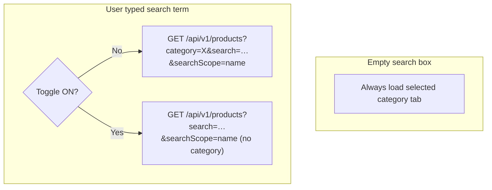

# New Order — search all categories toggle

## Behavior (confirmed)



| State | Grid data |
|-------|-----------|
| Search empty | Selected category only (unchanged) — **toggle has no effect until user types** |
| Search + toggle **OFF** | Match names within selected category |
| Search + toggle **ON** | Match names across **all** active tenant products |
| Page navigation | `CmxPagination` — one page at a time (replaces Load more) |
| Page size / API `limit` | From [`ORDER_DEFAULTS`](web-admin/lib/constants/order-defaults.ts) only |

Toggle default: **OFF**. Toggle + current page + page size live in the hook for the session (not persisted to DB).

---

## Production blockers (must fix — not optional)

### 1. RBAC mismatch on `GET /api/v1/products`

**Bug:** Route gates on `catalog:read` ([`route.ts` L82](web-admin/app/api/v1/products/route.ts)), but front-line roles use **`products:read`**:

- Cashier / receptionist seeded with `products:read` in [`0374_rbac_all_laundry_tenant_roles.sql`](supabase/migrations/0374_rbac_all_laundry_tenant_roles.sql)
- `catalog:read` appears only in legacy nav seed strings — **not** in `sys_auth_permissions` / cashier defaults

**Fix (same PR):**

```typescript
const authCheck = await requireAnyPermission(['products:read', 'catalog:read'])(request)
```

Use `requireAnyPermission` from [`require-permission.ts`](web-admin/lib/middleware/require-permission.ts). Prefer **`products:read`** as the documented permission (`catalog:read` is legacy nav text, not seeded in `sys_auth_permissions`). `requireAnyPermission` keeps catalog-admin paths working if `catalog:read` is ever seeded. No new migration — `products:read` exists in DB.

**Verify:** Log in as **cashier** → New Order → products load (200, not 403).

### 2. Access contract drift

[`orders-access.ts`](web-admin/src/features/orders/access/orders-access.ts) documents `GET /api/v1/products` as auth-only, but runtime enforces permission. Update `apiDependencies` for `/dashboard/orders/new`:

- `enforcement: 'permission'`
- `requirement.permissions`: `['products:read']` (matches DB; `catalog:read` is nav-only string — **not** in `sys_auth_permissions`)
- `notes`: New Order uses `searchScope=name`; global toggle omits `category` param; `limit`/`page` from client pagination

Also update [`catalog-access.ts`](web-admin/src/features/catalog/access/catalog-access.ts) list-products dependency: change `catalog:read` → `products:read` (or `['products:read', 'catalog:read']` in notes) so contract matches runtime `requireAnyPermission`.

**Do not** hand-edit `page-access-registry.ts` unless `register:ui-access-contract --fix` fails.

Golden path:

```bash
npm run wire:ui-access-contract -- --feature=orders --fix
npm run check:ui-access-contract -- --route=/dashboard/orders/new --wire --verbose
npm run sync:ui-access-contract
npm run rebuild:platform-info-inventories -- --surface=api --scope=/api/v1/products
```

### 3. Auth handler regression (already fixed — verify in PR)

Confirm [`instanceof NextResponse`](web-admin/app/api/v1/products/route.ts) guard remains; returning `AuthContext` on success caused 500 in production.

---

## Backend (search scope)

**No schema changes.** Category filter is already optional in [`catalog.service.ts`](web-admin/lib/services/catalog.service.ts).

Name search columns (`searchScope=name`): `product_name`, `product_name2`, `hint_text` via [`product-search.ts`](web-admin/lib/utils/product-search.ts).

---

## 0. Order defaults — page size authority

**File:** [`order-defaults.ts`](web-admin/lib/constants/order-defaults.ts)

Single source for **both** the API `limit` query param and the grid page size:

```typescript
LIMITS: {
  PRODUCTS_PER_CATEGORY: 20, // default page size (name kept for backward compat)
  PRODUCTS_PAGE_SIZE_OPTIONS: [10, 20, 50, 100] as const, // must include PRODUCTS_PER_CATEGORY (20)
  // ...
}
```

Rules:

- `fetchProductsPage` sends `limit: pageSize` where `pageSize` defaults to `ORDER_DEFAULTS.LIMITS.PRODUCTS_PER_CATEGORY`.
- `CmxPagination` `pageSizeOptions` = `ORDER_DEFAULTS.LIMITS.PRODUCTS_PAGE_SIZE_OPTIONS` (API max is 100 per [`route.ts`](web-admin/app/api/v1/products/route.ts) L126).
- Do **not** hardcode `10`, `20`, or `100` in the hook or grid.
- Adjust `PRODUCTS_PER_CATEGORY` in one place if ops wants a different default — **confirmed: 20** for this implementation.

---

## 1. Hook — pagination + fetch scope + toggle state

**File:** [`use-category-products.ts`](web-admin/src/features/orders/hooks/use-category-products.ts)

**Replace `useInfiniteQuery` with `useQuery`** (page-based, not append/load-more).

- Refactor `fetchProductsPage(page, pageSize, search, category?: string)` — add `category` to `URLSearchParams` **only when defined** (do not send empty string).
- **Required:** single global `productSearch` string (replace per-category map). `setProductSearch` must **not** no-op when `category` is null (brief mount race).
- Add `searchAllCategories` + `setSearchAllCategories`.
- Add `currentPage` + `setCurrentPage` (default `1`).
- Add `pageSize` + `setPageSize` (default `ORDER_DEFAULTS.LIMITS.PRODUCTS_PER_CATEGORY`).
- Effective category:

```typescript
const isGlobalSearch = searchAllCategories && debouncedSearch.trim().length > 0
const browseCategory = isGlobalSearch ? undefined : category ?? undefined
```

- Query key: `['products', browseCategory ?? '__all__', debouncedSearch, searchAllCategories, currentPage, pageSize]`
- `enabled: !!category` (browse still needs a selected tab).
- **Reset `currentPage` to 1** when `category`, `debouncedSearch`, `searchAllCategories`, or `pageSize` changes (`useEffect`).
- **Stale page clamp:** after fetch, if `currentPage > totalPages` and `totalPages > 0`, set page to `totalPages` (or `1` when `totalPages === 0`).
- **UX — use `keepPreviousData`:** import from `@tanstack/react-query` and set `placeholderData: keepPreviousData` (not `(d) => d` alone — `currentPage` is in the query key, so page changes need cross-key placeholder). Prevents skeleton flash on page/search/toggle changes.
- **Loading flags (critical):**
  - `SET_PRODUCTS_LOADING`: `query.isLoading && !query.data` only (first load / cold cache).
  - Expose `isFetching` for grid pagination disabled state and optional subtle opacity — **do not** swap entire grid to `ProductGridSkeleton` on page change.
  - Update [`new-order-content.tsx`](web-admin/src/features/orders/ui/new-order-content.tsx) skeleton gate to match (same condition as hook).
- Return `products` (current page only), `productsTotal`, `totalPages`, `currentPage`, `pageSize`, setters, `isFetching`, `isSearchPending`. Remove `loadedCount` / infinite-query fields.
- `SET_PRODUCTS` dispatch receives **current page** products only (cart `items` are separate — safe).
- **Errors:** `useEffect` on `query.isError` in `new-order-content` → `cmxMessage.error` with translated message; distinguish 403 vs 504 timeout if `error.message` includes status.

---

## 2. UI — search toolbar + pagination footer

**File:** [`product-grid.tsx`](web-admin/src/features/orders/ui/product-grid.tsx)

Compact toolbar row (wraps on mobile):

| Element | Notes |
|---------|--------|
| `CmxInput` | Existing search |
| `CmxSwitch` + `Label` | `id="new-order-search-all-categories"` |
| Help | `searchAllCategoriesHelp` via `aria-describedby` on switch |

Props: `searchAllCategories`, `onSearchAllCategoriesChange`, `isGlobalSearch`.

- When `isGlobalSearch`: show `searchingAllCategories` hint.
- When global search empty results: use dedicated `noGlobalSearchResultsHint` (differs from category-only empty).
- Toggle **remains enabled** when search is empty; help text explains it applies when typing.

**Pagination (replaces Load more):**

- Remove `hasMoreProducts`, `isLoadingMore`, `onLoadMore`, and the Load more `LoadingButton`.
- Add `CmxPagination` from `@ui/navigation` below the product grid when `productsTotal > 0`:

```typescript
<CmxPagination
  currentPage={currentPage}
  totalPages={totalPages}
  pageSize={pageSize}
  totalItems={productsTotal}
  onPageChange={onPageChange}
  onPageSizeChange={onPageSizeChange}
  pageSizeOptions={[...ORDER_DEFAULTS.LIMITS.PRODUCTS_PAGE_SIZE_OPTIONS]}
  showWhenSinglePage={true}
/>
```

- Remove the redundant top `showingProductsCount` line — `CmxPagination` `showInfo` shows `1-20 of 45`.
- Pass `isFetching` to disable pagination buttons / set `aria-busy` on grid wrapper while refetching.
- On `onPageChange`, scroll grid container into view if needed (optional polish).
- **i18n note:** `CmxPagination` hardcodes English `"Rows per page:"` today (app-wide). For production AR parity on New Order, either:
  - **(Preferred minimal)** Add optional `labels?: { rowsPerPage?: string }` prop to [`cmx-pagination.tsx`](web-admin/src/ui/navigation/cmx-pagination.tsx) and pass `tCommon('rowsPerPage')` from grid (keys exist in `messages/en.json` / `ar.json`), or
  - Document as follow-up if time-boxed (other admin tables share the same gap).

**File:** [`new-order-content.tsx`](web-admin/src/features/orders/ui/new-order-content.tsx)

- Pass hook pagination + toggle fields to `ProductGrid`.
- Remove `fetchNextPage` / `hasNextPage` wiring.
- `getCategoryLabel(code)` from `state.state.categories` + `useBilingual`; **fallback** to `code` if product category not in enabled list.

---

## 3. Product cards — category badge

**File:** [`product-card.tsx`](web-admin/src/features/orders/ui/product-card.tsx)

- Optional `categoryLabel?: string` above product name (only when `isGlobalSearch`).

---

## 4. i18n (EN + AR)

Under `newOrder.itemsGrid`:

| Key | EN |
|-----|-----|
| `searchAllCategories` | Search all categories |
| `searchAllCategoriesHelp` | When you search, include products from every service category |
| `searchingAllCategories` | Searching all categories |
| `noGlobalSearchResultsHint` | No products matched across all categories. Try another name or turn off “Search all categories”. |

Remove or keep unused keys: `loadMoreProducts`, `showingProductsCount` — remove if nothing references them after pagination footer (grep before delete).

Run `npm run check:i18n`.

---

## 5. Edge cases (handled by design)

| Case | Behavior |
|------|----------|
| Toggle ON, search empty | Category browse unchanged (user confirmed) |
| Global search returns retail + service items | `handleAddItem` already blocks mixed retail/service cart — user may see item but gets existing error toast |
| Toggle flip while search active | Query key change refetches; `placeholderData` reduces flicker; page resets to 1 |
| Category tab switch with search text | Global search still cross-category; local search re-scopes to new tab; page resets to 1 |
| User on page 3 changes page size | Reset to page 1; new `limit` in API request |
| Items added on page 1, user goes to page 2 | Cart keeps items; grid shows page 2 only |
| Search narrows while on page 3 | Page resets to 1 via effect; clamp if API returns `totalPages < currentPage` |
| `hint_text` match | Included in `searchScope=name` — intentional |
| Placeholder shows wrong category briefly | Acceptable with `keepPreviousData`; `isFetching` signals refresh |

---

## 6. Validation

**Automated**

- `npx eslint` on touched `web-admin/src/features/orders/**` + `app/api/v1/products/route.ts` + `cmx-pagination.tsx` if i18n labels added
- `npm run build` in `web-admin`
- `npm run check:i18n` after message changes
- `npm run check:ui-access-contract -- --route=/dashboard/orders/new --wire`
- Existing [`product-search.test.ts`](web-admin/__tests__/utils/product-search.test.ts) still passes

**Manual (cashier role)**

1. Empty search + toggle on/off → same category grid
2. Search + toggle off → Network has `category=…`
3. Search + toggle on → Network has **no** `category`
4. Pagination: page 2 request has `page=2`; prev/next work; range shows e.g. `11-20 of 45`
5. Page size selector changes `limit` param to value from `ORDER_DEFAULTS.LIMITS.PRODUCTS_PAGE_SIZE_OPTIONS`
6. Global results show category badge; RTL layout on pagination + switch
7. **403 test before RBAC fix / 200 after**
8. Page change does **not** show full skeleton (only first load)
9. Arabic locale: pagination footer uses translated `rowsPerPage` if labels prop added

---

## Known risks / follow-ups

| Risk | Mitigation in plan |
|------|---------------------|
| `catalog:read` not in DB | API uses `products:read`; `catalog:read` in `requireAnyPermission` is harmless fallback |
| `CmxPagination` English strings | Optional `labels` prop + `tCommon('rowsPerPage')` |
| POST `/api/v1/products` has no RBAC | Out of scope — catalog create is separate hardening |
| Global search shows retail items | Existing `handleAddItem` cart guard + toast |

---

## Out of scope

- Persisting toggle to user/tenant settings
- Browsing all categories without a search term
- New DB permission codes (use existing `products:read`)
- Changing sort order for global vs local search (keep `sortBy=name&sortOrder=asc`)
