# Cancel Order and Return Order — Implementation Plan

## Executive Summary

This plan covers two distinct flows:

1. **Cancel Order**: Order is voided **before** the customer receives items (draft through out_for_delivery). No physical return — items never left or are still at facility.
2. **Return Order**: **Customer-initiated** — customer comes to the facility with items they received (delivered or picked up), wants to cancel and return them. Order is voided + refund processed.

Both flows must follow best practices, have no gaps, and be ready for production use.

**DB migrations:** Always create new migration files (e.g. 0126, 0127). Never modify existing migration files (0075, 0076, 0023, etc.). Use `CREATE OR REPLACE` in new migrations to extend functions.

---

## Current State Analysis

### Cancel Order (Partial Implementation)


| Component                                        | Status                                                                            | Gap                                                                                                                                                |
| ------------------------------------------------ | --------------------------------------------------------------------------------- | -------------------------------------------------------------------------------------------------------------------------------------------------- |
| Status transition to `cancelled`                 | Exists                                                                            | DB function `cmx_order_transition`                                                                                                                 |
| UI Cancel button                                 | Exists in [order-actions.tsx](web-admin/src/features/orders/ui/order-actions.tsx) | No reason capture                                                                                                                                  |
| `cancelled_at`, `cancelled_by`, `cancelled_note` | **Missing**                                                                       | Columns commented out in [0023_workflow_transition_function.sql](supabase/migrations/0023_workflow_transition_function.sql); not in org_orders_mst |
| Payment handling on cancel                       | **Missing**                                                                       | No automatic cancel/refund of payments when order is cancelled                                                                                     |
| Cancellation policy (time window)                | **Missing**                                                                       | No configurable "cancel X hours before pickup"                                                                                                     |
| Cancel reason (required)                         | **Missing**                                                                       | Notes optional; no structured reason codes                                                                                                         |


### Return Order (Customer Returns Items — Not Implemented)


| Component                    | Status      | Gap                                                                                                   |
| ---------------------------- | ----------- | ----------------------------------------------------------------------------------------------------- |
| DELIVERED/CLOSED → CANCELLED | **Blocked** | Workflow allows DELIVERED → CLOSED only; CLOSED has no transitions. No path for post-delivery cancel. |
| Return reason/note           | **Missing** | No structured capture when customer returns items                                                     |
| Return tracking              | **Missing** | No `returned_at`, `returned_by`, `return_reason`                                                      |
| Refund on return             | **Missing** | No automatic refund flow when customer returns                                                        |
| UI "Customer Return"         | **Missing** | No dedicated flow for staff to process customer return                                                |


---

## Business Best Practices (Laundry/Dry Cleaning)

**Cancel Order:**

- Require cancellation reason (audit, analytics)
- Time-based policy: free cancel if X hours before pickup; fee for last-minute
- If paid: cancel payments or issue refund
- Record who cancelled and when

**Return Order (Customer-initiated):**

- Customer physically brings items back to facility after receiving them (delivered or picked up)
- Staff records return reason (changed mind, quality issue, wrong items, etc.)
- Order transitions to CANCELLED; items received back
- Refund required if customer had paid
- Track returned_at, returned_by, return_reason for audit and analytics

---

## Architecture Overview

Same methodology as other order screens ([0076_per_screen_wrappers_simplified.sql](supabase/migrations/0076_per_screen_wrappers_simplified.sql)):

- **Pre-conditions:** `cmx_ord_canceling_pre_conditions()`, `cmx_ord_returning_pre_conditions()` — return statuses, permissions
- **Transition:** `cmx_ord_canceling_transition(...)`, `cmx_ord_returning_transition(...)` — validate, update order + items, log history

```mermaid
flowchart TB
    subgraph CancelFlow [Cancel Order - No Items With Customer]
        A[Staff clicks Cancel] --> B[Cancel Dialog: reason required]
        B --> C[cmx_ord_canceling_pre_conditions]
        C --> D[cmx_ord_canceling_transition]
        D --> E[Set cancelled_at, cancelled_by, cancelled_note]
        E --> F{Has payments?}
        F -->|Yes| G[Cancel/Refund payments per policy]
        F -->|No| H[org_order_history]
        G --> H
    end

    subgraph ReturnFlow [Return Order - Customer Brings Items Back]
        R1[Customer comes with items] --> R2[Staff clicks Customer Return]
        R2 --> R3[Return Dialog: reason required]
        R3 --> R4[cmx_ord_returning_pre_conditions]
        R4 --> R5[cmx_ord_returning_transition]
        R5 --> R6[Set returned_at, returned_by, return_reason]
        R6 --> R7{Has payments?}
        R7 -->|Yes| R8[Process refund]
        R7 -->|No| R9[org_order_history]
        R8 --> R9
    end
```




---

## Part 1: Cancel Order — Full Implementation

### 1.1 Database: Add Cancel Columns to org_orders_mst

**New migration:** `supabase/migrations/0126_add_order_cancel_columns.sql`

- Add `cancelled_at TIMESTAMPTZ`
- Add `cancelled_by UUID` (references auth.users or org_users_mst)
- Add `cancelled_note TEXT` (reason, max 500 chars)
- Add `cancellation_reason_code VARCHAR(50)` (optional: CUSTOMER_REQUEST, DUPLICATE, WRONG_ADDRESS, etc.)

Update Prisma schema accordingly.

### 1.2 DB Functions: Per-Screen Pattern (Same as preparation, processing, etc.)

Follow the methodology from [0076_per_screen_wrappers_simplified.sql](supabase/migrations/0076_per_screen_wrappers_simplified.sql):

**1. Add `canceling` screen to `cmx_ord_screen_pre_conditions`** (new migration only — never modify old migration files):

```sql
WHEN 'canceling' THEN ARRAY['draft','intake','preparation','processing','sorting','washing','drying','finishing','assembly','qa','packing','ready','out_for_delivery']::TEXT[]
-- required_permissions: ARRAY['orders:cancel']::TEXT[]
```

**2. Create `cmx_ord_canceling_pre_conditions()`** — wrapper:

```sql
CREATE OR REPLACE FUNCTION cmx_ord_canceling_pre_conditions()
RETURNS jsonb LANGUAGE sql IMMUTABLE SECURITY DEFINER
AS $$ SELECT cmx_ord_screen_pre_conditions('canceling'); $$;
```

**3. Create `cmx_ord_canceling_transition(...)`** — dedicated logic (cancel sets extra fields; cannot use generic `cmx_ord_execute_transition` as-is):

```sql
CREATE OR REPLACE FUNCTION cmx_ord_canceling_transition(
  p_tenant_org_id uuid, p_order_id uuid, p_user_id uuid,
  p_input jsonb default '{}'::jsonb,  -- must contain cancelled_note, optional cancellation_reason_code
  p_idempotency_key text default null, p_expected_updated_at timestamptz default null
) RETURNS jsonb
```

Logic:

- Validate: order exists, `current_status` in allowed list (draft through out_for_delivery), `p_input->>'cancelled_note'` not empty
- Update `org_orders_mst`: `current_status='cancelled'`, `cancelled_at=now()`, `cancelled_by=p_user_id`, `cancelled_note`, `cancellation_reason_code`
- Call `cmx_order_items_transition` for items to `cancelled`
- Insert `org_order_history` (STATUS_CHANGE, from→cancelled)
- Return success JSONB

**4. Grant:** `GRANT EXECUTE ON FUNCTION cmx_ord_canceling_pre_conditions() TO authenticated;`  
`GRANT EXECUTE ON FUNCTION cmx_ord_canceling_transition(...) TO authenticated;`

### 1.3 Cancel Order Service (New)

**New file:** `web-admin/lib/services/order-cancel-service.ts`

- `cancelOrder(orderId, { reason, reasonCode, cancelledBy })`:
  - Call `cmx_ord_canceling_pre_conditions()` to get allowed statuses (or validate in app)
  - Call `cmx_ord_canceling_transition(tenantId, orderId, userId, { cancelled_note, cancellation_reason_code }, idempotencyKey, expectedUpdatedAt)` via Supabase RPC
  - **Payment handling:** If order has `paid_amount > 0`, optionally:
    - Cancel pending payments
    - Trigger refund workflow (link to [payment_cancel_refund_and_audit_plan.md](docs/dev/payment_cancel_refund_and_audit_plan.md))
  - Return success/error

### 1.4 Cancel Order UI and API

- **Cancel dialog:** Require reason (textarea, min 10 chars). Optional: dropdown for reason codes.
- **order-actions.tsx:** On Cancel click, open dialog; on confirm, call cancel action.
- **API/action:** `cancelOrderAction(orderId, { reason, reasonCode })` — calls `supabase.rpc('cmx_ord_canceling_transition', { p_tenant_org_id, p_order_id, p_user_id, p_input: { cancelled_note, cancellation_reason_code } })` (same pattern as [workflow-service-enhanced.ts](web-admin/lib/services/workflow-service-enhanced.ts) for `cmx_ord_execute_transition`).

### 1.5 Cancellation Policy (Optional Phase 2)

- Setting: `ORDER_CANCEL_FREE_HOURS_BEFORE_PICKUP` (e.g. 24)
- Setting: `ORDER_CANCEL_FEE_AMOUNT` (e.g. 2 OMR for last-minute)
- Validate in cancel service: if within window, apply fee or block (business rule)

---

## Part 2: Return Order — Customer Returns Items

### 2.1 Clarification: Return vs Cancel

- **Cancel:** Order voided **before** customer receives items. No physical return.
- **Return:** Customer **received** items (delivered or picked up), then comes to facility to return them. Order voided + refund.

### 2.2 DB Functions: Per-Screen Pattern (Same as cancel)

**1. Add `returning` (or `customer_return`) screen to `cmx_ord_screen_pre_conditions`**:

```sql
WHEN 'returning' THEN ARRAY['delivered','closed']::TEXT[]
-- required_permissions: ARRAY['orders:return']::TEXT[]
```

**2. Create `cmx_ord_returning_pre_conditions()`** — wrapper:

```sql
CREATE OR REPLACE FUNCTION cmx_ord_returning_pre_conditions()
RETURNS jsonb LANGUAGE sql IMMUTABLE SECURITY DEFINER
AS $$ SELECT cmx_ord_screen_pre_conditions('returning'); $$;
```

**3. Create `cmx_ord_returning_transition(...)`** — dedicated logic:

```sql
CREATE OR REPLACE FUNCTION cmx_ord_returning_transition(
  p_tenant_org_id uuid, p_order_id uuid, p_user_id uuid,
  p_input jsonb default '{}'::jsonb,  -- must contain return_reason, optional return_reason_code
  p_idempotency_key text default null, p_expected_updated_at timestamptz default null
) RETURNS jsonb
```

Logic:

- Validate: order exists, `current_status` in `['delivered','closed']`, `p_input->>'return_reason'` not empty
- Update `org_orders_mst`: `current_status='cancelled'`, `cancelled_at=now()`, `cancelled_by=p_user_id`, `cancelled_note=return_reason`, `returned_at=now()`, `returned_by=p_user_id`, `return_reason`, `return_reason_code`
- Call `cmx_order_items_transition` for items to `cancelled`
- Insert `org_order_history` (STATUS_CHANGE or CUSTOMER_RETURN, from→cancelled)
- Return success JSONB

**4. Grant:** `GRANT EXECUTE ON FUNCTION cmx_ord_returning_pre_conditions() TO authenticated;`  
`GRANT EXECUTE ON FUNCTION cmx_ord_returning_transition(...) TO authenticated;`

### 2.3 Database: Add Return Columns to org_orders_mst

**Migration:** `supabase/migrations/0126_add_order_cancel_columns.sql` (extend same migration)

- `returned_at TIMESTAMPTZ` — when customer returned items
- `returned_by UUID` — staff who processed return
- `return_reason TEXT` — reason (changed mind, quality issue, wrong items, etc.)
- `return_reason_code VARCHAR(50)` — optional structured code

### 2.4 Return Order Service

**New file:** `web-admin/lib/services/order-return-service.ts`

- `processCustomerReturn(orderId, { reason, reasonCode, returnedBy })`:
  - Call `cmx_ord_returning_pre_conditions()` to get allowed statuses
  - Call `cmx_ord_returning_transition(tenantId, orderId, userId, { return_reason, return_reason_code }, idempotencyKey, expectedUpdatedAt)` via Supabase RPC
  - **Refund:** If `paid_amount > 0`, trigger refund workflow (full refund typical for customer return)
  - Return success/error

### 2.5 Return Order UI and API

- **"Customer Return" button** when status = `delivered` or `closed`
- **Return dialog:** Reason required (textarea + optional reason codes: CHANGED_MIND, QUALITY_ISSUE, WRONG_ITEMS, OTHER)
- Confirm: "Customer has returned items. Order will be cancelled and refund processed."
- **API/action:** Calls `supabase.rpc('cmx_ord_returning_transition', { p_tenant_org_id, p_order_id, p_user_id, p_input: { return_reason, return_reason_code } })`

---

## Part 3: Payment Integration

When order is **cancelled** or **returned** and has payments:

1. **Cancel payments** (not refund): Use existing `cancelPayment` for each completed payment linked to order.
2. **Refund:** Use dedicated **refund service** that creates voucher first (see Part 3.1 below).
3. **Policy:** Configurable — "Auto-cancel payments on order cancel" vs "Manual refund required"

### 3.1 Refund Voucher Service (Mandatory)

**Rule:** No payment transaction without a voucher master in `org_fin_vouchers_mst`.

**New file:** `web-admin/lib/services/refund-voucher-service.ts` — standalone, best-practice refund service:

- `createRefundVoucherForPayment(input)` — creates voucher in `org_fin_vouchers_mst`:
  - `voucher_category`: `CASH_OUT`
  - `voucher_subtype`: `REFUND`
  - `voucher_type`: `PAYMENT` (or `REFUND` if in sys codes)
  - `invoice_id`, `order_id`, `customer_id` from original payment
  - `total_amount`: refund amount (positive; stored as outflow)
  - `reason_code`: optional (e.g. `CUSTOMER_RETURN`, `ORDER_CANCELLED`)
  - `status`: `issued`
  - `issued_at`: now()
- Returns `{ voucher_id, voucher_no }` for attaching to refund payment row.

**Refund flow:** 1) Create voucher (CASH_OUT, REFUND) → 2) Create refund payment row with `voucher_id` → 3) Reverse invoice/order paid_amount.

**DB constraint (new migration):** Enforce `voucher_id NOT NULL` on `org_payments_dtl_tr` for new rows (or CHECK that completed/refunded rows have voucher_id). Backfill any existing rows first.

Align with [payment_cancel_refund_and_audit_plan.md](docs/dev/payment_cancel_refund_and_audit_plan.md).

---

## Part 4: Permissions and i18n

- **Permission:** `orders:cancel` (add if not exists)
- **i18n keys:** `orders.cancel.`*, `orders.return.`* — title, reasonLabel, reasonPlaceholder, success, error, etc. EN + AR.

---

## Part 5: Audit and History

- `org_order_history`: Already logs STATUS_CHANGE. Ensure payload includes `cancelled_note`, `return_reason`.
- Optional: `ORDER_CANCELLED`, `DELIVERY_RETURNED` action types for clearer reporting.

---

## Implementation Order


| Phase | Task                                                                                                                                                                                                    | Priority |
| ----- | ------------------------------------------------------------------------------------------------------------------------------------------------------------------------------------------------------- | -------- |
| 1     | Migration: add cancel + return columns to org_orders_mst                                                                                                                                                | P0       |
| 2     | Add `canceling` and `returning` to cmx_ord_screen_pre_conditions; create cmx_ord_canceling_pre_conditions, cmx_ord_canceling_transition, cmx_ord_returning_pre_conditions, cmx_ord_returning_transition | P0       |
| 3     | Cancel dialog with required reason; wire to cmx_ord_canceling_transition RPC                                                                                                                            | P0       |
| 4     | Customer Return dialog + "Customer Return" button; wire to cmx_ord_returning_transition RPC                                                                                                             | P0       |
| 5     | Order cancel service + order return service with payment/refund handling; **refund-voucher-service** (CASH_OUT, REFUND) — no payment without voucher                                                    | P1       |
| 6     | Cancellation policy settings (time window, fee)                                                                                                                                                         | P2       |


---

## File Checklist

### New Files

- `supabase/migrations/0126_add_order_cancel_and_return_columns.sql`
- `supabase/migrations/0127_cmx_ord_canceling_returning_functions.sql` — new migration (CREATE OR REPLACE) to add `canceling`/`returning` to cmx_ord_screen_pre_conditions; create cmx_ord_canceling_* and cmx_ord_returning_* functions. **Never modify 0075 or 0076.**
- `web-admin/lib/services/order-cancel-service.ts`
- `web-admin/lib/services/order-return-service.ts`
- `web-admin/lib/services/refund-voucher-service.ts` — `createRefundVoucherForPayment` (CASH_OUT, REFUND, voucher first, no payment without voucher)
- `web-admin/src/features/orders/ui/cancel-order-dialog.tsx`
- `web-admin/src/features/orders/ui/customer-return-order-dialog.tsx`

### Modified Files

- [web-admin/src/features/orders/ui/order-actions.tsx](web-admin/src/features/orders/ui/order-actions.tsx) — integrate cancel + customer return dialogs
- [web-admin/prisma/schema.prisma](web-admin/prisma/schema.prisma) — add org_orders_mst cancel + return columns
- `web-admin/messages/en.json`, `web-admin/messages/ar.json` — cancel + return keys

---

## Verification Checklist

- Cancel: reason required; cancelled_at/by/note persisted; works for draft through out_for_delivery
- Customer Return: reason required; delivered/closed → cancelled; returned_at/by/reason persisted; refund processed
- RLS and tenant isolation verified
- `npm run build` passes
- Bilingual (EN/AR) for all new UI text

