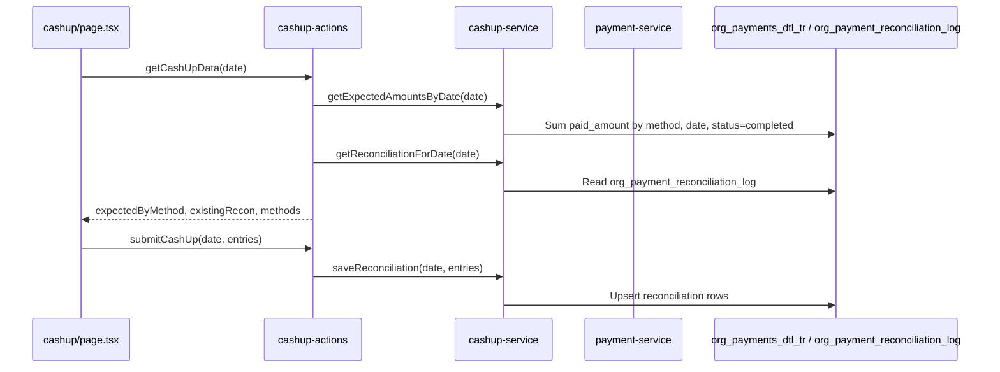

# Cash Up Feature Implementation Plan

## Current state

- **Route**: Navigation entry exists in [web-admin/config/navigation.ts](web-admin/config/navigation.ts) (`billing_cashup` → `/dashboard/billing/cashup`). No page exists yet under `app/dashboard/billing/cashup/`.
- **Database**: Table `org_payment_reconciliation_log` already exists (migration [0093_create_payment_reconciliation_log.sql](supabase/migrations/0093_create_payment_reconciliation_log.sql)) with: `tenant_org_id`, `reconciliation_date`, `payment_method_code`, `expected_amount`, `actual_amount`, `variance` (computed), `reconciled_by`, `reconciled_at`, `notes`, `status` (`pending` | `reconciled` | `variance_noted`), unique on `(tenant_org_id, reconciliation_date, payment_method_code)`.
- **Payments**: [payment-service.ts](web-admin/lib/services/payment-service.ts) has `getPaymentStats(tenantOrgId, startDate?, endDate?)` returning `byMethod` amounts; it does **not** filter by status (includes all payments). For cash-up "expected" amounts, we should use only **completed** payments for the selected date.

## Architecture

## 1. Types

**File**: [web-admin/lib/types/payment.ts](web-admin/lib/types/payment.ts) (or new `web-admin/lib/types/cashup.ts`)

- `CashUpDayData`: `{ date: string; expectedByMethod: Record<string, number>; reconciliation: CashUpReconciliationEntry[]; paymentMethods: PaymentMethod[] }`
- `CashUpReconciliationEntry`: `{ payment_method_code, expected_amount, actual_amount, variance, status, reconciled_by?, reconciled_at?, notes? }`
- `CashUpSubmitEntry`: `{ payment_method_code; actual_amount: number; notes?: string }`
- `CashUpSubmitInput`: `{ date: string; entries: CashUpSubmitEntry[] }`

Add these near existing payment types so cash-up actions can reuse `PaymentMethodCode` and `PaymentMethod`.

## 2. Cash-up service

**File**: `web-admin/lib/services/cashup-service.ts` (new)

- **getExpectedAmountsByDate(tenantOrgId, date: Date)**  
  Query `org_payments_dtl_tr` for the given date (start-of-day to end-of-day in tenant timezone if needed; otherwise UTC day). Filter `status = 'completed'`. Sum `paid_amount` grouped by `payment_method_code`. Return `Record<string, number>` (method code → total). Use `withTenantContext(tenantOrgId, ...)` and Prisma; exclude cancelled/refunded.
- **getReconciliationForDate(tenantOrgId, date: Date)**  
  Read `org_payment_reconciliation_log` where `reconciliation_date = date`, return list of entries (include method, expected, actual, variance, status, reconciled_by, reconciled_at, notes). Map to `CashUpReconciliationEntry[]`.
- **saveReconciliation(tenantOrgId, date: Date, entries: CashUpSubmitEntry[], reconciledBy: string)**  
  For each entry: expected = getExpectedAmountsByDate for that method (or 0). Compute variance = actual - expected. Status = `variance_noted` if variance !== 0 else `reconciled`. Upsert into `org_payment_reconciliation_log` (unique on tenant, date, method). Set `reconciled_at = now()`, `reconciled_by = reconciledBy`. Use Prisma transaction if multiple rows.
- **listReconciliationHistory(tenantOrgId, filters?: { startDate?, endDate?, limit? })**  
  Optional for "Cash up history" section: paginated list of `org_payment_reconciliation_log` for tenant, ordered by `reconciliation_date desc`.

All queries must filter by `tenant_org_id` (tenant isolation). Use existing Prisma client and tenant context pattern from [payment-service.ts](web-admin/lib/services/payment-service.ts).

## 3. Server actions

**File**: `web-admin/app/actions/billing/cashup-actions.ts` (new)

- **getCashUpData(date: string)**  
  `getAuthContext()` → tenantId. Parse `date` to Date (YYYY-MM-DD). Call cashup-service `getExpectedAmountsByDate(tenantId, date)` and `getReconciliationForDate(tenantId, date)`. Get `getAvailablePaymentMethods()` from payment-service to show method names. Return `{ success, data: CashUpDayData }` or `{ success: false, error }`.
- **submitCashUp(input: CashUpSubmitInput)**  
  Auth + tenantId. Validate date and entries (actual_amount >= 0, payment_method_code non-empty). Call `saveReconciliation(tenantId, date, input.entries, auth.userNameOrId)`. Revalidate `/dashboard/billing/cashup`. Return `{ success, data }` or `{ success: false, error }`.
- **getCashUpHistory(filters?: { startDate?, endDate?, limit? })**  
  Optional: auth, then `listReconciliationHistory(tenantId, filters)` and return.

## 4. Frontend UI

**Route**: `web-admin/app/dashboard/billing/cashup/`

- **page.tsx** (Server component)  
  Get searchParam `date` (default: today in local YYYY-MM-DD). Call `getCashUpData(date)`. If error, show error message. Otherwise render:
  - Page title and description (use translations).
  - Date selector (link or form that updates `?date=YYYY-MM-DD`).
  - Client component that receives `data: CashUpDayData` and optionally `currencyCode` (from tenant settings if available; else fallback e.g. OMR).
- **components/cashup-form.tsx** (Client)
  - Props: `data: CashUpDayData`, `currencyCode?: string`, `selectedDate: string`.
  - For each payment method in `data.paymentMethods` (or only methods with expected > 0 + CASH): show row with method name, **expected amount** (read-only from `data.expectedByMethod[code]` or 0), **actual amount** (number input), **variance** (computed: actual - expected, display only), **notes** (optional).
  - If `data.reconciliation` already has an entry for that method/date, show existing actual/variance/status and either read-only summary or "Edit" flow (upsert on submit).
  - Submit button: call `submitCashUp({ date: selectedDate, entries })` with entries for all shown methods (actual_amount from input, 0 if empty).
  - Success: toast or inline success; refetch or revalidate so updated reconciliation appears.
  - Validation: actual_amount >= 0; at least one entry.
- **components/cashup-history.tsx** (Client, optional)
  - Table: reconciliation_date, payment_method_code, expected_amount, actual_amount, variance, status, reconciled_by, reconciled_at. Data from optional `getCashUpHistory` or from same page with a "History" tab/section that fetches on demand.
- **loading.tsx**  
  Simple loading skeleton or spinner consistent with [billing/payments/loading.tsx](web-admin/app/dashboard/billing/payments/loading.tsx).

Use existing design patterns from billing: same layout (e.g. `space-y-6 p-6`), similar card/border styling as payments list. Use server actions for mutations; no new API route. For number inputs, use consistent decimal handling (e.g. 2–4 decimals) and tenant currency symbol.

## 5. i18n

**Files**: [web-admin/messages/en.json](web-admin/messages/en.json), [web-admin/messages/ar.json](web-admin/messages/ar.json)

- Add `cashup` section (sibling to `payments`, `invoices`): `title`, `description`, `date`, `selectDate`, `expectedAmount`, `actualAmount`, `variance`, `notes`, `submit`, `reconcile`, `reconciled`, `varianceNoted`, `pending`, `reconciledBy`, `reconciledAt`, `history`, `noReconciliation`, `successMessage`, `errorMessage`. Reuse `common.dateFrom`, `common.dateTo` or `common.branch` if needed. Keep keys under `cashup.*` for namespace. Add AR translations for RTL.

## 6. Expected amount calculation detail

- **Date range**: For "today" or selected date, use that calendar day in the **tenant’s** timezone if tenant timezone is stored; otherwise use UTC or server local date. Start: 00:00:00, End: 23:59:59.999.
- **Status**: Only include rows with `status = 'completed'` so that cancelled and refunded payments are excluded. Refunds are separate rows (negative `paid_amount`); if refunds are stored with status `refunded`, they are excluded; if they stay `completed` with negative amount, the sum will already reflect net.
- **Methods with zero expected**: Still show CASH (and optionally all enabled methods) so user can enter actual 0 when no cash was taken.

## 7. Edge cases and validation

- **Duplicate submit**: Save is upsert by (tenant, date, method); second submit for same date updates the row.
- **Permissions**: Reuse same roles as billing (e.g. `admin`, `operator`) as per navigation; no new permission unless you add a dedicated "cashup" permission later.
- **Decimal**: Use `DECIMAL(19,4)` in DB and Prisma; in UI round to 2–4 decimals for display and submit.

## 8. Files to add/change summary

| Area    | Action                                                                                       |
| ------- | -------------------------------------------------------------------------------------------- |
| Types   | Add CashUp types in `lib/types/payment.ts` or `lib/types/cashup.ts`                          |
| Service | New `lib/services/cashup-service.ts`                                                         |
| Actions | New `app/actions/billing/cashup-actions.ts`                                                  |
| Page    | New `app/dashboard/billing/cashup/page.tsx`                                                  |
| UI      | New `app/dashboard/billing/cashup/components/cashup-form.tsx`, optional `cashup-history.tsx` |
| Loading | New `app/dashboard/billing/cashup/loading.tsx`                                               |
| i18n    | Add `cashup` in `messages/en.json` and `messages/ar.json`                                    |

No new migration: `org_payment_reconciliation_log` already exists. After implementation, run `npm run build` and fix any TypeScript/lint errors; ensure tenant isolation and RTL/i18n for the new strings.
