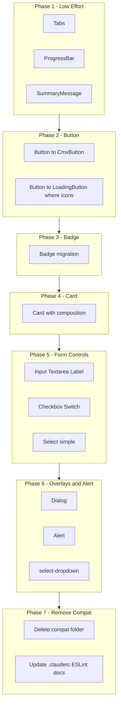

# Compat to Cmx Components Migration Plan

Migrate all `@ui/compat` usage to Cmx design system components. The compat layer remains functional but does not use design tokens; Cmx components use theme tokens and provide a consistent, maintainable UI foundation.

---

## Current State

- **~55 files** import from `@ui/compat` (Button, Input, Card, Badge, Tabs, Dialog, Alert, Select, etc.)
- **Compat layer:** [web-admin/src/ui/compat/index.ts](web-admin/src/ui/compat/index.ts)
- **Cmx components:** `@ui/primitives`, `@ui/forms`, `@ui/feedback`, `@ui/overlays`, `@ui/navigation`
- **Reference:** [docs/dev/ui-migration-guide.md](docs/dev/ui-migration-guide.md)

---

## Component Mapping and API Differences

### 1. Button

| Compat   | Cmx Replacement                | Prop Changes                                                                                                       |
| -------- | ------------------------------ | ------------------------------------------------------------------------------------------------------------------ |
| `Button` | `CmxButton` or `LoadingButton` | `isLoading` → `loading`, `variant="danger"` → `variant="destructive"` (CmxButton) or keep `danger` (LoadingButton) |
| Icons    | `LoadingButton` only           | Use `LoadingButton` when `leftIcon`/`rightIcon`/`fullWidth` needed                                                 |
| Import   | `@ui/primitives`               | `CmxButton` from `cmx-button`, `LoadingButton` from `loading-button`                                               |

**Use CmxButton for:** Simple actions without icons.  
**Use LoadingButton for:** Icons, fullWidth, or when already using `danger` (no mapping needed).

### 2. Input, Textarea, Label, Checkbox, Switch

| Compat     | Cmx                                    | Prop Changes                                                                                        |
| ---------- | -------------------------------------- | --------------------------------------------------------------------------------------------------- |
| `Input`    | `CmxInput` or `FormInput`              | `helpText` → `helperText` (FormInput); FormInput supports `label`, `error`, `leftIcon`, `rightIcon` |
| `Textarea` | `CmxTextarea`                          | API similar                                                                                         |
| `Label`    | `CmxLabel` from `@ui/primitives/label` | API similar                                                                                         |
| `Checkbox` | `CmxCheckbox`                          | API similar                                                                                         |
| `Switch`   | `CmxSwitch`                            | API similar                                                                                         |

**Input choice:** Use `CmxInput` for raw input; use `FormInput` when label/error/help text are needed.

### 3. Card

| Compat                                           | Cmx             | Structural Change                                                                       |
| ------------------------------------------------ | --------------- | --------------------------------------------------------------------------------------- |
| `Card`                                           | `CmxCard`       | No `padding`/`variant` props; use `className` if needed                                 |
| `CardHeader` with `title`, `subtitle`, `actions` | Compose         | Replace with `CmxCardHeader` + `CmxCardTitle` + `CmxCardDescription` + slot for actions |
| `CardFooter`                                     | `CmxCardFooter` | Direct replacement                                                                      |

**Pattern:**

```tsx
// Before (compat)
<Card>
  <CardHeader title="Title" subtitle="Sub" actions={<Button>Action</Button>} />
  <p>Content</p>
  <CardFooter>...</CardFooter>
</Card>

// After (Cmx)
<CmxCard>
  <CmxCardHeader className="flex flex-row items-center justify-between">
    <div>
      <CmxCardTitle>Title</CmxCardTitle>
      <CmxCardDescription>Sub</CmxCardDescription>
    </div>
    <CmxButton>Action</CmxButton>
  </CmxCardHeader>
  <CmxCardContent><p>Content</p></CmxCardContent>
  <CmxCardFooter>...</CmxCardFooter>
</CmxCard>
```

### 4. Badge

| Compat             | Cmx                                 | Notes                                                                                                |
| ------------------ | ----------------------------------- | ---------------------------------------------------------------------------------------------------- |
| `Badge` (children) | `Badge` from `@ui/primitives/badge` | Same `children`; check variant mapping (`info` exists in compat, may need `outline` or other in Cmx) |
| `Badge` (status)   | `CmxStatusBadge`                    | Requires `label: string`; use for status indicators                                                  |

**Variant map:** compat `success`/`warning`/`destructive`/`outline` → primitives Badge; compat `info` → map to `outline` or add if missing.

### 5. Tabs

| Compat             | Cmx                                  | Effort                                                          |
| ------------------ | ------------------------------------ | --------------------------------------------------------------- |
| `Tabs` from compat | `CmxTabsPanel` from `@ui/navigation` | **Low** – Same API: `tabs[]`, `defaultTab`, `value`, `onChange` |

**Tabs files (2):**

- [web-admin/app/dashboard/settings/page.tsx](web-admin/app/dashboard/settings/page.tsx)
- [web-admin/app/dashboard/settings/branches/[id]/page.tsx](web-admin/app/dashboard/settings/branches/[id]/page.tsx)

### 6. Dialog

| Compat                                          | Cmx                                                      | Notes                                      |
| ----------------------------------------------- | -------------------------------------------------------- | ------------------------------------------ |
| `Dialog`, `DialogContent`, `DialogHeader`, etc. | `CmxDialog`, `CmxDialogContent`, `CmxDialogHeader`, etc. | Same structure; import from `@ui/overlays` |

### 7. Alert, ProgressBar, SummaryMessage

| Compat                      | Cmx                                     | Notes                                                                                               |
| --------------------------- | --------------------------------------- | --------------------------------------------------------------------------------------------------- |
| `Alert`, `AlertDescription` | `Alert` from `@ui/primitives/alert`     | Check variant mapping (compat has `destructive`; primitives has `info`/`success`/`warning`/`error`) |
| `ProgressBar`               | `CmxProgressBar` from `@ui/feedback`    | API compatible                                                                                      |
| `SummaryMessage`            | `CmxSummaryMessage` from `@ui/feedback` | API compatible                                                                                      |

### 8. Select (simple vs composable)

| Compat                         | Cmx                                    | Use Case                 |
| ------------------------------ | -------------------------------------- | ------------------------ |
| `Select` (simple)              | `CmxSelect` from `@ui/primitives`      | Simple dropdown          |
| `select-dropdown` (composable) | `CmxSelectDropdown`\* from `@ui/forms` | Custom-trigger dropdowns |

**Select-dropdown consumer:** [web-admin/app/dashboard/processing/components/processing-modal-filters.tsx](web-admin/app/dashboard/processing/components/processing-modal-filters.tsx)

---

## Migration Phases (Recommended Order)



### Phase 1: Low-Effort Replacements (1–2 hours)

**Components:** Tabs, ProgressBar, SummaryMessage  
**Effort:** Minimal; APIs are compatible.

| File                                                                                                                               | Change                                                     |
| ---------------------------------------------------------------------------------------------------------------------------------- | ---------------------------------------------------------- |
| [app/dashboard/settings/page.tsx](web-admin/app/dashboard/settings/page.tsx)                                                       | `Tabs` → `CmxTabsPanel` from `@ui/navigation`              |
| [app/dashboard/settings/branches/[id]/page.tsx](web-admin/app/dashboard/settings/branches/[id]/page.tsx)                           | `Tabs` → `CmxTabsPanel` from `@ui/navigation`              |
| [app/dashboard/settings/components/SubscriptionSettings.tsx](web-admin/app/dashboard/settings/components/SubscriptionSettings.tsx) | `ProgressBar` → `CmxProgressBar` from `@ui/feedback`       |
| [app/dashboard/processing/components/processing-modal.tsx](web-admin/app/dashboard/processing/components/processing-modal.tsx)     | `SummaryMessage` → `CmxSummaryMessage` from `@ui/feedback` |

**Verification:** Build, smoke-test settings/branches and processing modal.

---

### Phase 2: Button Migration (3–4 hours)

**Scope:** All `Button` from `@ui/compat` → `CmxButton` or `LoadingButton`.

**Decision rule:**

- Has `leftIcon` or `rightIcon` or `fullWidth` → use `LoadingButton`
- Simple button → use `CmxButton`  
  **Prop mapping:** `isLoading` → `loading`, `variant="danger"` → `variant="destructive"` (CmxButton) or `variant="danger"` (LoadingButton).

**Files (high-impact):**

- [app/dashboard/orders/components/order-actions.tsx](web-admin/app/dashboard/orders/components/order-actions.tsx), [src/features/orders/ui/order-actions.tsx](web-admin/src/features/orders/ui/order-actions.tsx)
- [app/dashboard/settings/components/BrandingSettings.tsx](web-admin/app/dashboard/settings/components/BrandingSettings.tsx), [GeneralSettings.tsx](web-admin/app/dashboard/settings/components/GeneralSettings.tsx)
- [app/dashboard/processing/components/split-confirmation-dialog.tsx](web-admin/app/dashboard/processing/components/split-confirmation-dialog.tsx), [processing-modal.tsx](web-admin/app/dashboard/processing/components/processing-modal.tsx)
- [app/dashboard/subscription/page.tsx](web-admin/app/dashboard/subscription/page.tsx)
- [app/register/tenant/page.tsx](web-admin/app/register/tenant/page.tsx)
- Remaining pages/components importing Button from compat

**Verification:** `rg "from '@ui/compat'" web-admin -A 0 | rg Button` should be empty after Phase 2.

---

### Phase 3: Badge Migration (1–2 hours)

**Scope:** All `Badge` from compat.

**Files:**

- [app/dashboard/orders/components/order-status-badge.tsx](web-admin/app/dashboard/orders/components/order-status-badge.tsx)
- [app/dashboard/orders/[id]/full/components/orders-stock-tab-rprt.tsx](web-admin/app/dashboard/orders/[id]/full/components/orders-stock-tab-rprt.tsx)
- [app/dashboard/catalog/services/components/product-form.tsx](web-admin/app/dashboard/catalog/services/components/product-form.tsx)
- [app/dashboard/catalog/categories/page.tsx](web-admin/app/dashboard/catalog/categories/page.tsx)
- [app/dashboard/catalog/services/page.tsx](web-admin/app/dashboard/catalog/services/page.tsx)
- [app/dashboard/inventory/stock/page.tsx](web-admin/app/dashboard/inventory/stock/page.tsx)
- [app/dashboard/settings/components/SubscriptionSettings.tsx](web-admin/app/dashboard/settings/components/SubscriptionSettings.tsx)
- [app/dashboard/processing/[id]/page.tsx](web-admin/app/dashboard/processing/[id]/page.tsx)

**Choice:** Use `Badge` from `@ui/primitives/badge` for general badges; `CmxStatusBadge` for status-only (requires `label`).

---

### Phase 4: Card Migration (3–4 hours)

**Scope:** All `Card`, `CardHeader`, `CardFooter` from compat.

**Structural change:** Replace `CardHeader` with `title`/`subtitle`/`actions` by composition (see pattern above).

**Files:** Settings (Branding, General, BusinessHours, Subscription), catalog (product-form, export-modal, import-modal, pricing), inventory (stats-cards, modals), orders (tab reports), register, etc.

**Tip:** Create a small helper `CmxCardWithHeader` in `src/ui/patterns` if many cards share the same structure:

```tsx
export function CmxCardWithHeader({
  title,
  subtitle,
  actions,
  children,
  footer,
}) {
  return (
    <CmxCard>
      <CmxCardHeader className="flex flex-row items-center justify-between">
        <div>
          <CmxCardTitle>{title}</CmxCardTitle>
          {subtitle && <CmxCardDescription>{subtitle}</CmxCardDescription>}
        </div>
        {actions}
      </CmxCardHeader>
      <CmxCardContent>{children}</CmxCardContent>
      {footer && <CmxCardFooter>{footer}</CmxCardFooter>}
    </CmxCard>
  );
}
```

---

### Phase 5: Form Controls (Input, Textarea, Label, Checkbox, Switch, Select) (4–5 hours)

**Scope:** Input, Textarea, Label, Checkbox, Switch, Select (simple).

**Files:** pre-submission-pieces-manager, order-details-section, processing-modal-filters, processing-piece-row, processing-item-row, split-confirmation-dialog, product-form, import-modal, export-modal, add-item-modal, adjust-stock-modal, GeneralSettings, preferences, finance, catalog pages, register/tenant, etc.

**Input strategy:**

- Label + error → `FormInput` from `@ui/primitives/form-input` (`helperText` not `helpText`)
- Bare input → `CmxInput`

**Select:** Simple `Select` → `CmxSelect`; composable dropdown → `CmxSelectDropdown`\* (Phase 6).

---

### Phase 6: Overlays, Alert, Select-Dropdown (2–3 hours)

**Scope:** Dialog, Alert, select-dropdown.

**Dialog:** Any modal using `Dialog`/`DialogContent`/etc. → `CmxDialog` family.

**Alert:** `Alert`/`AlertDescription` → `Alert` from `@ui/primitives/alert`; verify variants.

**select-dropdown:** [processing-modal-filters.tsx](web-admin/app/dashboard/processing/components/processing-modal-filters.tsx) and any other composable Select usage → `CmxSelectDropdown` + Trigger/Value/Content/Item.

**Mixed usage:** [app/dashboard/catalog/pricing/[id]/page.tsx](web-admin/app/dashboard/catalog/pricing/[id]/page.tsx) uses both `CmxDialog` and compat `Dialog` for the import-all confirmation modal. Migrate the remaining compat `Dialog` to `CmxDialog`.

---

## Best Practices

1. **Migrate by component type** (all Buttons, then all Cards) to keep changes consistent and reviewable.
2. **Run build after each batch:** `cd web-admin && npm run build`
3. **i18n check:** `npm run check:i18n` after changes that add/change labels.
4. **RTL and dark mode:** Spot-check migrated screens for RTL and theme.
5. **Avoid compat in new code:** Enforce via ESLint `no-restricted-imports` (already configured).
6. **Prefer Cmx first:** When adding new UI, use Cmx components directly.
7. **Document decisions:** Update [docs/dev/ui-migration-guide.md](docs/dev/ui-migration-guide.md) with Phase 7 checklist and any new patterns.
8. **Tests:** Re-run relevant E2E/unit tests after each phase.
9. **Git:** Prefer one commit per phase for easier rollback.

---

## Verification Checklist (Per Phase)

- No remaining `@ui/compat` imports for migrated component type
- `npm run build` passes
- `npm run check:i18n` passes (if applicable)
- Smoke test: affected routes load and behave correctly
- RTL: Arabic layout checked where relevant
- No new TypeScript errors or console warnings

---

## Phase 7: Remove Compat and Clean Up (MANDATORY)

**Compat must be deleted** after migration. There are no external consumers; keeping it would be dead code and maintenance overhead.

### 7.1 Delete compat folder

- Delete `web-admin/src/ui/compat/` (entire folder and all files)
- Remove `export * from './compat'` from [web-admin/src/ui/index.ts](web-admin/src/ui/index.ts)

### 7.2 Update config and tooling

| Item                                                       | Action                                                                                                                                                                                                 |
| ---------------------------------------------------------- | ------------------------------------------------------------------------------------------------------------------------------------------------------------------------------------------------------ |
| [web-admin/.clauderc](web-admin/.clauderc)                 | Update UI snippets from `@ui/compat` to Cmx paths. **Fix:** `table: "import { Table } from '@ui/compat'"` – compat does not export `Table`; use `CmxDataTable` from `@ui` or remove if not applicable. |
| [web-admin/eslint.config.mjs](web-admin/eslint.config.mjs) | Change `no-restricted-imports` from "prefer Cmx" to **disallow** `@ui/compat` entirely (upgrade to `error`).                                                                                           |

### 7.3 Update documentation

| File                                                                                                               | Action                                                                                      |
| ------------------------------------------------------------------------------------------------------------------ | ------------------------------------------------------------------------------------------- |
| [web-admin/src/ui/feedback/cmxMessage_developer_guide.md](web-admin/src/ui/feedback/cmxMessage_developer_guide.md) | Change `SummaryMessage` import from `@ui/compat` to `CmxSummaryMessage` from `@ui/feedback` |
| [web-admin/src/ui/feedback/README.md](web-admin/src/ui/feedback/README.md)                                         | Same change                                                                                 |
| [docs/dev/ui-migration-guide.md](docs/dev/ui-migration-guide.md)                                                   | Mark "Phase 7: Cmx Migration" complete; remove compat references                            |

### 7.4 Verification

- `rg "@ui/compat" web-admin` returns no results
- `npm run build` passes
- `npm run check:i18n` passes

---

## Duplicate Components Audit (Completed 2026-02-20)

**Status:** Cleanup done. Unused duplicate components under `app/dashboard/**/components/` were removed. `src/features/*` is the single source of truth.

Previously, some `app/dashboard/.../components/` files duplicated `src/features/.../ui/`. Pages import from `@features/*`, so the app versions were unused and have been deleted.

**Kept:** `app/dashboard/jhtestui/components/` (dev tools), `app/dashboard/components/` (workflow-stats-widget, overdue-orders-widget – no features equivalent).

---

## Final State (Post Phase 7)

After all phases:

1. **Compat removed** – `web-admin/src/ui/compat/` deleted; no re-exports in `src/ui/index.ts`.
2. **Docs updated** – migration guide, feedback docs, .clauderc, ESLint.
3. **ESLint** – `@ui/compat` imports disallowed (error).

---

## File Inventory Summary

**Note:** Settings, inventory, processing pages import from `@features/`_ (src/features). The `app/dashboard/_/components/`\* versions may be duplicates. See Duplicate Components Audit above.

| Area         | Files (src/features or app/dashboard)                                                                                                                   |
| ------------ | ------------------------------------------------------------------------------------------------------------------------------------------------------- |
| Settings     | BrandingSettings, GeneralSettings, BusinessHoursSettings, SubscriptionSettings (src/features), preferences, finance, branches, page                     |
| Orders       | order-actions, pre-submission-pieces-manager, order-details-section, order-status-badge, orders-\*-tab-rprt                                             |
| Catalog      | product-form, export-modal, import-modal, price-history-timeline, bulk-import, price-list-item, pricing/[id] (mixed), pricing/categories/services pages |
| Processing   | processing-table, processing-modal, processing-modal-filters, processing-piece-row, processing-item-row, split-confirmation-dialog                      |
| Inventory    | stats-cards, add-item, edit-item, adjust-stock, stock-history modals (src/features used), stock page                                                    |
| Register     | tenant page, success page                                                                                                                               |
| Subscription | subscription page                                                                                                                                       |
