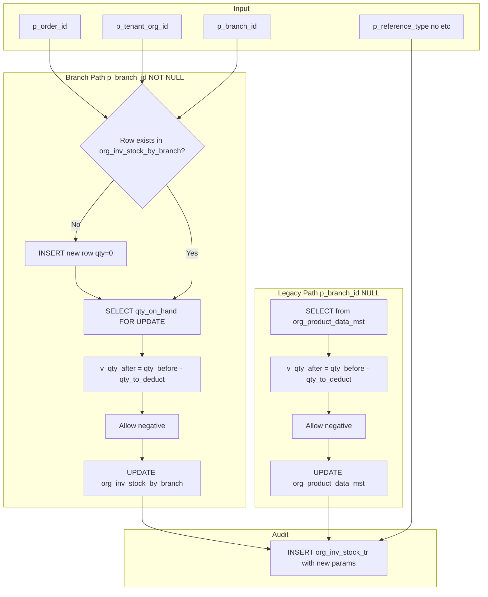

# Enhance deduct_retail_stock_for_order Function

## Summary of Changes

Create a **new migration file** `0108_enhance_deduct_retail_stock_for_order.sql` that replaces `deduct_retail_stock_for_order` with the enhanced version. Do **not** modify [supabase/migrations/0103_inventory_branch_and_deduct.sql](supabase/migrations/0103_inventory_branch_and_deduct.sql) or any other existing migration.

---

## Table Schema Impact (Columns)

**No new columns will be added. No existing columns will be modified.** The migration only replaces a function; it does not alter any table schema (no `ALTER TABLE`, no `ADD COLUMN`, etc.).

### Columns the function will use

| Table                       | Column           | Change               | Notes                                                                                                                                                                                                |
| --------------------------- | ---------------- | -------------------- | ---------------------------------------------------------------------------------------------------------------------------------------------------------------------------------------------------- |
| **org_inv_stock_by_branch** | (none)           | Schema unchanged     | Function will **INSERT** new rows when none exist. Uses existing columns: `tenant_org_id`, `product_id`, `branch_id`, `qty_on_hand`, `reorder_point`, `min_stock_level`. No new or modified columns. |
| **org_inv_stock_tr**        | `processed_by`   | **Usage** (was NULL) | Now populated from `p_user_id`. Existing column `UUID`.                                                                                                                                              |
| **org_inv_stock_tr**        | `created_by`     | **Usage** (was NULL) | Now populated from `p_user_name`. Existing column `TEXT`.                                                                                                                                            |
| **org_inv_stock_tr**        | `created_info`   | **Usage** (was NULL) | Now populated with JSON built from `p_user_info`, `p_user_agent`, `p_user_device`, `p_user_browser`, `p_user_os`, `p_user_ip`. Existing column `TEXT`.                                               |
| **org_inv_stock_tr**        | `reference_type` | Usage (unchanged)    | Already used; now sourced from `p_reference_type` with default `'ORDER'`.                                                                                                                            |
| **org_inv_stock_tr**        | `reference_id`   | Usage (unchanged)    | Already used; now sourced from `p_reference_id` or `p_order_id`.                                                                                                                                     |
| **org_inv_stock_tr**        | `reference_no`   | Usage (unchanged)    | Already used; now sourced from `p_reference_no` or order lookup.                                                                                                                                     |
| **org_inv_stock_tr**        | `reason`         | Usage (unchanged)    | Already used; now sourced from `p_reason` with default `'Order sale deduction'`.                                                                                                                     |
| **org_product_data_mst**    | (none)           | Schema unchanged     | Legacy path; function only reads/updates `qty_on_hand`, `updated_at`. No new or modified columns.                                                                                                    |

---

## 1. Behavioral Changes

### A. Insert when no record exists (org_inv_stock_by_branch)

**Current:** Raises `INSUFFICIENT_STOCK` if no row exists for `(tenant_org_id, product_id, branch_id)`.

**New:** Use `INSERT ... ON CONFLICT DO UPDATE` (upsert) or:

- `SELECT ... FOR UPDATE` → if `NOT FOUND`, `INSERT` a row with `qty_on_hand = 0` for that `(tenant_org_id, product_id, branch_id)`.
- Then proceed with the same deduct logic.

Recommended approach: `INSERT INTO org_inv_stock_by_branch (...) VALUES (...) ON CONFLICT DO NOTHING` before the SELECT, or explicitly INSERT only when NOT FOUND. Use existing table structure:

```sql
-- Table: org_inv_stock_by_branch (tenant_org_id, product_id, branch_id, qty_on_hand, ...)
-- When NOT FOUND: INSERT with qty_on_hand = 0 (or -v_qty_to_deduct if allowing minus)
```

### B. Allow negative stock (accept minus)

**Current:** Raises `INSUFFICIENT_STOCK` when `v_qty_after < 0`.

**New:** Remove the check; allow `v_qty_after` to go negative. The user will make adjustments later (e.g., via inventory adjustment). Both branch-level and legacy paths should allow negative.

---

## 2. New Function Signature and Parameters

**Current signature:**

```sql
deduct_retail_stock_for_order(p_order_id UUID, p_tenant_org_id UUID, p_branch_id UUID DEFAULT NULL)
```

**New signature (with backward compatibility via defaults):**

```sql
deduct_retail_stock_for_order(
  p_order_id       UUID,
  p_tenant_org_id  UUID,
  p_branch_id      UUID DEFAULT NULL,
  p_reference_type TEXT DEFAULT 'ORDER',
  p_reference_id   UUID DEFAULT NULL,
  p_reference_no   TEXT DEFAULT NULL,
  p_user_id        UUID DEFAULT NULL,
  p_user_name      TEXT DEFAULT NULL,
  p_user_info      TEXT DEFAULT NULL,
  p_user_agent     TEXT DEFAULT NULL,
  p_user_device    TEXT DEFAULT NULL,
  p_user_browser   TEXT DEFAULT NULL,
  p_user_os        TEXT DEFAULT NULL,
  p_user_ip        TEXT DEFAULT NULL,
  p_reason         TEXT DEFAULT 'Order sale deduction'
)
```

**Parameter mapping to org_inv_stock_tr:**

| Parameter        | Target column  | Notes                                                                      |
| ---------------- | -------------- | -------------------------------------------------------------------------- |
| p_reference_type | reference_type | Use p_reference_type, fallback to 'ORDER'                                  |
| p_reference_id   | reference_id   | Use p_reference_id, fallback to p_order_id                                 |
| p_reference_no   | reference_no   | Use p_reference_no, fallback to order_no from org_orders_mst               |
| p_user_id        | processed_by   | org_inv_stock_tr has `processed_by UUID`                                   |
| p_user_info      | created_info   | JSON or TEXT with user context (user_name, agent, device, browser, os, ip) |
| p_reason         | reason         | Already used; use p_reason instead of hardcoded 'Order sale deduction'     |

**Note:** `org_inv_stock_tr` does not have separate columns for `user_agent`, `user_device`, `user_browser`, `user_os`, `user_ip`. The standard pattern is to store these in `created_info` (TEXT/JSON). Build a JSON object from `p_user_name`, `p_user_info`, `p_user_agent`, `p_user_device`, `p_user_browser`, `p_user_os`, `p_user_ip` and store in `created_info`. Also set `created_by` from `p_user_id` (as text if the column accepts it; `processed_by` is UUID).

From [0101_inventory_stock_management.sql](supabase/migrations/0101_inventory_stock_management.sql):

- `processed_by UUID` — use `p_user_id`
- `created_by TEXT` — use `p_user_name` or cast `p_user_id::text`
- `created_info TEXT` — use a JSON string built from user params

---

## 3. org_inv_stock_tr INSERT Update

Current INSERT (lines 189–204):

```sql
INSERT INTO org_inv_stock_tr (
  tenant_org_id, product_id, branch_id,
  transaction_no, transaction_type, quantity,
  qty_before, qty_after,
  reference_type, reference_id, reference_no,
  reason, is_active, rec_status
) VALUES (
  p_tenant_org_id, r.product_id, p_branch_id,
  v_trans_no, 'STOCK_OUT', -v_qty_to_deduct,
  v_qty_before, v_qty_after,
  'ORDER', p_order_id,
  (SELECT order_no FROM org_orders_mst WHERE id = p_order_id AND tenant_org_id = p_tenant_org_id),
  'Order sale deduction',
  true, 1
);
```

**Updated INSERT** (use parameter defaults when not passed):

```sql
INSERT INTO org_inv_stock_tr (
  tenant_org_id, product_id, branch_id,
  transaction_no, transaction_type, quantity,
  qty_before, qty_after,
  reference_type, reference_id, reference_no,
  reason, processed_by, created_by, created_info,
  is_active, rec_status
) VALUES (
  p_tenant_org_id, r.product_id, p_branch_id,
  v_trans_no, 'STOCK_OUT', -v_qty_to_deduct,
  v_qty_before, v_qty_after,
  COALESCE(NULLIF(trim(p_reference_type), ''), 'ORDER'),
  COALESCE(p_reference_id, p_order_id),
  COALESCE(p_reference_no, (SELECT order_no FROM org_orders_mst WHERE id = p_order_id AND tenant_org_id = p_tenant_org_id LIMIT 1)),
  COALESCE(NULLIF(trim(p_reason), ''), 'Order sale deduction'),
  p_user_id,
  p_user_name,
  (SELECT json_build_object(
    'user_info', p_user_info,
    'user_agent', p_user_agent,
    'user_device', p_user_device,
    'user_browser', p_user_browser,
    'user_os', p_user_os,
    'user_ip', p_user_ip
  )::text),
  true, 1
);
```

Only include non-null values where appropriate; `json_build_object` omits nulls automatically in some usages—verify and simplify as needed.

---

## 4. Migration File Strategy

**Create a new migration only** — do not change any existing migration files.

Create [supabase/migrations/0108_enhance_deduct_retail_stock_for_order.sql](supabase/migrations/0108_enhance_deduct_retail_stock_for_order.sql) (next version after 0107) containing:

1. `DROP FUNCTION IF EXISTS deduct_retail_stock_for_order(UUID, UUID);`
2. `DROP FUNCTION IF EXISTS deduct_retail_stock_for_order(UUID, UUID, UUID);`
3. `CREATE OR REPLACE FUNCTION deduct_retail_stock_for_order(...)` with the new signature and logic.

The new migration will run after 0103 and replace the function without touching 0103 or any other old file.

---

## 5. Branch-Level Logic (p_branch_id IS NOT NULL)

**Current logic:**

1. `SELECT qty_on_hand ... FOR UPDATE` → if NOT FOUND, RAISE EXCEPTION.
2. `v_qty_after := v_qty_before - v_qty_to_deduct`.
3. If `v_qty_after < 0` → RAISE EXCEPTION.
4. `UPDATE org_inv_stock_by_branch SET qty_on_hand = v_qty_after`.

**New logic:**

1. Try `SELECT qty_on_hand INTO v_qty_before ... FOR UPDATE`.
2. If NOT FOUND:

- `INSERT INTO org_inv_stock_by_branch (tenant_org_id, product_id, branch_id, qty_on_hand, ...) VALUES (..., 0, ...)` ensuring no conflict (use ON CONFLICT or check existence).
- Re-select `qty_on_hand` into `v_qty_before` (or use 0).

1. `v_qty_after := COALESCE(v_qty_before, 0) - v_qty_to_deduct` (allow negative).
2. `UPDATE org_inv_stock_by_branch SET qty_on_hand = v_qty_after, updated_at = now() ...`.
3. Insert into `org_inv_stock_tr` with new audit fields.

For INSERT when not found, use:

```sql
INSERT INTO org_inv_stock_by_branch (
  tenant_org_id, product_id, branch_id,
  qty_on_hand, reorder_point, min_stock_level
) VALUES (
  p_tenant_org_id, r.product_id, p_branch_id,
  0, 0, 0
)
ON CONFLICT (tenant_org_id, product_id, branch_id) DO NOTHING;
```

Then `SELECT qty_on_hand INTO v_qty_before ... FOR UPDATE` (will now find the row). Alternatively, use `INSERT ... ON CONFLICT DO UPDATE SET qty_on_hand = org_inv_stock_by_branch.qty_on_hand - v_qty_to_deduct` but that is trickier with the transaction record. Simpler: INSERT when missing, then run the same SELECT/UPDATE as now.

---

## 6. Legacy Path (p_branch_id IS NULL)

Same behavioral changes:

- If product not found, decision needed: keep RAISE or insert (legacy uses `org_product_data_mst`; typically we do not auto-insert products). **Recommendation:** keep current behavior for legacy (product must exist).
- Allow negative: remove the `IF v_qty_after < 0 THEN RAISE` block.
- Use new audit parameters in the `org_inv_stock_tr` INSERT.

---

## 7. Frontend, APIs, and Services Changes

### 7.1 Overview

| Layer        | Changes                            | Notes                                                                                                         |
| ------------ | ---------------------------------- | ------------------------------------------------------------------------------------------------------------- |
| **Frontend** | None for deduct logic              | No UI changes; order submission flow unchanged. Optional: future low-stock warning (non-blocking) if desired. |
| **APIs**     | Extract and pass audit context     | Add request metadata to createOrderParams where available.                                                    |
| **Services** | Pass audit params to RPC / raw SQL | OrderService: both `createOrder` (Supabase RPC) and `createOrderInTransaction` (Prisma raw).                  |

### 7.2 Frontend

**File:** [web-admin/src/features/orders/hooks/use-order-submission.ts](web-admin/src/features/orders/hooks/use-order-submission.ts)

- **No changes required.** The hook calls `POST /api/v1/orders/create-with-payment`; request body and flow stay the same.
- **UX note:** Stock deduction no longer fails on insufficient stock (negative allowed). Existing "Insufficient stock" error handling in `createOrder` (Supabase flow) will no longer trigger for that case. For create-with-payment, deduction runs inside the Prisma transaction and succeeds. No frontend changes needed unless you add an optional "low stock warning" toast (non-blocking).

### 7.3 APIs

#### A. create-with-payment API

**File:** [web-admin/app/api/v1/orders/create-with-payment/route.ts](web-admin/app/api/v1/orders/create-with-payment/route.ts)

- Extract request audit context (user-agent, IP) from `request` before building `createOrderParams`.
- Add optional `stockDeductionAudit` (or extend `createOrderParams`) with:
  - `userId`, `userName` (already from `authCheck`)
  - `userAgent`, `userIp` from headers
- Pass to `createOrderParams` so `createOrderInTransaction` can forward to the deduct function.

```ts
// Helper pattern (reusable)
function getRequestAuditContext(request: NextRequest) {
  return {
    userAgent: request.headers.get("user-agent") ?? undefined,
    userIp:
      request.headers.get("x-forwarded-for") ??
      request.headers.get("x-real-ip") ??
      undefined,
  };
}
```

#### B. POST /api/v1/orders (standalone create)

**File:** [web-admin/app/api/v1/orders/route.ts](web-admin/app/api/v1/orders/route.ts)

- Same: extract `userAgent`, `userIp` from `request` and pass to `OrderService.createOrder` via params.
- `OrderService.createOrder` uses Supabase RPC; pass these as part of an optional audit object.

### 7.4 Services

#### A. CreateOrderParams interface

**File:** [web-admin/lib/services/order-service.ts](web-admin/lib/services/order-service.ts)

Add optional audit params to `CreateOrderParams`:

```ts
// Add to CreateOrderParams (optional)
stockDeductionAudit?: {
  referenceType?: string;
  referenceId?: string;
  referenceNo?: string;
  userId?: string;
  userName?: string;
  userInfo?: string;
  userAgent?: string;
  userDevice?: string;
  userBrowser?: string;
  userOs?: string;
  userIp?: string;
  reason?: string;
};
```

#### B. createOrder (Supabase RPC path)

**File:** [web-admin/lib/services/order-service.ts](web-admin/lib/services/order-service.ts) ~line 521

**Current:**

```ts
const { error: deductError } = await supabase.rpc(
  "deduct_retail_stock_for_order",
  {
    p_order_id: order.id,
    p_tenant_org_id: tenantId,
    p_branch_id: order.branch_id ?? null,
  },
);
```

**Updated:** Spread optional audit params when present. Remove rollback-on-error for INSUFFICIENT_STOCK (since we now allow negative); keep rollback only for real DB errors.

```ts
const { error: deductError } = await supabase.rpc(
  "deduct_retail_stock_for_order",
  {
    p_order_id: order.id,
    p_tenant_org_id: tenantId,
    p_branch_id: order.branch_id ?? null,
    ...(params.stockDeductionAudit && {
      p_reference_type: params.stockDeductionAudit.referenceType ?? "ORDER",
      p_reference_id: params.stockDeductionAudit.referenceId ?? order.id,
      p_reference_no: params.stockDeductionAudit.referenceNo,
      p_user_id: params.stockDeductionAudit.userId ?? params.userId,
      p_user_name: params.stockDeductionAudit.userName ?? params.userName,
      p_user_info: params.stockDeductionAudit.userInfo,
      p_user_agent: params.stockDeductionAudit.userAgent,
      p_user_device: params.stockDeductionAudit.userDevice,
      p_user_browser: params.stockDeductionAudit.userBrowser,
      p_user_os: params.stockDeductionAudit.userOs,
      p_user_ip: params.stockDeductionAudit.userIp,
      p_reason: params.stockDeductionAudit.reason,
    }),
  },
);
```

**Note:** With allow-negative, `INSUFFICIENT_STOCK` will no longer be raised. Existing rollback logic can stay for other errors (e.g., product not found in legacy path). Simplify if desired.

#### C. createOrderInTransaction (Prisma raw path)

**File:** [web-admin/lib/services/order-service.ts](web-admin/lib/services/order-service.ts) ~line 828

**Current:**

```ts
await tx.$executeRawUnsafe(
  `SELECT deduct_retail_stock_for_order($1::uuid, $2::uuid, $3::uuid)`,
  order.id,
  tenantId,
  order.branch_id ?? null,
);
```

**Options:**

- **Minimal:** Keep 3-arg call. New params use DB defaults (no audit from API).
- **Full audit:** Extend to pass all 16 params. Use `Prisma.sql` + `Prisma.join` for parameterized SQL to avoid SQL injection:

```ts
import { Prisma } from "@prisma/client";

const audit = params.stockDeductionAudit ?? {};
await tx.$executeRaw(
  Prisma.sql`SELECT deduct_retail_stock_for_order(
    ${order.id}::uuid, ${tenantId}::uuid, ${order.branch_id ?? null}::uuid,
    ${audit.referenceType ?? "ORDER"}, ${audit.referenceId ?? order.id}::uuid,
    ${audit.referenceNo ?? order.order_no},
    ${params.userId ?? null}::uuid, ${params.userName ?? null},
    ${audit.userInfo ?? null}, ${audit.userAgent ?? null},
    ${audit.userDevice ?? null}, ${audit.userBrowser ?? null},
    ${audit.userOs ?? null}, ${audit.userIp ?? null},
    ${audit.reason ?? "Order sale deduction"}
  )`,
);
```

**Best practice:** Prefer `Prisma.sql` over `$executeRawUnsafe` for parameterized queries.

### 7.5 Reusable request audit helper (recommended)

**File:** Create [web-admin/lib/utils/request-audit.ts](web-admin/lib/utils/request-audit.ts)

```ts
import type { NextRequest } from "next/server";

export interface RequestAuditContext {
  userAgent?: string;
  userIp?: string;
}

export function getRequestAuditContext(
  request: NextRequest,
): RequestAuditContext {
  return {
    userAgent: request.headers.get("user-agent") ?? undefined,
    userIp:
      request.headers.get("x-forwarded-for")?.split(",")[0]?.trim() ??
      request.headers.get("x-real-ip") ??
      undefined,
  };
}
```

Use in both API routes when building `stockDeductionAudit`.

### 7.6 Summary of file changes

| File                                                          | Action                                                                                         |
| ------------------------------------------------------------- | ---------------------------------------------------------------------------------------------- |
| `web-admin/lib/utils/request-audit.ts`                        | **Create** – request audit helper                                                              |
| `web-admin/lib/services/order-service.ts`                     | **Modify** – add `stockDeductionAudit` to CreateOrderParams; update RPC and raw SQL call sites |
| `web-admin/app/api/v1/orders/create-with-payment/route.ts`    | **Modify** – build `stockDeductionAudit` from request + auth, pass to createOrderParams        |
| `web-admin/app/api/v1/orders/route.ts`                        | **Modify** – build `stockDeductionAudit` from request + auth, pass to createOrder              |
| `web-admin/src/features/orders/hooks/use-order-submission.ts` | No change                                                                                      |
| `web-admin/types/database.ts`                                 | **Regenerate** after migration (Supabase gen types)                                            |

---

## 8. Best Practices Checklist

- **Backward compatibility:** 3-arg RPC/raw call continues to work; new params have defaults.
- **Security:** Use `Prisma.sql` for parameterized raw SQL; avoid string interpolation.
- **Audit trail:** Pass user context from APIs to the deduct function so `org_inv_stock_tr` is populated.
- **Separation of concerns:** Request audit extraction in API layer; service only receives data.
- **Error handling:** With negative allowed, stock errors are rare; keep rollback for non-stock DB errors.
- **Testing:** Run `npm run build` after changes; test create-with-payment and standalone create flows.

---

## 9. TypeScript Types

After migration, regenerate Supabase types:

```bash
npx supabase gen types typescript --local > web-admin/types/database.generated.ts
```

Or use the project’s type generation script. Update [web-admin/types/database.ts](web-admin/types/database.ts) to match the new RPC args for `deduct_retail_stock_for_order`.

---

## 10. Data Flow Diagram



---

## 11. Implementation Checklist

1. **New migration only:** Create `0108_enhance_deduct_retail_stock_for_order.sql` with DROP + CREATE for the function. Do not edit 0103 or other old files.
2. **Insert when not found:** Use `INSERT ... ON CONFLICT DO NOTHING` before SELECT for branch-level.
3. **Allow negative stock:** Remove both `IF v_qty_after < 0 THEN RAISE` blocks (branch + legacy).
4. **New parameters:** Add all new params with defaults; use in `org_inv_stock_tr` INSERT.
5. **created_info:** Build JSON from `p_user_info`, `p_user_agent`, `p_user_device`, etc.; store in `created_info`.
6. **processed_by / created_by:** Set from `p_user_id` and `p_user_name`.
7. **Callers:** Update order-service RPC and raw SQL to pass user context when available.
8. **Regenerate types:** Run Supabase type generation after migration.
9. **Regenerate types:** `npx supabase gen types typescript --local` (or project script).
10. **Build:** Run `npm run build` and fix any errors.

---

## 12. Edge Cases

- **created_info JSON:** If all user fields are null, store `NULL` or `'{}'` to avoid invalid JSON.
- **p_reference_id = p_order_id:** When `p_reference_type = 'ORDER'`, `p_reference_id` defaults to `p_order_id`.
- **Order_no lookup:** The subquery `(SELECT order_no FROM org_orders_mst ...)` can return NULL; `COALESCE(p_reference_no, ...)` handles that.
