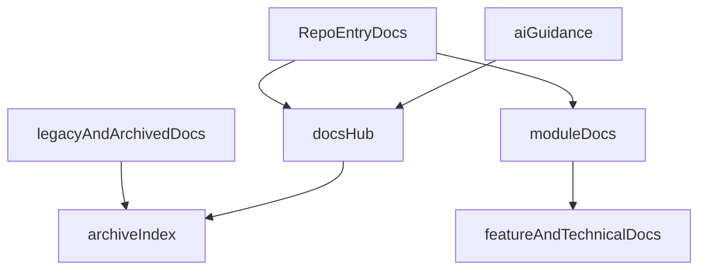

# Documentation Refresh Plan

## What This Plan Targets

This plan covers the full project documentation surface with no intentional gaps and applies a strict reconciliation rule:

- All documentation under [`docs/`](f:/jhapp/cleanmatex/docs), including but not limited to `features`, `plan`, `plan_cr`, `dev`, `api`, `config`, `deployment`, `Database_Design`, `security`, `migration`, `testing`, `users`, `admins`, `developers`, `implementation`, `master_data`, `navigation`, `langs`, archive areas, lookup files, and loose markdown files
- High-authority planning documents such as [`docs/plan/master_plan_cc_01.md`](f:/jhapp/cleanmatex/docs/plan/master_plan_cc_01.md) and overlapping roadmap/PRD files
- Human-facing project docs and guides in [`docs/`](f:/jhapp/cleanmatex/docs)
- Repo/app entrypoint docs like [`README.md`](f:/jhapp/cleanmatex/README.md), [`web-admin/README.md`](f:/jhapp/cleanmatex/web-admin/README.md), and [`cmx-api/README.md`](f:/jhapp/cleanmatex/cmx-api/README.md)
- All existing module-local documentation files under app/package folders such as `web-admin`, `cmx-api`, `supabase`, `cmx_mobile_apps`, `packages`, `scripts`, `infra`, and `qa`
- AI/project guidance docs such as [`CLAUDE.md`](f:/jhapp/cleanmatex/CLAUDE.md), [`.cursor/rules/documentationrules.mdc`](f:/jhapp/cleanmatex/.cursor/rules/documentationrules.mdc), and related `.claude`/`.cursor` guidance
- Cleanup/consolidation of overlapping, stale, and weakly indexed docs
- If a module documentation set exists, all of its documentation files, including PRD files, must be updated to match the real implemented state and be compatible/consolidated.
- If a module documentation set does not exist, the PRD documentation must be updated to align with the real implemented scope and be compatible/consolidated.
- Any unresolved enhancement suggestion or decision that requires your involvement must be written into a new dated file named `current_urgent_decesion_YYYY_MM_DD.md` for your review and approval.

## Current Gaps Found

- [`docs/README.md`](f:/jhapp/cleanmatex/docs/README.md) describes a narrower structure than what actually exists under `docs/`.
- [`docs/folders_lookup.md`](f:/jhapp/cleanmatex/docs/folders_lookup.md) currently indexes only a few feature folders, so discoverability is incomplete.
- [`README.md`](f:/jhapp/cleanmatex/README.md) contains outdated or conflicting operational guidance, including DB reset instructions that do not align with [`CLAUDE.md`](f:/jhapp/cleanmatex/CLAUDE.md).
- [`web-admin/README.md`](f:/jhapp/cleanmatex/web-admin/README.md) is still the default Next.js starter README.
- Module-level documentation is uneven: `web-admin` has many local docs, while `supabase`, `packages/*`, `cmx_mobile_apps/*`, `infra/`, and `qa/` appear under-documented.
- Guidance is split across `docs/`, root docs, `.claude`, and `.cursor`, which creates source-of-truth drift risk.
- PRD coverage and implementation reality are not consistently synchronized, so some PRDs likely describe planned or old scope rather than what is already built.
- There is no explicit workflow yet for parking unresolved enhancement suggestions or decision requests in a dedicated approval file.
- The project contains multiple documentation layers and historical structures, so a best-practice refresh must inventory all of them explicitly to avoid leaving hidden gaps.

## Target Documentation Model

Use a three-tier authority model to reduce drift:

- `RepoEntryDocs`: top-level orientation and navigation only.
- `docsHub`: canonical index, active plans, feature docs, operational references, and archive index.
- `moduleDocs`: colocated READMEs for each major app/package explaining ownership, setup, commands, and links back to canonical docs.
- `aiGuidance`: `CLAUDE.md`, `.claude`, and `.cursor` rules kept aligned with the canonical human docs, with clear ownership and reduced duplication.
- `legacyAndArchivedDocs`: preserved but clearly marked and indexed, not mixed with active guidance.

## Execution Phases

### Phase 1: Establish source of truth and implementation-reality audit

- Build a complete inventory of all documentation files and folders across the repository.
- Define which files are authoritative versus derived versus historical.
- Audit overlaps among [`README.md`](f:/jhapp/cleanmatex/README.md), [`CLAUDE.md`](f:/jhapp/cleanmatex/CLAUDE.md), [`docs/README.md`](f:/jhapp/cleanmatex/docs/README.md), `.claude` docs, and `.cursor/rules`.
- Produce a gap matrix covering: onboarding, architecture, feature docs, PRDs, plans, API/backend docs, UI/docs, ops, testing, security, data/docs, user/admin/developer docs, localization docs, and AI guidance.
- For each feature/module area, determine whether an existing module documentation set already exists or whether PRD-only reconciliation is needed.

### Phase 2: Repair top-level navigation and trust points

- Refresh [`README.md`](f:/jhapp/cleanmatex/README.md) so it becomes a reliable repo entrypoint with current stack, safe commands, and links to the right module/docs entrypoints.
- Refresh [`docs/README.md`](f:/jhapp/cleanmatex/docs/README.md) to reflect the actual `docs/` topology, active sections, and archive policy.
- Reconcile high-authority plan/index files such as [`docs/plan/master_plan_cc_01.md`](f:/jhapp/cleanmatex/docs/plan/master_plan_cc_01.md) so implemented, in-progress, and future scope are clearly separated.
- Expand [`docs/folders_lookup.md`](f:/jhapp/cleanmatex/docs/folders_lookup.md) into a real index or replace it with a better-maintained index strategy if feature coverage is too broad for one file.

### Phase 3: Normalize `docs/` structure and consolidate drift

- Reconcile older parallel structures such as `plan` vs `plan_cr`, `docs/features/**`, loose root markdown files in `docs/`, and inconsistent feature folder naming.
- Standardize active feature/document folder conventions around the rules in [`.cursor/rules/documentationrules.mdc`](f:/jhapp/cleanmatex/.cursor/rules/documentationrules.mdc).
- Move stale or duplicated content into clearly indexed archive locations instead of leaving it beside active docs.
- Ensure every retained active document is compatible/consolidated with the real implementation and does not conflict with sibling module docs or PRDs.

### Phase 4: Reconcile existing module documentation sets

- For each module that already has documentation, update all relevant documentation files, including PRD files, to reflect the real implemented behavior, scope, architecture, commands, constraints, and current status.
- Replace the starter content in [`web-admin/README.md`](f:/jhapp/cleanmatex/web-admin/README.md) with a real module guide and reconcile its local docs with actual implementation.
- Strengthen [`cmx-api/README.md`](f:/jhapp/cleanmatex/cmx-api/README.md) and related docs with module map, env/testing links, backend/API references, and implementation-accurate scope.
- Reconcile existing docs for `supabase`, `scripts`, and any other documented module so the module doc set is internally compatible/consolidated.

### Phase 5: Align PRDs where module documentation is missing or incomplete

- For feature areas lacking a proper module-level documentation set, update the PRD documentation itself so it aligns with the already implemented scope rather than stale planned scope.
- Mark clear boundaries in PRDs between implemented, partially implemented, deferred, and proposed scope.
- Align PRDs with the implementation checklist already required in [`CLAUDE.md`](f:/jhapp/cleanmatex/CLAUDE.md) and [`.cursor/rules/documentationrules.mdc`](f:/jhapp/cleanmatex/.cursor/rules/documentationrules.mdc).
- Standardize metadata, cross-linking, archive labels, and “last reviewed” markers across module docs and PRDs.

### Phase 6: Standardize minimum documentation sets and consolidation rules

- Define a lightweight, repeatable minimum set for active features and modules: overview, implementation status, developer guide, user guide where relevant, testing scenarios, technical/API notes, and PRD linkage.
- Define best-practice standards for documentation quality: authority, freshness, naming, metadata, cross-linking, implementation-status labeling, and archive handling.
- Define consolidation rules so module docs and PRDs complement each other instead of duplicating or contradicting each other.
- Define ownership for core docs versus module docs versus AI guidance.

### Phase 7: Add urgent decision file workflow

- Whenever the audit/update work identifies a suggested enhancement, open question, architectural choice, or business decision that needs your involvement, create a new file named `current_urgent_decesion_YYYY_MM_DD.md`.
- The file should contain full context, current state, options, impacts, recommendation if any, and the exact decision needed so you can decide easily.
- Ask you to fill/approve that file, and only use its contents as approved direction after an explicit approval marker is added at the top of the file.
- Keep approved decision files linked from the relevant module/PRD docs so future updates remain compatible/consolidated.

## Highest-Value Files To Tackle First

- [`README.md`](f:/jhapp/cleanmatex/README.md)
- [`docs/README.md`](f:/jhapp/cleanmatex/docs/README.md)
- [`docs/plan/master_plan_cc_01.md`](f:/jhapp/cleanmatex/docs/plan/master_plan_cc_01.md)
- [`docs/folders_lookup.md`](f:/jhapp/cleanmatex/docs/folders_lookup.md)
- [`docs/features/`](f:/jhapp/cleanmatex/docs/features)
- [`CLAUDE.md`](f:/jhapp/cleanmatex/CLAUDE.md)
- [`web-admin/README.md`](f:/jhapp/cleanmatex/web-admin/README.md)
- [`cmx-api/README.md`](f:/jhapp/cleanmatex/cmx-api/README.md)
- Relevant module-local doc sets and their PRD documents under [`docs/features/`](f:/jhapp/cleanmatex/docs/features) and related folders

## Deliverables

- A documentation audit summary with gap/duplication findings
- A full documentation inventory so no documentation surface is unintentionally skipped
- A standardized documentation information architecture
- Updated top-level docs, existing module documentation sets, and PRDs reconciled to the real implemented state
- A cleanup/archive plan for stale or overlapping content
- A dated urgent decision file workflow for unresolved enhancements or decisions requiring your approval
- A maintenance checklist for keeping docs aligned going forward
