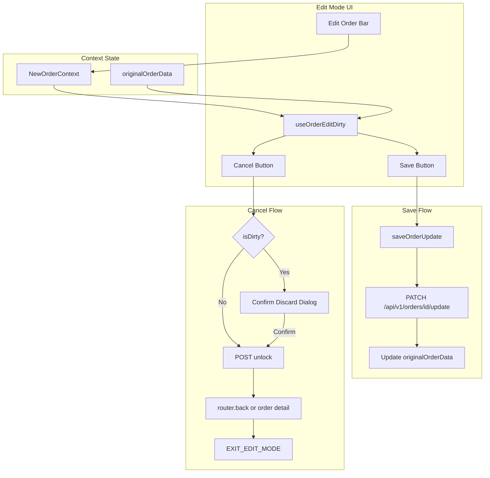

# Edit Order Mode Indicator, Save, and Cancel

## Current State

- **Edit flow**: [EditOrderScreen](web-admin/src/features/orders/ui/edit-order-screen.tsx) loads order data via `LOAD_ORDER_FOR_EDIT` into the shared [NewOrderContent](web-admin/src/features/orders/ui/new-order-content.tsx) form.
- **State**: `isEditMode`, `editingOrderId`, `editingOrderNo`, `originalOrderData` already exist in [new-order-reducer.ts](web-admin/src/features/orders/ui/context/new-order-reducer.ts).
- **Lock**: Edit page acquires lock on load; [edit/page.tsx](web-admin/app/dashboard/orders/[id]/edit/page.tsx) cleanup releases lock on unmount. Unlock API: `POST /api/v1/orders/[id]/unlock`.
- **Submit flow**: Both new and edit use the same "Add Order" button, which opens the payment modal. For edit mode, [use-order-submission.ts](web-admin/src/features/orders/hooks/use-order-submission.ts) calls `PATCH /api/v1/orders/[id]/update` (no payment required).
- **Gap**: No visible edit mode indicator; no dedicated Save button; no explicit Cancel; edit flow goes through payment modal unnecessarily.

## Architecture

## Implementation Plan

### 1. Add `useOrderEditDirty` hook

**File**: `web-admin/src/features/orders/hooks/use-order-edit-dirty.ts` (new)

- Compare current state with `originalOrderData` to detect changes.
- Compare: `items` (productId, quantity, pricePerUnit, notes, pieces, priceOverride), `customer`/`customerId`, `notes`, `readyByAt`, `express`, `branchId`, `customerNameSnapshot`, `customerMobile`, `customerEmail`.
- Return `{ isDirty: boolean }` for use by Save button and unsaved-changes warning.

### 2. Add `saveOrderUpdate` to order submission

**File**: [web-admin/src/features/orders/hooks/use-order-submission.ts](web-admin/src/features/orders/hooks/use-order-submission.ts)

- Extract the update payload logic (lines 211–262) into a reusable `buildUpdatePayload()` helper.
- Add `saveOrderUpdate: () => Promise<void>` that:
  - Builds payload via `buildUpdatePayload()`.
  - Calls `PATCH /api/v1/orders/[id]/update` directly.
  - On success: dispatch `UPDATE_ORIGINAL_ORDER_DATA` (or equivalent) to refresh `originalOrderData`, show success toast, optionally navigate back or stay.
  - On error: show error toast, keep user on page.
- Expose `saveOrderUpdate` and `isSaving` (or reuse `isSubmitting` for save) from the hook.

### 3. Add `UPDATE_ORIGINAL_ORDER_DATA` reducer action

**File**: [web-admin/src/features/orders/ui/context/new-order-reducer.ts](web-admin/src/features/orders/ui/context/new-order-reducer.ts)

- New action to set `originalOrderData` from the API response after a successful save, so dirty check resets correctly.

### 4. Edit mode bar component

**File**: `web-admin/src/features/orders/ui/edit-order-bar.tsx` (new)

- Renders only when `state.isEditMode`.
- Shows: "Editing Order #{orderNo}" badge/label.
- **Cancel button**: On click, call `onCancelEdit()`. Disabled when `isCancelling`. Parent handles dirty check and discard dialog.
- Uses Cmx components per [web-admin-ui-imports.mdc](.cursor/rules/web-admin-ui-imports.mdc).

### 5. Add `useOrderEditCancel` hook (Cancel flow)

**File**: `web-admin/src/features/orders/hooks/use-order-edit-cancel.ts` (new)

- `cancelEditOrder(orderId: string): Promise<void>`:
  1. Call `POST /api/v1/orders/[orderId]/unlock` with `Content-Type: application/json` and body `{}`.
  2. On success: dispatch `EXIT_EDIT_MODE`, then `router.push(\`/dashboard/orders/${orderId})` to order detail.
  3. On unlock error: show error toast, do not navigate (lock may still be held).
- Return `{ cancelEditOrder, isCancelling: boolean }` for loading state.
- Best practice: await unlock before navigating so lock is released before user leaves.

### 6. Integrate edit bar and Save in NewOrderContent

**File**: [web-admin/src/features/orders/ui/new-order-content.tsx](web-admin/src/features/orders/ui/new-order-content.tsx)

- Add `EditOrderBar` in the fixed top area (above branch selector, inside the `flex-shrink-0 p-6 space-y-4` block).
- Pass `isEditMode`, `editingOrderNo`, `onCancelEdit`, `isCancelling` (disable Cancel during unlock).
- When `isEditMode`, hide the "Add New Order" link in the right sidebar (avoid confusion with Cancel).

### 7. Edit-mode Save button in OrderSummaryPanel

**File**: [web-admin/src/features/orders/ui/order-summary-panel.tsx](web-admin/src/features/orders/ui/order-summary-panel.tsx)

- Add props: `isEditMode?: boolean`, `isDirty?: boolean`, `onSave?: () => void`, `isSaving?: boolean`.
- When `isEditMode`:
  - Show "Save" button (or "Save Changes") instead of "Add Order".
  - Enable only when `isDirty` and `!isSaving`.
  - On click: call `onSave` (no payment modal).
- When not edit mode: keep current "Add Order" + payment modal flow.

### 8. Wire Save and Cancel in NewOrderContent

**File**: [web-admin/src/features/orders/ui/new-order-content.tsx](web-admin/src/features/orders/ui/new-order-content.tsx)

- Use `useOrderEditDirty()`, `saveOrderUpdate` from `useOrderSubmission`, and `useOrderEditCancel(editingOrderId)`.
- State: `showCancelConfirm` for the discard dialog.
- `handleCancelEdit`: if `isDirty`, set `showCancelConfirm=true`; else call `cancelEditOrder()` directly. Pass `handleCancelEdit` to EditOrderBar as `onCancelEdit`.
- On dialog confirm: call `cancelEditOrder()`, set `showCancelConfirm=false`.
- Add `CmxAlertDialog` for discard confirmation (variant="warning", `orders.edit.confirmCancel` / `orders.edit.confirmCancelMessage`).

### 9. Unsaved changes for edit mode

**File**: [web-admin/src/features/orders/hooks/use-unsaved-changes.ts](web-admin/src/features/orders/hooks/use-unsaved-changes.ts)

- When `isEditMode`, use `useOrderEditDirty().isDirty` instead of the generic "has items/notes/customer" check for the beforeunload and route-change warnings.
- Ensure `NewOrderContent` passes the correct `hasUnsavedChanges` function based on mode.

### 10. i18n

**File**: `web-admin/messages/en.json`, `web-admin/messages/ar.json`

- Reuse existing keys: `orders.edit.saveChanges`, `orders.edit.saving`, `orders.edit.success`, `orders.edit.unsavedChanges`, `orders.edit.confirmLeave`, `orders.edit.cancelEdit`, `orders.edit.confirmCancel`, `orders.edit.confirmCancelMessage`.
- Add if missing: `orders.edit.editModeLabel` ("Editing Order #{orderNo}").

## Best Practices and Edge Cases

| Item                        | Action                                                                                                                                      |
| --------------------------- | ------------------------------------------------------------------------------------------------------------------------------------------- |
| **Unlock before navigate**  | Cancel calls `POST /api/v1/orders/[id]/unlock` and awaits success before `router.push`; on failure show error toast and do not navigate.    |
| **Double unlock**           | Edit page cleanup also calls unlock on unmount. Unlock API should handle "already unlocked" gracefully; cleanup catches and ignores errors. |
| **Keyboard / beforeunload** | `useUnsavedChanges` uses `isDirty` in edit mode; `beforeunload` and route interception warn correctly.                                      |
| **RTL**                     | Edit bar uses `useRTL` for layout; Cancel/Save buttons follow `isRTL` for icon placement.                                                   |
| **Loading states**          | Cancel shows `isCancelling` (or disabled) during unlock; Save shows `isSaving` during update.                                               |
| **Error handling**          | Unlock failure: toast, stay on page. Update failure: toast, stay on page. Both use existing `cmxMessage` patterns.                          |
| **Accessibility**           | Edit bar has `aria-label`; Cancel/Save buttons are focusable; dialog has proper focus trap.                                                 |
| **No duplicate unlock**     | Cleanup runs on unmount; Cancel explicitly unlocks before navigate. Both are idempotent.                                                    |

## Key Files Summary

| File                             | Change                                                   |
| -------------------------------- | -------------------------------------------------------- |
| `hooks/use-order-edit-dirty.ts`  | New – dirty state detection                              |
| `hooks/use-order-edit-cancel.ts` | New – cancel flow: unlock + navigate                     |
| `hooks/use-order-submission.ts`  | Add `saveOrderUpdate`, extract update payload            |
| `context/new-order-reducer.ts`   | Add `UPDATE_ORIGINAL_ORDER_DATA`                         |
| `ui/edit-order-bar.tsx`          | New – edit mode bar + Cancel button                      |
| `ui/new-order-content.tsx`       | Integrate EditOrderBar, wire Save/Cancel, discard dialog |
| `ui/order-summary-panel.tsx`     | Edit-mode Save button, conditional submit                |
| `hooks/use-unsaved-changes.ts`   | Use dirty check when in edit mode                        |

## Validation

- Run `npm run build` in web-admin after changes.
- Manually test: (1) Edit order, change items, click Save – success, dirty resets. (2) Edit order, change items, click Cancel – confirm dialog, confirm – unlock, navigate to order detail. (3) Edit order, no changes, click Cancel – no dialog, unlock, navigate. (4) Edit order, change items, try to navigate away (sidebar) – unsaved warning. (5) Edit order, save, then cancel – no dialog, navigate. (6) Verify lock is released in all exit paths.
