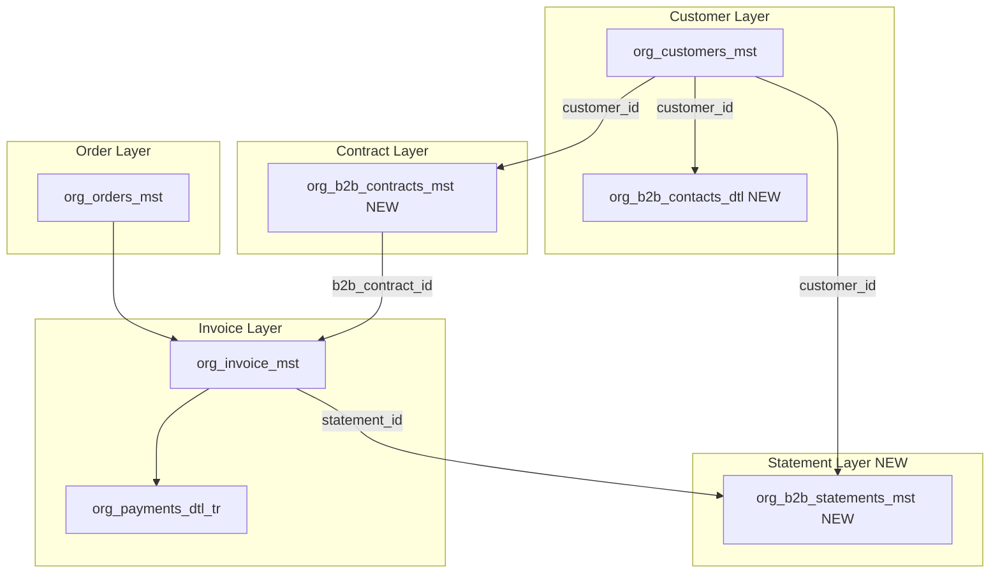

# Full B2B Feature Implementation Plan

## CRITICAL: Database Migrations

**Do NOT apply database migration files.** Create the migration file(s) only. Ask the user to apply them — the user will run migrations manually (e.g. `supabase db push` or `supabase migration up`).

---

## Current State Summary

**Already in place:**

- **Customer type**: `org_customers_mst.type` supports `b2b`; [PricingService](web-admin/lib/services/pricing.service.ts) applies B2B price lists when `customer.type === 'b2b'`
- **Price lists**: `org_price_lists_mst.price_list_type` includes `'b2b'` ([migration 0014](supabase/migrations/0014_catalog_pricing_tables.sql))
- **Feature flags**: `b2b_contracts`, `b2b_invoicing`, `b2b_invoicing_enabled`, `b2b_statements_enabled`, `credit_limits` in [sys_tenant_settings_cd](supabase/migrations/0066_hq_ff_feature_flags_243_seed_2026_01_03_OK.sql)
- **Plan limits**: `credit_limits` per plan (e.g., PRO: 5000, ENTERPRISE: 50000) in [0067](supabase/migrations/0067_sys_ff_pln_flag_mappings_dtl_seed_v2_OK.sql)
- **Invoice model**: `org_invoice_mst` has `customer_id`, `payment_terms`; design mentions `b2b_contract_id` and `invoice_type_cd` (RETAIL/B2B)
- **RequireFeature**: `b2b_contracts` in [RequireFeature.tsx](web-admin/src/features/auth/ui/RequireFeature.tsx)

**Missing:**

- B2B customer type in customer CRUD UI (create/update/filter)
- B2B columns on org_customers_mst; org_b2b_contacts_dtl (multi-contact); org_b2b_contracts_mst; org_b2b_statements_mst
- Contract and statement management UI
- Credit limit enforcement
- Consolidated invoicing and statement generation
- Cost center / PO tracking
- Dunning (overdue reminders)

---

## Architecture Overview

**Design decision**: Use `org_customers_mst` as the single customer master. B2B customers are rows with `type = 'b2b'` and B2B-specific columns. A detail table `org_b2b_contacts_dtl` supports multiple contacts per B2B customer.

**Data model summary:** `org_customers_mst` (B2B = type='b2b' + company_name, tax_id, credit_limit, payment_terms_days, cost_center_code) | `org_b2b_contacts_dtl` (multi-contact) | `org_b2b_contracts_mst` | `org_b2b_statements_mst` | `org_invoice_mst` (invoice_type_cd, b2b_contract_id, statement_id).

---

## Phase 1: Foundation (Database & Types)

### 1.1 Database Migrations

**Extend `org_customers_mst`** (B2B columns — nullable, used when `type = 'b2b'`): `company_name`, `company_name2`, `tax_id`, `credit_limit` DECIMAL(19,4), `payment_terms_days` INTEGER, `cost_center_code` VARCHAR(50).

`**org_b2b_contacts_dtl**` (multi-contact): `id`, `tenant_org_id`, `customer_id` (FK org_customers_mst), `contact_name`, `contact_name2`, `phone`, `email`, `role_cd`, `is_primary`, `rec_status`, `is_active`, audit fields. Enforce one primary per customer (app or trigger).

`**org_b2b_contracts_mst**`: `id`, `tenant_org_id`, `customer_id` (FK org_customers_mst), `contract_no`, `effective_from`, `effective_to`, `pricing_terms` JSONB, `rec_status`, `is_active`, audit fields.

`**org_b2b_statements_mst**`: `id`, `tenant_org_id`, `customer_id`, `contract_id` (nullable), `statement_no`, `period_from`, `period_to`, `due_date`, `total_amount`, `paid_amount`, `balance_amount`, `currency_cd`, `status_cd`, audit fields.

**Enhance `org_invoice_mst`**: `invoice_type_cd`, `b2b_contract_id`, `statement_id`, `cost_center_code`, `po_number`.

**Enhance `org_orders_mst`**(if not present):`b2b_contract_id`, `cost_center_code`, `po_number`.

**Migration**: `0147_b2b_customers_contracts_contacts.sql`; use `ADD COLUMN IF NOT EXISTS`, `CREATE TABLE IF NOT EXISTS`. **RLS** on all new tables. **Prisma**: Regenerate after migrations.

### 1.2 Constants & Types

- Add `b2b` to `CustomerType`; B2B fields on Customer interface
- `lib/constants/b2b.ts`: INVOICE_TYPES, STATEMENT_STATUSES, PAYMENT_TERMS_OPTIONS, CONTACT_ROLES
- `lib/types/b2b.ts`: B2BContract, B2BStatement, B2BContact

---

## Phase 2: B2B Customer Management (PRD-029)

### 2.1 Customer CRUD Extensions

- **Create/Update**: Add `b2b` to customer type options when `b2b_contracts` is enabled
- **Customer create modal**: Add B2B option; when B2B selected, show company fields (company_name, tax_id, credit_limit, payment_terms_days)
- **Customer list/detail**: Type badge for `b2b`; filter by type including B2B
- **Customer detail page**: B2B-specific section (company info, credit limit, contacts tab, contracts, statements)

### 2.2 B2B Contacts (Multi-Contact Support)

- **API**: `GET/POST /api/v1/b2b-contacts`, `GET/PATCH/DELETE /api/v1/b2b-contacts/:id` (scoped by customer_id)
- **Service**: `B2BContactsService` — CRUD for `org_b2b_contacts_dtl` with tenant isolation
- **UI**: Contacts tab on B2B customer detail page; inline add/edit contacts
- **Use cases**: Billing contact, delivery contact, primary contact for statements

### 2.3 B2B Customers List & Contract Management

- **B2B Customers**: List at `app/dashboard/b2b/customers/` — filtered `org_customers_mst` where `type = 'b2b'`
- **Contracts API**: `GET/POST /api/v1/b2b-contracts`, `GET/PATCH/DELETE /api/v1/b2b-contracts/:id`
- **Service**: `B2BContractsService` — FK to `org_customers_mst.id`
- **UI**: `app/dashboard/b2b/contracts/` — list, create, edit; contract detail with linked orders/invoices
- **Navigation**: B2B section (gated by `b2b_contracts`) with Customers, Contracts, Statements

---

## Phase 3: Order & Invoice Integration

### 3.1 Order Flow

- **New order**: When customer is B2B (or linked to corporate), allow selecting contract; set `payment_terms` from contract
- **Order model**: Add `b2b_contract_id` (optional) to `org_orders_mst` if not present
- **Pricing**: Already uses B2B price list when `customer.type === 'b2b'`

### 3.2 Invoice Enhancements

- **Invoice creation**: Set `invoice_type_cd = 'B2B'` when order has B2B contract or customer is B2B
- **Invoice service**: Populate `b2b_contract_id`, `statement_id` (when part of statement), `cost_center_code`, `po_number` from order
- **Invoice list**: Filter by `invoice_type_cd` (RETAIL vs B2B)

### 3.3 Credit Limit Enforcement

- **Check on order creation**: If B2B customer, sum open invoices + new order total vs `credit_limit`; warn or block if exceeded
- **Service**: `CreditLimitService.checkCreditLimit(tenantId, customerId, additionalAmount)`
- **UI**: Show credit usage and limit on B2B order confirmation

---

## Phase 4: B2B Billing (PRD-030)

### 4.1 Consolidated Invoicing / Statements

- **Statement generation**: Batch unpaid B2B invoices for a corporate customer into a statement
- **API**: `POST /api/v1/b2b-statements/generate` — creates `org_b2b_statements_mst` and links invoices
- **Service**: `B2BStatementsService` — generate, issue, record payments
- **UI**: `app/dashboard/b2b/statements/` — list, generate, detail, record payment

### 4.2 Statement Workflow

- **Draft** → **Issued** (sends PDF to contact)
- **Partial** / **Paid** when payments recorded
- **Overdue** when `due_date` passed and balance > 0

### 4.3 Credit Control & Dunning (FR-B2B-002)

- **Dunning levels**: Configurable (e.g., 7, 14, 30 days overdue)
- **Actions**: Email/SMS reminders, optional order hold
- **Service**: `DunningService` — evaluate overdue statements, trigger notifications
- **UI**: Dunning dashboard or report; config in tenant settings

---

## Phase 5: Cost Center & PO (Optional Enhancement)

- **Order fields**: `cost_center_code`, `po_number` on `org_orders_mst` (if not present)
- **Invoice/Statement**: Display and filter by cost center, PO
- **Reports**: B2B revenue by cost center

---

## Phase 6: Receipt Channel Rules (FR-RCT-002)

- **Tenant setting**: Receipt channel by customer type (B2C vs B2B)
- **B2B default**: Formal PDF (+ optional print) per [requirements](docs/Requirments_Specifications/clean_mate_x_unified_requirements_pack_v_0.12.1.md)
- **Receipt service**: Check customer type when choosing channel (WhatsApp vs PDF vs in-app)

---

## Phase 7: Documentation (Best-Practice)

Create `docs/features/B2B_Feature/` per [documentation reference](.claude/skills/documentation/reference.md): README, development_plan, progress_summary, current_status, developer_guide, user_guide, deploy_guide, testing_scenarios, implementation_requirements, CHANGELOG, version.txt, B2B_Feature_lookup.md, technical_docs/ (tech_data_model, tech_api_specification, tech_architecture_mermaid). Move `docs/plan_cr/036_b2b_contracts_corporate_dev_prd.md` to B2B_Feature. Update `docs/folders_lookup.md`.

---

## Implementation Order

| Phase | Scope                                                                      | Est. Effort |
| ----- | -------------------------------------------------------------------------- | ----------- |
| 1     | DB migrations, types, constants                                            | 2–3 days    |
| 2     | B2B customer CRUD, contacts, contracts                                     | 4–5 days    |
| 3     | Order/invoice integration, credit limit                                    | 2–3 days    |
| 4     | Statements, consolidated billing, dunning                                  | 4–5 days    |
| 5     | Cost center / PO (optional)                                                | 1–2 days    |
| 6     | Receipt channel rules                                                      | 1 day       |
| 7     | Documentation — B2B_Feature folder, move docs, implementation_requirements | 1–2 days    |

**Total**: ~16–21 days for full B2B.

---

## Key Files to Create/Modify

**New:** `supabase/migrations/0147_b2b_customers_contracts_contacts.sql` | `b2b-contacts.service.ts`, `b2b-contracts.service.ts`, `b2b-statements.service.ts`, `credit-limit.service.ts` | `app/dashboard/b2b/` (layout, customers, contracts, statements) | `app/api/v1/b2b-contacts/`, `b2b-contracts/`, `b2b-statements/` | `lib/types/b2b.ts`, `lib/constants/b2b.ts` | `docs/features/B2B_Feature/` (full structure).

**Modify:** customer.ts (b2b + B2B fields) | customers.service.ts (B2B fields) | customer-create-modal.tsx | customer-type-badge.tsx | invoice-service.ts | Navigation seed.

---

## Permissions & i18n

- **Permissions**: `b2b.customers.view|create|edit|delete`, `b2b.contacts.view|create|edit|delete`, `b2b.contracts.view|create|edit|delete`, `b2b.statements.view|create|edit`
- **i18n**: Add `b2b.`_ keys to en.json, ar.json; reuse `common.`_ where possible

---

## Dependencies

- **021 (Promotions)**, **024 (Driver)** — not blocking
- **Invoices & Payments** — already implemented; extend for B2B
- **Customer Management** — extend for B2B type

---

## Full Implementation Specification (Zero-Gap, Best-Practice)

### API & Validation

- **Zod schemas** for all POST/PATCH payloads (CreateB2BContactSchema, CreateContractSchema, GenerateStatementSchema)
- **Response shape**: `{ data?, error?, success }`; HTTP 200, 201, 400, 403, 404, 500
- **Error codes**: `B2B_CREDIT_EXCEEDED`, `B2B_CONTRACT_NOT_FOUND` — document in tech_api_specification
- **Permission check**: Every B2B API route calls `requirePermission('b2b.*')` before business logic

### Error Handling & Logging (per PRD Implementation Rules)

- **Try-catch** on all async service methods; never swallow errors
- **Logger**: `logger.info/error/warn` with `{ tenantId, userId, customerId }`; no `console.log`
- **Custom errors**: `CreditLimitExceededError`, `B2BContractNotFoundError` — extend Error
- **Re-throw** with cause for upstream handling

### Number Generation

- **Contract number**: `CON-{tenant}-{seq}` or tenant sequence; document format
- **Statement number**: `STMT-{tenant}-{YYYYMM}-{seq}`; unique per tenant
- **Sequences**: Add per-tenant or use existing `fn_next` pattern

### Credit Limit Behavior

- **Config**: Tenant setting `b2b_credit_limit_mode`: `warn` | `block` — warn shows modal + admin override; block prevents submit
- **Override**: Optional `credit_limit_override_by`, `credit_limit_override_at` when admin overrides
- **Calculation**: Sum unpaid B2B invoice balances + new order total vs `credit_limit`

### Dunning Configuration

- **Storage**: Tenant settings JSON `b2b_dunning_levels`: `[{ days: 7, action: 'email' }, { days: 14, action: 'sms' }, { days: 30, action: 'hold_orders' }]`
- **Cron/Job**: DunningService evaluates overdue statements; triggers notifications; optional order hold

### Statement PDF

- **Generator**: Reuse invoice PDF service/template; adapt for statement (multiple invoices, totals, due date)
- **Recipient**: Primary contact from org_b2b_contacts_dtl; fallback to org_customers_mst email/phone

### UI States (Best-Practice)

- **Empty states**: B2B customers, contacts, contracts, statements — icon + message + CTA
- **Loading**: Skeleton loaders for tables and detail pages
- **Error states**: Inline error + retry; toast for mutation errors
- **Disabled**: When b2b_contracts off, show upgrade prompt; grey out B2B option

### Testing Matrix

| Scope                | What to Test                                                                                          |
| -------------------- | ----------------------------------------------------------------------------------------------------- |
| **Unit**             | CreditLimitService (under/over/zero); B2BStatementsService.generate; B2BContactsService (one primary) |
| **Integration**      | Order creation + credit check; Invoice sets invoice_type_cd B2B; Statement generation links invoices  |
| **E2E**              | Create B2B customer → add contact → create order → generate statement → record payment                |
| **Tenant isolation** | API with tenant A token cannot access tenant B B2B data                                               |

### Migration Rollback

- **Idempotency**: `ADD COLUMN IF NOT EXISTS`, `CREATE TABLE IF NOT EXISTS` — safe to re-run
- **Optional down**: `0147_b2b_rollback.sql` only if no production data
- **Apply**: Create migration files only; do not run them. Ask user to apply migrations.

---

## Zero-Gap Checklist (Best-Practice)

Before considering B2B complete, verify:

| Area                  | Checklist                                                     |
| --------------------- | ------------------------------------------------------------- |
| **Database**          | Migrations applied; RLS; composite FKs; indexes               |
| **Tenant isolation**  | Every query filters by tenant_org_id                          |
| **Feature flag**      | b2b_contracts gates nav and APIs; RequireFeature on B2B pages |
| **Plan limits**       | credit_limit ≤ plan cap; enforced on order creation           |
| **Permissions**       | All B2B APIs/screens protected; roles assigned                |
| **i18n**              | All B2B UI in en.json/ar.json; RTL tested                     |
| **API**               | Documented; error handling; validation at boundaries          |
| **Types**             | No `any`; strict TypeScript; Zod for API                      |
| **Documentation**     | B2B_Feature folder complete; implementation_requirements.md   |
| **Testing**           | Unit + integration + E2E + tenant isolation                   |
| **Audit**             | created_at/by/info, updated_at/by/info on new tables          |
| **Soft delete**       | rec_status, is_active where applicable                        |
| **Error handling**    | Try-catch, logger, custom errors per PRD rules                |
| **UI states**         | Empty, loading, error, disabled (feature off)                 |
| **Number generation** | Contract and statement numbers unique, documented             |

---

## Risks & Mitigations

| Risk                           | Mitigation                                             |
| ------------------------------ | ------------------------------------------------------ |
| Credit limit vs plan limit     | Per-customer credit_limit ≤ tenant plan cap            |
| Statement vs per-order invoice | Support both: B2B can pay per invoice or via statement |
| Multiple primaries in contacts | Enforce one is_primary per customer (app or trigger)   |
