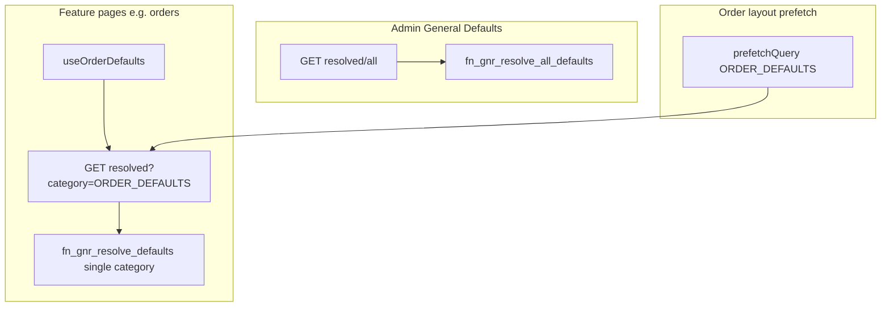
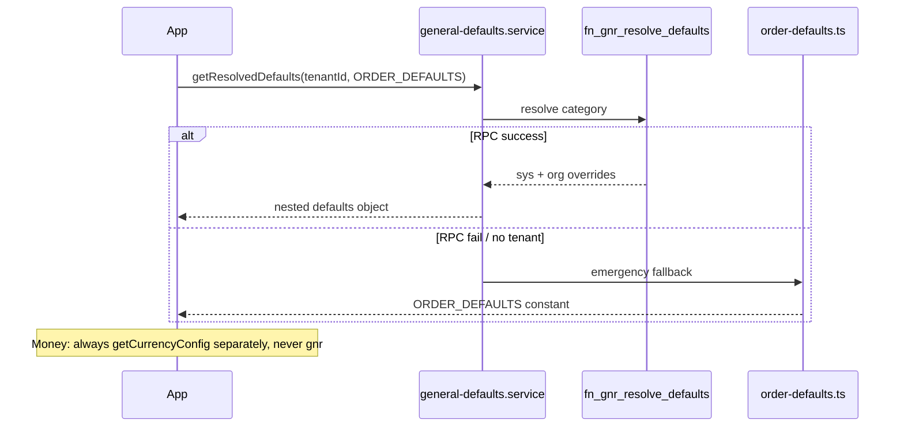
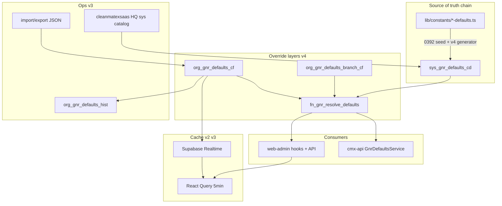

# Gnr Defaults System — Full Implementation Plan (no-table defaults only)

## Primary goal

**Move operational default values from hardcoded TypeScript into the database** so tenant admins can change them (e.g. max photos, quantity max, page size) **without a code change or redeploy**.

After implementation:

| Before | After |
|--------|-------|
| Change `ORDER_DEFAULTS.LIMITS.MAX_PHOTOS` in code → build → deploy | Admin updates `org_gnr_defaults_cf` or sys baseline via migration → app reads new value on next fetch |
| Defaults scattered in 40+ files | Single read path: `getResolvedDefaults(tenantId, category)` |

**This system only supplies default values.** It does not replace other configuration systems.

## What gnr does NOT do (non-goals)

| Do not replace | Keep using |
|----------------|------------|
| Tenant money settings | `TenantSettingsService.getCurrencyConfig()` / `TENANT_CURRENCY`, `TENANT_DECIMAL_PLACES` |
| Payment method config | `org_payment_methods_cf` |
| Notifications, loyalty, promos, workflow, inventory, finance, B2B, AR, ERP, delivery | Existing `org_*_cf` tables + settings UI |
| Status codes, enums, permissions | `lib/constants/*` DB-mirror constants (unchanged) |
| Feature flags / plan limits | HQ flags + plan limit middleware |
| Business logic, validation rules beyond numeric bounds | Services stay as-is; they **read** limits from gnr instead of importing literals |

**Rule:** Gnr is a **read-only source for tunable default numbers/strings** at runtime. No migration of business rules, no wrapping of other tables, no deleting existing settings flows.

## Overview

`sys_gnr_defaults_cd` (sys baseline) + `org_gnr_defaults_cf` (tenant override) + resolver RPC + service/API + admin UI at `/dashboard/catalog/gnr-defaults`.

**Implementation scope: v1–v4 complete** — foundation, performance, platform ops, and maturity in one production-ready delivery. No deferred gaps for audit, HQ sys catalog, import/export, plan caps, cmx-api, or consumer deprecation.

## Production-ready definition (no gaps)

| Layer | v1 | v2 | v3 | v4 |
|-------|----|----|----|-----|
| Schema + seed | ✓ | | | CI-generated seed script |
| Tenant admin UI | ✓ | batch UX | import/export, history tab | branch override UI (if branch context) |
| Platform HQ (cleanmatexsaas) | | | sys catalog CRUD + audit | |
| Runtime read (web-admin) | ✓ | prefetch, cache | Realtime invalidation | branch-aware RPC |
| Runtime read (cmx-api) | | | | NestJS module + guards |
| Security | RBAC tenant | | plan cap on PATCH | platform permission |
| Ops | seed validate CI | runbook | inventories drift surface | ESLint ban direct constant imports |
| Tests | unit merge/parse | | API import/export | contract + integration tests |

**Still explicitly out of scope (other features):** multi-currency orders, replacing tenant settings/workflow/inventory tables, CSV sys catalog bulk upload.

## Core rules (locked)

1. **No-table only** — no gnr category if values already live in another DB config table or `sys_tenant_settings_cd`.
2. **One category = one constant file** — `lib/constants/{kebab}-defaults.ts` → `{NAME}_DEFAULTS`.
3. **Full gnr coverage** — every **gnr-eligible** leaf in the constant file gets one DB row. Keys delegated to another DB system are listed in the constant but **excluded from gnr seed** (`GNR_EXCLUDED_KEYS` in registry).
4. **Flattening** — `GROUP.CHILD` → `GROUP_CHILD`.
5. **Runtime: DB first** — production path is always `fn_gnr_resolve_defaults` → merge tenant override → return to app. TS constant used **only** when RPC fails or before tenant context exists (boot/tests).
6. **Constants-db-mirror** — seed `default_value_jsonb` matches the constant value for gnr-eligible keys only.
7. **Change without redeploy** — admin PATCH override → React Query invalidates `['gnr-defaults', category, tenantId, branchId?]` → UI/API pick up new values; no build required.
8. **Performance by design (v2)** — batch RPC for admin; category-scoped fetch for features; React Query dedup; optional server TTL cache; prefetch on hot routes; parallel read with currency config.

---

## Performance — known issues and mitigations

Moving from hardcoded TS to DB reads adds latency. At ~46 small values this is negligible **if** caching and fetch scope are done correctly. v2 items below are **in scope**, not post-launch optional.

### Risk matrix

| Issue | When it hurts | Severity | Mitigation (in plan) |
|-------|----------------|----------|----------------------|
| **N+1 RPC on admin screen** | Opening General Defaults loads 8 categories | High | `fn_gnr_resolve_all_defaults` + single `GET /api/v1/gnr-defaults/resolved/all` for admin only |
| **Per-screen category RPC** | Each feature page calls resolve once | Low | One category per screen is fine; React Query dedupes identical keys |
| **Cold start / first paint** | Order UI before RPC returns | Medium | Prefetch `ORDER_DEFAULTS` in order route layout; hook exposes `isLoading`; TS fallback only inside service on RPC error (not as primary UI path) |
| **Double read on order flows** | `getOrderDefaults` + `getCurrencyConfig` | Low | `getOrderDefaults()` uses `Promise.all([resolveGnr, getCurrencyConfig])` — parallel, not serial |
| **Hook called in many children** | Same category, many components | Low | React Query shares one cache entry per `['gnr-defaults', category, tenantId, branchId?]`; prefer one hook at page/section boundary |
| **Server validation on every submit** | `submit-order` re-reads limits | Low | In-memory TTL cache in service (~60s per `tenantId+category`, same pattern as `TaxService`) |
| **Stale values after admin save** | Other users still see old max for up to 5 min | Medium | **v3:** Supabase Realtime on `org_gnr_defaults_cf` (tenant channel) → `queryClient.invalidateQueries(['gnr-defaults'])`; editor still invalidates immediately |
| **Client → API → Supabase hop** | Extra ~1 RTT vs direct Supabase | Low | Keep API route for `requirePermission` + tenant context; cost << product/order APIs |
| **TS fallback masking outages** | Silent wrong limits if RPC fails often | Medium | Structured `console.warn` + log tag `gnr_defaults_fallback`; monitor in prod |
| **Over-fetching all categories on dashboard** | Loading 8 categories on every page | High | **Never** resolve-all outside admin screen; features fetch one category only |

### Performance targets (acceptance)

| Surface | Target |
|---------|--------|
| Admin General Defaults (initial load) | **1** batch RPC (all categories), payload &lt; 10 KB |
| Order create screen (warm cache) | **0** extra RPC after prefetch/layout |
| Order create screen (cold) | **1** category RPC + currency settings (parallel) &lt; 100 ms DB time typical |
| `submit-order` validation | Cached resolve when same tenant within TTL; else 1 RPC |
| React Query | `staleTime: 5 * 60 * 1000`, `gcTime: 10 * 60 * 1000`, `refetchOnWindowFocus: false` |

### Fetch strategy (locked)



### Anti-patterns (forbid in implementation)

- `useGnrDefaults` in every table cell / list item
- `resolve_all` on dashboard shell or catalog hub
- Serial `await getCurrencyConfig()` then `await resolveGnr()` on hot path
- Feature code importing `ORDER_DEFAULTS` directly after wave A (service/hook only)
- Skipping server-side limit check on submit because client already validated

### Runtime read path (only for gnr-managed keys)



### Delegated keys (in constant file, NOT in gnr DB)

| Constant path | Authoritative source | Why excluded from gnr |
|---------------|---------------------|------------------------|
| `ORDER_DEFAULTS.CURRENCY` | `TENANT_CURRENCY` (settings DB) | Already DB-backed; changing via settings, not gnr |
| `ORDER_DEFAULTS.PRICE.DECIMAL_PLACES` | `TENANT_DECIMAL_PLACES` (settings DB) | Same |

`getOrderDefaults()` returns gnr limits/debounce/cache **plus** `currencyCode`/`decimalPlaces` from `getCurrencyConfig()` — two reads, no replacement.

### FAQ: Changing currency (e.g. USD → EUR) while tenant settings stay SAR

You selected: **gnr/ORDER_DEFAULTS currency is only a pre-settings-load fallback** — not an override of `TENANT_CURRENCY`.

| Phase | What user sees | Source |
|-------|----------------|--------|
| First paint / no tenant yet | May briefly use `ORDER_DEFAULTS.CURRENCY` (e.g. USD) | TS constant or optional gnr boot row |
| After `TenantCurrencyProvider` / `getCurrencyConfig()` | **Always SAR** (from settings DB) | `TENANT_CURRENCY` — wins every time |
| New order, payment, receipts | SAR | Tenant settings → order `currency_code` |

**Changing gnr or `order-defaults.ts` to EUR does not change production money when tenant settings = SAR.** Admins would think they changed currency but orders still use SAR — **do not expose `CURRENCY` in gnr admin UI.**

| Action | Effect when tenant = SAR |
|--------|--------------------------|
| Edit `TENANT_CURRENCY` in Settings → General | **Real change** — app uses new code everywhere |
| Edit gnr / `ORDER_DEFAULTS.CURRENCY` to EUR | **Cosmetic only** — flash before load; then SAR |
| Edit tenant settings to SAR + gnr to EUR | **Contradiction** — SAR wins; gnr EUR ignored at runtime |

**Plan decision (locked):**
- `CURRENCY` and `PRICE.DECIMAL_PLACES` remain **`@gnr-exclude`** — not seeded, not in admin UI.
- `ORDER_DEFAULTS.CURRENCY` stays in TS for emergency/boot/tests only; value should match a safe ISO code (consider aligning default to `OMR` if that matches migration seed, not critical since settings override).
- Admin docs on gnr screen: *"Currency is configured under Settings → General (Tenant Currency). This screen does not control money."*

If you later need **EUR orders while base is SAR**, that is **multi-currency** (order-level `currency_code` + FX) — a separate feature, not gnr defaults.

---

## Exclusion map (no gnr category)

| Removed category | Existing home |
|------------------|---------------|
| INVENTORY, NOTIFICATION, WORKFLOW, GIFT_CARD, MARKETING, FINANCE, B2B, AR, ERP_LITE, DELIVERY | See prior plan — dedicated `org_*` / settings tables |

Do not duplicate `sys_tenant_settings_cd` policy flags or plan limits.

---

## Phase 0 — Constant files (before migration)

Create **complete** `as const` objects first; migration seed is generated from these shapes.

| File | Export | Leaf count |
|------|--------|------------|
| [`order-defaults.ts`](web-admin/lib/constants/order-defaults.ts) | `ORDER_DEFAULTS` | **14 gnr** + 2 delegated (currency/decimal) |
| `list-defaults.ts` | `LIST_DEFAULTS` | 8 |
| `ui-defaults.ts` | `UI_DEFAULTS` | 5 |
| `customer-defaults.ts` | `CUSTOMER_DEFAULTS` | 6 |
| `catalog-defaults.ts` | `CATALOG_DEFAULTS` | 4 |
| `payment-defaults.ts` | `PAYMENT_DEFAULTS` | 2 |
| `report-defaults.ts` | `REPORT_DEFAULTS` | 4 |
| `api-defaults.ts` | `API_DEFAULTS` | 3 |

`lib/constants/gnr-default-codes.ts` — category names + flat code strings derived from files.

`lib/constants/gnr-defaults-registry.ts` — maps category → constant object (for service + seed validation).

**Do not** maintain a separate `gnr-fallbacks.ts` with different values — registry imports the 8 files above.

### `ORDER_DEFAULTS` — 14 gnr-eligible leaves (from existing file)

`CURRENCY` and `PRICE.DECIMAL_PLACES` stay in the TS constant for emergency fallback but are **not** seeded in gnr (settings DB owns them).

```ts
export const ORDER_DEFAULTS = {
  CURRENCY: 'USD',              // @gnr-exclude → TENANT_CURRENCY
  DEBOUNCE_MS: { ESTIMATION: 400, SEARCH: 300 },
  RETRY: { COUNT: 2, DELAYS: [1000, 2000] },
  LIMITS: { PRODUCTS_PER_CATEGORY: 5, QUANTITY_MIN: 1, QUANTITY_MAX: 999, ITEMS_HIGH_THRESHOLD: 10, MAX_PHOTOS: 10 },
  PRICE: { MIN: 0.001, STEP: 0.001, DECIMAL_PLACES: 3 }, // DECIMAL_PLACES @gnr-exclude → TENANT_DECIMAL_PLACES
  CACHE: { CATEGORIES_STALE_TIME: 300000, PRODUCTS_STALE_TIME: 120000 },
  FOCUS_DELAY: 100,
} as const;
```

| Flat `default_code` | Type | Value | `is_tenant_overridable` |
|---------------------|------|-------|-------------------------|
| `DEBOUNCE_MS_ESTIMATION` | INT | 400 | false |
| `DEBOUNCE_MS_SEARCH` | INT | 300 | false |
| `RETRY_COUNT` | INT | 2 | false |
| `RETRY_DELAYS` | JSON | [1000,2000] | false |
| `LIMITS_PRODUCTS_PER_CATEGORY` | INT | 5 | true |
| `LIMITS_QUANTITY_MIN` | INT | 1 | true |
| `LIMITS_QUANTITY_MAX` | INT | 999 | true |
| `LIMITS_ITEMS_HIGH_THRESHOLD` | INT | 10 | true |
| `LIMITS_MAX_PHOTOS` | INT | 10 | true |
| `PRICE_MIN` | NUMBER | 0.001 | true |
| `PRICE_STEP` | NUMBER | 0.001 | true |
| `CACHE_CATEGORIES_STALE_TIME` | INT | 300000 | false |
| `CACHE_PRODUCTS_STALE_TIME` | INT | 120000 | false |
| `FOCUS_DELAY` | INT | 100 | false |

### `LIST_DEFAULTS` — all 8 leaves (`list-defaults.ts`)

```ts
export const LIST_DEFAULTS = {
  PAGE_SIZE: { DEFAULT: 20, MAX: 100, MIN: 1, OPTIONS: [10, 20, 50, 100] },
  PLATFORM_INVENTORIES: { PAGE_SIZE: 25, PAGE_SIZE_MAX: 100 },
  ORDERS: { LIST_PAGE_SIZE: 20, PUBLIC_CUSTOMER_ORDERS_LIMIT: 25 },
} as const;
```

### `UI_DEFAULTS` — all 5 leaves (`ui-defaults.ts`)

```ts
export const UI_DEFAULTS = {
  DATA_GRID: {
    FILTER_DEBOUNCE_MS: 300,
    GLOBAL_SEARCH_DEBOUNCE_MS: 300,
    PAGE_SIZE_DEFAULT: 25,
    PAGE_SIZE_OPTIONS: [10, 25, 50, 100],
  },
  COPY_FEEDBACK_TIMEOUT_MS: 2000,
} as const;
```

Source: [`cmx-data-grid.tsx`](web-admin/src/ui/data-display/cmx-data-grid.tsx), [`cmx-datatable.tsx`](web-admin/src/ui/data-display/cmx-datatable.tsx).

### `CUSTOMER_DEFAULTS` — all 6 leaves (`customer-defaults.ts`)

```ts
export const CUSTOMER_DEFAULTS = {
  PICKER: { SEARCH_DEBOUNCE_MS: 300, API_TIMEOUT_MS: 8000 },
  LIST_PAGE_SIZE: 20,
  ORDERS_SECTION_PAGE_SIZE: 10,
  WALLET_LEDGER_PAGE_SIZE: 20,
  EXPORT_MAX_ROWS: 10000,
} as const;
```

### `CATALOG_DEFAULTS` — all 4 leaves (`catalog-defaults.ts`)

```ts
export const CATALOG_DEFAULTS = {
  PRODUCTS: { LIST_PAGE_SIZE: 20, LIST_PAGE_SIZE_MAX: 100 },
  PRICING_HISTORY_LIMIT: 100,
  PREFERENCE_SUGGEST_LIMIT_DEFAULT: 5,
} as const;
```

### `PAYMENT_DEFAULTS` — all 2 leaves (`payment-defaults.ts`)

```ts
export const PAYMENT_DEFAULTS = {
  PREVIEW: { DEBOUNCE_MS: 300, RETRY_COUNT: 2 },
} as const;
```

### `REPORT_DEFAULTS` — all 4 leaves (`report-defaults.ts`)

```ts
export const REPORT_DEFAULTS = {
  DEFAULT_PAGE_SIZE: 20,
  ORDERS: { PAGE_SIZE_OPTIONS: [10, 20, 50, 100], SUMMARY_LIMIT: 50 },
  SERVICE_LIMIT: 20,
} as const;
```

### `API_DEFAULTS` — all 3 leaves (`api-defaults.ts`)

```ts
export const API_DEFAULTS = {
  GENERIC_REQUEST_TIMEOUT_MS: 8000,
  CUSTOMER_PICKER_SKIP_COUNT_MAX_LIMIT: 15,
  PREFERENCE_SUGGEST_LIMIT_MAX: 20,
} as const;
```

**Total: 46 gnr seed rows** across 8 categories (14+8+5+6+4+2+4+3). Excludes 2 delegated money keys already in settings DB.

---

## Consumer migration pattern (read defaults only)

**Before (remove over time):**
```ts
import { ORDER_DEFAULTS } from '@/lib/constants/order-defaults';
const max = ORDER_DEFAULTS.LIMITS.MAX_PHOTOS;
```

**After:**
```ts
const { limits } = useOrderDefaults(); // or await getOrderDefaults(tenantId) server-side
const max = limits.maxPhotos;
```

- Replace **literal default reads** only — not imports of enums, types, or business rules.
- `ORDER_DEFAULTS` import may remain in tests and RPC-fallback layer inside the service, not in feature UI after wave A.
- Currency: keep `useTenantCurrency()` / `TenantCurrencyProvider` — do not route through gnr.

---

## Seed validation (mandatory)

Add `scripts/docs/validate-gnr-defaults-seed.ts` (or unit test):

1. For each category in registry, flatten constant → gnr-eligible leaves only (`GNR_EXCLUDED_KEYS` skipped).
2. Assert every eligible leaf has a matching `sys_gnr_defaults_cd` row.
3. Assert `default_value_jsonb` equals constant value.
4. Assert excluded keys (currency, decimal places) are **not** in seed.
5. CI fails on drift.
6. **v4:** `generate-gnr-defaults-migration.ts` produces SQL snippet for new keys; human reviews + new migration file (never auto-apply).

---

## Full production architecture (v1–v4)



**Permissions summary:**

| Permission | Who | Can do |
|------------|-----|--------|
| `gnr_defaults:read` | Tenant admin | View catalog + effective values |
| `gnr_defaults:manage` | Tenant admin | Tenant (+ branch v4) overrides, import/export |
| `gnr_defaults:sys_read` | Platform | View sys catalog |
| `gnr_defaults:sys_manage` | Platform | Edit sys baseline (HQ only) |

Two layers — loaded differently.

### Layer 1 — System baseline (`sys_gnr_defaults_cd`)

Global catalog (~46 rows). Same for all tenants unless overridden.

| When | How | Who |
|------|-----|-----|
| **First install** | Apply migration `0392_gnr_defaults_schema_seed.sql` | You review + run migrations (agent creates SQL only) |
| **New default key in a release** | **New** migration `INSERT ... ON CONFLICT DO NOTHING` | Dev — never edit old migrations |
| **Change baseline for everyone** | Migration **or** HQ Platform → General Defaults Sys Catalog (v3, audited) | Platform ops / dev |

Values are defined in `lib/constants/*-defaults.ts`, copied into migration SQL for initial seed. **v4:** subsequent keys via `generate-gnr-defaults-migration.ts`. **v3:** HQ can edit sys baseline at runtime (audited); migrations still required for new keys/columns.

### Layer 2 — Tenant override (`org_gnr_defaults_cf`)

| When | How | Who |
|------|-----|-----|
| **After feature is live** | **Catalog → General Defaults** → edit → Save | `gnr_defaults:manage` |
| **API / automation** | `PATCH /api/v1/gnr-defaults/overrides` | Integrations |
| **Reset** | Delete override in UI or `DELETE` API | Tenant admin |
| **Clone tenant / sandbox → prod** | **v3:** Export JSON → import on target tenant (`gnr_defaults:manage`) | Tenant admin / ops |
| **View change history** | **v3:** History tab on General Defaults (audit table) | `gnr_defaults:read` |

**No migration, no redeploy.** Override → DB row → app refetches (cache invalidation).

### Not uploaded to gnr

Currency → Settings → General (`TENANT_CURRENCY`). Payment, loyalty, workflow, etc. → existing `org_*` tables.

### Rollout order (full v1–v4)

1. **cleanmatex** migrations `0392`–`0397` (see Phase 1; `0390`/`0391` already taken) — you review + apply  
2. Deploy **web-admin** (tenant service, API, admin UI, consumption waves, Realtime subscriber)  
3. Deploy **cleanmatexsaas** HQ sys catalog screen (cross-project; migrations already in cleanmatex)  
4. Deploy **cmx-api** gnr module (v4)  
5. Run `validate-gnr-defaults-seed` + `rebuild:platform-info-inventories` + ui-access-contract check  
6. Tenants tune overrides; platform edits sys via HQ; ops use import/export for onboarding

---

## Phase 1 — Database (cleanmatex migrations)

**Sequence note:** `0390_rbac_permissions_admin_manage.sql` and `0391_nav_catalog_admin_manage.sql` already exist. Gnr migrations start at **0392**.

| Migration | Content |
|-----------|---------|
| `0392_gnr_defaults_schema_seed.sql` | `sys_gnr_defaults_cd`, `org_gnr_defaults_cf`, RLS, indexes, `fn_gnr_resolve_defaults`, `fn_gnr_resolve_all_defaults`, **46-row seed**, `GRANT EXECUTE` to `authenticated` |
| `0393_permissions_gnr_defaults.sql` | Tenant: `gnr_defaults:read`, `gnr_defaults:manage` + role seeds (mirror `*_permissions_*.sql` pattern) |
| `0394_nav_gnr_defaults.sql` | Nav dual-write (`catalog_gnr_defaults` under catalog parent) |
| `0395_gnr_defaults_audit.sql` | `org_gnr_defaults_hist` + `sys_gnr_defaults_hist` + triggers (tenant vs sys **separate** tables) |
| `0396_gnr_defaults_branch.sql` | `org_gnr_defaults_branch_cf` + branch-aware RPCs (`p_branch_id` optional) |
| `0397_permissions_gnr_platform.sql` | Platform: `gnr_defaults:sys_read`, `gnr_defaults:sys_manage` in `sys_auth_permissions_cd` (HQ RBAC consumes via cleanmatexsaas) |

### Table conventions (mandatory — database skill)

**`sys_gnr_defaults_cd`** (global, no `tenant_org_id`):

- PK: `(default_category, default_code)`
- Columns: `value_data_type`, `default_value_jsonb`, `name`, `name2`, `description`, `description2`, `validation_jsonb`, `is_tenant_overridable`, `is_active`, audit `created_at/_by/_info`, `updated_at/_by/_info`
- All string columns `TEXT`; money-like values still JSONB numbers in gnr

**`org_gnr_defaults_cf`** (tenant override):

- PK or UNIQUE: `(tenant_org_id, default_category, default_code)`
- `override_value_jsonb`, audit fields, `rec_status` soft delete if project standard applies
- RLS: `tenant_org_id = current_tenant_id()` for SELECT; writes via API with service check or RLS INSERT/UPDATE for manage role

**`org_gnr_defaults_branch_cf`** (v4):

- UNIQUE: `(tenant_org_id, branch_id, default_category, default_code)`
- Composite FK: `(branch_id, tenant_org_id) → org_branches_mst(id, tenant_org_id)` (see `0138_add_branch_id_remaining_transaction_tables.sql`)

**History tables:**

- `org_gnr_defaults_hist` — tenant override changes only
- `sys_gnr_defaults_hist` — sys catalog changes only (HQ writes)
- Never mix sys and tenant events in one hist table

**RPC resolution order (v4 branch-aware):**

```
effective = COALESCE(branch_override, tenant_override, sys_baseline)
```

- `p_branch_id` null → tenant + sys only.
- Branch overrides only for keys flagged `is_branch_overridable` on catalog row (new column, default false) — avoids branch layer on debounce/cache keys.

**Realtime (v3):** Add `org_gnr_defaults_cf` and `org_gnr_defaults_branch_cf` to `supabase_realtime` publication; filter client subscription by `tenant_org_id`.

**Sys catalog edits:** tenant app **never** writes `sys_gnr_defaults_cd`. HQ uses `gnr_defaults:sys_manage` via cleanmatexsaas platform-api (service role). Writes audit to **`sys_gnr_defaults_hist` only**.

**HQ vs constants drift:** After HQ sys edit, runtime DB wins; `validate-gnr-defaults-seed` compares migration seed + constants (release baseline), not live HQ edits. Runbook: periodic export sys catalog vs constants for release planning.

Seed: hand-written in `0392` for first ship; **v4** generator for **new keys only**.

---

## Phase 2 — Backend (cleanmatex web-admin)

- `general-defaults.service.ts` — nested build; **60s server TTL** per `tenantId+branchId?+category`
- `getResolvedDefaults(tenantId, category, branchId?)` — single category RPC
- `getAllResolvedDefaults(tenantId, branchId?)` — batch RPC (admin)
- `getOrderDefaults(tenantId, branchId?)` — `Promise.all([resolveGnr, getCurrencyConfig])`
- **Plan cap enforcement (v3):** on PATCH, consult `sys_plan_limits` / `getPlan()` only where an explicit mapping exists in `gnr-defaults-registry.ts` (e.g. `LIMITS_MAX_PHOTOS` → `max_photos_per_order` if defined); reject 402 if above plan max; **do not** invent plan codes without DB row in `sys_plan_limits`
- Hooks: `useGnrDefaults(category)`, `useAllGnrDefaults()`, `useGnrDefaultsRealtime()` — v3 Realtime on tenant + branch override tables
- **Server cache bust:** on PATCH/DELETE/import, clear in-memory TTL entry for affected `tenantId+branchId?+category`
- API routes (`web-admin/app/api/v1/gnr-defaults/`):
  - `GET resolved?category=` — `gnr_defaults:read` (or auth-only if same as other read APIs — prefer read perm)
  - `GET resolved/all` — admin (`gnr_defaults:read`)
  - `PATCH` / `DELETE overrides` — `gnr_defaults:manage` + reject `is_tenant_overridable=false` + plan cap + CSRF + audit trigger
  - `GET overrides/export` — v3 (`gnr_defaults:manage`)
  - `POST overrides/import` — v3 transactional; validate codes exist in catalog; max payload size; CSRF
  - `GET history` — v3 paginated `org_gnr_defaults_hist`
  - `GET catalog` — sys metadata read-only (`gnr_defaults:read`)
- **Permissions constants:** `web-admin/lib/constants/permissions/gnr-perm.ts` → `GNR_DEFAULTS_PERMISSIONS` (import in contract, page, routes)
- Observability: `gnr_defaults_fallback` warn tag; metric hook ready for Sentry

---

## Phase 3 — Frontend admin (tenant app)

- Route: `/dashboard/catalog/gnr-defaults`
- 8 category tabs; **one** `useAllGnrDefaults()` load
- Columns: **system** | **effective** | **tenant override** | edit (if `is_tenant_overridable`)
- **v3 History tab:** per-code change log from `org_gnr_defaults_hist`
- **v3 Import / Export:** buttons → download JSON, upload with preview + confirm
- **v4 Branch context:** pass `branchId` from order flow state / `useTenantSettings({ branchId })` pattern — **no** `useBranchContext()` (does not exist); optional thin `useSelectedBranchId()` if reused across screens
- Reset to system / clear branch / clear tenant override
- Link to Settings → General for currency
- Save → toast + local invalidation + Realtime fan-out **v3**
- i18n EN/AR

---

## Phase 4 — Consumption (web-admin, all waves)

| Wave | Categories | Notes |
|------|------------|-------|
| A | `ORDER_DEFAULTS` | Layout prefetch; server validation on submit; **remove direct `ORDER_DEFAULTS` imports** (v4 ESLint) |
| B | `LIST_DEFAULTS` | |
| C | `UI_DEFAULTS` | |
| D | `CUSTOMER`, `CATALOG`, `PAYMENT` | |
| E | `REPORT`, `API` | Server routes use service cache |

Pass `branchId` into resolve when branch-scoped limits apply (v4).

---

## Phase 5 — Gating, inventories, docs (cleanmatex)

- Extend [`catalog-access.ts`](web-admin/src/features/catalog/access/catalog-access.ts) — route `/dashboard/catalog/gnr-defaults`, hub `actions.openGnrDefaults`, all API deps
- Catalog hub [`page.tsx`](web-admin/app/dashboard/catalog/page.tsx) or services hub: gate link card with `gnr_defaults:read`
- Golden path: scaffold → derive → wire → check → sync ui-access-contract
- `rebuild:platform-info-inventories` — surface `page` + `api` for gnr routes
- `Permissions_To_InsertTo_DB.sql`
- `validate-gnr-defaults-seed` in CI (`npm run check:gnr-defaults-seed`)
- `docs/dev/gnr-defaults-runbook.md`
- **v3:** gnr section in Platform Inventories / drift report (constant ↔ migration ↔ runtime)
- tsc / eslint / `npm run build`

---

## Phase 6 — v2 performance (included)

| Item | Deliverable |
|------|-------------|
| Batch RPC + admin single fetch | Phase 1 + 2 + 3 |
| Order layout prefetch | Phase 4 wave A |
| Server TTL cache | `general-defaults.service.ts` |
| Parallel currency + gnr | `getOrderDefaults()` |
| Fallback observability | Structured warn + tag |

---

## Phase 7 — v3 platform ops (cleanmatex + cleanmatexsaas)

### cleanmatex (tenant app) — Phase 7a

Already covered: audit table, history API/UI, import/export, plan cap on PATCH, Realtime cache invalidation, inventories drift link.

### cleanmatexsaas (HQ console) — Phase 7b (cross-project)

Per [`docs/dev/rules/integration-contracts.md`](docs/dev/rules/integration-contracts.md): **migrations only in cleanmatex**; HQ UI in cleanmatexsaas.

| Deliverable | Location |
|-------------|----------|
| Platform API routes | `cleanmatexsaas/platform-api` — CRUD `sys_gnr_defaults_cd` via service role |
| Permissions | Use `gnr_defaults:sys_read` / `gnr_defaults:sys_manage` from `0396` |
| HQ screen | e.g. `/platform/general-defaults` — view/edit sys catalog, validation, audit log |
| Sys change audit | `sys_gnr_defaults_hist` (in `0395`) |
| No tenant override UI in HQ | Tenant overrides remain tenant-app only |

**HQ workflow:** platform admin edits sys baseline → audited → all tenants see new default on next resolve (unless tenant override exists).

---

## Phase 8 — v4 maturity (cleanmatex + cmx-api)

| Item | Deliverable |
|------|-------------|
| **cmx-api NestJS module** | `cmx-api/src/modules/gnr-defaults/` — `GnrDefaultsService` calls same RPCs; used by guards/validation on Nest routes |
| **CI seed generator** | `scripts/docs/generate-gnr-defaults-migration.ts` + `npm run generate:gnr-defaults-seed` — output SQL from `*-defaults.ts` + registry |
| **Contract tests** | `general-defaults.service.test.ts` — flatten/unflatten, merge precedence branch>tenant>sys, plan cap |
| **Integration tests** | API import/export round-trip; PATCH writes hist row |
| **ESLint rule** | Ban `ORDER_DEFAULTS` / `*_DEFAULTS` imports in `src/features/**` (allow `lib/constants`, service, tests) |
| **Branch overrides** | UI + API + RPC `p_branch_id` (Phase 1 `0395`) |
| **New category process** | Runbook section: audit for no-table → constant file → generate seed → migration → consumer wave |

---

## Phase 9 — Production verification checklist

Before marking production-ready:

- [ ] All 46 seed rows match constants (`check:gnr-defaults-seed`)
- [ ] Tenant admin: edit override, reset, history, export, import
- [ ] HQ: edit sys row, audit entry, tenant effective updates after override cleared
- [ ] Order submit rejects quantity &gt; resolved max (server-side)
- [ ] Plan cap blocks override above plan limit (v3)
- [ ] Realtime: second browser session refreshes within seconds of save (v3)
- [ ] Branch override beats tenant override when `branchId` passed (v4)
- [ ] cmx-api route using gnr validation (v4)
- [ ] No `ORDER_DEFAULTS` in feature folders (ESLint v4)
- [ ] ui-access-contract `--wire` pass for `/dashboard/catalog/gnr-defaults`
- [ ] platform-info-inventories refresh includes gnr permissions + APIs
- [ ] EN/AR strings present; `npm run build` green

---

## Implementation todos

### cleanmatex — core (v1)

1. Phase 0: 7 `*-defaults.ts` + registry + flatten + `GNR_EXCLUDED_KEYS`
2. `0392` schema, RPCs, 46-row seed (values match live `order-defaults.ts`)
3. `0393` tenant permissions + `0394` nav dual-write
4. `lib/constants/permissions/gnr-perm.ts` + service + hooks
5. API: resolved, overrides PATCH/DELETE
6. Admin UI: 8 tabs, sys/effective/override, i18n (`catalog.gnrDefaults.*`)
7. Gating + access contract + inventories

### cleanmatex — performance (v2)

8. Order layout prefetch + waves A–E consumption
9. Server TTL cache + bust on write + parallel `getOrderDefaults` + fallback logging
10. Runbook doc

### cleanmatex — platform ops (v3)

11. `0395` audit hist (org + sys) + triggers + Realtime publication
12. History API + History tab UI
13. Import/export API + UI
14. Plan cap on PATCH (registry mapping → `sys_plan_limits` only)
15. Realtime subscriber + query invalidation
16. Platform inventories / drift surfacing for gnr

### cleanmatex — maturity (v4)

17. `0396` branch table + branch-aware RPC + `is_branch_overridable` catalog flag
18. Branch override UI (branchId from order/settings pattern)
19. `0397` platform permissions
20. `generate-gnr-defaults-migration.ts` + `npm run check:gnr-defaults-seed`
21. ESLint no-direct-defaults-imports in features
22. Unit + integration tests
23. `npm run build` + full Phase 9 checklist

### cleanmatexsaas — HQ (v3, cross-project)

24. Platform API: sys catalog CRUD + hist
25. HQ UI: General Defaults sys catalog screen + RBAC

### cmx-api (v4)

26. `GnrDefaultsService` module + wire into at least one validation path (orders or shared guard)

---

## Version roadmap (v1–v4 — all in scope)

Scope stays **no-table defaults only**. Gnr does not absorb inventory, settings, workflow, or money policy.

### v1 — Foundation

Schema, seed, tenant permissions, nav, tenant admin UI (basic override), service, API, consumption start.

### v2 — Performance

Batch RPC, prefetch, server cache, parallel currency read, observability, runbook.

### v3 — Platform ops and tenant lifecycle

Audit history, import/export, plan cap enforcement, Realtime invalidation, HQ sys catalog (cleanmatexsaas), platform permissions, inventories drift.

### v4 — Maturity

Branch overrides, cmx-api module, CI seed generator, contract/integration tests, ESLint consumer deprecation, new-category runbook.

---

### Explicitly separate features (never gnr)

| Need | Right home |
|------|------------|
| Multi-currency orders (EUR order, SAR tenant) | Order financial / FX feature |
| Currency / decimal places | `TENANT_CURRENCY`, `TENANT_DECIMAL_PLACES` |
| Payment methods, loyalty, workflow, inventory limits | Existing `org_*` tables |
| Feature flags / plan limits (definition) | HQ flags — gnr only **reads** caps at PATCH time |
| Replacing `fn_stng_resolve_all_settings` | Never |

---

### Version decision rule

Deliver **v1→v4 as one production program** in ordered phases (migrations `0392`–`0397` → web-admin → HQ → cmx-api). Do not ship tenant admin without audit + import/export (v3) or leave cmx-api without gnr module (v4) if claiming production-ready with no gaps.

---

## Plan review — gaps fixed and watch items

### Critical bugs fixed in this review

| Issue | Fix |
|-------|-----|
| Migration `0391` collision | `0391_nav_catalog_admin_manage.sql` already exists → gnr starts at **0392** |
| Seed drift `PRODUCTS_PER_CATEGORY` | Plan said `2`; live [`order-defaults.ts`](web-admin/lib/constants/order-defaults.ts) has **`5`** — seed must use **5** |
| Sys audit wrong table | Sys writes go to **`sys_gnr_defaults_hist`**, not `org_gnr_defaults_hist` |
| `useBranchContext()` | Hook does not exist — use order `branchId` / `useTenantSettings` pattern |

### Remaining watch items (implement carefully)

| Item | Guidance |
|------|----------|
| Plan cap mapping | Define explicit `gnrCode → sys_plan_limits.limit_code` in registry; skip cap if no mapping (don't block PATCH) |
| HQ sys edit vs TS constants | Runtime DB authoritative; CI seed check is release baseline, not live HQ state |
| Branch overrides scope | Only keys with `is_branch_overridable=true` on catalog row |
| Server + client cache | Bust server TTL on every override write; Realtime for other browser tabs |
| Import security | Whitelist codes, size limit, transactional upsert, CSRF, `gnr_defaults:manage` |
| RLS + composite FKs | Follow `0138` branch FK pattern; test tenant isolation |
| Platform perms | Seeded in cleanmatex `sys_auth_permissions_cd`; enforced in cleanmatexsaas platform-api |
| Catalog hub gate | Add `actions.openGnrDefaults` + hub card gate (ui-access-contract) |
| `npm run check:i18n` | After adding `catalog.gnrDefaults.*` keys |

### Best-practice alignment (confirmed)

| Practice | Plan status |
|----------|-------------|
| Constants-db-mirror for seed | ✓ (fix PRODUCTS_PER_CATEGORY to 5) |
| Permissions in `lib/constants/permissions/` | ✓ added |
| Permissions require migration | ✓ 0393 + 0397 |
| Nav dual-write | ✓ 0394 |
| ui-access-contract golden path | ✓ Phase 5 |
| Tenant `tenant_org_id` filter | ✓ RLS on org tables |
| No modify existing migrations | ✓ new 0392+ only |
| Money via tenant settings, not gnr | ✓ locked |
| DB-first + TS emergency fallback | ✓ |
| Server validation on submit | ✓ wave A |
| Performance: batch admin, scoped feature fetch | ✓ v2 |
