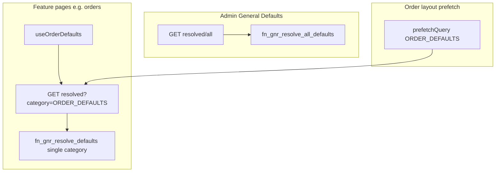
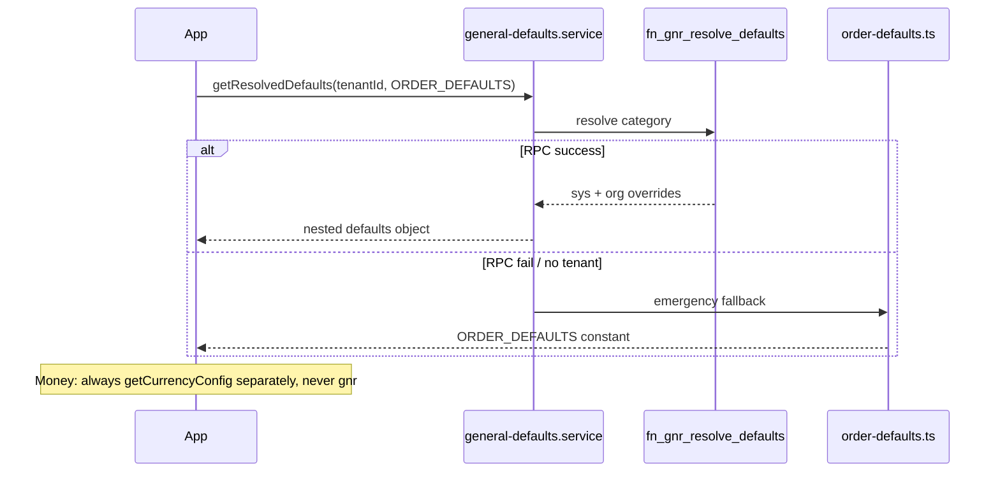

# Gnr Defaults System — Full Implementation Plan (no-table defaults only)

## Primary goal

**Move operational default values from hardcoded TypeScript into the database** so tenant admins can change them (e.g. max photos, quantity max, page size) **without a code change or redeploy**.

After implementation:

| Before | After |
|--------|-------|
| Change `ORDER_DEFAULTS.LIMITS.MAX_PHOTOS` in code → build → deploy | Admin updates `org_gnr_defaults_cf` or sys baseline via migration → app reads new value on next fetch |
| Defaults scattered in 40+ files | Single read path: `getResolvedDefaults(tenantId, category)` |

**This system only supplies default values.** It does not replace other configuration systems.

## What gnr does NOT do (non-goals)

| Do not replace | Keep using |
|----------------|------------|
| Tenant money settings | `TenantSettingsService.getCurrencyConfig()` / `TENANT_CURRENCY`, `TENANT_DECIMAL_PLACES` |
| Payment method config | `org_payment_methods_cf` |
| Notifications, loyalty, promos, workflow, inventory, finance, B2B, AR, ERP, delivery | Existing `org_*_cf` tables + settings UI |
| Status codes, enums, permissions | `lib/constants/*` DB-mirror constants (unchanged) |
| Feature flags / plan limits | HQ flags + plan limit middleware |
| Business logic, validation rules beyond numeric bounds | Services stay as-is; they **read** limits from gnr instead of importing literals |

**Rule:** Gnr is a **read-only source for tunable default numbers/strings** at runtime. No migration of business rules, no wrapping of other tables, no deleting existing settings flows.

## Overview

`sys_gnr_defaults_cd` (sys baseline) + `org_gnr_defaults_cf` (tenant override) + resolver RPC + service/API + admin UI at `/dashboard/catalog/gnr-defaults`.

**Implementation scope: v1 foundation + v2 performance/hardening** (single delivery). v3+ (HQ console, audit, import/export) remain deferred.

## Core rules (locked)

1. **No-table only** — no gnr category if values already live in another DB config table or `sys_tenant_settings_cd`.
2. **One category = one constant file** — `lib/constants/{kebab}-defaults.ts` → `{NAME}_DEFAULTS`.
3. **Full gnr coverage** — every **gnr-eligible** leaf in the constant file gets one DB row. Keys delegated to another DB system are listed in the constant but **excluded from gnr seed** (`GNR_EXCLUDED_KEYS` in registry).
4. **Flattening** — `GROUP.CHILD` → `GROUP_CHILD`.
5. **Runtime: DB first** — production path is always `fn_gnr_resolve_defaults` → merge tenant override → return to app. TS constant used **only** when RPC fails or before tenant context exists (boot/tests).
6. **Constants-db-mirror** — seed `default_value_jsonb` matches the constant value for gnr-eligible keys only.
7. **Change without redeploy** — admin PATCH override → React Query invalidates `['gnr-defaults', category, tenantId]` → UI/API pick up new values; no build required.
8. **Performance by design (v2)** — batch RPC for admin; category-scoped fetch for features; React Query dedup; optional server TTL cache; prefetch on hot routes; parallel read with currency config.

---

## Performance — known issues and mitigations

Moving from hardcoded TS to DB reads adds latency. At ~46 small values this is negligible **if** caching and fetch scope are done correctly. v2 items below are **in scope**, not post-launch optional.

### Risk matrix

| Issue | When it hurts | Severity | Mitigation (in plan) |
|-------|----------------|----------|----------------------|
| **N+1 RPC on admin screen** | Opening General Defaults loads 8 categories | High | `fn_gnr_resolve_all_defaults` + single `GET /api/v1/gnr-defaults/resolved/all` for admin only |
| **Per-screen category RPC** | Each feature page calls resolve once | Low | One category per screen is fine; React Query dedupes identical keys |
| **Cold start / first paint** | Order UI before RPC returns | Medium | Prefetch `ORDER_DEFAULTS` in order route layout; hook exposes `isLoading`; TS fallback only inside service on RPC error (not as primary UI path) |
| **Double read on order flows** | `getOrderDefaults` + `getCurrencyConfig` | Low | `getOrderDefaults()` uses `Promise.all([resolveGnr, getCurrencyConfig])` — parallel, not serial |
| **Hook called in many children** | Same category, many components | Low | React Query shares one cache entry per `['gnr-defaults', category, tenantId]`; prefer one hook at page/section boundary |
| **Server validation on every submit** | `submit-order` re-reads limits | Low | In-memory TTL cache in service (~60s per `tenantId+category`, same pattern as `TaxService`) |
| **Stale values after admin save** | Other users still see old max for up to 5 min | Medium | Editor invalidates own cache immediately; document 5 min SLA for other sessions (v3: push invalidation) |
| **Client → API → Supabase hop** | Extra ~1 RTT vs direct Supabase | Low | Keep API route for `requirePermission` + tenant context; cost << product/order APIs |
| **TS fallback masking outages** | Silent wrong limits if RPC fails often | Medium | Structured `console.warn` + log tag `gnr_defaults_fallback`; monitor in prod |
| **Over-fetching all categories on dashboard** | Loading 8 categories on every page | High | **Never** resolve-all outside admin screen; features fetch one category only |

### Performance targets (acceptance)

| Surface | Target |
|---------|--------|
| Admin General Defaults (initial load) | **1** batch RPC (all categories), payload &lt; 10 KB |
| Order create screen (warm cache) | **0** extra RPC after prefetch/layout |
| Order create screen (cold) | **1** category RPC + currency settings (parallel) &lt; 100 ms DB time typical |
| `submit-order` validation | Cached resolve when same tenant within TTL; else 1 RPC |
| React Query | `staleTime: 5 * 60 * 1000`, `gcTime: 10 * 60 * 1000`, `refetchOnWindowFocus: false` |

### Fetch strategy (locked)



### Anti-patterns (forbid in implementation)

- `useGnrDefaults` in every table cell / list item
- `resolve_all` on dashboard shell or catalog hub
- Serial `await getCurrencyConfig()` then `await resolveGnr()` on hot path
- Feature code importing `ORDER_DEFAULTS` directly after wave A (service/hook only)
- Skipping server-side limit check on submit because client already validated

### Runtime read path (only for gnr-managed keys)



### Delegated keys (in constant file, NOT in gnr DB)

| Constant path | Authoritative source | Why excluded from gnr |
|---------------|---------------------|------------------------|
| `ORDER_DEFAULTS.CURRENCY` | `TENANT_CURRENCY` (settings DB) | Already DB-backed; changing via settings, not gnr |
| `ORDER_DEFAULTS.PRICE.DECIMAL_PLACES` | `TENANT_DECIMAL_PLACES` (settings DB) | Same |

`getOrderDefaults()` returns gnr limits/debounce/cache **plus** `currencyCode`/`decimalPlaces` from `getCurrencyConfig()` — two reads, no replacement.

### FAQ: Changing currency (e.g. USD → EUR) while tenant settings stay SAR

You selected: **gnr/ORDER_DEFAULTS currency is only a pre-settings-load fallback** — not an override of `TENANT_CURRENCY`.

| Phase | What user sees | Source |
|-------|----------------|--------|
| First paint / no tenant yet | May briefly use `ORDER_DEFAULTS.CURRENCY` (e.g. USD) | TS constant or optional gnr boot row |
| After `TenantCurrencyProvider` / `getCurrencyConfig()` | **Always SAR** (from settings DB) | `TENANT_CURRENCY` — wins every time |
| New order, payment, receipts | SAR | Tenant settings → order `currency_code` |

**Changing gnr or `order-defaults.ts` to EUR does not change production money when tenant settings = SAR.** Admins would think they changed currency but orders still use SAR — **do not expose `CURRENCY` in gnr admin UI.**

| Action | Effect when tenant = SAR |
|--------|--------------------------|
| Edit `TENANT_CURRENCY` in Settings → General | **Real change** — app uses new code everywhere |
| Edit gnr / `ORDER_DEFAULTS.CURRENCY` to EUR | **Cosmetic only** — flash before load; then SAR |
| Edit tenant settings to SAR + gnr to EUR | **Contradiction** — SAR wins; gnr EUR ignored at runtime |

**Plan decision (locked):**
- `CURRENCY` and `PRICE.DECIMAL_PLACES` remain **`@gnr-exclude`** — not seeded, not in admin UI.
- `ORDER_DEFAULTS.CURRENCY` stays in TS for emergency/boot/tests only; value should match a safe ISO code (consider aligning default to `OMR` if that matches migration seed, not critical since settings override).
- Admin docs on gnr screen: *"Currency is configured under Settings → General (Tenant Currency). This screen does not control money."*

If you later need **EUR orders while base is SAR**, that is **multi-currency** (order-level `currency_code` + FX) — a separate feature, not gnr defaults.

---

## Exclusion map (no gnr category)

| Removed category | Existing home |
|------------------|---------------|
| INVENTORY, NOTIFICATION, WORKFLOW, GIFT_CARD, MARKETING, FINANCE, B2B, AR, ERP_LITE, DELIVERY | See prior plan — dedicated `org_*` / settings tables |

Do not duplicate `sys_tenant_settings_cd` policy flags or plan limits.

---

## Phase 0 — Constant files (before migration)

Create **complete** `as const` objects first; migration seed is generated from these shapes.

| File | Export | Leaf count |
|------|--------|------------|
| [`order-defaults.ts`](web-admin/lib/constants/order-defaults.ts) | `ORDER_DEFAULTS` | **14 gnr** + 2 delegated (currency/decimal) |
| `list-defaults.ts` | `LIST_DEFAULTS` | 8 |
| `ui-defaults.ts` | `UI_DEFAULTS` | 5 |
| `customer-defaults.ts` | `CUSTOMER_DEFAULTS` | 6 |
| `catalog-defaults.ts` | `CATALOG_DEFAULTS` | 4 |
| `payment-defaults.ts` | `PAYMENT_DEFAULTS` | 2 |
| `report-defaults.ts` | `REPORT_DEFAULTS` | 4 |
| `api-defaults.ts` | `API_DEFAULTS` | 3 |

`lib/constants/gnr-default-codes.ts` — category names + flat code strings derived from files.

`lib/constants/gnr-defaults-registry.ts` — maps category → constant object (for service + seed validation).

**Do not** maintain a separate `gnr-fallbacks.ts` with different values — registry imports the 8 files above.

### `ORDER_DEFAULTS` — 14 gnr-eligible leaves (from existing file)

`CURRENCY` and `PRICE.DECIMAL_PLACES` stay in the TS constant for emergency fallback but are **not** seeded in gnr (settings DB owns them).

```ts
export const ORDER_DEFAULTS = {
  CURRENCY: 'USD',              // @gnr-exclude → TENANT_CURRENCY
  DEBOUNCE_MS: { ESTIMATION: 400, SEARCH: 300 },
  RETRY: { COUNT: 2, DELAYS: [1000, 2000] },
  LIMITS: { PRODUCTS_PER_CATEGORY: 2, QUANTITY_MIN: 1, QUANTITY_MAX: 999, ITEMS_HIGH_THRESHOLD: 10, MAX_PHOTOS: 10 },
  PRICE: { MIN: 0.001, STEP: 0.001, DECIMAL_PLACES: 3 }, // DECIMAL_PLACES @gnr-exclude → TENANT_DECIMAL_PLACES
  CACHE: { CATEGORIES_STALE_TIME: 300000, PRODUCTS_STALE_TIME: 120000 },
  FOCUS_DELAY: 100,
} as const;
```

| Flat `default_code` | Type | Value | `is_tenant_overridable` |
|---------------------|------|-------|-------------------------|
| `DEBOUNCE_MS_ESTIMATION` | INT | 400 | false |
| `DEBOUNCE_MS_SEARCH` | INT | 300 | false |
| `RETRY_COUNT` | INT | 2 | false |
| `RETRY_DELAYS` | JSON | [1000,2000] | false |
| `LIMITS_PRODUCTS_PER_CATEGORY` | INT | 2 | true |
| `LIMITS_QUANTITY_MIN` | INT | 1 | true |
| `LIMITS_QUANTITY_MAX` | INT | 999 | true |
| `LIMITS_ITEMS_HIGH_THRESHOLD` | INT | 10 | true |
| `LIMITS_MAX_PHOTOS` | INT | 10 | true |
| `PRICE_MIN` | NUMBER | 0.001 | true |
| `PRICE_STEP` | NUMBER | 0.001 | true |
| `CACHE_CATEGORIES_STALE_TIME` | INT | 300000 | false |
| `CACHE_PRODUCTS_STALE_TIME` | INT | 120000 | false |
| `FOCUS_DELAY` | INT | 100 | false |

### `LIST_DEFAULTS` — all 8 leaves (`list-defaults.ts`)

```ts
export const LIST_DEFAULTS = {
  PAGE_SIZE: { DEFAULT: 20, MAX: 100, MIN: 1, OPTIONS: [10, 20, 50, 100] },
  PLATFORM_INVENTORIES: { PAGE_SIZE: 25, PAGE_SIZE_MAX: 100 },
  ORDERS: { LIST_PAGE_SIZE: 20, PUBLIC_CUSTOMER_ORDERS_LIMIT: 25 },
} as const;
```

### `UI_DEFAULTS` — all 5 leaves (`ui-defaults.ts`)

```ts
export const UI_DEFAULTS = {
  DATA_GRID: {
    FILTER_DEBOUNCE_MS: 300,
    GLOBAL_SEARCH_DEBOUNCE_MS: 300,
    PAGE_SIZE_DEFAULT: 25,
    PAGE_SIZE_OPTIONS: [10, 25, 50, 100],
  },
  COPY_FEEDBACK_TIMEOUT_MS: 2000,
} as const;
```

Source: [`cmx-data-grid.tsx`](web-admin/src/ui/data-display/cmx-data-grid.tsx), [`cmx-datatable.tsx`](web-admin/src/ui/data-display/cmx-datatable.tsx).

### `CUSTOMER_DEFAULTS` — all 6 leaves (`customer-defaults.ts`)

```ts
export const CUSTOMER_DEFAULTS = {
  PICKER: { SEARCH_DEBOUNCE_MS: 300, API_TIMEOUT_MS: 8000 },
  LIST_PAGE_SIZE: 20,
  ORDERS_SECTION_PAGE_SIZE: 10,
  WALLET_LEDGER_PAGE_SIZE: 20,
  EXPORT_MAX_ROWS: 10000,
} as const;
```

### `CATALOG_DEFAULTS` — all 4 leaves (`catalog-defaults.ts`)

```ts
export const CATALOG_DEFAULTS = {
  PRODUCTS: { LIST_PAGE_SIZE: 20, LIST_PAGE_SIZE_MAX: 100 },
  PRICING_HISTORY_LIMIT: 100,
  PREFERENCE_SUGGEST_LIMIT_DEFAULT: 5,
} as const;
```

### `PAYMENT_DEFAULTS` — all 2 leaves (`payment-defaults.ts`)

```ts
export const PAYMENT_DEFAULTS = {
  PREVIEW: { DEBOUNCE_MS: 300, RETRY_COUNT: 2 },
} as const;
```

### `REPORT_DEFAULTS` — all 4 leaves (`report-defaults.ts`)

```ts
export const REPORT_DEFAULTS = {
  DEFAULT_PAGE_SIZE: 20,
  ORDERS: { PAGE_SIZE_OPTIONS: [10, 20, 50, 100], SUMMARY_LIMIT: 50 },
  SERVICE_LIMIT: 20,
} as const;
```

### `API_DEFAULTS` — all 3 leaves (`api-defaults.ts`)

```ts
export const API_DEFAULTS = {
  GENERIC_REQUEST_TIMEOUT_MS: 8000,
  CUSTOMER_PICKER_SKIP_COUNT_MAX_LIMIT: 15,
  PREFERENCE_SUGGEST_LIMIT_MAX: 20,
} as const;
```

**Total: 46 gnr seed rows** across 8 categories (14+8+5+6+4+2+4+3). Excludes 2 delegated money keys already in settings DB.

---

## Consumer migration pattern (read defaults only)

**Before (remove over time):**
```ts
import { ORDER_DEFAULTS } from '@/lib/constants/order-defaults';
const max = ORDER_DEFAULTS.LIMITS.MAX_PHOTOS;
```

**After:**
```ts
const { limits } = useOrderDefaults(); // or await getOrderDefaults(tenantId) server-side
const max = limits.maxPhotos;
```

- Replace **literal default reads** only — not imports of enums, types, or business rules.
- `ORDER_DEFAULTS` import may remain in tests and RPC-fallback layer inside the service, not in feature UI after wave A.
- Currency: keep `useTenantCurrency()` / `TenantCurrencyProvider` — do not route through gnr.

---

## Seed validation (mandatory)

Add `scripts/docs/validate-gnr-defaults-seed.ts` (or unit test):

1. For each category in registry, flatten constant → gnr-eligible leaves only (`GNR_EXCLUDED_KEYS` skipped).
2. Assert every eligible leaf has a matching `sys_gnr_defaults_cd` row.
3. Assert `default_value_jsonb` equals constant value.
4. Assert excluded keys (currency, decimal places) are **not** in seed.
5. CI fails on drift.

---

## When & how gnr defaults get into the DB (“upload”)

Two layers — loaded differently.

### Layer 1 — System baseline (`sys_gnr_defaults_cd`)

Global catalog (~46 rows). Same for all tenants unless overridden.

| When | How | Who |
|------|-----|-----|
| **First install** | Apply migration `0391_gnr_defaults_schema_seed.sql` | You review + run migrations (agent creates SQL only) |
| **New default key in a release** | **New** migration `INSERT ... ON CONFLICT DO NOTHING` | Dev — never edit old migrations |
| **Change baseline for everyone** | New migration updating `default_value_jsonb` | Dev + migration deploy |

Values are defined in `lib/constants/*-defaults.ts`, copied into migration SQL. **Not** a CSV/manual upload in v1.

### Layer 2 — Tenant override (`org_gnr_defaults_cf`)

| When | How | Who |
|------|-----|-----|
| **After feature is live** | **Catalog → General Defaults** → edit → Save | `gnr_defaults:manage` |
| **API / automation** | `PATCH /api/v1/gnr-defaults/overrides` | Integrations |
| **Reset** | Delete override in UI or `DELETE` API | Tenant admin |

**No migration, no redeploy.** Override → DB row → app refetches (cache invalidation).

### Not uploaded to gnr

Currency → Settings → General (`TENANT_CURRENCY`). Payment, loyalty, workflow, etc. → existing `org_*` tables.

### Rollout order

1. Dev creates `0391` (schema + seed) → `0392` (permissions) → `0393` (nav)  
2. You apply migrations (`0390` is already `rbac_permissions_admin_manage`)  
3. Deploy web-admin (service + API + admin UI)  
4. Tenants tune overridable values in admin UI — no further upload

---

## Phase 1 — Database

| Migration | Content |
|-----------|---------|
| `0391_gnr_defaults_schema_seed.sql` | Schema, RLS, indexes, **`fn_gnr_resolve_defaults`**, **`fn_gnr_resolve_all_defaults`**, **46-row seed** |
| `0392_permissions_gnr_defaults.sql` | `gnr_defaults:read`, `gnr_defaults:manage` |
| `0393_nav_gnr_defaults.sql` | Nav dual-write |

**RPC functions (v1+v2):**

- `fn_gnr_resolve_defaults(p_tenant_id, p_category)` — single category; used by feature pages and server validation.
- `fn_gnr_resolve_all_defaults(p_tenant_id)` — all categories in one call; **admin screen only**.

Indexes: `(tenant_org_id, default_category, default_code)` on `org_gnr_defaults_cf`; PK on sys catalog.

Seed SQL may be hand-written from Phase 0 constants or generated by validation script.

---

## Phase 2 — Backend

- `general-defaults.service.ts` — DB read; `buildCategoryDefaults()` nested shape; **60s in-memory TTL cache** per `tenantId+category` (server routes)
- `getResolvedDefaults(tenantId, category)` — single category RPC
- `getAllResolvedDefaults(tenantId)` — batch RPC (admin)
- `getOrderDefaults()` — `Promise.all([resolve ORDER_DEFAULTS, getCurrencyConfig()])` — parallel
- `useGnrDefaults(category)` — React Query, `staleTime` 5min, deduped query key
- `useAllGnrDefaults()` — admin hook; single fetch for 8 tabs
- API routes:
  - `GET /api/v1/gnr-defaults/resolved?category=` — feature consumption
  - `GET /api/v1/gnr-defaults/resolved/all` — admin only (`gnr_defaults:read`)
  - `PATCH` / `DELETE` overrides — `gnr_defaults:manage`
- **Observability:** log `gnr_defaults_fallback` when TS emergency path used (RPC error)

---

## Phase 3 — Frontend admin

- 8 category tabs; **one** `useAllGnrDefaults()` load (not 8 per-tab fetches)
- Columns per row: **system default** | **effective** | **tenant override** (if any) | edit (overridable only)
- Inline validation from `validation_jsonb`; **Reset to system default** clears override
- No tab for currency/decimal — link to Settings → General for money
- Save override → toast + `invalidateQueries` for `['gnr-defaults', …]` → **no redeploy**

---

## Phase 4 — Consumption (phased)

| Wave | Categories | Performance note |
|------|------------|------------------|
| A | `ORDER_DEFAULTS` | Prefetch in `app/dashboard/orders/**/layout.tsx` (or nearest order layout); hook at page level |
| B | `LIST_DEFAULTS` | Category-scoped fetch only on list screens |
| C | `UI_DEFAULTS` | Consider shared provider only if data-grid mounts many times same route |
| D | `CUSTOMER_DEFAULTS`, `CATALOG_DEFAULTS`, `PAYMENT_DEFAULTS` | One category per feature area |
| E | `REPORT_DEFAULTS`, `API_DEFAULTS` | Server routes use service cache on repeated validation |

Consumers import nested shapes from service/hooks, not flat DB codes.

---

## Phase 5 — Gating, docs, validation

- catalog-access, ui-access-contract, inventories
- `Permissions_To_InsertTo_DB.sql`
- `validate-gnr-defaults-seed` in CI
- tsc / eslint / build

---

## Phase 6 — v2 hardening (included in delivery)

| Item | Deliverable |
|------|-------------|
| Batch RPC + admin single fetch | Phase 1 + 2 + 3 |
| Order layout prefetch | Phase 4 wave A |
| Server TTL cache | `general-defaults.service.ts` |
| Parallel currency + gnr | `getOrderDefaults()` |
| Fallback observability | Structured warn + tag |
| Runbook | `docs/dev/gnr-defaults-runbook.md` — add key: constant → migration → validate → consumer |

**Deferred to v3:** HQ sys catalog UI, override audit history, import/export, plan-gated caps, realtime push invalidation.

**Deferred to v4:** branch overrides, CI-generated seed migrations, cmx-api NestJS module (unless order validation already in web-admin API is sufficient for launch).

---

## Implementation todos

1. **Phase 0**: 7 new `*-defaults.ts` files + registry + `GNR_EXCLUDED_KEYS` + flatten utility
2. `0391` migration: schema, **both RPCs**, **46 gnr rows** (exclude delegated money keys)
3. `0392` permissions + `0393` nav
4. Service: nested build, **server TTL cache**, batch + single resolve, parallel `getOrderDefaults`, fallback logging
5. API: `resolved?category=`, `resolved/all`, overrides PATCH/DELETE
6. Admin UI: 8 tabs, **sys/effective/override columns**, reset, single `useAllGnrDefaults`
7. **Order layout prefetch** + wave A consumption
8. Seed validation script/test
9. Consumption waves B–E
10. Gating, runbook doc, tests, build

---

## Version roadmap (v1 + v2 in scope → v3+ deferred)

Scope stays **no-table defaults only** in every version. Gnr does not absorb inventory, settings, workflow, or money policy.

### v1 + v2 — Deliver in this implementation

| Area | Delivered |
|------|-----------|
| Schema | `sys_gnr_defaults_cd`, `org_gnr_defaults_cf`, single + **all** resolve RPCs |
| Seed | 8 categories, ~46 rows; sys via migration only |
| Runtime | DB-first + TS emergency fallback; React Query 5 min; **server 60s TTL** on hot API paths |
| Admin | Tenant UI: **sys / effective / override** columns; reset; **one batch load** for 8 tabs |
| API | `resolved?category=`, `resolved/all`, PATCH/DELETE overrides; server validation wave A |
| Performance | Order layout **prefetch**; parallel gnr + currency; fallback logging |
| Consumption | Waves A–E in web-admin |
| Ops | `validate-gnr-defaults-seed` CI; gating; inventories; **runbook** |

**Still out of scope (v3+):** HQ sys edit UI, override audit, import/export, plan-gated overrides, branch layer, cmx-api Nest module.

---

### v3 — Platform ops and tenant lifecycle (deferred)

| Item | What |
|------|------|
| HQ console (cleanmatexsaas) | Platform screen to view/edit **sys** catalog (audited); tenant app remains override-only |
| Override audit | `org_gnr_defaults_cf` history table or audit log: who changed what, when, old/new value |
| Import / export | JSON export/import of tenant overrides (onboarding, sandbox → prod template) — not sys catalog |
| Plan coupling | Optional: `is_tenant_overridable` enforced by plan limit (e.g. max photos cap by plan) — **read** plan in API, do not duplicate plan data in gnr |
| Realtime-ish refresh | After save, broadcast invalidation hint or shorten `staleTime` for users with `gnr_defaults:manage` |
| Drift dashboard | Link from Help → Platform Inventories: constant file vs DB seed vs runtime usage |

**Still not in v3:** branch-level defaults (use settings 7-layer if needed); CSV bulk upload of sys catalog.

---

### v4 — Maturity (only if product asks)

| Item | What |
|------|------|
| New categories | Add only when audit finds **no** existing `org_*_cf` / settings home — same rules as v1 |
| Branch overrides | **Only if** product requires branch-specific limits (e.g. max photos per branch) — new table `org_gnr_defaults_branch_cf` + resolver layer; large scope — prefer settings or feature flags first |
| Generated seed | Migration seed generated from `*-defaults.ts` in CI (not hand-written SQL) |
| Contract tests | Consumer tests assert hooks return DB-shaped nested objects |
| Deprecation | Remove direct `ORDER_DEFAULTS` imports from feature code (keep in service fallback + tests only) |

---

### Explicitly separate features (not gnr v2/v3/v4)

These were discussed in planning but belong to **other** workstreams:

| Need | Right home |
|------|------------|
| Multi-currency orders (EUR order, SAR tenant) | Order financial / FX feature — not gnr |
| Currency / decimal places | `TENANT_CURRENCY`, `TENANT_DECIMAL_PLACES` — Settings → General |
| Payment methods, loyalty, workflow, inventory limits | Existing `org_*` tables and UIs |
| Feature flags / plan limits | HQ flags + middleware |
| Replacing `fn_stng_resolve_all_settings` | Never — different resolution model |

---

### Version decision rule

Ship **v1 + v2 together** in one PR series. v3+ only when product needs HQ ops, audit, or tenant cloning. Do not defer batch RPC or prefetch to a follow-up — they prevent known performance issues on day one.
