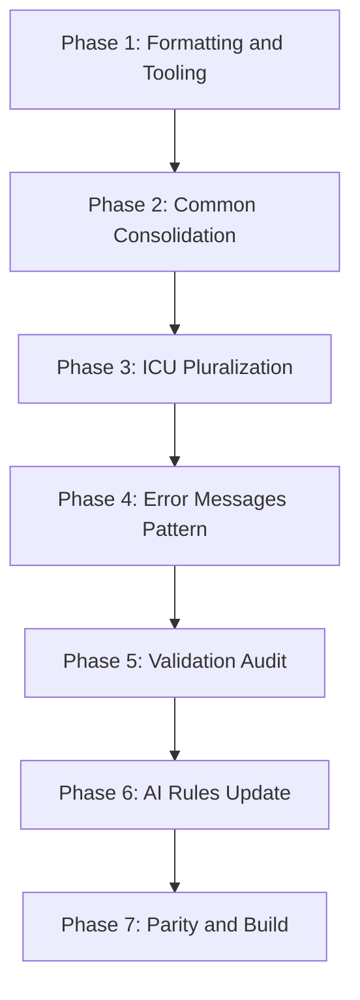

# i18n Enhancement Plan

## Scope

- **Files per locale:** Keep single file per locale ([web-admin/messages/en.json](web-admin/messages/en.json), [web-admin/messages/ar.json](web-admin/messages/ar.json)) — no splitting
- **Tooling:** Add parity-check script, npm script, style guide
- **Code changes:** Migrate duplicates to `common`, adopt ICU pluralization where applicable
- **Rules:** Update [.cursor/rules/i18n.mdc](.cursor/rules/i18n.mdc), [.claude/skills/i18n/SKILL.md](.claude/skills/i18n/SKILL.md), and [.cursor/rules/aicoderfrontendinstructions.mdc](.cursor/rules/aicoderfrontendinstructions.mdc)

---

## Recommendations Coverage

| Recommendation                                    | Phase    | Status   |
| ------------------------------------------------- | -------- | -------- |
| Pretty-print JSON                                 | 1.1      | Planned  |
| Parity-check script                               | 1.2, 1.3 | Planned  |
| i18n docs (style-guide, future-suggestions, etc.) | 1.4      | Planned  |
| Consolidate duplicates into common                | 2        | Planned  |
| ICU pluralization (orders bulk, order-table)      | 3.1      | Planned  |
| Replace hardcoded item/items, Warning/Warnings    | 3.2      | Planned  |
| Arabic plural rules                               | 3.3      | Planned  |
| Error messages pattern                            | 4        | Planned  |
| Validation namespace reuse                        | 5        | Planned  |
| Update AI coder rules (i18n.mdc, SKILL, aicoder)  | 6        | Planned  |
| CLAUDE.md UI rules                                | 6.4      | Required |

---

## Phase 1: Formatting and Tooling (No Component Changes)

### 1.1 Pretty-print JSON

- Format [web-admin/messages/en.json](web-admin/messages/en.json) and [web-admin/messages/ar.json](web-admin/messages/ar.json) with 2-space indentation
- Preserve exact structure; only change layout for readability
- No changes to [web-admin/i18n.ts](web-admin/i18n.ts) or components

### 1.2 Parity-check Script

Create `web-admin/scripts/check-i18n-parity.js`:

- Recursively compare keys between en.json and ar.json
- Report keys in en but missing in ar, and vice versa
- Support `--fix` to optionally list keys to add (no auto-edit)
- Exit with non-zero code if mismatches found (for CI)

### 1.3 npm Script

Add to [web-admin/package.json](web-admin/package.json):

```json
"check:i18n": "node scripts/check-i18n-parity.js"
```

### 1.4 i18n Documentation (docs/dev/i18n_docs/)

Create `docs/dev/i18n_docs/` and add:

**1. README.md** — Index and overview of all i18n docs

**2. style-guide.md** — Developer style guide (key naming, interpolation, pluralization, formatting, error messages, Arabic-specific, workflow)

**3. future-suggestions.md** — Recommendations for future work:

- Split by feature when files exceed ~5,000 lines per locale
- TypeScript types from keys for autocomplete (e.g. `type MessageKey = ...`)
- CI integration: run `check:i18n` on PR
- Translation memory / glossary for consistency
- Third language support (if needed)
- Lazy-load per-route translations (when splitting)
- Professional translation review for Arabic

**4. migration-checklist.md** — Step-by-step checklist for this migration (reference during implementation)

**5. common-keys-reference.md** — List of all common keys with usage examples

Update rule references: point to `docs/dev/i18n_docs/style-guide.md` instead of `docs/dev/i18n-style-guide.md`.

---

## Phase 2: Common Keys Consolidation

### 2.1 Add Missing Common Keys

Ensure `common` includes pagination and shared UI (currently missing; vouchers-table expects them):

- `page` (generic: "Page")
- `of` (generic: "of")
- `showing` (generic: "Showing")
- `to` (generic: "to") — for "X to Y of Z" patterns

Add to both en.json and ar.json under `common`.

### 2.2 Migrate Feature-specific Duplicates to tCommon

Replace `t('clearFilters')`, `t('cancel')`, `t('loading')`, `t('create')`, `t('import')` with `tCommon(...)` where semantically identical.

**Files to update (~18 files):**

| File                                                                                                         | Change                                                                    |
| ------------------------------------------------------------------------------------------------------------ | ------------------------------------------------------------------------- |
| [invoice-filters-bar.tsx](web-admin/app/dashboard/billing/invoices/components/invoice-filters-bar.tsx)       | `t('clearFilters')` → `tCommon('clearFilters')`                           |
| [payment-filters-bar.tsx](web-admin/app/dashboard/billing/payments/components/payment-filters-bar.tsx)       | `t('clearFilters')` → `tCommon('clearFilters')`                           |
| [refund-payment-dialog.tsx](web-admin/app/dashboard/billing/payments/components/refund-payment-dialog.tsx)   | `t('cancel')` → `tCommon('cancel')`                                       |
| [create-payment-form.tsx](web-admin/app/dashboard/billing/payments/new/create-payment-form.tsx)              | `t('cancel')` → `tCommon('cancel')`                                       |
| [ready-date-picker-modal.tsx](web-admin/app/dashboard/orders/new/components/ready-date-picker-modal.tsx)     | `t('cancel')` → `tCommon('cancel')`                                       |
| [split-confirmation-dialog.tsx](web-admin/app/dashboard/processing/components/split-confirmation-dialog.tsx) | `t('cancel')` → `tCommon('cancel')`                                       |
| [settings/users/page.tsx](web-admin/app/dashboard/settings/users/page.tsx)                                   | `t('cancel')` → `tCommon('cancel')`                                       |
| [order-tracking-page.tsx](web-admin/src/features/orders/public/order-tracking-page.tsx)                      | `t('loading')` → `tCommon('loading')`                                     |
| [customer-picker-modal.tsx](web-admin/app/dashboard/orders/new/components/customer-picker-modal.tsx)         | `t('loading')` → `tCommon('loading')`                                     |
| [processing/page.tsx](web-admin/app/dashboard/processing/page.tsx)                                           | `t('loading')` fallback → `tCommon('loading')`                            |
| [OrderPiecesManager.tsx](web-admin/components/orders/OrderPiecesManager.tsx)                                 | `t('loading')` → `tCommon('loading')`                                     |
| [PieceHistory.tsx](web-admin/components/orders/PieceHistory.tsx)                                             | `t('loading')` → `tCommon('loading')`                                     |
| [product-form.tsx](web-admin/app/dashboard/catalog/services/components/product-form.tsx)                     | `t('loading')`, `t('create')` → `tCommon('loading')`, `tCommon('create')` |
| [catalog/services/page.tsx](web-admin/app/dashboard/catalog/services/page.tsx)                               | `t('clearFilters')`, `t('loading')` → `tCommon(...)`                      |
| [catalog/categories/page.tsx](web-admin/app/dashboard/catalog/categories/page.tsx)                           | `t('loading')` → `tCommon('loading')`                                     |
| [catalog/pricing/page.tsx](web-admin/app/dashboard/catalog/pricing/page.tsx)                                 | `t('loading')`, `t('create')` → `tCommon(...)`                            |
| [import-modal.tsx](web-admin/app/dashboard/catalog/services/components/import-modal.tsx)                     | `t('loading')`, `t('import')` → `tCommon(...)`                            |
| [order-timeline.tsx](web-admin/app/dashboard/orders/components/order-timeline.tsx)                           | `t('loading')` → `tCommon('loading')`                                     |
| [customer-edit-modal.tsx](web-admin/app/dashboard/orders/new/components/customer-edit-modal.tsx)             | `t('loading')` → `tCommon('loading')`                                     |
| [GlobalFiltersBar.tsx](web-admin/components/dashboard/GlobalFiltersBar.tsx)                                  | Already uses `t` from `common` — no change needed                         |
| [catalog/services/[id]/page.tsx](web-admin/app/dashboard/catalog/services/[id]/page.tsx)                     | `t('loading')` → `tCommon('loading')`                                     |

For each file: add `const tCommon = useTranslations('common')` (or `getTranslations`) if not present, then replace the feature-specific calls with `tCommon(...)`.

### 2.3 Migrate Hardcoded Strings (Additional)

| File                                                                                            | Current                                                                                                     | Change                                                                                                                                    |
| ----------------------------------------------------------------------------------------------- | ----------------------------------------------------------------------------------------------------------- | ----------------------------------------------------------------------------------------------------------------------------------------- |
| [customer-type-badge.tsx](web-admin/app/dashboard/customers/components/customer-type-badge.tsx) | Hardcoded `guest: 'Guest'`, `stub: 'Stub'`, `full: 'Full'`                                                  | Use `useTranslations('customers.types')` and `t('guest')`, `t('stub')`, `t('full')`                                                       |
| [customers/[id]/page.tsx](web-admin/app/dashboard/customers/[id]/page.tsx)                      | Hardcoded tab labels: `'Profile'`, `'Addresses'`, `'Orders'`, `'Loyalty'`; type labels: `'Guest'`, `'Stub'` | Use `t('profile')`, `t('addresses')`, `t('orderHistory')`, `t('loyalty')`; `t('types.guest')`, `t('types.stub')` from customers namespace |
| [reports/layout.tsx](web-admin/app/dashboard/reports/layout.tsx)                                | Hardcoded headers: `['Order #', 'Customer', 'Status', ...]`                                                 | Use `t('reports.table.orderNo')`, `t('reports.table.customer')`, etc.                                                                     |
| [reports/print/page.tsx](web-admin/app/dashboard/reports/print/page.tsx)                        | Same hardcoded headers                                                                                      | Same as above                                                                                                                             |

### 2.4 Remove Duplicate Keys from Feature Namespaces

After migration, remove redundant keys from feature namespaces in both en.json and ar.json (e.g. `invoices.filters.clearFilters`, `payments.filters.clearFilters` when they now use `common.clearFilters`). Only remove keys that are fully migrated and no longer referenced.

**Verify customers namespace has:** `profile`, `addresses`, `orderHistory`, `loyalty`, `types.guest`, `types.stub`, `types.full` for the new migrations. Add if missing.

---

## Phase 3: ICU Pluralization

### 3.1 Orders Bulk Status

**Keys:** `orders.bulkStatusUpdate.subtitle` / `subtitlePlural`, `form.confirmationMessage` / `confirmationMessagePlural`, `results.successMessage` / `successMessagePlural`, `results.successWithFailures` / `successWithFailuresPlural`

**Current:** Manual `count === 1 ? t('subtitle') : t('subtitlePlural', { count })`

**Target:** Single key with ICU format:

```json
"subtitle": "{count, plural, one {Update status for # selected order} other {Update status for # selected orders}}"
```

**Files:**

- [bulk-status-update.tsx](web-admin/app/dashboard/orders/components/bulk-status-update.tsx)
- [order-table.tsx](web-admin/app/dashboard/orders/components/order-table.tsx) (for `ordersSelected` / `ordersSelectedPlural`)

**Usage:** `t('subtitle', { count })` or `t('ordersSelected', { count })`

### 3.2 Replace Hardcoded Plural Strings

Fix components with hardcoded `count === 1 ? 'X' : 'Xs'` patterns:

| File                                                                                             | Current                                          | Change                                                                                                       |
| ------------------------------------------------------------------------------------------------ | ------------------------------------------------ | ------------------------------------------------------------------------------------------------------------ |
| [order-summary-panel.tsx](web-admin/app/dashboard/orders/new/components/order-summary-panel.tsx) | `items.length === 1 ? 'item' : 'items'`          | Add `common.itemCount` or `newOrder.orderSummary.itemCount`: `{count, plural, one {# item} other {# items}}` |
| [catalog/pricing/[id]/page.tsx](web-admin/app/dashboard/catalog/pricing/[id]/page.tsx)           | `items.length === 1 ? 'item' : 'items'`          | Same pattern                                                                                                 |
| [UsageWidget.tsx](web-admin/components/dashboard/UsageWidget.tsx)                                | `warnings.length === 1 ? 'Warning' : 'Warnings'` | Add `common.warningCount`: `{count, plural, one {# Warning} other {# Warnings}}`                             |

### 3.3 Arabic Plural Rules

Arabic uses 6 plural categories: zero, one, two, few, many, other. For `ar.json`, use full ICU when needed:

```json
"ordersSelected": "{count, plural, zero {لا توجد طلبات محددة} one {تم اختيار طلب واحد} two {تم اختيار طلبين} few {تم اختيار # طلبات} many {تم اختيار # طلباً} other {تم اختيار # طلب}}"
```

For simpler cases, `one` + `other` is often sufficient; test with native speaker if unsure.

### 3.4 Update en.json and ar.json

Replace plural pairs with single ICU keys in both locale files. Remove `*Plural` keys after migration.

---

## Phase 4: Error Messages Pattern

### 4.1 Document Error Message Conventions

Add to `docs/dev/i18n_docs/style-guide.md`:

- **Pattern:** `errors.loadFailed`, `errors.saveFailed`, `errors.deleteFailed`, `errors.notFound`
- **Parameterized:** Use `{resource}` when applicable: `"loadFailed": "Failed to load {resource}"`
- **Feature-specific:** Keep domain errors in feature namespace (e.g. `orders.preparation.errors.atLeastOneItem`)
- **Generic:** Use `common.error` or `validation.*` for generic messages

### 4.2 Optional: Common Errors Namespace

Evaluate adding `common.errors` or reusing existing `messages` namespace for generic error strings used across features. Scope: audit only; implement only if clear wins.

---

## Phase 5: Validation Messages

### 5.1 Reuse validation Namespace

Ensure [validation](web-admin/messages/en.json) namespace is used consistently for form validation. Components that use feature-specific validation strings should prefer `useTranslations('validation')` when the message is generic (e.g. required, invalidEmail, minLength).

**Scope:** Audit and migrate only where the message is truly generic; avoid changes to domain-specific validation messages.

---

## Phase 6: AI Coder Rules and Instructions

### 6.1 Update [.cursor/rules/i18n.mdc](.cursor/rules/i18n.mdc)

Add sections:

- **Before adding keys:** Search en.json and ar.json for existing keys; reuse when possible
- **Common keys:** Use `tCommon` for save, cancel, delete, edit, create, update, search, filter, clearFilters, loading, error, success, actions, status, date, etc.
- **Key naming:** camelCase, concise; avoid long key names
- **Parity:** Always update both en.json and ar.json; run `npm run check:i18n` before committing
- **Pluralization:** Prefer ICU format `{count, plural, one {...} other {...}}` over manual plural keys
- **Reference:** Link to `docs/dev/i18n_docs/style-guide.md`

### 6.2 Update [.claude/skills/i18n/SKILL.md](.claude/skills/i18n/SKILL.md)

- Add workflow checklist: search → reuse or add → update both files → run check:i18n
- Add common keys list (save, cancel, loading, etc.)
- Add ICU pluralization example (including Arabic plural rules)
- Add error message conventions
- Link to `docs/dev/i18n_docs/` (README as entry point)

### 6.3 Update [.cursor/rules/aicoderfrontendinstructions.mdc](.cursor/rules/aicoderfrontendinstructions.mdc)

- In section 3.1 (Reusable UI): strengthen rule to always use `tCommon` for common keys
- Add explicit instruction: "Before adding UI text, search messages/en.json and messages/ar.json; reuse common keys; run `npm run check:i18n` after i18n changes"

### 6.4 Update [CLAUDE.md](CLAUDE.md) (Required)

- In UI Quick Rules: add "Run `npm run check:i18n` after translation changes"

---

## Phase 7: Fix Parity and Verify

### 7.1 Run Parity Check

- Run `npm run check:i18n`
- Fix any missing keys in ar.json (or en.json) reported by the script

### 7.2 Build and Test

- Run `npm run build` in web-admin
- Manually verify critical flows (orders, payments, customers, catalog) in EN and AR

---

## Implementation Order



---

## Files Summary

| Category       | Files                                                                                                                                                                         |
| -------------- | ----------------------------------------------------------------------------------------------------------------------------------------------------------------------------- |
| **New**        | `web-admin/scripts/check-i18n-parity.js`, `docs/dev/i18n_docs/` (README.md, style-guide.md, future-suggestions.md, migration-checklist.md, common-keys-reference.md)          |
| **Modified**   | `web-admin/messages/en.json`, `web-admin/messages/ar.json`, `web-admin/package.json`                                                                                          |
| **Components** | ~27 files (filters, modals, pages, order-summary, catalog pricing, UsageWidget, bulk-status, order-table, customer-type-badge, customers/[id], reports/layout, reports/print) |
| **Rules**      | `.cursor/rules/i18n.mdc`, `.cursor/rules/aicoderfrontendinstructions.mdc`, `.claude/skills/i18n/SKILL.md`, `CLAUDE.md`                                                        |

---

## Risks and Mitigations

- **Over-migration:** Only migrate keys that are semantically identical across features
- **Missing tCommon:** Ensure each updated component has `tCommon` before using it
- **ICU in Arabic:** Test ICU pluralization in ar; Arabic has 6 plural categories (zero, one, two, few, many, other); use `one` + `other` for simplicity when acceptable
- **Hardcoded strings:** Order-summary-panel and catalog pricing use hardcoded "item"/"items"; UsageWidget uses "Warning"/"Warnings" — all must be migrated to translations
