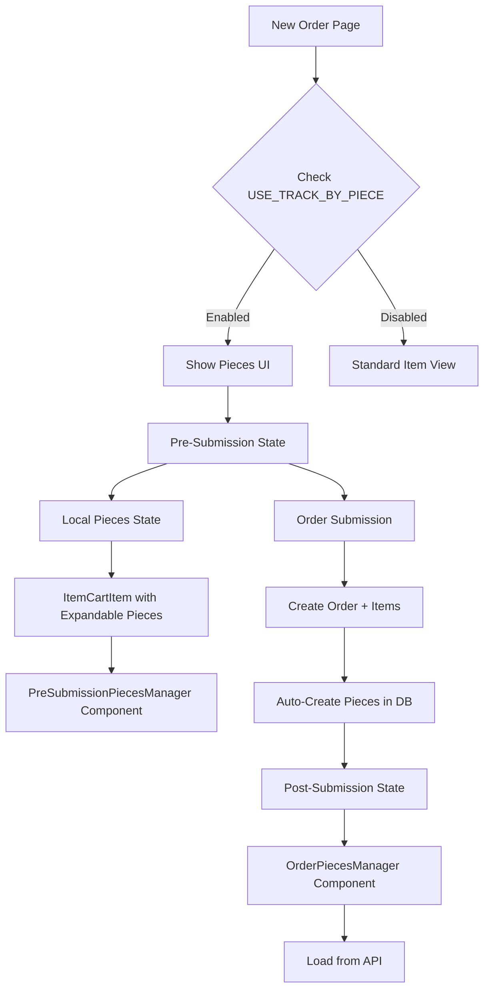

# Plan: Integrate Item Pieces into New Order Page

## Overview

Integrate existing order item pieces components (`OrderPiecesManager`, `PieceCard`, `PieceList`) into the new order page (`web-admin/app/dashboard/orders/new/page.tsx`). Support both pre-submission piece editing (local state) and post-submission piece management (database-backed), conditionally shown when `USE_TRACK_BY_PIECE` tenant setting is enabled.

## Architecture

### Data Flow




### Component Structure

1. **Pre-Submission**: Local state pieces (not yet in DB)
2. **Post-Submission**: Database-backed pieces using existing `OrderPiecesManager`

## Implementation Tasks

### Phase 1: Extend Order Item State with Pieces

**File**: `web-admin/app/dashboard/orders/new/page.tsx`

- Extend `OrderItem` interface to include `pieces?: PreSubmissionPiece[]`
- Add state management for pieces per item
- Create helper functions:
- `generatePiecesForItem(item: OrderItem, quantity: number): PreSubmissionPiece[]`
- `updateItemPieces(itemId: string, pieces: PreSubmissionPiece[])`
- `addPieceToItem(itemId: string, piece: PreSubmissionPiece)`
- `removePieceFromItem(itemId: string, pieceId: string)`

**PreSubmissionPiece Interface**:

```typescript
interface PreSubmissionPiece {
  id: string; // Temporary ID: `temp-${itemId}-${pieceSeq}`
  itemId: string;
  pieceSeq: number;
  color?: string;
  brand?: string;
  hasStain?: boolean;
  hasDamage?: boolean;
  notes?: string;
  rackLocation?: string;
  metadata?: Record<string, any>;
}
```


### Phase 2: Create Pre-Submission Pieces Manager Component

**File**: `web-admin/app/dashboard/orders/new/components/pre-submission-pieces-manager.tsx`Create a new component that:

- Works with local state (not DB)
- Uses similar UI to `PieceCard` but adapted for pre-submission
- Supports:
- Adding/removing pieces
- Editing piece details (color, brand, stains, damage, notes)
- Reordering pieces (if needed)
- Props:
  ```typescript
      interface PreSubmissionPiecesManagerProps {
        pieces: PreSubmissionPiece[];
        itemId: string;
        onPiecesChange: (pieces: PreSubmissionPiece[]) => void;
        readOnly?: boolean;
      }
  ```


### Phase 3: Integrate Pieces into ItemCartItem

**File**: `web-admin/app/dashboard/orders/new/components/item-cart-item.tsx`

- Add expandable section for pieces (when `trackByPiece` is enabled)
- Add "View Pieces" / "Hide Pieces" toggle button
- Show piece count badge: `{quantity} pieces`
- When expanded, render `PreSubmissionPiecesManager`
- Update props to accept:
- `pieces?: PreSubmissionPiece[]`
- `onPiecesChange?: (pieces: PreSubmissionPiece[]) => void`
- `trackByPiece?: boolean`

### Phase 4: Update ItemCartList

**File**: `web-admin/app/dashboard/orders/new/components/item-cart-list.tsx`

- Pass pieces data and handlers to `ItemCartItem`
- Update `CartItem` interface to include `pieces?: PreSubmissionPiece[]`
- Show total pieces count in header: `{totalPieces} pieces`

### Phase 5: Update Order Summary Panel

**File**: `web-admin/app/dashboard/orders/new/components/order-summary-panel.tsx`

- Pass `trackByPiece` setting to `ItemCartList`
- Ensure pieces data flows through props

### Phase 6: Check Tenant Settings

**File**: `web-admin/app/dashboard/orders/new/page.tsx`

- Use `useTenantSettingsWithDefaults` hook to get `trackByPiece` setting
- Conditionally show pieces UI only when `trackByPiece === true`
- Initialize pieces when items are added (if `trackByPiece` enabled)

### Phase 7: Handle Order Submission with Pieces

**File**: `web-admin/app/dashboard/orders/new/page.tsx`

- When submitting order, pieces are auto-created by backend (existing logic in `order-service.ts`)
- After successful order creation, pieces exist in DB
- Show success message with link to view order details (which will show pieces)

### Phase 8: Post-Submission Pieces View (Optional Enhancement)

**File**: `web-admin/app/dashboard/orders/new/components/post-submission-pieces-view.tsx` (new)

- After order creation, show a confirmation view
- Use existing `OrderPiecesManager` component to display DB-backed pieces
- Only show if `createdOrderId` exists and `trackByPiece` is enabled

### Phase 9: Update Order Item Creation Logic

**File**: `web-admin/app/dashboard/orders/new/page.tsx`

- When adding item to cart, auto-generate pieces if `trackByPiece` enabled
- When quantity changes, update pieces count accordingly
- When removing item, remove associated pieces

### Phase 10: Add Translations

**Files**:

- `web-admin/messages/en.json`
- `web-admin/messages/ar.json`

Add translations for:

- `newOrder.pieces.viewPieces`
- `newOrder.pieces.hidePieces`
- `newOrder.pieces.addPiece`
- `newOrder.pieces.removePiece`
- `newOrder.pieces.pieceNumber`
- `newOrder.pieces.totalPieces`

## Key Files to Modify

1. **`web-admin/app/dashboard/orders/new/page.tsx`**

- Add pieces state management
- Check tenant settings
- Handle piece generation on item add/update

2. **`web-admin/app/dashboard/orders/new/components/item-cart-item.tsx`**

- Add expandable pieces section
- Integrate `PreSubmissionPiecesManager`

3. **`web-admin/app/dashboard/orders/new/components/item-cart-list.tsx`**

- Pass pieces props through

4. **`web-admin/app/dashboard/orders/new/components/order-summary-panel.tsx`**

- Pass `trackByPiece` setting

## Key Files to Create

1. **`web-admin/app/dashboard/orders/new/components/pre-submission-pieces-manager.tsx`**

- Local state pieces manager component

2. **`web-admin/app/dashboard/orders/new/components/pre-submission-piece-card.tsx`** (optional)

- Individual piece card for pre-submission state

## Dependencies

- Existing components: `OrderPiecesManager`, `PieceCard`, `PieceList` (for post-submission)
- Tenant settings hook: `useTenantSettingsWithDefaults`
- Order service: Auto-creates pieces on order submission (already implemented)

## Testing Considerations

1. Test with `USE_TRACK_BY_PIECE` enabled
2. Test with `USE_TRACK_BY_PIECE` disabled (should not show pieces)
3. Test adding/removing pieces before submission
4. Test editing piece details
5. Test order submission with pieces
6. Test pieces appear correctly after order creation

## Notes

- Pieces are auto-created in DB by `OrderPieceService.createPiecesForItem()` when order is submitted (existing logic)