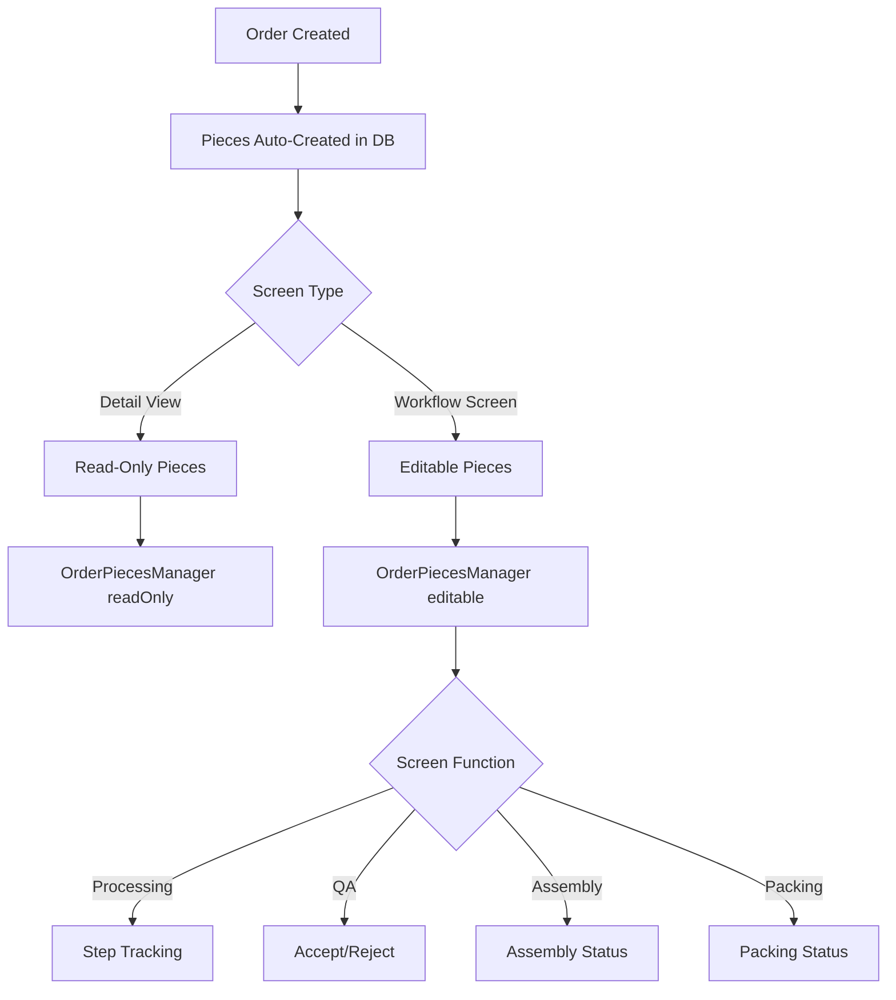

# Plan: Integrate Order Item Pieces Across All Workflow Screens

## Overview

Integrate order item pieces display and management across all order-related screens in the CleanMateX workflow. Pieces will be conditionally shown when `USE_TRACK_BY_PIECE` tenant setting is enabled, using the existing `OrderPiecesManager` component for database-backed pieces.

## Architecture

### Component Reuse Strategy

- **Pre-Submission**: `PreSubmissionPiecesManager` (already implemented in new order page)
- **Post-Submission**: `OrderPiecesManager` (existing component for DB-backed pieces)
- **Read-Only Views**: `OrderPiecesManager` with `readOnly={true}`
- **Editable Views**: `OrderPiecesManager` with appropriate permissions

### Data Flow




## Implementation Phases

### Phase 1: Order Detail Page (High Priority)

**File**: `web-admin/app/dashboard/orders/[id]/order-detail-client.tsx`**Changes**:

- Add tenant settings check for `trackByPiece`
- Modify `OrderItemsList` component to accept `trackByPiece` prop
- Add expandable pieces section per item using `OrderPiecesManager` (read-only)
- Show piece count badge on items when pieces exist

**Dependencies**: None

### Phase 2: Order Items List Component Enhancement

**File**: `web-admin/app/dashboard/orders/components/order-items-list.tsx`**Changes**:

- Add `trackByPiece` prop
- Add `orderId` and `tenantId` props
- Add expandable pieces section per item
- Integrate `OrderPiecesManager` for read-only piece display
- Show piece count indicator

**Dependencies**: Phase 1

### Phase 3: Preparation Detail Page (High Priority)

**File**: `web-admin/app/dashboard/preparation/[orderId]/page.tsx`**Changes**:

- Add tenant settings check
- Modify `FastItemizer` component to show pieces after items are added
- Add piece editing capability during preparation
- Use `OrderPiecesManager` for piece management

**Dependencies**: Phase 2

### Phase 4: Processing Detail Page (High Priority)

**File**: `web-admin/app/dashboard/processing/[id]/page.tsx`**Changes**:

- Add tenant settings check
- Add expandable pieces section per item
- Integrate `OrderPiecesManager` with step tracking enabled
- Show piece-level progress through processing steps
- Allow piece-level step updates

**Dependencies**: Phase 2

### Phase 5: QA Detail Page (High Priority)

**File**: `web-admin/app/dashboard/qa/[id]/page.tsx`**Changes**:

- Add tenant settings check
- Add expandable pieces section per item
- Integrate `OrderPiecesManager` with reject functionality
- Enable piece-level accept/reject decisions
- Show rejected pieces with visual indicators

**Dependencies**: Phase 2

### Phase 6: Assembly Detail Page (Medium Priority)

**File**: `web-admin/app/dashboard/assembly/[id]/page.tsx`**Changes**:

- Add tenant settings check
- Add expandable pieces section per item
- Integrate `OrderPiecesManager` (read-only or editable based on requirements)
- Show assembly status per piece if applicable

**Dependencies**: Phase 2

### Phase 7: Packing Detail Page (Medium Priority)

**File**: `web-admin/app/dashboard/packing/[id]/page.tsx`**Changes**:

- Add tenant settings check
- Add expandable pieces section per item
- Integrate `OrderPiecesManager` for packing tracking
- Show packing status per piece

**Dependencies**: Phase 2

### Phase 8: Ready Detail Page (Medium Priority)

**File**: `web-admin/app/dashboard/ready/[id]/page.tsx`**Changes**:

- Add tenant settings check
- Add expandable pieces section per item
- Integrate `OrderPiecesManager` (read-only)
- Show ready status per piece

**Dependencies**: Phase 2

### Phase 9: Order List Page Enhancement (Low Priority)

**File**: `web-admin/app/dashboard/orders/page.tsx`**Changes**:

- Add piece count indicator in order table
- Show total pieces per order (optional)
- Add filter/sort by piece count (optional)

**Dependencies**: Phase 2

## Implementation Details

### Common Pattern for Each Screen

1. **Check Tenant Settings**:
   ```typescript
            const { trackByPiece } = useTenantSettingsWithDefaults(tenantId);
   ```


2. **Conditional Rendering**:
   ```typescript
            {trackByPiece && item.pieces && (
              <OrderPiecesManager
                orderId={orderId}
                itemId={item.id}
                tenantId={tenantId}
                readOnly={isReadOnlyScreen}
                // ... other props
              />
            )}
   ```


3. **Expandable UI Pattern**:

- Add "View Pieces" / "Hide Pieces" toggle button
- Show piece count badge: `{pieces.length} pieces`
- Expand to show `OrderPiecesManager` component

### Component Props Needed

**OrderPiecesManager** (already exists):

- `orderId`: string
- `itemId`: string
- `tenantId`: string
- `readOnly`: boolean (true for detail views)
- `onUpdate`: callback for refresh
- `showSplitCheckbox`: boolean (for processing/QA screens)
- `rejectColor`: string (for QA screen)

### API Requirements

All required APIs already exist:

- `GET /api/v1/orders/:id/items/:itemId/pieces` - List pieces
- `PATCH /api/v1/orders/:id/items/:itemId/pieces/:pieceId` - Update piece
- `PATCH /api/v1/orders/:id/items/:itemId/pieces` - Batch update

## Key Files to Modify

### High Priority

1. `web-admin/app/dashboard/orders/[id]/order-detail-client.tsx`
2. `web-admin/app/dashboard/orders/components/order-items-list.tsx`
3. `web-admin/app/dashboard/preparation/[orderId]/page.tsx`
4. `web-admin/app/dashboard/processing/[id]/page.tsx`
5. `web-admin/app/dashboard/qa/[id]/page.tsx`

### Medium Priority

6. `web-admin/app/dashboard/assembly/[id]/page.tsx`
7. `web-admin/app/dashboard/packing/[id]/page.tsx`
8. `web-admin/app/dashboard/ready/[id]/page.tsx`

### Low Priority

9. `web-admin/app/dashboard/orders/page.tsx`

## Testing Considerations

1. Test with `USE_TRACK_BY_PIECE` enabled
2. Test with `USE_TRACK_BY_PIECE` disabled (should not show pieces)
3. Test read-only views (order detail, ready)
4. Test editable views (preparation, processing, QA)
5. Test piece expansion/collapse functionality
6. Test piece updates and refresh behavior
7. Test with orders that have no pieces
8. Test with orders that have many pieces (pagination)

## Notes

- All screens should check tenant settings before showing pieces UI
- Use existing `OrderPiecesManager` component for consistency
- Read-only mode for detail/informational screens