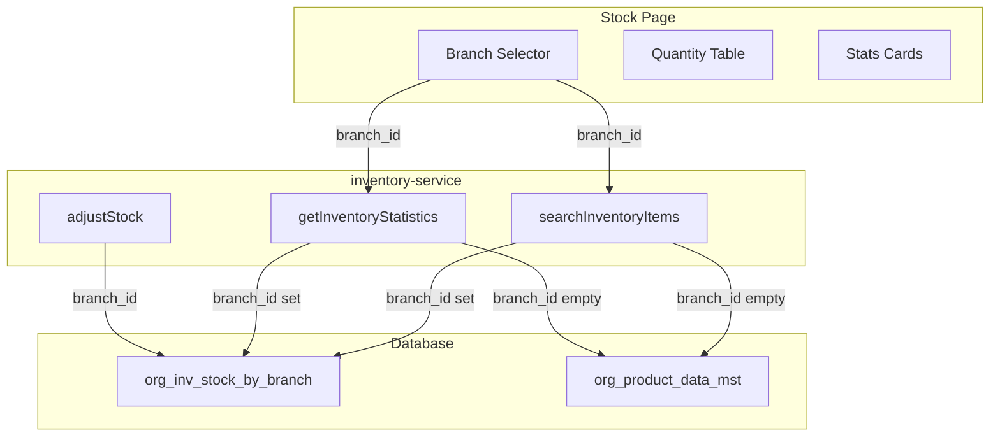

# Inventory Branch-Wise and Enhancement Plan

## Current State vs Target

**Current:** Branch selector only shows when `branches.length > 1`. When no branch selected, quantity comes from `org_product_data_mst.qty_on_hand` (legacy tenant-level). Single-branch tenants never see branch context.

**Target:** Branch-wise quantity everywhere. Branch selector always visible. Quantity and stats always sourced from `org_inv_stock_by_branch` when a branch is selected; "All Branches" shows aggregated sum across branches.

---

## Data Flow (Branch-Wise Quantity)

**Target flow:** When `branch_id` set: always use `org_inv_stock_by_branch`. When "All Branches": aggregate from `org_inv_stock_by_branch` (sum qty per product across branches).

---

## 1. Branch Selector Always Visible

**File:** [web-admin/app/dashboard/inventory/stock/page.tsx](web-admin/app/dashboard/inventory/stock/page.tsx)

- Remove `branches.length > 1` guard; show branch selector even when only one branch.
- Default when 1 branch: auto-select the main branch (`is_main = true` or first branch).
- When 0 branches: show empty state with message "No branch configured" and disabled actions.
- Add visible label: "Branch" (i18n: `inventory.filters.branch`) so purpose is clear.
- Use consistent Select styling; place branch selector first in filter row (primary filter).
- "All Branches" option: show aggregated quantity (see section 2).

---

## 2. "All Branches" = Aggregate from org_inv_stock_by_branch

**Current:** `branch_id` empty uses `org_product_data_mst.qty_on_hand` (legacy, may be stale).

**Target:** When "All Branches" (branch_id empty):

- **searchInventoryItems:** Sum `qty_on_hand` from `org_inv_stock_by_branch` per product across all tenant branches. Products with no branch rows = 0.
- **getInventoryStatistics:** Compute stats from the same aggregated branch data.

**File:** [web-admin/lib/services/inventory-service.ts](web-admin/lib/services/inventory-service.ts)

- Add branch-aggregation path: when `branch_id` is null/undefined, query `org_inv_stock_by_branch` grouped by `product_id`, sum `qty_on_hand`.
- Join with `org_product_data_mst` for product metadata (name, cost, reorder_point, etc.).
- Remove usage of `org_product_data_mst.qty_on_hand` for quantity in search/stats (keep it for non-inventory features if needed).

**Behavior:**

| branch_id              | Quantity source                                                  |
| ---------------------- | ---------------------------------------------------------------- |
| Set (UUID)             | `org_inv_stock_by_branch` for that branch                        |
| Empty ("All Branches") | Sum of `org_inv_stock_by_branch` per product across all branches |

---

## 3. Default Branch Selection and State

**File:** [web-admin/app/dashboard/inventory/stock/page.tsx](web-admin/app/dashboard/inventory/stock/page.tsx)

- On load, when branches exist: if single branch, set `branchId` to that branch's id; if multiple, set to main branch or first.
- `useEffect` after `getBranchesAction`: `if (branches.length === 1) setBranchId(branches[0].id)`.
- Optional: persist last-selected branch in `sessionStorage` for multi-branch tenants.

---

## 4. Negative Stock Support (Align with deduct_retail_stock_for_order)

**Files:** [web-admin/lib/services/inventory-service.ts](web-admin/lib/services/inventory-service.ts), [web-admin/lib/constants/inventory.ts](web-admin/lib/constants/inventory.ts)

- **adjustStock:** Remove `if (qtyAfter < 0) qtyAfter = 0` for DECREASE and SET. Allow negative `qty_after`.
- **getStockStatus:** Add `NEGATIVE_STOCK` when `qtyOnHand < 0`. Map: `< 0` -> NEGATIVE_STOCK, `0` -> OUT_OF_STOCK, `<= reorder` -> LOW_STOCK, etc.
- **Add i18n:** `inventory.statuses.negativeStock` in en.json and ar.json.
- **Stock page:** Add `NEGATIVE_STOCK` to status filter and badge (e.g. destructive or warning variant).

---

## 5. Audit Fields in Stock Adjustments

**Files:** [web-admin/lib/services/inventory-service.ts](web-admin/lib/services/inventory-service.ts), [web-admin/lib/types/inventory.ts](web-admin/lib/types/inventory.ts), [web-admin/app/actions/inventory/inventory-actions.ts](web-admin/app/actions/inventory/inventory-actions.ts), [web-admin/app/dashboard/inventory/stock/components/adjust-stock-modal.tsx](web-admin/app/dashboard/inventory/stock/components/adjust-stock-modal.tsx)

- **Validation:** Use Zod schemas for quantity and reason validation in the adjust modal. Create or extend a schema (e.g. in `lib/validations/inventory-schemas.ts`) with `quantity` (number, allow negative for DECREASE), `reason` (string, min length), and `adjustmentType`. Parse and validate before calling `adjustStockAction`; show inline errors from `safeParse`.
- Extend `StockAdjustmentRequest` with optional `processed_by`, `created_by`, `created_info` (or a `userContext` object).
- **adjustStock:** When creating `org_inv_stock_tr`, set `processed_by`, `created_by`, `created_info` from request.
- Server actions cannot access `NextRequest` directly. Options:
  - **A)** Accept optional `userContext` in `adjustStockAction` and pass from a Server Action that receives it from headers (via a wrapper or middleware).
  - **B)** Use `headers()` from `next/headers` inside the server action to get user-agent, x-forwarded-for; resolve `userId` from auth (e.g. `getAuthContext` or session); build `created_info` JSON and pass to `adjustStock`.
- **Recommended:** Create `getServerAuditContext()` in `request-audit.ts` that uses `headers()` and auth to return `{ userId, userName, userAgent, userIp }` for use in server actions. Reuse in `adjustStockAction`.

---

## 6. Stock History Modal Enhancements

**File:** [web-admin/app/dashboard/inventory/stock/components/stock-history-modal.tsx](web-admin/app/dashboard/inventory/stock/components/stock-history-modal.tsx)

- Add columns: **Performed by** (from `processed_by` / `created_by`), **Reference** (e.g. `reference_no` when `reference_type = 'ORDER'`), **Source** (reference_type: Order/Manual/Purchase).
- **Types:** Extend `StockTransaction` in [web-admin/lib/types/inventory.ts](web-admin/lib/types/inventory.ts) to include `processed_by`, `created_by`, `created_info`, `reference_type`, `reference_no`, `reference_id`.
- **Link to order:** When `reference_type = 'ORDER'` and `reference_id` present, render a link to `/dashboard/orders/[id]` or equivalent order detail route.
- **Responsive table:** Wrap in `overflow-x-auto`; on mobile, consider card layout per transaction or horizontal scroll with sticky first column.
- **Accessibility:** Table `aria-label`; column headers `scope="col"`.

---

## 7. Add Negative Stock Badge and Status Filter

**File:** [web-admin/app/dashboard/inventory/stock/page.tsx](web-admin/app/dashboard/inventory/stock/page.tsx)

- In `getStatusBadge`, handle `STOCK_STATUS.NEGATIVE_STOCK` with a distinct variant (e.g. destructive).
- Add `NEGATIVE_STOCK` to the status filter dropdown.
- Update [web-admin/lib/constants/inventory.ts](web-admin/lib/constants/inventory.ts) with `NEGATIVE_STOCK` constant.

---

## 8. "Never Stocked at Branch" Indicator (Optional)

**File:** [web-admin/app/dashboard/inventory/stock/page.tsx](web-admin/app/dashboard/inventory/stock/page.tsx)

- When a branch is selected and a product has no row in `org_inv_stock_by_branch`, currently `branchQtyMap[id] ?? 0` shows 0.
- Add tooltip or badge: "Not stocked at this branch" when qty is 0 and product exists but has no branch row. Requires service to return a `has_branch_record` flag or similar.

---

## 9. Stats Cards Branch Context

**File:** [web-admin/app/dashboard/inventory/stock/components/stats-cards.tsx](web-admin/app/dashboard/inventory/stock/components/stats-cards.tsx)

- Accept optional `branchName?: string`.
- When branch is selected, show label like "Low Stock (Main Branch)" or "Out of Stock at Downtown".
- When "All Branches", show "Low Stock (All Branches)" or similar.
- Pass `branchName` from page based on selected branch.

---

## 10. i18n Additions

**Files:** `web-admin/messages/en.json`, `web-admin/messages/ar.json`

- `inventory.statuses.negativeStock`: "Negative Stock" / Arabic equivalent.
- `inventory.filters.branch`: "Branch" / Arabic.
- `inventory.messages.selectBranch`: "Select a branch to view stock" (when needed).
- `inventory.stats.atBranch`: "at {branch}" for stats card subtitle.

---

## 11. Summary of File Changes

| File                                                                         | Changes                                                               |
| ---------------------------------------------------------------------------- | --------------------------------------------------------------------- |
| `web-admin/app/dashboard/inventory/stock/page.tsx`                           | Always show branch selector; default branch; pass branchName to stats |
| `web-admin/lib/services/inventory-service.ts`                                | All-branches aggregation; allow negative in adjustStock; audit params |
| `web-admin/lib/constants/inventory.ts`                                       | Add NEGATIVE_STOCK; update getStockStatus                             |
| `web-admin/lib/types/inventory.ts`                                           | Extend StockTransaction; StockAdjustmentRequest audit fields          |
| `web-admin/lib/validations/inventory-schemas.ts`                             | Zod schema for adjust-modal (quantity, reason, adjustmentType)        |
| `web-admin/app/actions/inventory/inventory-actions.ts`                       | Pass user/audit context to adjustStock                                |
| `web-admin/app/dashboard/inventory/stock/components/stock-history-modal.tsx` | Add performed-by, reference, source columns                           |
| `web-admin/app/dashboard/inventory/stock/components/stats-cards.tsx`         | Optional branchName prop for context                                  |
| `web-admin/app/dashboard/inventory/stock/components/adjust-stock-modal.tsx`  | Integrate Zod schema; validate quantity/reason before submit          |
| `web-admin/messages/en.json`, `ar.json`                                      | New inventory keys                                                    |

---

## 12. Implementation Order

1. **Branch aggregation** - searchInventoryItems and getInventoryStatistics "All Branches" path.
2. **Branch selector always visible + default** - page.tsx.
3. **Negative stock** - constants, getStockStatus, adjustStock, badge, filter.
4. **Audit in adjustStock** - types, service, action; create `inventory-schemas.ts` and integrate Zod validation in adjust-stock-modal.
5. **Stock history modal** - columns, types.
6. **Stats cards branch context** - optional label.
7. **i18n** - all new keys.
8. **Build and test** - `npm run build`, manual test with single and multi-branch tenants.

---

## 13. Best Practices Checklist

| Area                   | Rule                                       | Implementation                                                                      |
| ---------------------- | ------------------------------------------ | ----------------------------------------------------------------------------------- |
| Tenant isolation       | Every query MUST filter by `tenant_org_id` | All inventory-service queries already use `tenantId` from session. No changes.      |
| Security               | No hardcoded secrets; validate inputs      | Use Zod schemas for quantity and reason validation in the adjust modal.             |
| Separation of concerns | UI, logic, data layers                     | Service handles DB; actions wrap; components handle UI.                             |
| DRY                    | Reuse existing patterns                    | Use `getRequestAuditContext`-style helper for audit; reuse `cmxMessage` for toasts. |
| Types                  | Strict TypeScript, no `any`                | Extend StockTransaction, StockAdjustmentRequest with proper types.                  |
| i18n                   | Search before adding; reuse `common.`      | Add only missing keys; use `tc('search')`, `tc('cancel')` etc.                      |
| Constants              | Single source of truth                     | `STOCK_STATUS`, `getStockStatus` in `lib/constants/inventory.ts`.                   |

---

## 14. UI/UX Alignment (CleanMateX Rules)

Per [.cursor/rules/uiuxrules.mdc](.cursor/rules/uiuxrules.mdc):

**Layout and structure**

- Use modular cards for stats; table for items; filter panel in a Card.
- Keep grid alignment and consistent spacing (e.g. `space-y-6`, `gap-3`, `p-4`).
- Breadcrumb: add `Inventory > Stock` when applicable.

**Accessibility (WCAG 2.1 AA)**

- Branch selector: `aria-label`, `aria-describedby` for "View stock by branch".
- Status badges: pair color with icon or text (not color-only); e.g. Negative Stock badge with AlertTriangle icon.
- Table: use `<th scope="col">`, semantic `<table>`, `<caption>` or `aria-label` for screen readers.
- Modals: focus trap, `role="dialog"`, `aria-modal="true"`, escape to close.
- Buttons: ensure min 44x44px touch target on mobile.

**Responsiveness**

- Filter form: `grid-cols-1 md:grid-cols-5`; stack on mobile.
- Table: horizontal scroll on small screens with `overflow-x-auto`; consider sticky first column.
- Stats cards: `grid-cols-1 sm:grid-cols-2 lg:grid-cols-4`.
- Breakpoints: 320px, 768px, 1024px, 1440px.

**Feedback and states**

- Loading: skeleton or spinner for table and stats while `loadData` runs.
- Success: toast on adjust/add success (e.g. `cmxMessage.success`).
- Error: inline error in modals; Card with error message for page-level.
- Empty state: icon + message when no items (e.g. "No inventory items. Add your first item.").
- Disabled: when no branch and branch required, disable Adjust/Add or show tooltip.

**RTL and bilingual**

- Branch selector, table, modals: respect `document.dir`; use `isRtl ? name2 \|\| name : name` for branch labels.
- All new text in `en.json` and `ar.json`; run `npm run check:i18n` after changes.

**Microinteractions**

- Hover states on table rows, buttons.
- Modal open/close: subtle fade or slide.
- Button loading state: spinner + disabled during submit.

---

## 15. Ready-to-Use Verification

| Check            | Action                                                  |
| ---------------- | ------------------------------------------------------- |
| Build            | Run `npm run build` after implementation.               |
| i18n             | Run `npm run check:i18n`.                               |
| Lint             | Fix any new lint errors in changed files.               |
| Tenant isolation | Confirm no new queries bypass `tenant_org_id`.          |
| RTL              | Test branch labels, table, modals in Arabic.            |
| Empty states     | Verify no branches, no items, no transactions.          |
| Error paths      | Test invalid quantity, missing reason, network failure. |

---

## 16. Edge Cases

- **No branches:** Show empty state with message "No branch configured. Add a branch in Settings to manage inventory." Disable Add Item and Adjust; allow view in read-only mode if desired.
- **Product with no org_inv_stock_by_branch rows:** Shows 0 in branch view; in "All Branches" shows 0. Optional tooltip: "Not yet stocked at this branch."
- **Negative stock in stats:** Add `negativeStockCount` to `InventoryStatistics`; show in stats card with distinct styling.
- **sessionStorage branch:** For multi-branch tenants, persist `inventory_stock_branch_id` in sessionStorage and restore on mount for continuity.
