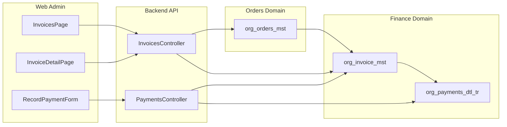

# Invoices & Payments Feature Plan (CleanMateX)

## Overview

Design and implement a **full-stack invoices & payments feature** for CleanMateX that works across web admin and (future-ready) mobile apps, while initially supporting **cash and in-branch POS card payments only**. The solution must follow the **multi-tenant (org), RLS, bilingual, and feature-flag architecture** already defined in `master_plan_cc_01.md` and prepare the ground for later online gateways.---

## 1. Scope & Goals

- **In-scope (Phase 1)**
- **Invoice lifecycle** for retail/B2C orders: draft → issued → partially paid → paid → cancelled.
- **Payments recording** for:
  - Cash at counter.
  - POS card at branch (recorded, but actual charge is done outside CleanMateX).
- **Finance tables usage**: leverage `org_invoice_mst` and `org_payments_dtl_tr` per master plan with proper tenant isolation and audit fields.
- **Web admin UI** in `web-admin` for:
  - Viewing invoices per order/customer.
  - Recording payments (cash/POS) and partial payments.
  - Viewing payment history and balances.
- **Basic support for future B2B billing** (consolidated invoices) at design level, but not full B2B flows yet.
- **Out of scope (for later phases)**
- Online gateways (HyperPay, PayTabs, Stripe) and webhooks.
- Wallets, family accounts, and marketplace commissions.
- Full B2B consolidated invoicing/statement engine (PRD-030) – only prepare model & interfaces.

---

## 2. Domain & Data Model Design

### 2.1 Core Concepts

- **Invoice** (per order or grouped for B2B later):
- Links to `org_orders_mst` and optionally customer/contract.
- Stores **amounts**, **currency**, **tax/VAT**, and **status**.
- Bilingual fields for display names/messages.
- **Payment**:
- Linked to invoice (and order for reporting convenience).
- Supports **payment method** (cash, POS), **amount**, **timestamp**, **operator**, **branch**.
- Supports **partial payments** and status (successful, reversed, etc.).

### 2.2 Tables & Columns (Supabase / PostgreSQL)

Design to align with `master_plan_cc_01.md` and naming constraints (≤30 chars, org*/sys* patterns).

- `**org_invoice_mst**` (already listed in master plan – detail the structure):
- Keys & references:
  - `tenant_org_id` (FK, part of all composite keys).
  - `invoice_id` (PK, UUID).
  - `order_id` + `tenant_org_id` (FK to `org_orders_mst`).
  - For future: `b2b_contract_id` + `tenant_org_id` (FK to B2B table).
- Financial fields:
  - `total_amount`, `net_amount`, `tax_amount` (NUMERIC with scale).
  - `currency_cd` (ISO, from system lookup if available).
  - `balance_amount` (denormalized for fast reads).
- Status & classification:
  - `invoice_status_cd` (e.g., DRAFT, ISSUED, PARTIAL, PAID, CANCELLED).
  - `invoice_type_cd` (e.g., RETAIL, B2B, ADJUSTMENT).
  - `due_date`, `invoice_date`.
- Bilingual and meta:
  - `title` / `title2`, `description` / `description2`.
  - Standard audit fields (`created_at/_by/_info`, `updated_at/_by/_info`, `rec_status`, `is_active`, `rec_notes`, `rec_order`).
- `**org_payments_dtl_tr**`:
- Keys & references:
  - `tenant_org_id`.
  - `payment_id` (PK, UUID).
  - `invoice_id` + `tenant_org_id` (FK to `org_invoice_mst`).
  - `order_id` + `tenant_org_id` (FK to `org_orders_mst`, optional but useful).
- Financial fields:
  - `payment_amount`, `currency_cd`.
  - `exchange_rate` (for future multi-currency support).
- Method & channel:
  - `payment_method_cd` (CASH, POS, later: CARD_ONLINE, WALLET, etc.).
  - `payment_channel_cd` (COUNTER, APP, PORTAL) – initially COUNTER only.
  - `pos_reference` (for POS slip/reference if branch logs it).
- Status & audit:
  - `payment_status_cd` (SUCCESS, FAILED, REVERSED).
  - `paid_at`.
  - Standard audit fields & soft delete.
- **Lookups (if not already present)**
- `sys_payment_method_cd` for payment methods.
- `sys_invoice_status_cd` for invoice status codes.
- **Indexes & RLS**
- Indices on `tenant_org_id`, (`tenant_org_id`, `order_id`), (`tenant_org_id`, `invoice_status_cd`).
- Ensure `tenant_org_id`-based RLS policies in line with existing `org_*` rules.

> Note: Migrations must be separate DDL scripts; coordinate with you to run them (no `supabase db reset`).---

## 3. Backend Service Design (NestJS API – `backend/` Phase 2)

### 3.1 Module Structure

Create a payments/invoices module designed for future gateways:

- `backend/src/finance/invoices/`
- `backend/src/finance/payments/`
- Shared domain interfaces in `backend/src/finance/domain/`.

Modules:

- `InvoicesModule`:
- `InvoicesController` (REST, versioned `/api/v1/invoices`).
- `InvoicesService` for business logic.
- `InvoicesRepository` (Prisma/Postgres, wrapped with `withTenantContext()`).
- `PaymentsModule`:
- `PaymentsController` (`/api/v1/payments`).
- `PaymentsService` (create payment, partial payments, reconciliation updates to invoice balance).
- `PaymentsRepository`.
- **Shared components**:
- DTOs with class-validator/class-transformer.
- Payment method & status enums.
- Domain services for invoice balance calculation (pure functions for easy unit testing).

### 3.2 API Endpoints (v1 – Internal & Admin)

Use RESTful, versioned routes and always resolve tenant via `getTenantIdFromSession()`.

- **Invoices** (`/api/v1/invoices`):
- `GET /` – list invoices with filters (by order, status, date, customer, branch).
- `GET /:id` – get single invoice with payments and order summary.
- `POST /` – create invoice for an order (if not auto-created on order creation yet).
- `PATCH /:id` – update invoice metadata (description, due date) and support cancellation.
- **Payments** (`/api/v1/payments`):
- `GET /` – list payments with filters.
- `GET /:id` – payment details.
- `POST /` – record payment against invoice:
  - Body: tenant-resolved payload with `invoiceId`, `orderId` (optional), `amount`, `paymentMethod`, `channel`, `posReference`.
  - Logic: validate that amount > 0, invoice exists and is not closed, update invoice balance & status transactionally.

### 3.3 Business Rules

- **Invoice creation vs order**:
- MVP: 1–1 mapping of order → invoice.
- Auto-generate a draft invoice when an order reaches a specific status (e.g., `READY`), or allow manual create from order page.
- **Partial payments**:
- Allow multiple payments per invoice until `balance_amount` == 0 → status `PAID`.
- Validate: sum of successful payments ≤ `total_amount` (prevent overpayment).
- **Cancellations & reversals**:
- Invoice cancellation allowed only in specific states (e.g., DRAFT, ISSUED without payments).
- For now, payment reversal handled by creating a negative adjustment payment record rather than hard delete.

### 3.4 Security & Multi-Tenancy

- Enforce tenant via `withTenantContext()` wrapper and composite FKs.
- No direct ID lookups without `tenant_org_id` filter.
- Role-based access (only roles with finance permissions can create/cancel invoices and record payments).

### 3.5 Testing

- Unit tests for:
- Invoice total/balance calculation.
- Partial payment recording and status transitions.
- Integration tests (Jest + Supertest):
- `POST /payments` scenario from unpaid to fully paid invoice.
- RLS enforcement: tenant A cannot see or affect tenant B invoices.

---

## 4. Web Admin (Next.js – `web-admin/`)

### 4.1 Routes & Navigation

Add finance-focused views under the dashboard route group, reusing existing UI patterns.

- Routes (examples, adjust to your structure):
- `web-admin/app/(dashboard)/invoices/page.tsx` – invoice list.
- `web-admin/app/(dashboard)/invoices/[id]/page.tsx` – invoice detail (with payment history & add-payment action).
- Extend existing order detail page, e.g. `web-admin/app/(dashboard)/orders/[id]/page.tsx`, to show **invoice summary** and a **"Record Payment"** action.

### 4.2 UI & UX

- **Invoice List**
- Data table with filters: status, branch, date range, payment status.
- Columns: invoice no, order no, customer name, total, paid, balance, status, created date.
- Actions: view invoice, export CSV/PDF (export can be a separate step if too big for first iteration).
- **Invoice Detail**
- Header: invoice basic info (customer, branch, dates, totals, status).
- Sections:
  - Order summary (link to order).
  - List of invoice line items (from order items, read-only in first phase).
  - **Payment history** table (method, amount, operator, timestamp, channel, POS ref).
- Action: **"Record Payment"** button opened in a modal or side sheet.
- **Record Payment Form** (modal)
- Fields:
  - Payment method (cash / POS).
  - Amount (default = remaining balance, editable for partial payment).
  - POS reference (optional when method=POS).
- Validations:
  - Required fields.
  - Amount > 0 and ≤ invoice balance.
- UX: show current balance and new balance preview.
- **Internationalization (EN/AR) & RTL**
- Add translation keys to `en.json`/`ar.json` under a `finance`/`invoices` namespace (reuse existing keys where possible).
- Ensure layout supports RTL and numeric amounts formatted using `formatCurrency` utilities (or similar existing utilities).

### 4.3 Frontend Data Layer

- Create API client wrappers in `web-admin` (e.g. `lib/api/invoices.ts`, `lib/api/payments.ts`) calling backend `/api/v1/...` endpoints.
- Use server components for list & detail pages, with client components for interactive forms.
- Use React Hook Form + Zod for the **Record Payment** modal.

### 4.4 Permissions & Guards

- Integrate with existing auth/session to ensure only roles with finance permission can see/create invoices & payments.
- Hide finance menu items for tenants/plans where `feature_flags.pdf_invoices` or equivalent financial features are disabled.

---

## 5. Mobile Apps & Future Extensibility (Design Only for Now)

### 5.1 Customer App Read-Only Views

Design (but do not implement yet) the APIs so that mobile apps can:

- Fetch **customer’s invoices** and payment status per order.
- Show invoice summary and last payment in the customer app.

APIs required later:

- `GET /api/v1/customers/me/invoices` (mobile-friendly, auth-based).
- `GET /api/v1/customers/me/invoices/:id`.

### 5.2 Preparing for Online Gateways & Wallets

- Keep a **payment provider abstraction** in the backend service layer:
- Current implementation: simple `ManualPaymentProvider` that only records cash/POS.
- Future: plug-in providers for HyperPay, PayTabs, Stripe with webhooks & status sync.
- Ensure `org_payments_dtl_tr` contains fields that will be needed later (e.g., `provider_payment_id`, `provider_name`).

---

## 6. Feature Flags & Plan Integration

- Add a specific feature flag (if not already): e.g., `"basic_invoices": true`, `"cash_pos_payments": true` to `org_tenants_mst.feature_flags`.
- Use guards/middleware on backend and checks on frontend to:
- Only expose invoice/payment flows when features are enabled.
- Reserve advanced features (PDF export, B2B billing, online gateways) for higher plans.

---

## 7. Observability, Audit & Security

- **Audit Logging**
- Every payment creation or invoice status change should log the user, tenant, and previous/new values.
- Option: centralized audit log table or event log if you already have one.
- **Monitoring & Metrics**
- Counters and latency metrics for `POST /payments` and `GET /invoices` endpoints.
- Error tracking (Sentry or similar) for payment creation failures.
- **Security**
- Ensure no financial endpoints allow cross-tenant access; test RLS + service-level checks.
- Never store full card data; POS is treated as an external channel, only store reference.

---

## 8. Implementation Phasing & Deliverables

### Phase A – Data & Backend

- Implement/migrate `org_invoice_mst`, `org_payments_dtl_tr`, and supporting lookup tables with RLS.
- Implement `InvoicesModule` and `PaymentsModule` in NestJS with all CRUD+business rules.
- Add unit and integration tests for core flows.

### Phase B – Web Admin UI

- Add invoice list & detail pages plus integrations into the existing order detail page.
- Implement record-payment modal with validations and error handling.
- Wire up i18n keys (EN/AR) and currency formatting.

### Phase C – Hardening & Extensions

- Add CSV export and basic PDF export for invoices (if within your current scope/flags).
- Add more filters and simple analytics (e.g., total collected today per branch).
- Finalize documentation under `docs/` for finance module (API contracts, data model, UX notes).

---

## 9. Mermaid Overview Diagram

