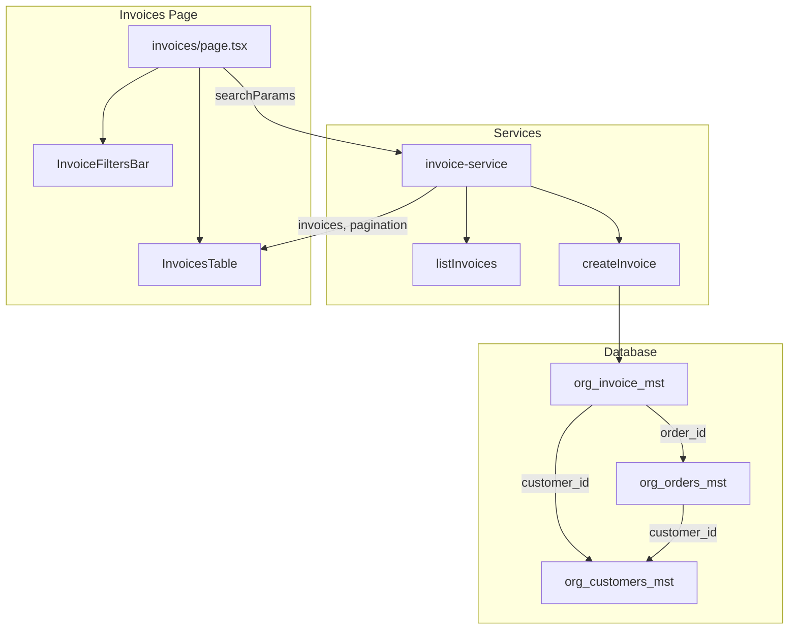

# Invoices Feature Enhancement Plan

## Part 0: Add Missing Columns for Best-Practice Invoice Data

Add columns to align `org_invoice_mst` with industry best practices, existing `org_orders_mst` conventions, and project [database SKILL](.claude/skills/database/SKILL.md) audit fields.

### 0.1 Database Migration

Create `supabase/migrations/0099_add_customer_id_and_invoice_enhancements.sql` (combine with customer_id, or split if preferred):

| Column                      | Type                               | Purpose                                                                           |
| --------------------------- | ---------------------------------- | --------------------------------------------------------------------------------- |
| `invoice_date`              | DATE                               | Business/issue date (distinct from `created_at`); critical for accounting periods |
| `branch_id`                 | UUID, nullable                     | Branch that issued the invoice; aligns with orders                                |
| `payment_terms`             | VARCHAR(50), nullable              | e.g. "Net 30", "Due on receipt"; aligns with orders                               |
| `service_charge`            | DECIMAL(19,4), nullable, default 0 | Service charge amount; aligns with orders                                         |
| `service_charge_type`       | VARCHAR(50), nullable              | Type of service charge; aligns with orders                                        |
| `gift_card_id`              | UUID, nullable                     | Gift card applied; aligns with orders                                             |
| `gift_card_discount_amount` | DECIMAL(19,4), nullable, default 0 | Gift card amount; aligns with orders                                              |
| `customer_reference`        | VARCHAR(120), nullable             | Customer PO number or their reference                                             |
| `trans_desc`                | VARCHAR(255), nullable             | Short description/reference for the invoice (like org_payments_dtl_tr)            |
| `tax_rate`                  | DECIMAL(5,3), nullable             | Tax rate applied; aligns with orders; complements existing `tax` amount           |
| `paid_by_name`              | VARCHAR(255), nullable             | Display name of user who recorded payment (resolved from paid_by)                 |
| `handed_to_name`            | VARCHAR(255), nullable             | Name of person invoice was handed to (pickup/delivery)                            |
| `handed_to_mobile_no`       | VARCHAR(50), nullable              | Mobile/phone number of person invoice was handed to                               |
| `handed_to_date`            | TIMESTAMP, nullable                | When invoice was handed over to customer                                          |
| `handed_to_by_user`         | UUID, nullable                     | User ID who handed over the invoice; FK to org_users_mst                          |
| `rec_status`                | SMALLINT, nullable, default 1      | Per DB SKILL audit fields                                                         |
| `is_active`                 | BOOLEAN, default true              | Per DB SKILL audit fields                                                         |

**Existing columns** (ensure in UI/types; no migration): `due_date`, `paid_at`, `paid_by`, `tax`, `vat_rate`, `vat_amount`.

- Use DECIMAL(19,4) for all money fields (per DB SKILL).
- Add FK for `branch_id` to `org_branches_mst`, `gift_card_id` to `org_gift_cards_mst`.
- Backfill `invoice_date` from `created_at` for existing rows; backfill `rec_status=1`, `is_active=true`.

### 0.2 Prisma Schema

Add to `org_invoice_mst`:

- `invoice_date`, `branch_id`, `payment_terms`, `service_charge`, `service_charge_type`
- `gift_card_id`, `gift_card_discount_amount`, `customer_reference`
- `trans_desc`, `tax_rate`, `paid_by_name`, `handed_to_name`, `handed_to_mobile_no`, `handed_to_date`, `handed_to_by_user`
- `rec_status`, `is_active`
- Relations: `org_branches_mst`, `org_gift_cards_mst`, `org_users_mst` (handed_to_by_user)
- Index: `idx_org_invoice_branch` on `(tenant_org_id, branch_id)` if filtering by branch

### 0.3 Types and Services

- Extend `Invoice` and `CreateInvoiceInput` in `lib/types/payment.ts` with the new fields.
- `createInvoice` and `createInvoiceForOrder`: populate from order when present (branch_id, payment_terms, service_charge, gift_card, tax_rate, etc.).
- Record-payment flow: populate `paid_by`, `paid_by_name` (user display name), `paid_at` when payment is recorded.
- Handover flow: populate `handed_to_name`, `handed_to_mobile_no`, `handed_to_date`, `handed_to_by_user` when invoice is handed to customer (pickup/delivery).
- `mapInvoiceToType`: map all new columns.
- `listInvoices`: include new columns in results; add branch_id to filters if multi-branch.

---

## Part 1: Add customer_id to org_invoice_mst

### 1.1 Database Migration

Create `[supabase/migrations/0099_add_customer_id_and_invoice_enhancements.sql](supabase/migrations/0099_add_customer_id_and_invoice_enhancements.sql)` (includes Part 0 columns above):

- Add nullable `customer_id UUID` column
- Add FK constraint to `org_customers_mst(id)` ON DELETE SET NULL
- Add index `idx_org_invoice_customer` on `(tenant_org_id, customer_id)` for search/sort
- Backfill: `UPDATE org_invoice_mst inv SET customer_id = ord.customer_id FROM org_orders_mst ord WHERE inv.order_id = ord.id AND inv.customer_id IS NULL`

### 1.2 Prisma Schema

In `[web-admin/prisma/schema.prisma](web-admin/prisma/schema.prisma)` (org_invoice_mst model ~line 500):

- Add `customer_id String? @db.Uuid`
- Add relation: `org_customers_mst org_customers_mst? @relation(...)`
- Add `org_invoice_mst` to `org_customers_mst` model's relations
- Add `@@index([tenant_org_id, customer_id], map: "idx_org_invoice_customer")`

### 1.3 Types

In `[web-admin/lib/types/payment.ts](web-admin/lib/types/payment.ts)`:

- Add `customer_id?: string` and `customerName?: string` (display) to `Invoice` interface
- Add `customer_id?: string` to `CreateInvoiceInput` (optional; usually derived from order)

### 1.4 Services

**Invoice Service** (`[web-admin/lib/services/invoice-service.ts](web-admin/lib/services/invoice-service.ts)`):

- `createInvoice`: Set `customer_id: order.customer_id` when creating (order already fetched)
- `mapInvoiceToType`: Add `customer_id`, `customerName` from joined `org_customers_mst` when present
- `listInvoices`: Extend params with `searchQuery`, `sortBy`, `sortOrder`; add `include: { org_orders_mst: { select: { order_no } }, org_customers_mst: { select: { name, name2 } } }`; implement search OR and dynamic orderBy (see Part 2)

**Payment Service** (`[web-admin/lib/services/payment-service.ts](web-admin/lib/services/payment-service.ts)`):

- `createInvoiceForOrder`: Add `customer_id: order.customer_id` to create data (order already fetched)

### 1.5 Invoice Detail Page

In `[web-admin/app/dashboard/billing/invoices/[id]/page.tsx](web-admin/app/dashboard/billing/invoices/[id]/page.tsx)`:

- Display customer name with link to `/dashboard/customers/[id]` when `invoice.customer_id` present
- Use `getInvoice` (or ensure `getInvoice` includes customer via Prisma include) for detail view

---

## Part 2: Enhance Invoices List Screen

### 2.1 Server Actions

Create `[web-admin/app/actions/payments/invoice-list-actions.ts](web-admin/app/actions/payments/invoice-list-actions.ts)`:

- `listInvoicesAction(params)`: Accept `page`, `limit`, `status`, `fromDate`, `toDate`, `searchQuery`, `sortBy`, `sortOrder`
- Call `listInvoices` from invoice-service (extended)
- Return `{ success, data: { invoices, pagination } }`
- Revalidate path on success

### 2.2 listInvoices Service Extensions

In `[web-admin/lib/services/invoice-service.ts](web-admin/lib/services/invoice-service.ts)` `listInvoices`:

- **Params**: Add `searchQuery?: string`, `sortBy?: string`, `sortOrder?: 'asc'|'desc'`
- **Search (when searchQuery)**: Build `where.OR` with `mode: 'insensitive'`:
  - `invoice_no`, `rec_notes`, `paid_by`, `paid_by_name`, `trans_desc`, `customer_reference`, `handed_to_name`, `handed_to_mobile_no` contains
  - `org_orders_mst.order_no` contains (relation filter)
  - `org_customers_mst`: `OR` on `name` contains, `name2` contains
- **Include**: `org_orders_mst: { select: { order_no } }`, `org_customers_mst: { select: { name, name2 } }`
- **orderBy**: Allow sort fields: `invoice_no`, `created_at`, `due_date`, `total`, `paid_amount`, `status`, `order_no` (via relation), `customer_name` (via relation). Map to Prisma `orderBy`. Default `created_at desc`.
- **Pagination**: Use `limit`, `offset` (from page); return `total` and computed `totalPages`

### 2.3 Invoice Filters Bar (Client)

Create `[web-admin/app/dashboard/billing/invoices/components/invoice-filters-bar.tsx](web-admin/app/dashboard/billing/invoices/components/invoice-filters-bar.tsx)`:

- Search input (placeholder: "Search by invoice #, order #, customer, notes...")
- Status dropdown (all, pending, paid, partial, overdue, cancelled, etc.)
- Date range (fromDate, toDate) - use `created_at` or `due_date`
- Search and Clear Filters buttons
- Use `useSearchParams` + `router.push` for URL state (like `[payment-filters-bar.tsx](web-admin/app/dashboard/billing/payments/components/payment-filters-bar.tsx)`)

### 2.4 Invoices Table (Client)

Create `[web-admin/app/dashboard/billing/invoices/components/invoices-table.tsx](web-admin/app/dashboard/billing/invoices/components/invoices-table.tsx)`:

- **Column definitions** (similar to [PaymentsTable](web-admin/app/dashboard/billing/payments/components/payments-table.tsx)):
  - id (truncated), invoice_no, invoice_date, order_no, customer, customer_reference, trans_desc, branch, subtotal, discount, discount_rate, tax_rate, tax, vat_rate, vat_amount, service_charge, promo_discount, gift_card_discount, total, status, due_date, payment_terms, payment_method_code, paid_amount, paid_at, paid_by, paid_by_name, handed_to_name, handed_to_mobile_no, handed_to_date, handed_to_by_user, balance (computed), currency_code, rec_notes, created_at, created_by, updated_at, actions
  - Mark `sortField` for server-side sortable columns
  - Set `minWidth` for each column
- **Layout**:
  - `overflow-x-auto` wrapper with table `minWidth` (e.g. 2800px) for horizontal scroll
  - Optional: `max-h-[60vh] overflow-y-auto` on tbody for vertical scroll when many rows
  - Sortable headers: click toggles asc/desc, updates URL (`sortBy`, `sortOrder`)
- **Pagination**:
  - "Showing X–Y of Z" and Previous/Next + page numbers (same pattern as PaymentsTable)
  - Client-side `navigate` via URL search params
- **Row**: Click navigates to `/dashboard/billing/invoices/[id]`; actions column has View link

### 2.5 Invoices Page Update

Update `[web-admin/app/dashboard/billing/invoices/page.tsx](web-admin/app/dashboard/billing/invoices/page.tsx)`:

- Parse `searchParams`: `page`, `status`, `fromDate`, `toDate`, `search`, `sortBy`, `sortOrder`
- Call `listInvoicesAction` (or keep server-side `listInvoices` directly for RSC) with parsed params
- Render `InvoiceFiltersBar` (client)
- Render `InvoicesTable` (client) with `invoices`, `pagination`, `sortBy`, `sortOrder`
- Keep stats cards; ensure `getInvoiceStats` remains

### 2.6 Translations

In `[web-admin/messages/en.json](web-admin/messages/en.json)` and `[web-admin/messages/ar.json](web-admin/messages/ar.json)`:

- Add `invoices.filters.search`, `invoices.filters.clearFilters`, `invoices.filters.allStatuses`, etc.
- Add `invoices.table.columns.*` for all column keys including Part 0 fields (invoiceNo, invoiceDate, orderNo, customer, customerReference, transDesc, branch, subtotal, discount, discountRate, taxRate, tax, vatRate, vatAmount, serviceCharge, promoDiscount, giftCardDiscount, total, status, dueDate, paymentTerms, paymentMethod, paidAmount, paidAt, paidBy, paidByName, handedToName, handedToMobileNo, handedToDate, handedToByUser, balance, currency, recNotes, createdAt, createdBy, updatedAt, actions)
- Add `invoices.pagination.showing` (from, to, total)
- Add `invoices.table.noCustomer`, `invoices.table.viewDetails` (or reuse common keys)

---

## Architecture Summary

---

## Files to Create

| File                                                                          | Purpose                             |
| ----------------------------------------------------------------------------- | ----------------------------------- |
| `supabase/migrations/0099_add_customer_id_and_invoice_enhancements.sql`       | Migration (Part 0 + Part 1 columns) |
| `web-admin/app/dashboard/billing/invoices/components/invoice-filters-bar.tsx` | Filters UI                          |
| `web-admin/app/dashboard/billing/invoices/components/invoices-table.tsx`      | Data table                          |

## Files to Modify

| File                                                     | Changes                                       |
| -------------------------------------------------------- | --------------------------------------------- |
| `web-admin/prisma/schema.prisma`                         | customer_id, relation, index                  |
| `web-admin/lib/types/payment.ts`                         | Invoice customer fields                       |
| `web-admin/lib/services/invoice-service.ts`              | createInvoice, listInvoices, mapInvoiceToType |
| `web-admin/lib/services/payment-service.ts`              | createInvoiceForOrder                         |
| `web-admin/app/dashboard/billing/invoices/page.tsx`      | Filters, table, params                        |
| `web-admin/app/dashboard/billing/invoices/[id]/page.tsx` | Customer display                              |
| `web-admin/messages/en.json`, `ar.json`                  | New keys                                      |

---

## Execution Order

1. Migration 0099 – Part 0 (missing columns) + Part 1 (customer_id); run manually per project rules
2. Prisma schema + `npx prisma generate`
3. Types, invoice-service, payment-service (Part 0 + Part 1)
4. Invoice-list-actions (if using actions) or keep page as RSC
5. InvoiceFiltersBar, InvoicesTable components
6. Page update
7. Invoice detail customer display
8. Translations
