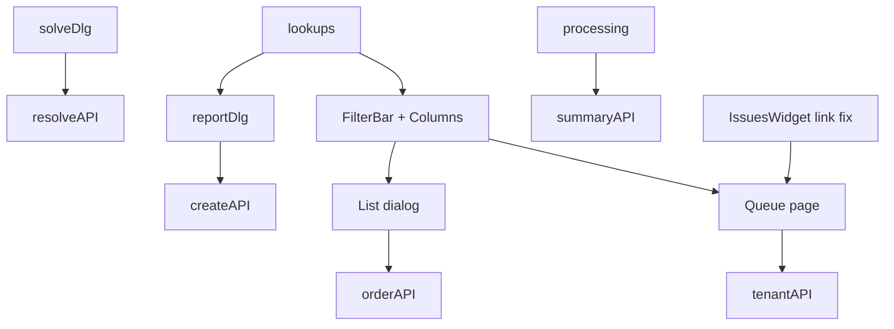

# Order issues — production-ready plan (gap-hardened)

## Review verdict

Earlier draft had **ship blockers**. This revision locks dual-write, index/helper alignment, remap+seed, Prisma, IssuesWidget fix, and lookup auth pattern.

## Decisions (locked)

- **Open predicate (single SoT for “is open?”):** `status = 'OPEN'`. **`solved_at` remains the resolution timestamp** (when/who/notes). Every write dual-updates both:
  - **Create:** `status=OPEN`, `solved_*=null`
  - **Resolve:** `status=SOLVED` + `solved_at/by/notes` set together
  - **Backfill:** `status = CASE WHEN solved_at IS NULL THEN 'OPEN' ELSE 'SOLVED' END`
  - **Must update in same migration/PR:** `has_unresolved_issues` / `org_ord_*`, partial indexes, `recomputeOrderHasIssue`, list/summary/queue/KPI — **never** mix `solved_at IS NULL` and `status='OPEN'` after cutover.
- **Status UI column (required):** Per-order Issues dialog table **and** tenant `/dashboard/issues` table — dedicated Status column (`OPEN`/`SOLVED` i18n text). Issue cell = type + description only.
- **Priority:** `sys_lkp_priority_cd`; drop `chk_issue_priority`; FK; default `normal`.
- **Issue type:** drop `chk_issue_code`; remap; seed missing; FK → `sys_issue_type_cd(code)`; report options `is_active=true`.
- **Lookup APIs:** auth-only (same as existing order-issue APIs), documented in `orders-access` with `enforcement: 'auth_only'` — do not invent a third pattern.
- **Navigation (required):** Add **`/dashboard/issues`** to sidebar via **dual-write** — [`web-admin/config/navigation.ts`](web-admin/config/navigation.ts) **and** a new `sys_components_cd` migration (same pattern as other nav entries). Align label/permissions/featureFlag with the access contract (auth-only page today).
- **Add issue** while filter ≠ This level: still creates at **original open scope**.

## Legacy remap + catalog seeds (P0)

| Legacy | Target |
|--------|--------|
| `damage` | `DAMAGE` |
| `stain` | `STAIN` |
| `complaint` | `COMPLAINT` (seed if missing) |
| `other` | `OTHER` (seed if missing) |

- Assert zero orphans before FK.
- FK type note: `sys_issue_type_cd.code` is `VARCHAR(50)`; `issue_code` is `TEXT` — OK in Postgres; optionally `ALTER issue_code TYPE VARCHAR(50)` for mirror.
- Update **QA reject create** (`issueCode: 'other'`) → `OTHER` / catalog code.
- Stop using i18n `codes.damage` etc. as primary labels — use catalog `name`/`name2`.

## Constraint names (confirmed)

- `chk_issue_priority`, `chk_issue_code` (plus existing scope checks — leave unless touched).

---

## Production gaps closed (checklist)

| Severity | Gap | Plan fix |
|----------|-----|----------|
| P0 | Remap/FK fails without COMPLAINT/OTHER + uppercase map | Seed + UPDATE map before FK |
| P0 | `status` vs `solved_at` drift | Dual-write + helpers/indexes/app all use `status` |
| P0 | Partial indexes still `solved_at IS NULL` | Drop/recreate on `status='OPEN'` |
| P0 | create/resolve omit `status` | Explicit fields + DEFAULT `'OPEN'` |
| P0 | Prisma/types omit `status` + FKs | Update schema in same change set |
| P1 | IssuesWidget `href="/issues"` (dead) | Fix → `/dashboard/issues` (`next/link`) |
| P1 | No sidebar nav for issues | **Required dual-write** `navigation.ts` + `sys_components_cd` for `/dashboard/issues` |
| P1 | Lookup route auth unclear | auth_only + access contract |
| P1 | Hardcoded lowercase Zod/i18n/QA | Catalog-driven |
| P2 | Queue sort/join perf | Index `(tenant_org_id, status, created_at)` (+ priority if needed) |
| P2 | `sys_*` broad grants | Prefer Next API only (no client direct table) |

---

## UI/UX redesign

### Shared (`features/orders/ui/issues/`)

- `OrderIssuesFilterBar` — scope + status (+ priority on queue); counts; Reset; RTL wrap.
- Columns factory: **Status** | Issue | Priority | Scope | Reported | Resolution | Solved (+ Order on queue).
- Status/priority chips with text+color; contextual empty states.

### Per-order dialog

Wider shell; sticky header + filter bar; Status column; Add = opener scope; Cmx loading/empty.

### Tenant queue `/dashboard/issues`

Page header + optional open KPI; filters Status · Scope · Priority; shared columns + Order link; Solve; Cmx states.

### Report / solve

Type + priority from catalogs (bilingual); default normal; solve shows snippet → SOLVED dual-write.

### Processing

Badge = manage; Report = create; tooltips/aria; summary counts = `status=OPEN`; Simple **Issues** column kept.

---

## 1. Migration `0416_…` (create only — do not apply)

**Strict order:**

1. Seed `COMPLAINT`, `OTHER` on `sys_issue_type_cd` (+ any missing map targets).
2. Create + seed `sys_lkp_priority_cd` (`low|normal|high|urgent`, normal default).
3. `UPDATE org_order_issues` remap `issue_code`.
4. Optional `ALTER issue_code` / `priority` to `VARCHAR(50)`.
5. `DROP CONSTRAINT chk_issue_code`, `chk_issue_priority`.
6. Add FKs to `sys_issue_type_cd`, `sys_lkp_priority_cd`.
7. `ADD status TEXT NOT NULL DEFAULT 'OPEN'` + CHECK (`OPEN`,`SOLVED`); backfill from `solved_at`.
8. `CREATE OR REPLACE` unresolved helpers → `status = 'OPEN'`.
9. Drop/recreate partial indexes (`idx_issue_unresolved`, `idx_issue_priority`, item/piece open indexes) on `status = 'OPEN'`.
10. Add supporting btree indexes for queue filters.

Stop for user review; never apply via agent.

---

## 2. Constants / Zod / Prisma

- `ORDER_ISSUE_STATUS`, shared `PRIORITY_*`; deprecate fixed lowercase `ORDER_ISSUE_CODE` as UI source.
- Zod: non-empty `issueCode` (service validates active catalog); priority codes.
- Prisma: `org_order_issues.status`; relations/FKs; add `sys_lkp_priority_cd` model; regenerate types after apply.

---

## 3. Service + APIs

| Method / route | Requirement |
|----------------|-------------|
| `createIssue` | Validate active type + priority; `status=OPEN`; dual-write null solved_* |
| `resolveIssue` | `status=SOLVED` + solved_* together; recompute `has_issue` via status |
| `listIssues` | Filter by `status`; scopeFilter; enrich type/priority; sort `display_order`, `created_at` |
| `getIssueSummary` | Counts via `status='OPEN'` |
| Tenant `GET /api/v1/orders/issues` | status/scope/priority filters; enrich; tenant_org_id |
| `GET /api/v1/lookups/issue-types` | active types |
| `GET /api/v1/lookups/priorities` | active priorities |

QA / any create path emitting `other` → catalog `OTHER`.

---

## 4. Access + navigation + widget

- **Navigation dual-write (required):**
  1. Add sidebar item for `/dashboard/issues` in [`web-admin/config/navigation.ts`](web-admin/config/navigation.ts) (label EN/AR via existing i18n/nav patterns, sensible parent group e.g. operations/workflow, Lucide icon).
  2. New migration `0417_nav_dashboard_issues.sql` (or combine with 0416 only if sequencing stays clear — prefer **separate nav migration** after 0416) inserting/updating `sys_components_cd` (`comp_code`, `label`/`name2`, `comp_path=/dashboard/issues`, `roles`, `main_permission_code` if any, `feature_flag`, icon). Follow [`navigation-dual-write`](.cursor/rules/navigation-dual-write.mdc) / `/navigation` skill.
  3. Keep access contract [`orders-access.ts`](web-admin/src/features/orders/access/orders-access.ts) route `/dashboard/issues` aligned with nav visibility.
- Lookup routes + queue filter notes; `enforcement: 'auth_only'`.
- **Fix** IssuesWidget link `/issues` → `/dashboard/issues` (`next/link`).
- `check`/`sync` ui-access-contract; inventory refresh for **navigation** + page surface after nav change.

---

## 5. Frontend map

---

## 6. i18n / tests / validation

- Chrome strings EN/AR; type/priority labels from DB.
- Tests: create OPEN; resolve SOLVED+solved_at; list filters; reject inactive type; tenant filters; remap constants.
- `check:i18n` + `web-admin` build + eslint on UI.

---

## Explicitly out of scope

- Non–order-issue consumers of `sys_lkp_priority_cd`.
- `sys_lkp_issue_status_cd` (two codes + CHECK enough).
- Changing Report ≠ Reject / QA reject semantics (only code string + status dual-write).
- Real photo upload.
- New Issues product area beyond processing + `/dashboard/issues`.
