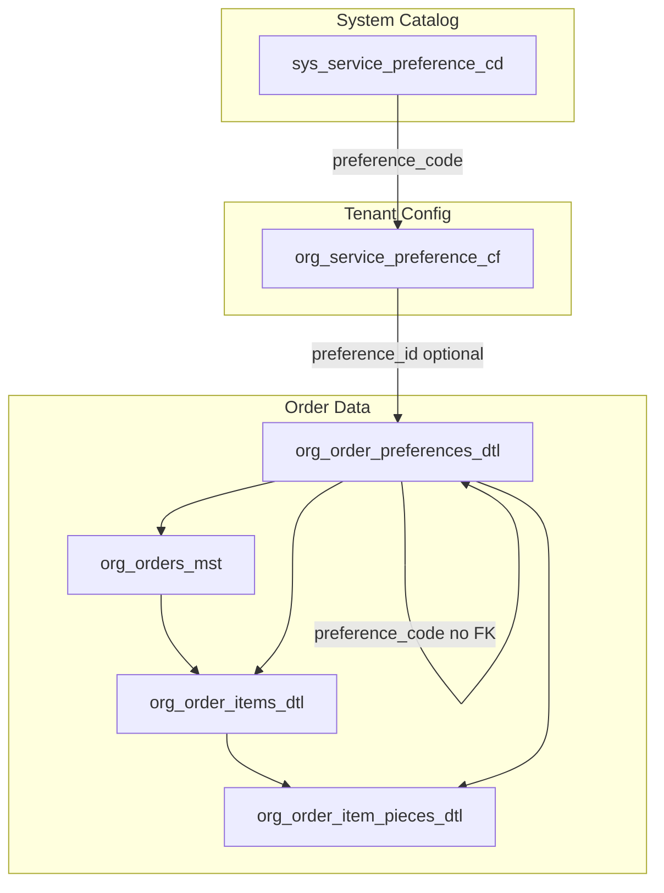

# Customer/Order/Item/Pieces Preferences - Unified Plan

## Execution Note

**Do NOT apply migrations.** Create migration files only. The user will run migrations manually (e.g. `supabase db push` or equivalent).

---

## Design Decisions (from discussion)

- **Single catalog:** Extend `sys_service_preference_cd` (no separate condition/color tables)
- **Unified table:** One `org_order_preferences_dtl` for ORDER/ITEM/PIECE levels (replaces `org_order_item_service_prefs` + `org_order_item_pc_prefs`)
- **FK strategy:** `preference_id` UUID nullable FK to `org_service_preference_cf(id)`; `preference_code` TEXT NOT NULL without FK for historical preservation
- **Color storage:** `org_order_item_pieces_dtl.color` changed from VARCHAR(50) to JSONB
- **Feature flag:** `item_conditions_colors_enabled` (default true)

---

## Architecture Overview




---

## Phase 1: Extend sys_service_preference_cd

**File:** New migration `0165_extend_preference_catalog_conditions_colors.sql` (or next available version)

**Add columns to sys_service_preference_cd:**


| Column                      | Type        | Default           | Purpose                                                |
| --------------------------- | ----------- | ----------------- | ------------------------------------------------------ |
| `preference_sys_kind`       | VARCHAR(30) | `'service_prefs'` | Discriminator: `service_prefs`                         |
| `is_color_prefs`            | BOOLEAN     | false             | True when preference_sys_kind='color'                  |
| `color_hex`                 | VARCHAR(20) | NULL              | Hex for color swatches (e.g. #FF0000)                  |
| `is_note_prefs`             | BOOLEAN     | false             | True when preference_sys_kind='note'                   |
| `is_used_by_system`         | BOOLEAN     | true              | System-managed vs tenant-created                       |
| `is_allow_to_show_for_user` | BOOLEAN     | true              | Show in UI                                             |
| `system_type_code`          | VARCHAR(50) | NULL              | Optional grouping (e.g. stain, damage, solid, pattern) |
| `is_show_in_quick_bar`      | BOOLEAN     | true              | Show in quick-select bar                               |
| `is_show_in_all_stages`     | BOOLEAN     | true              | Show across workflow stages                            |


**Existing columns reused:** `name`, `name2`, `icon`, `preference_category`, `display_order`

**Backfill:** Set `preference_sys_kind = 'service_prefs'` for all existing rows.

**Seed conditions** (preference_sys_kind: condition_stain, condition_damag; preference_category: stain, damage, special):

- Stains: COFFEE, WINE, BLOOD, MUD, OIL, INK, GREASE, BLEACH, BUBBLE, etc.
- Damage: BUTTON_BROKEN, BUTTON_MISSING, COLLAR_TORN, ZIPPER_BROKEN, HOLE, TEAR, SEAM_OPEN, etc.
- Special: SPECIAL_CARE, DELICATE (if not already as service_prefs)

**Seed colors** (preference_sys_kind='color', is_color_prefs=true):

- Solid: BLACK, WHITE, GREY, RED, BLUE, GREEN, YELLOW, ORANGE, PINK, PURPLE, etc.
- Pattern: STRIPED, CHECKERED, MULTI_COLOR (with color_hex for swatches where applicable)

**Tenant init:** When tenant is initialized, auto-create `org_service_preference_cf` rows for all conditions and colors (from sys_service_preference_cd where preference_sys_kind IN ('condition_stain','condition_damag','color')). Include in existing tenant initialization flow if one exists.

---

## Phase 2: Extend org_service_preference_cf

**Add columns** (mirror catalog config where needed):


| Column                  | Type        | Default | Purpose                               |
| ----------------------- | ----------- | ------- | ------------------------------------- |
| `preference_sys_kind`   | VARCHAR(30) | NULL    | Denormalized from sys_* for filtering |
| `is_show_in_quick_bar`  | BOOLEAN     | true    | Tenant override                       |
| `is_show_in_all_stages` | BOOLEAN     | true    | Tenant override                       |


**Note:** `org_service_preference_cf` already has `id` as PK. Keep `preference_code` for lookup; `id` used as FK from order prefs.

---

## Phase 3: Create Unified org_order_preferences_dtl

**New table:** `org_order_preferences_dtl`


| Column                 | Type          | Constraints                                 | Purpose                                                                              |
| ---------------------- | ------------- | ------------------------------------------- | ------------------------------------------------------------------------------------ |
| `id`                   | UUID          | PK                                          |                                                                                      |
| `tenant_org_id`        | UUID          | NOT NULL, FK org_tenants_mst                |                                                                                      |
| `order_id`             | UUID          | NOT NULL, FK org_orders_mst                 |                                                                                      |
| `branch_id`            | UUID          | NULL                                        |                                                                                      |
| `prefs_no`             | INTEGER       | NOT NULL                                    | Record sequence number per order/item/piece                                          |
| `prefs_level`          | VARCHAR(20)   | NOT NULL, CHECK IN ('ORDER','ITEM','PIECE') | Granularity                                                                          |
| `order_item_id`        | UUID          | NULL, FK org_order_items_dtl                | Required when prefs_level IN ('ITEM','PIECE')                                        |
| `order_item_piece_id`  | UUID          | NULL, FK org_order_item_pieces_dtl          | Required when prefs_level='PIECE'                                                    |
| `preference_id`        | UUID          | NULL, FK org_service_preference_cf(id)      | Live link; nullable for historical                                                   |
| `preference_code`      | TEXT          | NOT NULL                                    | Historical; no FK                                                                    |
| `preference_sys_kind`  | VARCHAR(30)   | NULL                                        | Denormalized: service_prefs, condition_stain, condition_damag, color, note           |
| `preference_category`  | VARCHAR(30)   | NULL                                        | Denormalized                                                                         |
| `prefs_owner_type`     | VARCHAR(20)   | NOT NULL, DEFAULT 'SYSTEM'                  | CUSTOMER, USER, SYSTEM                                                               |
| `prefs_source`         | VARCHAR(50)   | NOT NULL, DEFAULT 'ORDER_CREATE'            | ORDER_CREATE, LAST_ORDER, CUSTOMER_SAVED, SYSTEM, manual, bundle, repeat_order, etc. |
| `extra_price`          | DECIMAL(19,4) | DEFAULT 0                                   | For service_prefs                                                                    |
| `processing_confirmed` | BOOLEAN       | DEFAULT false                               | For service_prefs workflow                                                           |
| `confirmed_by`         | VARCHAR(120)  | NULL                                        |                                                                                      |
| `confirmed_at`         | TIMESTAMPTZ   | NULL                                        |                                                                                      |
| `rec_status`           | SMALLINT      | DEFAULT 1                                   |                                                                                      |
| `created_at`           | TIMESTAMPTZ   | DEFAULT NOW()                               |                                                                                      |
| `created_by`           | VARCHAR(120)  | NULL                                        |                                                                                      |
| `updated_at`           | TIMESTAMPTZ   | NULL                                        |                                                                                      |
| `updated_by`           | VARCHAR(120)  | NULL                                        |                                                                                      |


**prefs_no:** Sequence number within scope (per order, per item, or per piece). Use ROW_NUMBER() when migrating; on insert, compute as COALESCE(MAX(prefs_no), 0) + 1 within same order/item/piece.

**Indexes:**

- `(tenant_org_id, order_id)`
- `(tenant_org_id, order_item_id)` WHERE order_item_id IS NOT NULL
- `(tenant_org_id, order_item_piece_id)` WHERE order_item_piece_id IS NOT NULL
- `(preference_id)` WHERE preference_id IS NOT NULL

**Check constraint:** When prefs_level='ITEM', order_item_id NOT NULL; when prefs_level='PIECE', order_item_id AND order_item_piece_id NOT NULL.

**preference_sys_kind values:** `service_prefs` | `condition_stain` | `condition_damag` | `color` | `note`

---

## Phase 4: Migrate Data from Existing Tables

**Migration steps:**

1. **Create org_order_preferences_dtl** (as above).
2. **Migrate org_order_item_service_prefs:**
  - INSERT into org_order_preferences_dtl with prefs_level='ITEM', prefs_no (sequence per item), order_item_id, order_id, preference_code, preference_id (lookup from org_service_preference_cf by tenant_org_id+preference_code), preference_sys_kind='service_prefs', prefs_owner_type, prefs_source (from source column), extra_price, etc.
3. **Migrate org_order_item_pc_prefs:**
  - INSERT into org_order_preferences_dtl with prefs_level='PIECE', prefs_no (sequence per piece), order_item_id, order_item_piece_id, order_id, same mapping. Conditions/colors use preference_sys_kind IN ('condition_stain','condition_damag','color').
4. **Drop old tables:**
  - DROP TABLE org_order_item_pc_prefs
  - DROP TABLE org_order_item_service_prefs
5. **Migrate org_customer_service_prefs:** Change FK from `sys_service_preference_cd(code)` to `org_service_preference_cf(id)`. Add `preference_cf_id UUID REFERENCES org_service_preference_cf(id)`, backfill from (tenant_org_id, preference_code) lookup, drop old preference_code FK, keep preference_code as denormalized text for historical. Update any code that reads org_customer_service_prefs.

---

## Phase 5: org_order_item_pieces_dtl.color to JSONB

**Migration:**

1. Add `color_jsonb JSONB DEFAULT NULL`.
2. Backfill: `UPDATE org_order_item_pieces_dtl SET color_jsonb = to_jsonb(color) WHERE color IS NOT NULL` (or `{"codes": [color]}` for multi-color structure).
3. Drop `color` column.
4. Rename `color_jsonb` to `color`.

**Suggested JSONB structure:**

```json
{ "codes": ["RED", "STRIPED"], "primary": "RED" }
```

Or simple array: `["RED", "STRIPED"]`.

---

## Phase 6: Feature Flag

**Feature flag:** `item_conditions_colors_enabled`

- Default: true
- Plan binding: STARTER, GROWTH, PRO, ENTERPRISE (or all)
- Insert into `hq_ff_feature_flags_mst` and `sys_ff_pln_flag_mappings_dtl`
- No plan limits; keep open

---

## Phase 7: Update Application Code (Backend)

**Types and schema:** After migrations are applied (by user), regenerate `web-admin/types/database.ts` (Supabase types) and update `web-admin/prisma/schema.prisma` to reflect new tables (org_order_preferences_dtl, extended sys_service_preference_cd/org_service_preference_cf) and removed tables (org_order_item_service_prefs, org_order_item_pc_prefs). Run `npx prisma generate` if Prisma client is used.

**Affected files:**


| File                                                                                                                         | Change                                                                                                                                                                  |
| ---------------------------------------------------------------------------------------------------------------------------- | ----------------------------------------------------------------------------------------------------------------------------------------------------------------------- |
| [web-admin/lib/services/order-item-preference.service.ts](web-admin/lib/services/order-item-preference.service.ts)           | Switch from `org_order_item_service_prefs` to `org_order_preferences_dtl` with prefs_level='ITEM'                                                                       |
| [web-admin/lib/services/order-piece-preference.service.ts](web-admin/lib/services/order-piece-preference.service.ts)         | Switch from `org_order_item_pc_prefs` to `org_order_preferences_dtl` with prefs_level='PIECE'                                                                           |
| Customer pref services (if any)                                                                                              | Update to use org_service_preference_cf(id) for org_customer_service_prefs                                                                                              |
| [web-admin/lib/services/order-piece-service.ts](web-admin/lib/services/order-piece-service.ts)                               | Update piece creation/update to use org_order_preferences_dtl                                                                                                           |
| [web-admin/lib/services/order-service.ts](web-admin/lib/services/order-service.ts)                                           | Update order creation to use org_order_preferences_dtl                                                                                                                  |
| [web-admin/types/database.ts](web-admin/types/database.ts)                                                                   | Regenerate types for new schema (Supabase types)                                                                                                                        |
| [web-admin/prisma/schema.prisma](web-admin/prisma/schema.prisma)                                                             | Update schema: add org_order_preferences_dtl, extend sys_service_preference_cd, org_service_preference_cf; remove org_order_item_service_prefs, org_order_item_pc_prefs |
| [supabase/migrations/0142_preference_resolution_functions.sql](supabase/migrations/0142_preference_resolution_functions.sql) | Update `get_last_order_preferences` and `suggest_preferences_from_history` to query org_order_preferences_dtl                                                           |


---

## Phase 8: UI Activation - Customer/Order/Item/Pieces Preferences Panel

**Goal:** Activate the "Customer/Order/Item/Pieces Preferences" section (bottom-left panel) so staff can apply preferences (conditions, colors, service prefs) at the appropriate level to the most recently added piece.

**Current state:** [StainConditionToggles](web-admin/src/features/orders/ui/stain-condition-toggles.tsx) (to be renamed or generalized as Preferences panel) exists but receives empty `selectedConditions` and no-op `onConditionToggle`; [ProductGrid](web-admin/src/features/orders/ui/product-grid.tsx) does not pass these props from [NewOrderContent](web-admin/src/features/orders/ui/new-order-content.tsx).

**Implementation:**

1. **Selected piece state**
  - Add `selectedPieceId: string | null` to new order state (or derive from `selectedItemId` + piece index when trackByPiece).
  - When user adds item: set selected piece = last added piece (create piece if trackByPiece=false with implicit pieces).
  - When user clicks item/piece in order summary: set selected piece = that piece.
2. **Wire StainConditionToggles**
  - In [NewOrderContent](web-admin/src/features/orders/ui/new-order-content.tsx), pass to ProductGrid:
    - `selectedConditions` = conditions of the selected piece (from pieces array or item)
    - `onConditionToggle` = handler that toggles condition on selected piece
  - Guard: when no piece selected or no items, `disabled={true}` (already supported).
3. **State model for conditions**
  - Add `conditions: string[]` to [PreSubmissionPiece](web-admin/src/features/orders/model/new-order-types.ts).
  - When trackByPiece=false: each quantity unit = implicit piece; store conditions per implicit piece (e.g. in expanded pieces array or item-level conditions for qty=1).
4. **Order summary display**
  - In [memoizedOrderItems](web-admin/src/features/orders/ui/new-order-content.tsx), include `conditions` (and `hasStain`, `hasDamage`) from pieces for each item.
  - [ItemCartItem](web-admin/src/features/orders/ui/item-cart-item.tsx) already displays `conditions`; ensure it receives them.
5. **Visual feedback**
  - Highlight selected item/piece in [OrderSummaryPanel](web-admin/src/features/orders/ui/order-summary-panel.tsx) / [ItemCartList](web-admin/src/features/orders/ui/item-cart-list.tsx) (e.g. border or background).
  - Instruction text: "Click to apply preference to the most recently added piece" (update in messages).
6. **Conditions source**
  - **Interim:** Use hardcoded [STAIN_CONDITIONS](web-admin/lib/types/order-creation.ts) until catalog API is ready.
  - **Post-catalog:** Fetch conditions from API (org_service_preference_cf where preference_sys_kind IN ('condition_stain','condition_damag')) and filter by category (All, Stains, Damage, Special).
7. **Submission**
  - Include piece conditions in order creation payload; backend persists to `org_order_preferences_dtl` with prefs_level='PIECE', preference_sys_kind IN ('condition_stain','condition_damag').
8. **Edit order**
  - Load conditions from `org_order_preferences_dtl` when loading order for edit; populate piece.conditions.

**Files to modify:**


| File                                                                                                                             | Change                                                                                                                                                      |
| -------------------------------------------------------------------------------------------------------------------------------- | ----------------------------------------------------------------------------------------------------------------------------------------------------------- |
| [web-admin/src/features/orders/model/new-order-types.ts](web-admin/src/features/orders/model/new-order-types.ts)                 | Add `conditions?: string[]` to PreSubmissionPiece                                                                                                           |
| [web-admin/src/features/orders/ui/context/new-order-context.tsx](web-admin/src/features/orders/ui/context/new-order-context.tsx) | Add `selectedPieceId`, `setSelectedPieceId`; reducer actions for `UPDATE_PIECE_CONDITIONS`                                                                  |
| [web-admin/src/features/orders/ui/new-order-content.tsx](web-admin/src/features/orders/ui/new-order-content.tsx)                 | Wire selectedConditions, onConditionToggle to ProductGrid; pass selectedPieceId to OrderSummaryPanel                                                        |
| [web-admin/src/features/orders/ui/product-grid.tsx](web-admin/src/features/orders/ui/product-grid.tsx)                           | Already accepts props; ensure passed through                                                                                                                |
| [web-admin/src/features/orders/ui/order-summary-panel.tsx](web-admin/src/features/orders/ui/order-summary-panel.tsx)             | Accept selectedPieceId; highlight selected piece in ItemCartList                                                                                            |
| [web-admin/src/features/orders/ui/item-cart-list.tsx](web-admin/src/features/orders/ui/item-cart-list.tsx)                       | Accept onSelectPiece, selectedPieceId; pass to ItemCartItem                                                                                                 |
| [web-admin/src/features/orders/ui/item-cart-item.tsx](web-admin/src/features/orders/ui/item-cart-item.tsx)                       | Add onClick to select piece; visual highlight when selected                                                                                                 |
| [web-admin/src/features/orders/ui/stain-condition-toggles.tsx](web-admin/src/features/orders/ui/stain-condition-toggles.tsx)     | Update panel title to "Customer/Order/Item/Pieces Preferences" (use new translation key)                                                                    |
| [web-admin/messages/en.json](web-admin/messages/en.json), [web-admin/messages/ar.json](web-admin/messages/ar.json)               | Add key `customerOrderItemPiecesPreferences` (or similar): "Customer/Order/Item/Pieces Preferences" / Arabic equivalent; replace itemConditionsStains usage |


---

## Phase 9: RLS and Policies

- Enable RLS on `org_order_preferences_dtl`
- Policy: `tenant_isolation_org_order_preferences_dtl` USING (tenant_org_id = current_tenant_id())
- Service role policy for admin operations

---

## Phase 10: Create/Update Documentation

**Goal:** Document the Customer/Order/Item/Pieces Preferences feature for developers and maintainers.

**Deliverables:**

1. **Feature documentation** (e.g. `docs/features/Order_Service_Preferences/` or new `docs/features/Customer_Order_Item_Pieces_Preferences/`)
  - Overview of the unified preferences model
  - Data model diagram (sys_service_preference_cd, org_service_preference_cf, org_order_preferences_dtl)
  - preference_sys_kind values and usage (service_prefs, condition_stain, condition_damag, color, note)
  - API endpoints and payloads for preferences
  - Tenant initialization flow for conditions/colors
2. **Update existing docs**
  - [docs/features/Order_Service_Preferences/](docs/features/Order_Service_Preferences/) - Update technical data model, developer guide to reflect org_order_preferences_dtl
  - [docs/plan/](docs/plan/) or [.cursor/rules/](.cursor/rules/) - Add reference to new preference tables if applicable
  - [CLAUDE.md](CLAUDE.md) - Add note on preference system if relevant
3. **Migration documentation**
  - Document migration order (0165-0169) in dev commands or migration guide
  - Rollback procedure for each migration
4. **API documentation**
  - Order creation/update payload: piece.conditions, piece.color_codes
  - Preference resolution functions: get_last_order_preferences, suggest_preferences_from_history
5. **i18n / settings reference**
  - Document new translation keys (customerOrderItemPiecesPreferences, etc.)
  - Document feature flag item_conditions_colors_enabled

**Files to create/update:**


| File                                                                                                 | Action                                                     |
| ---------------------------------------------------------------------------------------------------- | ---------------------------------------------------------- |
| `docs/features/Customer_Order_Item_Pieces_Preferences/README.md` or extend Order_Service_Preferences | Create/update feature overview                             |
| `docs/features/Order_Service_Preferences/technical_docs/tech_data_model.md`                          | Update with org_order_preferences_dtl, preference_sys_kind |
| `docs/features/Order_Service_Preferences/developer_guide.md`                                         | Update with new table usage, migration notes               |
| `docs/dev/` or `.claude/docs/`                                                                       | Add migration order, rollback steps                        |
| `.claude/docs/Allsettings.md` / `Allsettings.json`                                                   | Add item_conditions_colors_enabled if in tenant settings   |


---

## Full Plan Tasks (Execution Order)


| #   | Task ID        | Task                                                                                                                                                 | Depends On     |
| --- | -------------- | ---------------------------------------------------------------------------------------------------------------------------------------------------- | -------------- |
| 1   | mig-0165       | Create migration 0165 (file only, do not apply): ALTER sys_service_preference_cd, seed conditions/colors, ALTER org_service_preference_cf            | -              |
| 2   | mig-0166       | Create migration 0166 (file only, do not apply): CREATE org_order_preferences_dtl, migrate data, DROP old tables, migrate org_customer_service_prefs | mig-0165       |
| 3   | mig-0167       | Create migration 0167 (file only, do not apply): org_order_item_pieces_dtl.color to JSONB                                                            | mig-0166       |
| 4   | mig-0168       | Create migration 0168 (file only, do not apply): Feature flag item_conditions_colors_enabled                                                         | -              |
| 5   | mig-0169       | Create migration 0169 (file only, do not apply): Update get_last_order_preferences, suggest_preferences_from_history                                 | mig-0166       |
| 6   | phase7-backend | Update backend services; regenerate database types (database.ts); update Prisma schema (schema.prisma)                                               | mig-0166       |
| 7   | phase9-rls     | Add RLS policies to org_order_preferences_dtl (in mig-0166 or separate)                                                                              | mig-0166       |
| 8   | phase8-ui      | Wire Customer/Order/Item/Pieces Preferences panel: state, ProductGrid, OrderSummaryPanel, ItemCartList, ItemCartItem, translations                   | phase7-backend |
| 9   | tenant-init    | Update tenant initialization to seed org_service_preference_cf for conditions/colors                                                                 | mig-0165       |
| 10  | phase10-docs   | Create/update feature docs, tech data model, developer guide, migration docs                                                                         | phase8-ui      |


---

## Migration Order (Recommended)

**Create migration files only. User will apply migrations manually.**

Schema first (0165-0169), then Phase 7 (backend), then Phase 8 (UI activation), then Phase 10 (documentation).

1. **0165_extend_sys_service_preference_cd_conditions_colors.sql**
  - ALTER sys_service_preference_cd (add columns)
  - Seed conditions and colors
  - ALTER org_service_preference_cf (add columns)
2. **0166_create_org_order_preferences_dtl.sql**
  - CREATE org_order_preferences_dtl
  - Migrate data from org_order_item_service_prefs and org_order_item_pc_prefs
  - DROP org_order_item_service_prefs and org_order_item_pc_prefs
  - Migrate org_customer_service_prefs: add preference_cf_id FK to org_service_preference_cf, backfill, drop preference_code FK
3. **0167_org_order_item_pieces_color_jsonb.sql**
  - ALTER org_order_item_pieces_dtl: color to JSONB
4. **0168_item_conditions_colors_feature_flag.sql**
  - Feature flag and plan mappings
5. **0169_update_preference_resolution_functions.sql**
  - Update get_last_order_preferences, suggest_preferences_from_history
6. **Phase 7** - Backend services update
7. **Phase 8** - UI activation
8. **tenant-init** - Update tenant initialization for conditions/colors seed
9. **Phase 10** - Create/update documentation

---

## Rollback Considerations

- Old tables are dropped; rollback requires recreating them and re-migrating data from org_order_preferences_dtl (reverse migration).
- Color migration: use ADD column + backfill + DROP old in same migration.
- Document rollback steps in migration comments.

---

## Resolved Decisions (Open Questions)

1. **Packing preferences:** Keep on `org_order_items_dtl.packing_pref_code` and `org_order_item_pieces_dtl.packing_pref_code`. Packing is single-select, different from multi-select prefs; no move to org_order_preferences_dtl.
2. **org_customer_service_prefs:** Migrate to reference `org_service_preference_cf(id)` instead of `sys_service_preference_cd(code)`. Add migration to change FK and backfill preference_id from tenant+code lookup.
3. **Tenant seed for conditions/colors:** Yes. Auto-create `org_service_preference_cf` rows for new conditions/colors when tenant is initialized (include in tenant init if one exists).

