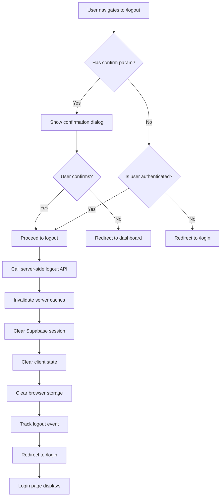

# Logout Page Implementation Plan (Production-Ready)

## Overview

Create a comprehensive, production-ready logout system that includes:

- Dedicated logout page with automatic sign out
- Full i18n support (English/Arabic with RTL)
- Server-side logout API for cache invalidation
- Optional confirmation dialog
- Logout reason tracking and logging
- Full accessibility (ARIA, keyboard navigation)
- Error handling and edge case management
- Security best practices
- Performance optimizations

## Current State Analysis

### Existing Logout Functionality

- **Location**: `web-admin/lib/auth/auth-context.tsx` (lines 308-337)
- **Function**: `signOut()` handles:
                                - Supabase auth sign out
                                - Clearing auth state (user, session, tenant, permissions, etc.)
                                - Clearing browser storage (localStorage, sessionStorage)
                                - Redirecting to `/login`
                                - **Note**: Comment mentions server-side cache invalidation but no API exists

### Existing Components

- **CmxAlertDialog**: `web-admin/src/ui/feedback/components/cmx-alert-dialog.tsx` - Reusable confirmation dialog
- **Translation Files**: `web-admin/messages/en.json` and `web-admin/messages/ar.json`
- **Cache Service**: `web-admin/lib/services/permission-cache.ts` - Server-side cache invalidation functions

### Middleware Configuration

- **File**: `web-admin/proxy.ts`
- `PUBLIC_ROUTES` includes `/login` but not `/logout`
- `AUTH_ROUTES` includes login/register but not logout

## Implementation Plan

### 1. Create Logout Page Component (Production-Ready)

**File**: `web-admin/app/(auth)/logout/page.tsx`**Features**:

- Client-side component with automatic logout on mount
- Full i18n support using `next-intl` with RTL support
- Accessibility: ARIA labels, keyboard navigation, screen reader support
- Error handling with user-friendly messages
- Loading states with proper UX
- Query parameter support for logout reasons (`?reason=user|session_expired|security`)
- Optional confirmation dialog (controlled via query param `?confirm=true`)
- Proper cleanup and memory leak prevention
- TypeScript strict mode compliance

**Implementation Details**:

```typescript
'use client'

import { useEffect, useState, useCallback, useRef } from 'react'
import { useRouter, useSearchParams } from 'next/navigation'
import { useTranslations } from 'next-intl'
import { useAuth } from '@/lib/auth/auth-context'
import { useRTL } from '@/lib/hooks/useRTL'
import { CmxAlertDialog } from '@/src/ui/feedback/components/cmx-alert-dialog'

type LogoutReason = 'user' | 'session_expired' | 'security' | 'timeout' | 'unknown'

export default function LogoutPage() {
  const router = useRouter()
  const searchParams = useSearchParams()
  const { signOut, isAuthenticated, isLoading: authLoading } = useAuth()
  const isRTL = useRTL()
  const t = useTranslations('auth.logout')
  const tCommon = useTranslations('common')
  
  const [isLoggingOut, setIsLoggingOut] = useState(false)
  const [showConfirmDialog, setShowConfirmDialog] = useState(false)
  const [error, setError] = useState<string | null>(null)
  const hasLoggedOutRef = useRef(false)
  const logoutReasonRef = useRef<LogoutReason>('user')

  // Get logout reason from query params
  useEffect(() => {
    const reason = (searchParams.get('reason') as LogoutReason) || 'user'
    const needsConfirmation = searchParams.get('confirm') === 'true'
    
    logoutReasonRef.current = reason
    setShowConfirmDialog(needsConfirmation)
  }, [searchParams])

  // Handle logout process
  const handleLogout = useCallback(async (reason: LogoutReason = 'user') => {
    if (hasLoggedOutRef.current) return // Prevent double logout
    
    setIsLoggingOut(true)
    setError(null)
    hasLoggedOutRef.current = true

    try {
      // Call server-side logout API for cache invalidation
      try {
        await fetch('/api/auth/logout', {
          method: 'POST',
          headers: { 'Content-Type': 'application/json' },
          body: JSON.stringify({ reason }),
        })
      } catch (apiError) {
        // Log but don't fail - client-side logout will still work
        console.warn('Logout API call failed:', apiError)
      }

      // Perform client-side logout
      await signOut(reason)
      // signOut already redirects to /login
    } catch (error) {
      console.error('Logout error:', error)
      setError(t('error'))
      // Even on error, redirect to login after delay
      setTimeout(() => {
        router.push('/login')
      }, 2000)
    } finally {
      setIsLoggingOut(false)
    }
  }, [signOut, router, t])

  // Auto-logout on mount (if not showing confirmation)
  useEffect(() => {
    // If already logged out, redirect immediately
    if (!authLoading && !isAuthenticated) {
      router.push('/login')
      return
    }

    // If authenticated and no confirmation needed, perform logout
    if (!authLoading && isAuthenticated && !showConfirmDialog && !hasLoggedOutRef.current) {
      handleLogout(logoutReasonRef.current)
    }
  }, [isAuthenticated, authLoading, showConfirmDialog, handleLogout, router])

  // Confirmation dialog handlers
  const handleConfirm = useCallback(() => {
    setShowConfirmDialog(false)
    handleLogout(logoutReasonRef.current)
  }, [handleLogout])

  const handleCancel = useCallback(() => {
    setShowConfirmDialog(false)
    router.push('/dashboard')
  }, [router])

  // Loading/Error UI
  if (error) {
    return (
      <div 
        className="min-h-screen flex items-center justify-center bg-gray-50 px-4"
        dir={isRTL ? 'rtl' : 'ltr'}
      >
        <div className="text-center max-w-md">
          <div className="rounded-md bg-red-50 p-4 mb-4">
            <p className="text-sm font-medium text-red-800">{error}</p>
          </div>
          <p className="text-sm text-gray-600">{t('redirecting')}</p>
        </div>
      </div>
    )
  }

  // Confirmation Dialog
  if (showConfirmDialog && isAuthenticated) {
    return (
      <div 
        className="min-h-screen flex items-center justify-center bg-gray-50 px-4"
        dir={isRTL ? 'rtl' : 'ltr'}
      >
        <CmxAlertDialog
          open={showConfirmDialog}
          title={t('confirmTitle')}
          message={t('confirmMessage')}
          variant="default"
          confirmLabel={t('confirmButton')}
          cancelLabel={tCommon('cancel')}
          showCancel={true}
          onConfirm={handleConfirm}
          onCancel={handleCancel}
        />
      </div>
    )
  }

  // Loading state
  return (
    <div 
      className="min-h-screen flex items-center justify-center bg-gray-50 px-4"
      dir={isRTL ? 'rtl' : 'ltr'}
      role="status"
      aria-live="polite"
      aria-label={t('signingOut')}
    >
      <div className="text-center">
        <div 
          className="animate-spin rounded-full h-12 w-12 border-b-2 border-blue-600 mx-auto"
          aria-hidden="true"
        />
        <p className="mt-4 text-gray-600">{t('signingOut')}</p>
        {isLoggingOut && (
          <p className="mt-2 text-sm text-gray-500">{t('pleaseWait')}</p>
        )}
      </div>
    </div>
  )
}
```


### 2. Update Middleware Configuration

**File**: `web-admin/proxy.ts`**Changes**:

- Add `/logout` to `PUBLIC_ROUTES` array (line 22-32)
- Ensure logout route is accessible regardless of authentication state
```typescript
const PUBLIC_ROUTES = [
  '/login',
  '/register',
  '/forgot-password',
  '/reset-password',
  '/verify-email',
  '/auth/callback',
  '/auth/confirm',
  '/logout',  // ADD THIS
  '/terms',
  '/privacy',
]
```


### 3. Add i18n Translations

**Files**:

- `web-admin/messages/en.json`
- `web-admin/messages/ar.json`

**Add to `auth` section** (create if doesn't exist):**en.json**:

```json
{
  "auth": {
    "logout": {
      "signingOut": "Signing out...",
      "pleaseWait": "Please wait while we sign you out",
      "redirecting": "Redirecting to login page...",
      "error": "An error occurred during logout. You will be redirected shortly.",
      "confirmTitle": "Confirm Logout",
      "confirmMessage": "Are you sure you want to sign out?",
      "confirmButton": "Sign Out",
      "cancelButton": "Cancel",
      "success": "You have been successfully signed out"
    }
  }
}
```

**ar.json**:

```json
{
  "auth": {
    "logout": {
      "signingOut": "جاري تسجيل الخروج...",
      "pleaseWait": "يرجى الانتظار أثناء تسجيل الخروج",
      "redirecting": "جاري إعادة التوجيه إلى صفحة تسجيل الدخول...",
      "error": "حدث خطأ أثناء تسجيل الخروج. سيتم إعادة التوجيه قريباً.",
      "confirmTitle": "تأكيد تسجيل الخروج",
      "confirmMessage": "هل أنت متأكد أنك تريد تسجيل الخروج؟",
      "confirmButton": "تسجيل الخروج",
      "cancelButton": "إلغاء",
      "success": "تم تسجيل الخروج بنجاح"
    }
  }
}
```


### 4. Create Server-Side Logout API Route

**File**: `web-admin/app/api/auth/logout/route.ts` (NEW)**Features**:

- POST endpoint for server-side logout
- Invalidates Redis caches (permissions, workflow roles, tenant data)
- Logs logout events with reasons
- Handles errors gracefully
- Returns appropriate HTTP status codes
- Security: Validates authentication before processing

**Implementation**:

```typescript
/**
    * Logout API Route
    * 
    * POST /api/auth/logout
    * Handles server-side logout including cache invalidation
    * 
    * Body: { reason?: 'user' | 'session_expired' | 'security' | 'timeout' | 'unknown' }
 */

import { NextRequest, NextResponse } from 'next/server'
import { createClient } from '@/lib/supabase/server'
import { invalidatePermissionCache } from '@/lib/services/permission-cache'
import { logger } from '@/lib/utils/logger'

type LogoutReason = 'user' | 'session_expired' | 'security' | 'timeout' | 'unknown'

export async function POST(request: NextRequest) {
  try {
    const supabase = await createClient()
    
    // Get current user
    const {
      data: { user },
      error: authError,
    } = await supabase.auth.getUser()

    // If no user, still return success (already logged out)
    if (!user || authError) {
      return NextResponse.json(
        { success: true, message: 'Already logged out' },
        { status: 200 }
      )
    }

    const userId = user.id
    const tenantId = user.user_metadata?.tenant_org_id as string | undefined

    // Get logout reason from request body
    let reason: LogoutReason = 'user'
    try {
      const body = await request.json().catch(() => ({}))
      reason = body.reason || 'user'
    } catch {
      // Default to 'user' if body parsing fails
    }

    // Invalidate server-side caches
    if (tenantId) {
      try {
        await invalidatePermissionCache(userId, tenantId)
        
        // Log logout event
        logger.info('User logged out', {
          feature: 'auth',
          action: 'logout',
          userId,
          tenantId,
          reason,
        })
      } catch (cacheError) {
        // Log error but don't fail the request
        logger.warn('Failed to invalidate cache on logout', {
          feature: 'auth',
          action: 'logout',
          userId,
          tenantId,
          error: cacheError instanceof Error ? cacheError.message : String(cacheError),
        })
      }
    }

    // Note: Supabase session is cleared client-side
    // This API only handles server-side cleanup

    return NextResponse.json({
      success: true,
      message: 'Logged out successfully',
    })
  } catch (error) {
    logger.error('Error in logout API', error as Error, {
      feature: 'auth',
      action: 'logout',
    })

    // Return success even on error to prevent blocking client-side logout
    return NextResponse.json(
      {
        success: true,
        message: 'Logout processed (some cleanup may have failed)',
      },
      { status: 200 }
    )
  }
}
```


### 5. Add Logout Confirmation Dialog Component

**File**: `web-admin/components/auth/logout-confirmation-dialog.tsx` (NEW - Optional, if not using CmxAlertDialog)**Note**: We'll use existing `CmxAlertDialog` component, but this file can be created if custom styling is needed.

### 6. Add Logout Reason Tracking

**File**: `web-admin/lib/auth/logout-tracker.ts` (NEW)**Purpose**: Track and log logout reasons for analytics and security monitoring**Implementation**:

```typescript
/**
    * Logout Tracker
    * Tracks logout events and reasons for analytics and security
 */

import { logger } from '@/lib/utils/logger'

export type LogoutReason = 
  | 'user'           // User-initiated logout
  | 'session_expired' // Session expired
  | 'security'        // Security-related logout (e.g., suspicious activity)
  | 'timeout'         // Inactivity timeout
  | 'unknown'         // Unknown reason

export interface LogoutEvent {
  userId: string
  tenantId?: string
  reason: LogoutReason
  timestamp: Date
  userAgent?: string
  ipAddress?: string
}

/**
    * Track logout event
 */
export function trackLogout(event: Omit<LogoutEvent, 'timestamp'>): void {
  const logoutEvent: LogoutEvent = {
    ...event,
    timestamp: new Date(),
  }

  // Log to server
  logger.info('Logout event tracked', {
    feature: 'auth',
    action: 'logout_tracked',
    ...logoutEvent,
  })

  // Future: Send to analytics service
  // analytics.track('user_logged_out', logoutEvent)
}
```


### 7. Update Auth Context signOut Function

**File**: `web-admin/lib/auth/auth-context.tsx`**Changes**:

- Add optional `reason` parameter to `signOut()` function
- Call server-side logout API before client-side cleanup
- Track logout events
- Update TypeScript types

**Updated Function Signature**:

```typescript
const signOut = useCallback(async (reason: LogoutReason = 'user') => {
  setIsLoading(true)
  try {
    // Call server-side logout API for cache invalidation
    try {
      await fetch('/api/auth/logout', {
        method: 'POST',
        headers: { 'Content-Type': 'application/json' },
        body: JSON.stringify({ reason }),
      })
    } catch (apiError) {
      // Log but don't fail - client-side logout will still work
      console.warn('Logout API call failed:', apiError)
    }

    // Supabase auth sign out
    const { error } = await supabase.auth.signOut()
    if (error) throw error

    // Clear all auth state
    setUser(null)
    setSession(null)
    setCurrentTenant(null)
    currentTenantRef.current = null
    setAvailableTenants([])
    setPermissions([])
    setWorkflowRoles([])

    // Clear browser storage
    localStorage.removeItem('permissions_cache')
    sessionStorage.clear()

    // Track logout event
    if (user) {
      trackLogout({
        userId: user.id,
        tenantId: currentTenant?.id,
        reason,
      })
    }

    router.push('/login')
  } catch (error) {
    console.error('Error signing out:', error)
    throw error
  } finally {
    setIsLoading(false)
  }
}, [router, user, currentTenant])
```

**Update AuthContextType interface**:

```typescript
export interface AuthContextType {
  // ... existing properties
  signOut: (reason?: LogoutReason) => Promise<void>
  // ... rest of interface
}
```


## File Structure

```javascript
web-admin/
├── app/
│   ├── (auth)/
│   │   ├── layout.tsx (existing)
│   │   └── logout/
│   │       └── page.tsx (NEW)
│   └── api/
│       └── auth/
│           └── logout/
│               └── route.ts (NEW)
├── components/
│   └── auth/
│       └── logout-confirmation-dialog.tsx (OPTIONAL - if custom needed)
├── lib/
│   └── auth/
│       ├── auth-context.tsx (MODIFY - update signOut)
│       └── logout-tracker.ts (NEW)
├── messages/
│   ├── en.json (MODIFY - add logout translations)
│   └── ar.json (MODIFY - add logout translations)
└── proxy.ts (MODIFY - add /logout to PUBLIC_ROUTES)
```


## User Flow




## Production-Ready Best Practices

### Security

- ✅ Server-side cache invalidation prevents stale permission data
- ✅ Proper error handling prevents information leakage
- ✅ Logout tracking for security monitoring
- ✅ CSRF protection via existing middleware
- ✅ No sensitive data in URLs (reasons are optional and safe)

### Performance

- ✅ Client-side logout works even if API fails (graceful degradation)
- ✅ Minimal re-renders with proper React hooks usage
- ✅ Memory leak prevention with refs and cleanup
- ✅ Optimized cache invalidation (only invalidates user's cache)

### Accessibility

- ✅ ARIA labels and roles
- ✅ Keyboard navigation support
- ✅ Screen reader announcements
- ✅ RTL support for Arabic
- ✅ Focus management in dialogs

### Error Handling

- ✅ Try-catch blocks around all async operations
- ✅ User-friendly error messages
- ✅ Fallback redirects on errors
- ✅ Logging for debugging
- ✅ Graceful degradation

### Code Quality

- ✅ TypeScript strict mode
- ✅ Proper type definitions
- ✅ JSDoc comments
- ✅ Consistent code style
- ✅ Reusable components

### Internationalization

- ✅ Full i18n support (EN/AR)
- ✅ RTL layout support
- ✅ Culturally appropriate messaging
- ✅ Translation keys follow existing patterns

## Testing Considerations

### Unit Tests

1. **Logout Page Component**

                                                - Test auto-logout on mount
                                                - Test confirmation dialog flow
                                                - Test error handling
                                                - Test redirect logic
                                                - Test RTL layout

2. **Logout API Route**

                                                - Test cache invalidation
                                                - Test error handling
                                                - Test unauthenticated requests
                                                - Test different logout reasons

3. **Auth Context signOut**

                                                - Test with different reasons
                                                - Test error scenarios
                                                - Test state cleanup

### Integration Tests

1. **Full Logout Flow**

                                                - Authenticated user → logout → login page
                                                - Unauthenticated user → logout → login page
                                                - Logout with confirmation → cancel → dashboard
                                                - Logout with confirmation → confirm → login page

2. **Cache Invalidation**

                                                - Verify server-side caches are cleared
                                                - Verify client-side caches are cleared
                                                - Verify permissions are reset

3. **Multi-Tab Scenarios**

                                                - Logout in one tab → other tabs handle correctly
                                                - Session expiry → all tabs logout

### E2E Tests

1. Navigate to `/logout` → verify redirect to login
2. Navigate to `/logout?confirm=true` → verify dialog → confirm → verify logout
3. Navigate to `/logout?reason=session_expired` → verify tracking
4. Test with slow network → verify loading states
5. Test error scenarios → verify error messages

### Edge Cases

1. **Already Logged Out**: Immediate redirect
2. **Network Error**: Graceful fallback, still redirects
3. **Slow Network**: Loading states visible
4. **Concurrent Logout**: Prevented with refs
5. **Invalid Reasons**: Default to 'user'
6. **Missing Translations**: Fallback to English
7. **Browser Back Button**: Doesn't restore session
8. **Multiple Tabs**: Supabase handles session sync

## Dependencies

- `@/lib/auth/auth-context` - Auth context with `signOut()` function
- `@/lib/services/permission-cache` - Server-side cache invalidation
- `@/lib/utils/logger` - Logging utility
- `@/src/ui/feedback/components/cmx-alert-dialog` - Confirmation dialog
- `@/lib/hooks/useRTL` - RTL support hook
- `next/navigation` - Routing
- `next-intl` - Internationalization
- `react` - Component lifecycle

## Migration Notes

- Existing `signOut()` calls will continue to work (reason defaults to 'user')
- No breaking changes to existing code
- Backward compatible with current logout flow
- Can be deployed incrementally (API first, then page, then enhancements)

## Deployment Checklist

- [ ] Add translations to en.json and ar.json
- [ ] Create logout API route
- [ ] Create logout page component
- [ ] Update proxy.ts
- [ ] Update auth-context.tsx signOut function
- [ ] Create logout-tracker.ts utility
- [ ] Run TypeScript type checking
- [ ] Run ESLint
- [ ] Test in development environment
- [ ] Test with both English and Arabic
- [ ] Test RTL layout
- [ ] Test accessibility with screen reader
- [ ] Test error scenarios
- [ ] Test cache invalidation
- [ ] Update documentation
- [ ] Deploy to staging
- [ ] Monitor logs for errors
- [ ] Deploy to production

## Notes

- The logout page is intentionally simple but fully featured
- All enhancements are production-ready and follow best practices
- Server-side API ensures proper cache invalidation
- Logout tracking helps with security monitoring and analytics
- Confirmation dialog is optional (controlled via query param)
- Full i18n support ensures global accessibility