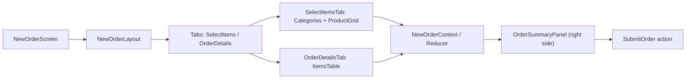

# New Order Page – Two-Tab Layout Implementation Plan

## Goals

- **Introduce a clear two-step flow** on the New Order page: **Select Items** → **Review Order Details**.
- **Reuse existing order state, reducers, and summary logic** so the change is minimal-risk and consistent with current architecture.
- **Maintain EN/AR bilingual support and RTL**, and keep the right-hand summary panel always visible.
- **Keep tests and build green** (`npm run test`, `npm run build` in `web-admin`).

## Scope

- Affects only **New Order** UX in Web Admin:
- [`web-admin/src/features/orders/ui/new-order-screen.tsx`](web-admin/src/features/orders/ui/new-order-screen.tsx)
- [`web-admin/src/features/orders/ui/new-order-layout.tsx`](web-admin/src/features/orders/ui/new-order-layout.tsx)
- [`web-admin/app/dashboard/orders/new/components/order-header-nav.tsx`](web-admin/app/dashboard/orders/new/components/order-header-nav.tsx)
- [`web-admin/app/dashboard/orders/new/components/order-summary-panel.tsx`](web-admin/app/dashboard/orders/new/components/order-summary-panel.tsx)
- Order state & hooks: [`web-admin/src/features/orders/ui/context/new-order-context.tsx`](web-admin/src/features/orders/ui/context/new-order-context.tsx), [`web-admin/src/features/orders/ui/context/new-order-reducer.ts`](web-admin/src/features/orders/ui/context/new-order-reducer.ts), [`web-admin/src/features/orders/hooks/use-new-order-state.ts`](web-admin/src/features/orders/hooks/use-new-order-state.ts).
- Existing order pieces list/table components if reusable: e.g. [`web-admin/app/dashboard/orders/components/order-items-list.tsx`](web-admin/app/dashboard/orders/components/order-items-list.tsx), [`web-admin/components/orders/OrderPiecesManager.tsx`](web-admin/components/orders/OrderPiecesManager.tsx).

## High-Level Design

- **Single source of truth**: `NewOrderContext` / reducer remains the only owner of `orderItems`, totals, and metadata.
- **Tabs are purely presentational**: they switch between two body components but share the same context.
- **Right-side summary panel** continues to subscribe to context and updates in real time regardless of active tab.

## Implementation Steps

### 0) Cross-cutting best practices

- **Performance & scalability**:
- Use a **virtualized list** (or lazy rendering) in `OrderDetailsSection` when item count exceeds a sensible threshold (for example, 50+ pieces) to keep scrolling and rendering smooth.
- **Debounce or batch quantity updates** (e.g. when the operator holds the `+` button) so the reducer and any downstream network calls are not spammed.
- **Error handling & resilience**:
- Provide **per-row validation states** (invalid quantity, missing price, disallowed combinations) and a **top-of-tab error banner** summarizing issues.
- Add an **unsaved changes guard** when navigating away from the New Order page while there are items that have not yet been submitted.
- For destructive actions such as removing lines with non-zero quantity or high value, show a **confirmation dialog or undo toast**.
- **Roles & feature flags**:
- Respect existing **RBAC and feature flags** in both tabs and in `OrderSummaryPanel` (for example, hide or disable discount/price override controls for operators without permission).
- Allow the second tab label to be contextual (e.g. “2) Review & Charges”) when pricing or payment breakdown features are enabled.
- **Discoverability & guidance**:
- When `orderItems` is empty, show a **friendly empty state** in `OrderDetailsSection` (“No items yet – add from ‘Select Items’ tab”) with a button that switches back to Tab 1.
- After the first item is added, show a **one-time subtle highlight or badge** on the Order Details tab to encourage operators to review items before submitting.
- **Accessibility & keyboard flow**:
- Ensure tabs and table actions are fully **keyboard accessible**, with visible focus outlines and appropriate ARIA roles.
- Implement **keyboard shortcuts** for power users (for example, `Alt+1` for Select Items, `Alt+2` for Order Details; arrow keys to move between tabs).
- **Analytics & observability**:
- Emit structured analytics/telemetry events for key interactions: tab switches, item add/edit/remove, validation errors shown, and order submit success/failure.
- Include relevant context (tenant, branch, locale, item count) so the team can later analyze friction and optimize the flow.

### 1) Analyze current New Order implementation

- Review `new-order-screen.tsx` and `new-order-layout.tsx` to understand:
- How the **current category/product grid** is rendered.
- How `NewOrderContext` is provided and where `orderItems` live.
- Inspect `order-header-nav.tsx` and `order-summary-panel.tsx` to see what parts of the header and summary can be reused without change.
- Confirm any existing **items list or table** components (e.g. `OrderPiecesManager`, `order-items-list`) that already render order pieces with details.

### 2) Define tab model in New Order state (UI-only)

- In `new-order-context.tsx` or `new-order-screen.tsx`, introduce a **local UI state** for the active tab (no need to persist to backend):
- Enum or string union: `'select' | 'details'`.
- Default to `'select'` when a new order is opened.
- Keep this **local to the New Order layout** (not part of domain reducer) to avoid polluting business logic.

### 3) Implement reusable Tabs UI component (if not already present)

- Check if there is a shared `Tabs` component (likely from shadcn/ui) in the codebase.
- If it exists, reuse it with proper props for a two-tab layout.
- If not, create a small wrapper component under `src/features/orders/ui/` or shared UI library, configured with:
    - Accessible role attributes (`role="tablist"`, `role="tab"`, `aria-selected`, keyboard navigation).
    - Support for RTL via `dir` or Tailwind utility classes pulled from the existing layout.
- Add i18n keys for the tab labels in `en.json` and `ar.json` (e.g. `orders.new.tabs.selectItems`, `orders.new.tabs.orderDetails`), reusing existing keys if present.

### 4) Integrate tabs into `new-order-layout`

- In `new-order-layout.tsx`:
- Wrap the current main content area (where categories/products are shown) in a **tabbed container**.
- Render two tab headers:
    - **Tab 1** label: localized “Select Items” (or equivalent existing message key).
    - **Tab 2** label: localized “Order Details” plus count badge, e.g. `({totalPieces})`.
- Conditionally render:
    - `SelectItemsSection` (existing grid of categories/products) when `activeTab === 'select'`.
    - New `OrderDetailsSection` when `activeTab === 'details'`.
- Ensure the **header nav and right summary panel remain outside** this tab switching, so they always show.

### 5) Implement `SelectItemsSection` (refactor of existing grid)

- Extract the current category buttons and product grid into a dedicated component under `src/features/orders/ui/`, e.g. `SelectItemsSection`.
- Ensure this component only interacts with `NewOrderContext` via **well-typed callbacks/hooks** (e.g. `useNewOrderState`):
- `onAddItem(orderItemInput)` to add items when `+ Add` is clicked.
- Reuse existing helpers in `lib/utils/order-item-helpers.ts` and `order-defaults` for merging quantities, pricing, etc.
- Confirm all texts (category labels, buttons, etc.) are driven from i18n message keys and respect RTL layouts.

### 6) Implement `OrderDetailsSection` with items table

- Create `OrderDetailsSection` component in `src/features/orders/ui/` that:
- Reads `orderItems`, totals, and validation state from `NewOrderContext` or `use-order-totals.ts` and `use-order-validation.ts`.
- Renders a table or card list with at least:
    - Item name (bilingual-aware), service/category, quantity, unit price, line total.
    - Optional columns: per-item notes, express, ready-by if already part of model.
- Actions per row:
    - **Increase/decrease quantity** (using reducer actions, not ad-hoc mutations).
    - **Edit notes/options** (small inline inputs or a modal reusing `new-order-modals.tsx` if applicable).
    - **Remove item**.
- Prefer **reusing** existing components:
- If `OrderPiecesManager` or `order-items-list` already supports this representation, use them directly and just wire to new context.
- Otherwise, extract common row rendering into a shared `OrderItemRow` component.
- Ensure layout is **responsive** and works in both EN and AR (table/header alignment, numbers alignment, etc.).

### 7) Wire actions into existing reducer and helpers

- In `new-order-reducer.ts` and `new-order-types.ts`:
- Verify there are already actions for `ADD_ITEM`, `UPDATE_ITEM`, `REMOVE_ITEM`, `SET_QUANTITY`.
- If anything is missing (e.g. separate update for notes), introduce new actions with strict TypeScript types.
- In `OrderDetailsSection`, dispatch these actions instead of introducing new state.
- Ensure all totals used by `OrderSummaryPanel` and submission logic are **derived from the same state** (or `use-order-totals.ts`), so both the summary and the details tab stay in sync.

### 8) Keep `OrderSummaryPanel` unchanged but enhanced where needed

- Confirm that `order-summary-panel.tsx` already:
- Shows counts, subtotal, discounts, tax, grand total.
- Contains the **customer selection, ready-by, express toggle, submit button**.
- Optionally enhance the panel to display a **link/button to switch to the Order Details tab** (e.g. “View Items”) if many operators will start from there.
- Make sure all labels and error messages still use `cmxMessages` / i18n keys.

### 9) Validation, warnings, and submission flow

- Review `use-order-validation.ts`, `use-order-warnings.ts`, and `use-order-submission.ts` to ensure they **do not depend on the UI layout**.
- If there are validation error surfaces that currently appear only in the existing view, add equivalent cues in the **Order Details tab** (e.g. highlight invalid rows, global error above the table).
- Confirm that `create-order.ts` / `add-order-items.ts` remain unchanged and that the new tab layout passes the same payload.

### 10) i18n & RTL compliance

- Add or reuse translation keys for:
- Tab titles (Select Items, Order Details, Items count string).
- Table column labels (Item, Service, Qty, Price, Total, Actions, Notes, etc.).
- Update `en.json` and `ar.json` under the `orders` namespace, checking first for existing shared keys.
- Verify that direction (`dir="rtl"`) from the global layout naturally flips the tab order and table alignment; adjust Tailwind classes where needed to avoid hard-coded `text-left`/`text-right` without considering locale.

### 11) Testing strategy

- **Unit tests**:
- Extend `__tests__/features/orders/new-order-reducer.test.ts` to cover any new reducer actions (`UPDATE_ITEM_NOTES`, etc.).
- Add tests for a new `OrderDetailsSection` component where feasible (e.g. rendering correct rows, firing callbacks).
- **Integration tests**:
- Update `__tests__/features/orders/new-order-integration.test.ts` to:
    - Simulate adding items in the Select Items tab.
    - Switch to Order Details tab and verify items and totals.
    - Edit quantities/notes and ensure summary updates.
- **E2E tests** (`e2e/new-order.spec.ts`):
- Add scenarios that:
    - Use the Select Items tab to add items.
    - Switch to Order Details tab, adjust items, and submit order.
- Cover both EN and AR locales where practical (or at least one smoke test in AR).

### 12) Accessibility & UX polish

- Ensure tabs are **keyboard accessible** and have visible focus states.
- Use ARIA attributes to announce active tab and tab panels.
- Guarantee that **error messages and validation summaries** are readable by screen readers.
- Keep the operator flow fast: minimal clicks, visually clear step 1 / step 2, and instant feedback on changes.

### 13) Final checks and build

- Run formatting and linting in `web-admin`.