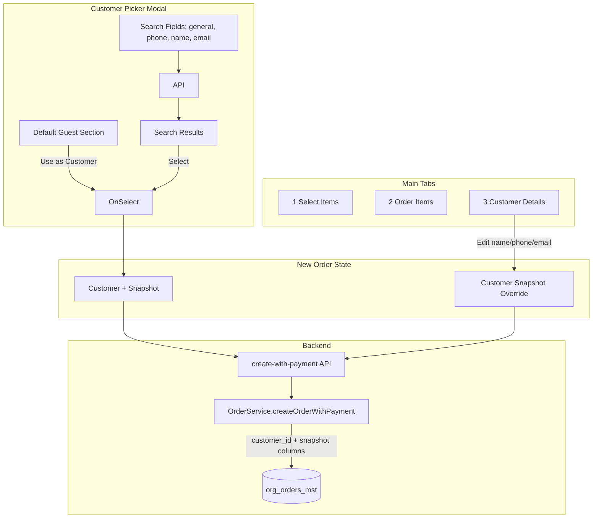

# New Order Screen – Customer Enhancements

## Data Flow Overview

---

## Phase 1: Database and Backend Foundation

### 1.1 Migration – org_orders_mst New Columns

Create [supabase/migrations/0125_add_order_customer_snapshot_columns.sql](supabase/migrations/0125_add_order_customer_snapshot_columns.sql):

- `is_default_customer` BOOLEAN DEFAULT false
- `customer_mobile_number` TEXT
- `customer_email` TEXT
- `customer_name` TEXT
- `customer_details` JSONB

Follow DB rules: max 30 chars for objects; add comments for audit.

### 1.2 Prisma Schema

Update [web-admin/prisma/schema.prisma](web-admin/prisma/schema.prisma) org_orders_mst model with the five new fields. Run `npx prisma generate`.

### 1.3 Tenant Settings

- Add `TENANT_DEFAULT_GUEST_CUSTOMER_ID` to `SETTING_CODES` in [web-admin/lib/services/tenant-settings.service.ts](web-admin/lib/services/tenant-settings.service.ts)
- Create API route `GET /api/v1/tenant-settings/default-guest-customer` that:
  - Resolves `TENANT_DEFAULT_GUEST_CUSTOMER_ID` via `getSettingValue`
  - If set, fetches customer from `org_customers_mst` (tenant filter) and returns `{ id, name, name2, displayName, phone, email }`
  - Returns 404 if not configured or customer not found

### 1.4 Order Service and API

- Extend [web-admin/lib/services/order-service.ts](web-admin/lib/services/order-service.ts) `createOrderWithPayment` input to accept: `isDefaultCustomer`, `customerMobile`, `customerEmail`, `customerName`, `customerDetails`
- Pass these to `prisma.org_orders_mst.create` in the `data` object
- Extend [web-admin/lib/validations/new-order-payment-schemas.ts](web-admin/lib/validations/new-order-payment-schemas.ts) `createWithPaymentRequestSchema` with optional: `customerMobile`, `customerEmail`, `customerName`, `isDefaultCustomer`, `customerDetails` (object)
- [web-admin/app/api/v1/orders/create-with-payment/route.ts](web-admin/app/api/v1/orders/create-with-payment/route.ts): pass new fields from validated input to OrderService

---

## Phase 2: Order State and Customer Snapshot

### 2.1 Types and State

- [web-admin/src/features/orders/model/new-order-types.ts](web-admin/src/features/orders/model/new-order-types.ts):
  - Add `OrderCustomerSnapshot` or extend `NewOrderState` with: `customerMobile`, `customerEmail`, `customerName`, `isDefaultCustomer`, `customerSnapshotOverride`
  - Add `SET_CUSTOMER_SNAPSHOT_OVERRIDE` action type
- [web-admin/src/features/orders/ui/context/new-order-reducer.ts](web-admin/src/features/orders/ui/context/new-order-reducer.ts):
  - `SET_CUSTOMER`: accept payload with `customer`, `customerName`, `customerMobile`, `customerEmail`, `customerName`, `isDefaultCustomer`; derive snapshot from customer when not default guest (API camelCase maps to DB snake_case: customer_mobile_number, customer_email, customer_name)
  - `SET_CUSTOMER_SNAPSHOT_OVERRIDE`: accept `{ name?, phone?, email? }` for order-only edits
- [web-admin/src/features/orders/hooks/use-new-order-state.ts](web-admin/src/features/orders/hooks/use-new-order-state.ts): add `setCustomerSnapshotOverride` helper

### 2.2 Customer Picker Modal – Default Guest Section

- [web-admin/src/features/orders/ui/customer-picker-modal.tsx](web-admin/src/features/orders/ui/customer-picker-modal.tsx):
  - Add top section above search: when `TENANT_DEFAULT_GUEST_CUSTOMER_ID` is configured, fetch customer via new API
  - Display card: ID, name, phone, email; button "Use as Customer"
  - **When not configured:** show text "No default guest customer setting" (EN) / "لا يوجد إعداد عميل افتراضي" (AR) via `newOrder.customerPicker.noDefaultGuestSetting` (section always visible)
  - On click: call `onSelectCustomer` with customer + `isDefaultCustomer: true`
  - RTL support; Cmx components per [.cursor/rules/web-admin-ui-imports.mdc](.cursor/rules/web-admin-ui-imports.mdc)

### 2.3 New Order Modals

- [web-admin/src/features/orders/ui/new-order-modals.tsx](web-admin/src/features/orders/ui/new-order-modals.tsx): when `onSelectCustomer` is called, pass full snapshot (customerMobile, customerEmail, customerName, isDefaultCustomer) to `state.setCustomer`

### 2.4 Order Submission

- [web-admin/src/features/orders/hooks/use-order-submission.ts](web-admin/src/features/orders/hooks/use-order-submission.ts): in `createWithPaymentBody`, add `customerMobile`, `customerEmail`, `customerName`, `isDefaultCustomer`, `customerDetails`
- Use `customerSnapshotOverride` when present; otherwise use state snapshot values

---

## Phase 3: Customer Details Tab

### 3.1 New Tab and Section

- [web-admin/src/features/orders/ui/new-order-content.tsx](web-admin/src/features/orders/ui/new-order-content.tsx):
  - Extend `activeTab` to `'select' | 'details' | 'customer'`
  - Add third tab "3) Customer Details" (visible only when `state.customer !== null`)
  - Tab content: `OrderCustomerDetailsSection`
- Create [web-admin/src/features/orders/ui/order-customer-details-section.tsx](web-admin/src/features/orders/ui/order-customer-details-section.tsx):
  - Form: name, phone, email (CmxInput)
  - Optional: address/notes (CmxTextarea)
  - Display: `customerSnapshotOverride` or base customer snapshot
  - On change: dispatch `SET_CUSTOMER_SNAPSHOT_OVERRIDE`
  - Note: "Changes apply to this order only, not to customer profile"
  - RTL, i18n, Cmx components

---

## Phase 4: Advanced Search Fields

### 4.1 API and Backend

- [web-admin/lib/services/customers.service.ts](web-admin/lib/services/customers.service.ts) `searchCustomersProgressive`:
  - Accept `searchPhone?: string`, `searchName?: string`, `searchEmail?: string`
  - When `searchPhone`: filter `phone.ilike.%...%`; when `searchName`: `first_name.ilike... or last_name.ilike... or display_name.ilike...`; when `searchEmail`: `email.ilike...`
  - Combine with AND when multiple; fall back to combined `search` when no specific fields
- [web-admin/app/api/v1/customers/route.ts](web-admin/app/api/v1/customers/route.ts): parse `searchPhone`, `searchName`, `searchEmail` from query params

### 4.2 Frontend Search

- [web-admin/lib/api/customers.ts](web-admin/lib/api/customers.ts) `searchCustomersForPicker`: extend params with `searchPhone`, `searchName`, `searchEmail`
- [web-admin/lib/hooks/use-customer-search.ts](web-admin/lib/hooks/use-customer-search.ts): accept new params; include in query key
- [web-admin/src/features/orders/ui/customer-picker-modal.tsx](web-admin/src/features/orders/ui/customer-picker-modal.tsx):
  - Add collapsible "Advanced search" with Phone, Name, Email fields
  - Min chars: phone 3, name 2, email 3
  - If any specific field has value, use field-specific search; else use combined `search`

---

## Phase 5: i18n and Reset Logic

### 5.1 Translations

Search existing keys in [web-admin/messages/en.json](web-admin/messages/en.json) and [web-admin/messages/ar.json](web-admin/messages/ar.json). Add only new keys:

- `newOrder.customerPicker.defaultGuest`, `useDefaultGuest`, `noDefaultGuestSetting` ("No default guest customer setting" / "لا يوجد إعداد عميل افتراضي"), `searchPhone`, `searchName`, `searchEmail`
- `newOrder.customerDetails.title`, `orderOnlyNote`
- Reuse: `common.phone`, `common.email`, `common.name`

### 5.2 Reset Order

- [web-admin/src/features/orders/ui/context/new-order-reducer.ts](web-admin/src/features/orders/ui/context/new-order-reducer.ts) `RESET_ORDER`: clear `customerSnapshotOverride`, `customerMobile`, `customerEmail`, `customerName`, `isDefaultCustomer`

### 5.3 API/DB Field Mapping

| API (camelCase)   | DB Column              |
| ----------------- | ---------------------- |
| customerMobile    | customer_mobile_number |
| customerEmail     | customer_email         |
| customerName      | customer_name          |
| customerDetails   | customer_details       |
| isDefaultCustomer | is_default_customer    |

---

## Best Practices Checklist

| Area         | Practice                                                               |
| ------------ | ---------------------------------------------------------------------- |
| Security     | Tenant filter on all queries; validate default guest belongs to tenant |
| Multitenancy | Every org_* query filters by `tenant_org_id`                           |
| UI           | Cmx only; imports from `.clauderc`                                     |
| i18n         | All new strings in en/ar; RTL                                          |
| Types        | No `any`; strict TypeScript                                            |
| Naming       | `OrderCustomerDetailsSection` (not report; no `-rprt` suffix)          |

---

## Gaps Addressed / Implementation Notes

### Security & Sanitization

- Sanitize snapshot fields before persist: use `sanitizeInput()` from [web-admin/lib/utils/security-helpers.ts](web-admin/lib/utils/security-helpers.ts) for `customerName`, `customerMobile`, `customerEmail` in order submission
- Default guest API: use `getTenantIdFromSession()`; verify customer `tenant_org_id` matches before returning

### Validation Schema (createWithPaymentRequestSchema)

- Add: `customerMobile: z.string().max(50).optional()`, `customerEmail: z.string().email().max(255).optional()`, `customerName: z.string().max(255).optional()`, `isDefaultCustomer: z.boolean().optional()`, `customerDetails: z.record(z.string(), z.unknown()).optional()`

### Default Guest API

- Route path: `app/api/v1/tenant-settings/default-guest-customer/route.ts` (new; no existing tenant-settings API)
- Use `createTenantSettingsService(await createServerSupabaseClient())` for auth context
- Check `is_active = true` when fetching customer from org_customers_mst

### Loading & Error States

- Default guest section: show skeleton/loading while fetching; on 404 or error, show `noDefaultGuestSetting`; on success, show card

### Keyboard & Accessibility

- Add Alt+3 shortcut for Customer Details tab when visible (in [new-order-content.tsx](web-admin/src/features/orders/ui/new-order-content.tsx) `useKeyboardNavigation`)
- Default guest button: focusable, aria-label from i18n

### Verification

- After all frontend changes: run `npm run build` in web-admin (per CLAUDE.md)

### customerSnapshotOverride Shape

- Use `{ name?, phone?, email? }` for override; on submit map to `customerName`, `customerMobile`, `customerEmail` (override takes precedence over base snapshot per field)

---

## Key Files Reference

| Purpose           | Path                                                                                        |
| ----------------- | ------------------------------------------------------------------------------------------- |
| Migration         | `supabase/migrations/0125_add_order_customer_snapshot_columns.sql`                          |
| Tenant settings   | `web-admin/lib/services/tenant-settings.service.ts`                                         |
| Default guest API | `web-admin/app/api/v1/tenant-settings/default-guest-customer/route.ts` (new)                |
| Order service     | `web-admin/lib/services/order-service.ts`                                                   |
| Customer picker   | `web-admin/src/features/orders/ui/customer-picker-modal.tsx`                                |
| New tab section   | `web-admin/src/features/orders/ui/order-customer-details-section.tsx` (new)                 |
| State/reducer     | `web-admin/src/features/orders/model/new-order-types.ts`, `ui/context/new-order-reducer.ts` |
| Submission        | `web-admin/src/features/orders/hooks/use-order-submission.ts`                               |

