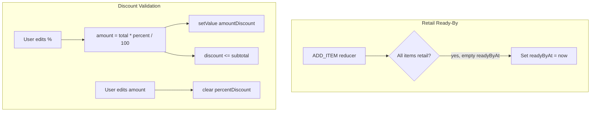

# New Order Retail and Discount Enhancements

## 1. Retail Order: Default Ready-By to Current Date/Time

### Context

- Retail orders (all items with `serviceCategoryCode === 'RETAIL_ITEMS'`) represent immediate POS sales; items are ready at purchase time.
- Currently, `readyByAt` starts empty and requires user to pick a future date. The Ready Date Picker validates `selectedDateTime > now`, and Order Summary requires `isFuture`.

### Implementation

**1.1 Set default ready-by when first retail item is added**

In `[new-order-reducer.ts](web-admin/src/features/orders/ui/context/new-order-reducer.ts)`:

- In the `ADD_ITEM` case, after adding the item, check if the basket is now retail-only (all items have `serviceCategoryCode === 'RETAIL_ITEMS'`).
- If so and `readyByAt` is empty, set `readyByAt` to `new Date().toISOString()`.
- Also handle `SET_ITEMS` (e.g. after custom item add or restore) to apply the same logic.

**1.2 Relax validation for retail orders**

- **ReadyDatePickerModal** (`[ready-date-picker-modal.tsx](web-admin/app/dashboard/orders/new/components/ready-date-picker-modal.tsx)`): Add prop `allowNow?: boolean`. When true (retail), treat `selectedDateTime >= now - 1 minute` as valid instead of `> now`.
- **OrderSummaryPanel** (`[order-summary-panel.tsx](web-admin/app/dashboard/orders/new/components/order-summary-panel.tsx)`): Add prop `isRetailOnlyOrder?: boolean`. In `readyByValidation`, when retail: `isFuture = readyByDate >= now - 60000` (allow "now" with 1‑min tolerance).
- **NewOrderContent** / **NewOrderModals**: Pass `isRetailOnlyOrder` into OrderSummaryPanel and ReadyDatePickerModal. Derive `isRetailOnlyOrder` from items (already computed in `new-order-modals.tsx`).

**1.3 Wire `isRetailOnlyOrder` into OrderSummaryPanel**

In `[new-order-content.tsx](web-admin/src/features/orders/ui/new-order-content.tsx)`, OrderSummaryPanel does not receive `retail` / `isRetailOnlyOrder`. Add `isRetailOnlyOrder` derived from `state.state.items` and pass it to OrderSummaryPanel. Use the same pattern as in `new-order-modals.tsx` (lines 89–92).

**1.4 ReadyDatePickerModal initial values for retail**

When opening the modal for a retail order with `readyByAt` already set to "now", the existing `initialDate` / `initialTime` from state will be used. No change needed.

---

## 2. Discount: Validation and Auto-Fill from Percentage

### Context

- Payment modal: `[payment-modal-enhanced-02.tsx](web-admin/app/dashboard/orders/new/components/payment-modal-enhanced-02.tsx)` is used (from `new-order-modals.tsx`).
- Schema: `[payment-form-schema.ts](web-admin/src/features/orders/model/payment-form-schema.ts)` enforces mutual exclusion of percent and amount.
- Server caps discount: `[order-calculation.service.ts](web-admin/lib/services/order-calculation.service.ts)` line 120: `Math.min(manualDiscount, subtotalRounded)`.

### 2.1 Discount must not exceed order total (subtotal)

**Client-side (payment modal)**

- Add validation that effective discount ≤ subtotal:
  - Percent: `(subtotal * percentDiscount / 100) <= subtotal` (always true for percent ≤ 100; real check is result ≤ subtotal).
  - Amount: `amountDiscount <= subtotal`.
- Since the schema is static, use one of:
  - **Option A**: Dynamic schema — create `getPaymentFormSchema(subtotal: number)` that adds a `.refine()` for discount ≤ subtotal.
  - **Option B**: Validate in the form `onChange` / submit handler and show error via `setError`.

**Recommended:** Option A — extend or wrap the schema so it receives `total` (subtotal) and refines:

- `(percentDiscount > 0) => (total * percentDiscount / 100) <= total`
- `(amountDiscount > 0) => amountDiscount <= total`

The payment modal receives `total` as a prop; create the schema/resolver with that value.

**Server-side**

- Already enforced in `order-calculation.service.ts` via `Math.min(manualDiscount, subtotalRounded)`.
- Add an explicit check in `[preview-payment](web-admin/app/api/v1/orders/preview-payment/route.ts)` and `[create-with-payment](web-admin/app/api/v1/orders/create-with-payment/route.ts)` for defense in depth (optional).

### 2.2 When discount percentage is edited, calculate and fill discount amount

**Current behavior:** Percent and amount are mutually exclusive; changing one clears the other.

**New behavior:** When the user edits the percent field:

1. Compute `amount = total * percentDiscount / 100`.
2. Set `amountDiscount` to that value (rounded per currency decimal places).
3. Keep `percentDiscount` as entered.
4. Both fields are populated; backend will use percent when both are present (see below).

**Schema and backend**

- Remove or relax the "cannot have both" refinement. Replace with: "when both set, use percent for calculation; amount is informational/derived."
- Ensure backend uses a single effective discount: `manualDiscount = percentDiscount > 0 ? (subtotal * percentDiscount / 100) : amountDiscount`.
  - Verify `[order-calculation.service.ts](web-admin/lib/services/order-calculation.service.ts)` lines 113–120: it currently _adds_ both. Change to use only one (prefer percent when > 0).

**UI change in payment-modal-enhanced-02**

- In the `percentDiscount` Controller `onChange`: compute `amount = (total * value) / 100`, then `setValue('amountDiscount', round(amount, decimalPlaces))`. Do not clear percent.
- In the `amountDiscount` `onChange`: keep clearing percent when amount is manually edited (user chooses amount mode).
- When the modal opens with `total`, use it for the percent→amount calculation.

---

## 3. Data Flow Summary

---

## 4. Files to Change

| File                                                                                                           | Changes                                                                                                      |
| -------------------------------------------------------------------------------------------------------------- | ------------------------------------------------------------------------------------------------------------ |
| `[new-order-reducer.ts](web-admin/src/features/orders/ui/context/new-order-reducer.ts)`                        | In ADD_ITEM and SET_ITEMS: when basket becomes retail-only and readyByAt empty, set readyByAt to now         |
| `[ready-date-picker-modal.tsx](web-admin/app/dashboard/orders/new/components/ready-date-picker-modal.tsx)`     | Add `allowNow` prop; when true, treat "now" as valid                                                         |
| `[new-order-modals.tsx](web-admin/src/features/orders/ui/new-order-modals.tsx)`                                | Pass `allowNow={isRetailOnlyOrder}` to ReadyDatePickerModal                                                  |
| `[order-summary-panel.tsx](web-admin/app/dashboard/orders/new/components/order-summary-panel.tsx)`             | Add `isRetailOnlyOrder` prop; when true, allow readyByDate >= now in validation                              |
| `[new-order-content.tsx](web-admin/src/features/orders/ui/new-order-content.tsx)`                              | Compute and pass `isRetailOnlyOrder` to OrderSummaryPanel                                                    |
| `[payment-form-schema.ts](web-admin/src/features/orders/model/payment-form-schema.ts)`                         | Add dynamic refine for discount ≤ subtotal; relax mutual exclusion to allow percent+derived amount           |
| `[payment-modal-enhanced-02.tsx](web-admin/app/dashboard/orders/new/components/payment-modal-enhanced-02.tsx)` | On percent change: compute and set amountDiscount; add discount ≤ total validation                           |
| `[order-calculation.service.ts](web-admin/lib/services/order-calculation.service.ts)`                          | Use percent OR amount (prefer percent when > 0), not both                                                    |
| `payment-modal-enhanced.tsx`                                                                                   | Same discount logic if still used elsewhere; otherwise confirm PaymentModalEnhanced02 is the only one in use |

---

## 5. i18n

- Add or reuse message keys for:
  - "Discount cannot exceed order total"
  - Any updated validation messages for ready-by when retail allows "now"

---

## 6. Edge Cases

- **Retail → Service:** If user removes all retail items and adds only service items, readyByAt stays as-is (no automatic clear). Optional: clear or recalc when basket becomes non-retail.
- **Empty basket:** No automatic readyByAt.
- **Discount with promo/gift card:** Validation is on manual discount only; promo/gift card have separate limits.
- **Currency decimals:** Use `decimalPlaces` from currency config when rounding discount amount.
