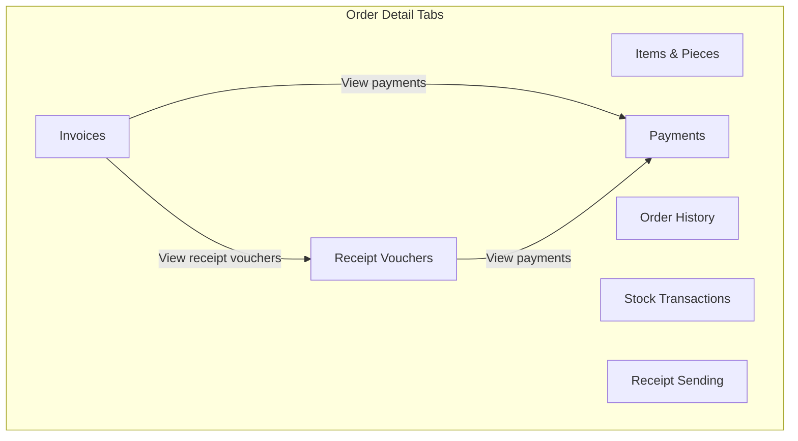

# Order Details Page Tabs Enhancement Plan

## Two Pages Strategy

| Page             | Route                         | Component                | Purpose                                                         |
| ---------------- | ----------------------------- | ------------------------ | --------------------------------------------------------------- |
| **Simple**       | `/dashboard/orders/[id]`      | `OrderDetailClient`      | Current layout unchanged; add optional "View full details" link |
| **Full details** | `/dashboard/orders/[id]/full` | `OrderDetailsFullClient` | New tabbed layout with all order-related data                   |

**No refactor of the simple page** — it stays as is. All enhancements live in the new full page.

## Current State (Simple Page)

- **Route:** `[/dashboard/orders/[id]](web-admin/app/dashboard/orders/[id]/page.tsx)`
- **Main component:** `[order-detail-client.tsx](web-admin/app/dashboard/orders/[id]/order-detail-client.tsx)`
- **Layout:** 2-column grid (left: customer, items, notes, photos; right: timeline, actions, payment details, unapplied payments, record deposit/POS)
- **Data fetched:** order, unappliedPayments, orderInvoices
- **Order statuses (terminal):** `closed`, `cancelled` (`[lib/types/workflow.ts](web-admin/lib/types/workflow.ts)`)

---

## 1. New Full Details Page Structure

**Route:** `web-admin/app/dashboard/orders/[id]/full/page.tsx`

**File layout:**

```
web-admin/app/dashboard/orders/[id]/
  page.tsx                    # Simple page (unchanged)
  order-detail-client.tsx     # Simple client (unchanged)
  full/
    page.tsx                  # Full page server component
    order-details-full-client.tsx  # Full client with tabs
    components/               # Tab panels (orders-*-tab-rprt.tsx)
```

**Simple page update (minimal):** Add a "View full details" link/button in the header that navigates to `/dashboard/orders/[id]/full`.

**Full page header:** Include a "Back to order" or "Simple view" link that navigates back to `/dashboard/orders/[id]`.

---

## 2. Status-Based Screen Control (Full Page Only)

**Terminal statuses:** `closed`, `cancelled`

| Status           | Hide/Disable                                                                                       |
| ---------------- | -------------------------------------------------------------------------------------------------- |
| closed           | Record deposit/POS section, Apply payment modal, Edit button (or show read-only edit)              |
| cancelled        | Same as closed + optional banner "Order was cancelled"                                             |
| closed/cancelled | Quick Actions panel shows empty state with message (e.g. "No actions available for closed orders") |

**Implementation:** In `order-details-full-client.tsx` only.

---

## 3. Tabbed Layout for Order-Related Data (Full Page)

Use the existing `[Tabs](web-admin/components/ui/Tabs.tsx)` component with URL-synced active tab via `?tab=<tabId>`.

**Tab structure (below the order header):**



**Tab definitions:**

| Tab ID     | Content                                           | Data Source                                  | Search/Filter                                                                       |
| ---------- | ------------------------------------------------- | -------------------------------------------- | ----------------------------------------------------------------------------------- |
| `items`    | OrderItemsList + OrderPiecesManager               | `order.org_order_items_dtl` (existing)       | —                                                                                   |
| `history`  | OrderTimeline                                     | org_order_history (existing)                 | —                                                                                   |
| `invoices` | Table of order invoices                           | `orderInvoices` (existing)                   | `?invoiceId=xxx` prefills search; "View payments" / "View receipt vouchers" buttons |
| `vouchers` | Receipt vouchers (org_fin_vouchers_mst) for order | New: `getVouchersForOrder(orderId)`          | `?voucherId=xxx`; "View payments" button                                            |
| `payments` | All payments for order                            | `getPaymentsForOrder` (existing)             | Search by invoice_id or voucher_id from URL                                         |
| `stock`    | Stock transactions (org_inv_stock_tr)             | New: `getStockTransactionsForOrder(orderId)` | reference_type='ORDER', reference_id=order_id                                       |
| `receipts` | Receipt sending (org_rcpt_receipts_mst)           | `ReceiptService.getReceipts`                 | order_id filter                                                                     |

---

## 4. Cross-Tab Navigation

**URL params:**

- `tab` — active tab id (items, history, invoices, vouchers, payments, stock, receipts)
- `invoiceId` — when navigating from Invoice tab to Payments or Receipt Vouchers
- `voucherId` — when navigating from Receipt Vouchers tab to Payments

**Flow:**

1. User on Invoices tab clicks "View payments" on invoice X → switch to Payments tab, set search filter `invoiceId=X`
2. User on Invoices tab clicks "View receipt vouchers" on invoice X → switch to Receipt Vouchers tab, set search filter `invoiceId=X` (vouchers linked via invoice_id)
3. User on Receipt Vouchers tab clicks "View payments" on voucher Y → switch to Payments tab, set search filter `voucherId=Y`

**Tabs component enhancement:**

- Extend `Tabs` to support controlled mode: `value` + `onChange` that sync with `useSearchParams` / `useRouter`
- Or create `OrderDetailTabs` wrapper that reads `tab` from URL, updates URL on tab change, and passes `defaultTab`/`onChange` to Tabs

---

## 5. Backend / Service Additions

**4.1 `getVouchersForOrder(orderId)`** — `[lib/services/voucher-service.ts](web-admin/lib/services/voucher-service.ts)`

```ts
export async function getVouchersForOrder(
  orderId: string,
): Promise<VoucherData[]>;
```

- Query `org_fin_vouchers_mst` where `order_id = orderId`, tenant-scoped
- Return voucher list with invoice_no, total_amount, status, voucher_no, etc.

**4.2 `getStockTransactionsForOrder(orderId)`** — `[lib/services/inventory-service.ts](web-admin/lib/services/inventory-service.ts)`

```ts
export async function getStockTransactionsForOrder(
  orderId: string,
): Promise<StockTransaction[]>;
```

- Query `org_inv_stock_tr` where `reference_type = 'ORDER'` and `reference_id = orderId`
- Include product info for display (product name, quantity, transaction_type, branch)
- Use Supabase client (inventory-service uses Supabase for org_inv_stock_tr)

**4.3 Receipts by order** — Already exists: `ReceiptService.getReceipts({ orderId, tenantId })`

---

## 5. Page Data Fetching

**New `[full/page.tsx](web-admin/app/dashboard/orders/[id]/full/page.tsx)`:**

- Same auth/tenant logic as simple page
- Fetch: order, unappliedPayments, orderInvoices, plus `getVouchersForOrder`, `getStockTransactionsForOrder`, `ReceiptService.getReceipts`
- Pass all data to `OrderDetailsFullClient`
- Consider lazy-loading heavy tabs (stock, receipts) via client-side fetch if preferred for performance

**Simple `page.tsx`:** No changes to data fetching.

---

## 6. Component Structure (Full Page)

**New components under `web-admin/app/dashboard/orders/[id]/full/`:**

| Component                       | Purpose                                                                                                                                                |
| ------------------------------- | ------------------------------------------------------------------------------------------------------------------------------------------------------ |
| `order-details-full-client.tsx` | Main full-details view: header, status controls, tabbed content                                                                                        |
| `order-detail-tabs.tsx`         | Wrapper: URL-synced tabs, passes tab + search params to children                                                                                       |
| `orders-invoices-tab-rprt.tsx`  | Invoices table with "View payments" / "View receipt vouchers" buttons per row                                                                          |
| `orders-vouchers-tab-rprt.tsx`  | Vouchers table with "View payments" button                                                                                                             |
| `orders-payments-tab-rprt.tsx`  | Payments table with search bar (invoiceId, voucherId)                                                                                                  |
| `orders-stock-tab-rprt.tsx`     | Stock transactions table (reuse patterns from `[stock-history-modal.tsx](web-admin/app/dashboard/inventory/stock/components/stock-history-modal.tsx)`) |
| `orders-receipts-tab-rprt.tsx`  | Receipt sending transactions (org_rcpt_receipts_mst)                                                                                                   |

**Naming:** Per rules, report-related components use `-rprt` suffix.

`**order-details-full-client.tsx` layout:

- Order header (same as simple, with back link to simple page or orders list)
- Customer card, notes, photos (compact or in first tab)
- Tabs: Items | History | Invoices | Receipt Vouchers | Payments | Stock | Receipts
- Payment summary in header or compact card; full payment ops in Payments tab
- Status-based control: hide record deposit/apply when closed/cancelled

---

## 7. UI/UX Details

- **Tab bar:** Use existing Tabs component; support RTL via `useRTL()` and direction-aware spacing
- **Empty states:** Each tab has empty state with icon + message (e.g. "No invoices for this order")
- **Loading:** Skeleton or spinner per tab when data is loading (if any tab uses client-side fetch)
- **Search bar (Payments tab):** Input for invoice ID or voucher ID; filter displayed payments
- **Search bar (Invoices tab):** Optional filter by invoice_no if many invoices
- **Accessibility:** `aria-label` on tab buttons, `aria-current="page"` on active tab
- **i18n:** Add keys under `orders.detail.tabs.` and `orders.detail.statusClosed`, etc.; search existing keys first

---

## 9. i18n Keys

Search `en.json` / `ar.json` for existing keys. Add as needed:

- `orders.detail.tabs.items`, `history`, `invoices`, `vouchers`, `payments`, `stock`, `receipts`
- `orders.detail.viewPayments`, `orders.detail.viewReceiptVouchers`
- `orders.detail.noActionsForClosedOrder`
- `orders.detail.statusClosed`, `orders.detail.statusCancelled` (if banner used)
- Empty states: `orders.detail.emptyInvoices`, `emptyVouchers`, `emptyPayments`, `emptyStock`, `emptyReceipts`
- `orders.detail.viewFullDetails` — for the link on the simple page

---

## 10. Implementation Order

1. **Services** — Add `getVouchersForOrder`, `getStockTransactionsForOrder`
2. **Full page route** — Create `[id]/full/page.tsx` and `order-details-full-client.tsx`
3. **Tabs wrapper + URL sync** — Extend Tabs for controlled mode; `OrderDetailTabs` with `?tab=`
4. **Page data** — Full page fetches vouchers, stock, receipts; pass to `OrderDetailsFullClient`
5. **Tab panels** — Create orders--tab-rprt.tsx (invoices, vouchers, payments, stock, receipts); reuse OrderItemsList, OrderTimeline for items/history tabs
6. **Status-based control** — In full page only: hide record deposit, apply payment, edit when closed/cancelled
7. **Cross-tab navigation** — Wire buttons to `router.replace` with `?tab=X&invoiceId=Y` or `?tab=payments&voucherId=Z`
8. **Simple page** — Add "View full details" link to `/dashboard/orders/[id]/full`
9. **i18n** — Add/update keys; run `npm run check:i18n`
10. **Build** — Run `npm run build` and fix errors

---

## 11. File Changes Summary

| File                                                                     | Action                                                                         |
| ------------------------------------------------------------------------ | ------------------------------------------------------------------------------ |
| `web-admin/lib/services/voucher-service.ts`                              | Add `getVouchersForOrder`                                                      |
| `web-admin/lib/services/inventory-service.ts`                            | Add `getStockTransactionsForOrder`                                             |
| `web-admin/app/dashboard/orders/[id]/page.tsx`                           | Add "View full details" link only (minimal change)                             |
| `web-admin/app/dashboard/orders/[id]/full/page.tsx`                      | **New** — Full page server component                                           |
| `web-admin/app/dashboard/orders/[id]/full/order-details-full-client.tsx` | **New** — Full client with tabs, status control                                |
| `web-admin/app/dashboard/orders/[id]/full/components/`                   | **New** — order-detail-tabs.tsx, orders--tab-rprt.tsx                          |
| `web-admin/components/ui/Tabs.tsx`                                       | Add optional controlled mode (`value`, `onChange`)                             |
| `web-admin/messages/en.json`, `ar.json`                                  | Add tab labels, buttons, empty states, "View full details"                     |
| `web-admin/app/actions/`                                                 | Optional: server actions for getVouchersForOrder, getStockTransactionsForOrder |

**Unchanged:** `order-detail-client.tsx` (simple page)
