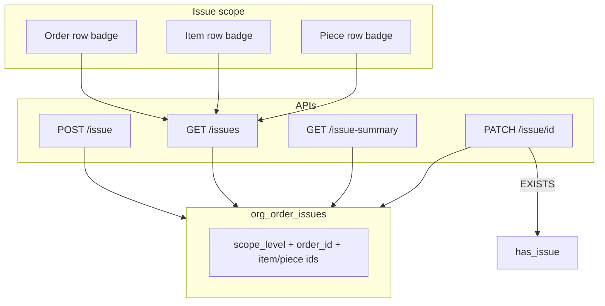

# Order Issues Enhancement — Full Scope (No Gaps)

## Decisions locked

- **Report ≠ Reject (1A):** Creating an issue never sets reject flags. Reject remains a separate QA/processing action.
- **Indicators on order + item + piece rows:** high-visibility red/green circle badges with white `!`. Click → issues list; unsolved → Solve → notes → auto `solved_by` / `solved_at`.
- **Add when no issues:** Badge hidden if zero issues; each level always has **Report issue**; list empty state has **Add issue**.
- **No dedicated issue RBAC:** auth-only (session + tenant) for create / list / summary / resolve.
- **Table rename (requested):** `org_order_item_issues` → **`org_order_issues`**, with full RLS / function / app / cleanup update in the same migration pack (see §1). No half-rename.
- **All previously deferred product gaps are in scope:** photo on report (optional field + basic upload if existing storage pattern exists, else URL field), `/dashboard/issues` queue, legacy pointer sync/clear, open-urgent warning on processing transitions.

---

## Architecture



**Scope matrix (DB CHECK `chk_order_issue_scope`):**

| `scope_level` | `order_id` | `order_item_id` | `order_item_piece_id` |
|---------------|------------|-----------------|------------------------|
| `ORDER` | required | NULL | NULL |
| `ITEM` | required | required | NULL |
| `PIECE` | required | required | required |

Validate piece ∈ item ∈ order and same `tenant_org_id` in service.

---

## 1. Schema — rename + refactor (new migrations only)

**Do not edit** `0021` / `0413`. New migration(s), e.g.:

- `0414_order_issues_rename_and_scope.sql` (depends on `0413`)

### 1.1 Rename + columns (single migration, ordered steps)

**Why rename breaks things if done carelessly:** RLS policies are attached to the table OID/name; rename moves policies with the table in PostgreSQL, but **policy names** and **all SQL/app references** to `org_order_item_issues` must be updated. Function bodies that hardcode the old name must be replaced. Cleanup snippets and KPI SQL must be updated.

**Safe sequence (no CASCADE):**

1. Drop dependent **views** that reference the old name (if any) with `DROP VIEW … RESTRICT`.
2. `ALTER TABLE org_order_item_issues RENAME TO org_order_issues;`
3. Rename constraints/indexes to `org_order_issues_*` / `idx_ord_issue_*` for clarity (optional but preferred).
4. Drop old RLS policy names and recreate on `org_order_issues`:
   - `DROP POLICY IF EXISTS tenant_isolation_org_order_item_issues ON org_order_issues;`
   - `DROP POLICY IF EXISTS tenant_isolation_issues ON org_order_issues;`
   - `CREATE POLICY tenant_isolation_org_order_issues ON org_order_issues FOR ALL USING (tenant_org_id = current_tenant_id()) WITH CHECK (tenant_org_id = current_tenant_id());`
5. Add columns:
   - `scope_level TEXT NOT NULL` + CHECK (`ORDER`|`ITEM`|`PIECE`)
   - `order_item_piece_id UUID NULL` FK → `org_order_item_pieces_dtl(id)` ON DELETE CASCADE
6. Backfill `scope_level`: NULL item → `ORDER`; else → `ITEM`.
7. Add `chk_order_issue_scope` (scope matrix).
8. Indexes: `(tenant_org_id, order_id, solved_at)`, partial open on item, partial open on piece; keep unresolved/priority indexes (renamed).
9. **Compatibility view (one release):**  
   `CREATE VIEW org_order_item_issues AS SELECT * FROM org_order_issues;`  
   Only if grep still finds SQL/snippets that cannot be updated in the same PR. Prefer updating all callers and **skipping the view** if the repo grep is clean after the app/snippet update. If view is created, document drop in follow-up migration after deploy.
10. Update comments on table/columns for order/item/piece semantics.

### 1.2 Functions (replace + better naming)

- `CREATE OR REPLACE FUNCTION has_unresolved_issues(p_order_item_id UUID)` — body queries **`org_order_issues`**, open if `order_item_id = p` OR piece under that item. **No RLS uses this function** (verified); REPLACE is safe.
- Also add convention-aligned alias:  
  `CREATE OR REPLACE FUNCTION org_ord_has_unresolved_issues(p_order_item_id UUID) …`  
  same body; keep grandfathered name for compatibility.
- Optionally add `org_ord_has_unresolved_order_issues(p_order_id UUID)` for order-level EXISTS (used by recompute if desired).

### 1.3 Callers that must be updated in the same change set

| Area | Action |
|------|--------|
| Prisma `schema.prisma` | Model `org_order_issues` (`@@map` if needed) |
| `database.ts` / `database.generated.ts` | Table + Relationships rename |
| [`order-service.ts`](web-admin/lib/services/order-service.ts) | `.from('org_order_issues')` |
| Any KPI / dashboard SQL or IssuesWidget queries | New table name |
| [`cleanup_all_order_data_*.sql`](supabase/snippets/cleanup_all_order_data_all_tenants_or_one_tenant_fixed.sql) | Delete from `org_order_issues` |
| Grandfathered-objects docs | Note rename + new alias |
| Tests mocking table name | Update |

### 1.4 Flag recompute + legacy pointers

```sql
UPDATE org_orders_mst
SET has_issue = EXISTS (
  SELECT 1 FROM org_order_issues i
  WHERE i.tenant_org_id = $tenant AND i.order_id = $order AND i.solved_at IS NULL
)
WHERE id = $order AND tenant_org_id = $tenant;
```

- Never set reject flags on create/solve.
- **Pointers in scope:** on create (item/piece), set `item_issue_id` / piece `issue_id` to latest open issue id; on solve when no open left for that entity, clear pointer; order `issue_id` = latest open order-scoped issue or null. UI still uses list/summary counts, not pointers alone.

**Prisma + generated types:** full rename + `scope_level` + `order_item_piece_id`.

---

## 2. Backend / API

| Endpoint | Behavior |
|----------|----------|
| `POST /api/v1/orders/[id]/issue` | Create with scope; legacy body OK; hierarchy validation; recompute `has_issue`; **no reject**; `ISSUE_CREATED` |
| `GET /api/v1/orders/[id]/issues` | List with `includeChildren` default true for parents; `status`; return rows + `{ openCount, totalCount }` |
| `GET /api/v1/orders/[id]/issue-summary` | Order + per-item + per-piece `{ open, total }` for badges |
| `PATCH /api/v1/orders/[id]/issue/[issueId]` | Solve with notes (min 3); 409 if already solved; recompute; `ISSUE_SOLVED` |
| Optional `GET /api/v1/orders/issues` (tenant queue) | Paginated open/solved for `/dashboard/issues` |

Stable error codes: `ISSUE_SCOPE_INVALID`, `ISSUE_HIERARCHY_MISMATCH`, `ISSUE_ALREADY_SOLVED`, etc.

Auth-only + CSRF on mutations; document in [`orders-access.ts`](web-admin/src/features/orders/access/orders-access.ts).

Constants: `ORDER_ISSUE_SCOPE`, codes, priorities — DB-mirror strings.

---

## 3. UI/UX

### Shared (`web-admin/src/features/orders/ui/issues/` or `workflow/ui/issues/`)

1. **`OrderIssueStatusBadge`** — 20–24px saturated red/green circle + white `!`; hidden if total=0; click → list.
2. **`OrderIssuesListDialog`** — list + Solve + always **Add issue**; empty state CTA.
3. **`OrderIssueSolveDialog`** — `solved_notes` required; cmxMessage; refresh.
4. **`OrderIssueReportDialog`** — scope from entry point; optional photo (URL or existing upload helper); EN/AR.

### Wire everywhere

| Surface | Report always | Badge when total>0 |
|---------|---------------|--------------------|
| Processing table OrderRow + card | Yes | Yes (open/total) |
| Full Processing item/piece rows | Yes | Yes |
| Simple Processing header + item/piece rows | Yes | Yes |
| `/dashboard/issues` queue | N/A (row actions) | Status column |

Aggregation: parent red if any open in subtree; green if total>0 and open=0.

Processing filter: **Has open issues** (`has_issue = true`).

Nested dialogs: one child at a time; block dismiss while pending; invalidate React Query after mutate.

**Open urgent warning (in scope):** when transitioning processing/QA with open `priority = urgent` issues, show confirm via `cmxMessage.confirm` / `CmxConfirmDialog` (warn, do not hard-block unless easy to add flag) — document as soft gate.

### i18n

`messages/en|ar` — processing + `orders/issues` namespace; `npm run check:i18n`.

---

## 4. Issues queue page (fix KPI gap)

- [`IssuesWidget`](web-admin/src/features/dashboard/ui/widgets/IssuesWidget.tsx) currently links to `/issues` with no route → add **`/dashboard/issues`** (or `/dashboard/processing/issues`) with list of open/solved issues, link to order, solve action.
- Auth-only page gate matching processing access pattern; access contract + nav dual-write if sidebar entry is added.
- Query new table `org_order_issues`.

---

## 5. QA reject split

[`qa/[id]/page.tsx`](web-admin/app/dashboard/qa/[id]/page.tsx): after `createIssue`, explicitly set `item_is_rejected` / order reject fields as today intended — **not** inside `createIssue`.

---

## 6. Production readiness — all bugs in scope

| Gap / bug | Mitigation (in scope) |
|-----------|------------------------|
| Wrong table name (`item` only) | **Rename** to `org_order_issues` + update all callers |
| RLS after rename | Drop old policy names; recreate `tenant_isolation_org_order_issues` |
| Piece scope missing | `order_item_piece_id` + CHECK + UI |
| Report = Reject | createIssue never rejects |
| Missing resolve/list/summary APIs | Ship all three + queue API |
| Green badge impossible | open + total counts |
| List misses children | `includeChildren` default true |
| Legacy body | Derive `scopeLevel` |
| `has_issue` race | EXISTS UPDATE |
| Opaque 400 | Stable error codes + server log |
| CSRF | On POST/PATCH |
| Badge-only entry | Always Report + empty Add |
| Simple Processing unwired | Explicit wire |
| Helper stale after piece | REPLACE `has_unresolved_issues` + add `org_ord_*` alias |
| Legacy pointers drift | Sync/clear on create/solve |
| KPI dead link | `/dashboard/issues` page |
| Photo unused | Optional photo on report dialog |
| Urgent ignored | Soft confirm before stage transition |
| Cleanup SQL stale | Update snippet table name |
| Docs / grandfathered list | Update |

**Nothing intentionally deferred** for this feature pack.

---

## 7. Implementation sequence

1. Grep all `org_order_item_issues` references; prepare rename migration with RLS recreate + function replace + optional compatibility view.
2. Apply types/Prisma/service to `org_order_issues`.
3. APIs + Zod + constants + access contract.
4. Shared UI + i18n.
5. Wire processing (list + Simple + Full) + filter + soft urgent confirm.
6. QA reject split + pointer sync.
7. Issues queue page + IssuesWidget link + nav if needed.
8. Update cleanup snippet + grandfathered docs.
9. Tests + `check:i18n` + eslint on touched UI.
10. **Stop for user to apply migration** (never auto-apply).

---

## Key files

- `supabase/migrations/0414_order_issues_rename_and_scope.sql` (new)
- [`web-admin/lib/services/order-service.ts`](web-admin/lib/services/order-service.ts)
- APIs under `web-admin/app/api/v1/orders/[id]/` + optional tenant issues list
- UI: processing-table, processing-item-row, processing-piece-row, simple-processing-dialog, new issues/* components, new dashboard issues page
- [`orders-access.ts`](web-admin/src/features/orders/access/orders-access.ts)
- Prisma + `database.ts` / `database.generated.ts`
- Cleanup snippet + IssuesWidget
