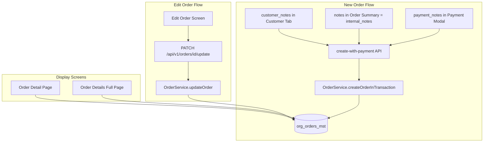

# Order Notes Fields Enhancement Plan

## Current State Summary

**Database**: All 4 fields already exist in `org_orders_mst`:

- `customer_notes`, `payment_notes` (0001_core_schema.sql)
- `cancelled_note`, `return_reason` (0129_add_order_cancel_and_return_columns.sql)

**Gaps identified**:

1. **customer_notes**: No dedicated field in customer tab; current "notes" in order summary maps to customerNotes on create, but edit loads merged `internal_notes ?? customer_notes` and update only writes to `internal_notes`
2. **payment_notes**: Not in payment modal, create-with-payment schema, or payment-service
3. **cancelled_note, return_reason**: Used in cancel/return dialogs but not displayed in order detail page or order details full page
4. **Edit flow**: API returns merged `notes`; update schema has only `notes` (maps to internal_notes); no customer_notes or payment_notes support

---

## Phase 1: Data Layer and Validation

### 1.1 Validation Schemas

- `**[web-admin/lib/validations/edit-order-schemas.ts](web-admin/lib/validations/edit-order-schemas.ts)`: Add `customerNotes`, `paymentNotes` to `updateOrderInputSchema` (keep `notes` for internal_notes)
- `**[web-admin/lib/validations/new-order-payment-schemas.ts](web-admin/lib/validations/new-order-payment-schemas.ts)`: Add `paymentNotes` to `createWithPaymentRequestSchema`
- `**[web-admin/src/features/orders/model/payment-form-schema.ts](web-admin/src/features/orders/model/payment-form-schema.ts)`: Add `paymentNotes` to payment form schema

### 1.2 Order Service and APIs

- `**[web-admin/lib/services/order-service.ts](web-admin/lib/services/order-service.ts)`:
  - `CreateOrderParams`: Add `paymentNotes` (already has `customerNotes`)
  - `createOrderInTransaction`: Pass `payment_notes` to Supabase insert
  - `updateOrder`: Map `customerNotes` → `customer_notes`, `paymentNotes` → `payment_notes`, `notes` → `internal_notes`
- `**[web-admin/app/api/v1/orders/create-with-payment/route.ts](web-admin/app/api/v1/orders/create-with-payment/route.ts)`: Add `paymentNotes: input.paymentNotes` to `createOrderParams`
- `**[web-admin/app/api/v1/orders/[id]/route.ts](web-admin/app/api/v1/orders/[id]/route.ts)`: Return `customer_notes`, `internal_notes`, `payment_notes` separately (not merged into `notes`) for edit screen
- `**[web-admin/lib/services/payment-service.ts](web-admin/lib/services/payment-service.ts)`: When recording payment, update `payment_notes` on `org_orders_mst` when provided

---

## Phase 2: New Order Screen

### 2.1 State and Types

- `**[web-admin/src/features/orders/model/new-order-types.ts](web-admin/src/features/orders/model/new-order-types.ts)`: Add `customerNotes: string` to `NewOrderState`; add `SET_CUSTOMER_NOTES` action; extend `LOAD_ORDER_FOR_EDIT` payload with `customerNotes`, `paymentNotes`, `internalNotes`
- `**[web-admin/src/features/orders/ui/context/new-order-reducer.ts](web-admin/src/features/orders/ui/context/new-order-reducer.ts)`: Handle `SET_CUSTOMER_NOTES`; update `LOAD_ORDER_FOR_EDIT` to set `customerNotes`, `paymentNotes`, `notes` (internal)

### 2.2 Customer Tab

- `**[web-admin/src/features/orders/ui/order-customer-details-section.tsx](web-admin/src/features/orders/ui/order-customer-details-section.tsx)`: Add `customerNotes` textarea (CmxTextarea) with label from i18n `newOrder.customerDetails.customerNotes`

### 2.3 Payment Modal

- `**[web-admin/src/features/orders/ui/payment-modal-enhanced-02.tsx](web-admin/src/features/orders/ui/payment-modal-enhanced-02.tsx)`: Add `paymentNotes` textarea to form; include in `onSubmit` payload
- `**[web-admin/src/features/orders/ui/new-order-modals.tsx](web-admin/src/features/orders/ui/new-order-modals.tsx)`: Pass `paymentNotes` from payment modal to submission; load/save `paymentNotes` in edit mode

### 2.4 Order Summary and Submission

- `**[web-admin/src/features/orders/ui/order-summary-panel.tsx](web-admin/src/features/orders/ui/order-summary-panel.tsx)`: Keep existing "notes" for internal_notes (staff); wire to `state.notes`
- `**[web-admin/src/features/orders/hooks/use-order-submission.ts](web-admin/src/features/orders/hooks/use-order-submission.ts)`:
  - Create: Send `customerNotes: state.customerNotes ?? state.notes`, `paymentNotes` from payment payload
  - Edit: Send `customerNotes`, `paymentNotes`, `notes` (internal) in update body

---

## Phase 3: Edit Order Screen

- `**[web-admin/src/features/orders/ui/edit-order-screen.tsx](web-admin/src/features/orders/ui/edit-order-screen.tsx)`: Load `customer_notes`, `internal_notes`, `payment_notes` from `initialOrderData`; pass to `LOAD_ORDER_FOR_EDIT` as `customerNotes`, `notes` (internal), `paymentNotes`
- `**[web-admin/app/api/v1/orders/[id]/update/route.ts](web-admin/app/api/v1/orders/[id]/update/route.ts)`: No change (uses edit-order-schemas)
- `**[web-admin/app/api/v1/orders/[id]/batch-update/route.ts](web-admin/app/api/v1/orders/[id]/batch-update/route.ts)`: Ensure it supports `customerNotes`, `paymentNotes` if used

---

## Phase 4: Order Details and Display Screens

### 4.1 Order Detail Page

- `**[web-admin/app/dashboard/orders/[id]/order-detail-client.tsx](web-admin/app/dashboard/orders/[id]/order-detail-client.tsx)`\*\*:
  - Add `payment_notes` to Notes section (customer_notes, internal_notes, payment_notes)
  - Add "Cancellation / Return" section when `cancelled_at` or `returned_at` is set: display `cancelled_note`, `return_reason`, dates, and who performed the action

### 4.2 Order Details Full Page

- `**[web-admin/app/dashboard/orders/[id]/full/order-details-full-client.tsx](web-admin/app/dashboard/orders/[id]/full/order-details-full-client.tsx)**`: Add `cancelled_note`, `return_reason`, `cancelled_at`, `returned_at` to a "Cancellation & Return" section (or extend "notes" / "other" section)

### 4.3 Other Order Screens

- `**[web-admin/app/dashboard/processing/page.tsx](web-admin/app/dashboard/processing/page.tsx)**`: Already uses `customer_notes || internal_notes` for notes; no change needed
- `**[web-admin/src/features/orders/ui/order-details-print.tsx](web-admin/src/features/orders/ui/order-details-print.tsx)**`: Add customer_notes, payment_notes, cancelled_note, return_reason if not already present
- **Workflow screens** (ready, processing, etc.): Audit for any order data display; add notes fields where relevant

---

## Phase 5: i18n and Types

- `**[web-admin/messages/en.json](web-admin/messages/en.json)`**, `**[web-admin/messages/ar.json](web-admin/messages/ar.json): Add/verify keys:
  - `newOrder.customerDetails.customerNotes`
  - `newOrder.payment.paymentNotes`
  - `orders.detail.paymentNotes`, `orders.detail.cancelledNote`, `orders.detail.returnReason`, `orders.detail.cancelledAt`, `orders.detail.returnedAt`
- `**[web-admin/types/order.ts](web-admin/types/order.ts)`: Ensure `cancelled_note`, `return_reason`, `cancelled_at`, `returned_at` are in Order interface (already present per schema)

---

## Phase 6: Payment Flow Integration

- `**[web-admin/lib/services/payment-service.ts](web-admin/lib/services/payment-service.ts)`: When `recordPaymentTransaction` or equivalent updates `org_orders_mst`, include `payment_notes` when provided in the payment input
- `**[web-admin/app/actions/payments/process-payment.ts](web-admin/app/actions/payments/process-payment.ts)` (if used): Ensure payment notes are passed through

---

## Data Flow Diagram

---

## Implementation Order

1. Validation schemas and types
2. Order service and API changes (create, update, GET for edit)
3. New order: state, reducer, customer tab, payment modal, submission
4. Edit order: load and save customer_notes, payment_notes, internal_notes
5. Order detail and full pages: display all four fields
6. Payment service: payment_notes on record
7. i18n keys
8. Run `npm run build` and fix lint/type errors
9. Manual QA: new order, edit order, cancel, return, view details

---

## Files to Modify (Summary)

| Area       | Files                                                                                                                                                                                             |
| ---------- | ------------------------------------------------------------------------------------------------------------------------------------------------------------------------------------------------- |
| Validation | `edit-order-schemas.ts`, `new-order-payment-schemas.ts`, `payment-form-schema.ts`                                                                                                                 |
| Services   | `order-service.ts`, `payment-service.ts`                                                                                                                                                          |
| APIs       | `create-with-payment/route.ts`, `[id]/route.ts`, `[id]/update/route.ts`                                                                                                                           |
| New order  | `new-order-types.ts`, `new-order-reducer.ts`, `order-customer-details-section.tsx`, `payment-modal-enhanced-02.tsx`, `new-order-modals.tsx`, `use-order-submission.ts`, `order-summary-panel.tsx` |
| Edit order | `edit-order-screen.tsx`                                                                                                                                                                           |
| Display    | `order-detail-client.tsx`, `order-details-full-client.tsx`, `order-details-print.tsx`                                                                                                             |
| i18n       | `en.json`, `ar.json`                                                                                                                                                                              |

---

## No Database Migration Required

All columns exist. No new migration needed.
