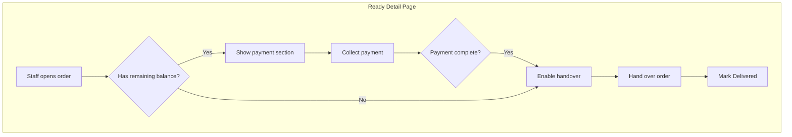

# Order Ready Page - Completion Plan

## Current State

The ready flow exists but is incomplete:

- **List page** (`[web-admin/app/dashboard/ready/page.tsx](web-admin/app/dashboard/ready/page.tsx)`): Shows order cards with order_no, customer, rack, total. No payment status.
- **Detail page** (`[web-admin/app/dashboard/ready/[id]/page.tsx](web-admin/app/dashboard/ready/[id]/page.tsx)`): Shows items, pieces, total, rack, and "Mark Delivered" / "Print Receipt". No payment collection or payment status.
- **Order state API** (`[web-admin/app/api/v1/orders/[id]/state/route.ts](web-admin/app/api/v1/orders/[id]/state/route.ts)`): Returns order, items, allowed transitions. Does not include payment summary or invoice data.
- **Workflow**: ready -> delivered (no payment blocker today).

Existing building blocks:

- `PaymentService.getPaymentStatus(orderId)` returns `{ status, total, paid, remaining }`
- `PaymentService.getPaymentsForOrder(orderId)` for payment history
- `InvoiceService.getInvoicesForOrder(orderId)` for invoices
- `RecordPaymentClient` (`[record-payment-client.tsx](web-admin/app/dashboard/billing/invoices/[id]/record-payment-client.tsx)`) - reusable payment form
- `processPayment` server action supports order_id and creates invoice on first payment if needed

---

## Recommended Flow (Best Practice)

**Principles:**

1. **Collect-before-handover (recommended)**: Collect remaining payment on the ready screen before marking as delivered. Optional tenant setting to allow handover without full payment (e.g. credit customers).
2. **Single-screen flow**: Payment + handover on the same page to avoid context switching.
3. **Clear status**: Show paid/partial/pending and remaining balance prominently.
4. **Reuse existing services**: Use `RecordPaymentClient` + `processPayment` + `getPaymentStatus`.

---

## Implementation Plan

### 1. Extend order state API with payment data

**File:** `[web-admin/app/api/v1/orders/[id]/state/route.ts](web-admin/app/api/v1/orders/[id]/state/route.ts)`

- Import and call `PaymentService.getPaymentStatus(orderId)` (server-side, tenant-scoped).
- Import `getInvoicesForOrder` to resolve primary invoice for the order.
- Add to response:
  - `paymentSummary: { status, total, paid, remaining }`
  - `primaryInvoiceId: string | null` (first invoice for order, or null if none yet)
- Ensure tenant context is available (already present via `getAuthContext`).

### 2. Create server action for ready-order payment context

**File:** `web-admin/app/actions/orders/ready-order-actions.ts` (new)

- `getReadyOrderPaymentContext(orderId)`:
  - Calls `getPaymentStatus(orderId)` and `getInvoicesForOrder(orderId)`.
  - Returns `{ paymentSummary, primaryInvoice, payments }` for use in the ready detail page.
- Reuses existing invoice/payment services and tenant context.

### 3. Enhance Ready Detail Page

**File:** `[web-admin/app/dashboard/ready/[id]/page.tsx](web-admin/app/dashboard/ready/[id]/page.tsx)`

- Fetch payment context (via new action or extended state API).
- Extend `ReadyOrder` type with `paymentSummary` and `primaryInvoiceId`.
- Add payment section in the right column:
  - Show total, paid, remaining balance (highlight when remaining > 0).
  - When `remaining > 0`:
    - Embed `RecordPaymentClient` (or a slim variant) with `orderId`, `invoiceId` (if any), `remainingBalance`.
    - Wire to `processPayment` action.
    - On successful payment, refresh order state and re-enable "Mark Delivered" if blocked.
  - When `remaining === 0`: Show "Paid in full" and enable handover.
- **Payment-before-handover (optional)**:
  - Add `requiresPaymentBeforeHandover` check (e.g. from tenant settings or env).
  - If true and `remaining > 0`: disable "Mark Delivered" until paid; show a short message.
  - If false: allow handover with remaining balance (e.g. credit customers).
- Order actions layout:
  1. Payment section (when remaining > 0)
  2. Mark Delivered (enabled when allowed by payment rule)
  3. Print Receipt
- Add i18n keys for payment section under `workflow.ready`.

### 4. Add payment status to Ready list page

**File:** `[web-admin/app/dashboard/ready/page.tsx](web-admin/app/dashboard/ready/page.tsx)`

- Extend orders API/response to include `payment_status` and `paid_amount` (or `remaining`).
- In list cards, show:
  - Payment badge: Paid / Partial / Pending
  - Remaining balance when > 0 (e.g. "Balance: X OMR")
- Ensures staff see which orders need payment at a glance.

### 5. API / data changes for list page

- `[web-admin/app/api/v1/orders/route.ts](web-admin/app/api/v1/orders/route.ts)` (or screen orders hook) already returns `payment_status`, `paid_amount` for list views.
- Verify `useScreenOrders` / list API includes these fields; if not, add them to the select and pass through to the list page.

### 5a. Add search and sort to orders API and Ready list page

**Goal:** Allow staff to search and sort ready orders by order and customer data for quick lookup at the counter.

**API changes** – `[web-admin/app/api/v1/orders/route.ts](web-admin/app/api/v1/orders/route.ts)`:

- **Search (`search` query param):** Text search across:
  - Order: `order_no`
  - Customer: `name`, `name2`, `phone`, `email` (via `org_customers_mst` and `sys_customers_mst`)
- Implement via Supabase `or` filter with `ilike` on order_no and joined customer fields. Supabase PostgREST supports filtering on embedded resources. If native nested `or` is cumbersome, consider a DB RPC (e.g. `search_orders_ready`) that accepts search term and returns order ids for tenant—then filter by `id.in.(...)`.
- **Sort (`sort_by`, `sort_order` params):**
  - `sort_by`: `order_no` | `received_at` | `ready_by` | `created_at` | `total`
  - `sort_order`: `asc` | `desc`
  - Default: `received_at` desc (or `ready_by` asc for ready screen)
- **Date filters (optional for Ready):**
  - `received_from`, `received_to` – filter by order/received date
  - `ready_by_from`, `ready_by_to` – filter by ready-by date range

**Hook changes** – `[web-admin/lib/hooks/use-screen-orders.ts](web-admin/lib/hooks/use-screen-orders.ts)`:

- Accept `search`, `sortBy`, `sortOrder`, `receivedFrom`, `receivedTo`, `readyByFrom`, `readyByTo` in `additionalFilters` (or extend `UseScreenOrdersOptions`).
- Forward these as query params to `/api/v1/orders`.

**Ready list UI** – `[web-admin/app/dashboard/ready/page.tsx](web-admin/app/dashboard/ready/page.tsx)`:

- Add a compact toolbar above the cards:
  - **Search input** – placeholder: "Search by order #, customer name, phone, email..." – debounced (e.g. 300ms), passed to `useScreenOrders`.
  - **Sort dropdown** – options: Order #, Order date (received_at), Ready by, Total; ascending/descending toggle or dropdown.
  - **Date range (optional)** – "Order date" from/to or "Ready by" from/to for quick filtering.
- Ensure RTL-friendly layout for Arabic.

**i18n keys** (add under `workflow.ready` or `common`):

- `searchPlaceholder`: "Search by order #, name, phone, email..."
- `sortBy.orderNo`: "Order #"
- `sortBy.receivedAt`: "Order date"
- `sortBy.readyBy`: "Ready by"
- `sortBy.total`: "Total"
- `sortOrder.asc`: "Ascending"
- `sortOrder.desc`: "Descending"
- `filters.dateRange`: "Date range"

### 6. i18n

**Files:** `web-admin/messages/en.json`, `web-admin/messages/ar.json`

- Add under `workflow.ready`:
  - `paymentSection.title`: "Payment"
  - `paymentSection.paidInFull`: "Paid in full"
  - `paymentSection.remainingDue`: "Balance due"
  - `paymentSection.collectBeforeHandover`: "Collect payment before handover"
  - `paymentStatus.paid`: "Paid"
  - `paymentStatus.partial`: "Partial"
  - `paymentStatus.pending`: "Pending"
- Reuse existing keys from invoices/orders where applicable (e.g. `orders.detail.balance`, `orders.detail.paidAmount`).

### 7. Tenant setting (optional, Phase 2)

- Add `require_payment_before_handover: boolean` to tenant settings.
- Use in ready detail page to gate "Mark Delivered" when remaining > 0.
- Default: `true` for most laundries; `false` for credit accounts.

---

## UX Sketch

**Ready list:** Toolbar with **search** (order #, customer name, phone, email) and **sort** (order #, order date, ready by, total). Each card shows order_no, customer, rack, total, **payment badge**, and **remaining balance** when > 0.

**Ready detail:**

| Left column          | Right column                           |
| -------------------- | -------------------------------------- |
| Order items + pieces | **Payment** (total / paid / remaining) |
| Total amount         | Record payment form (if remaining > 0) |
| Rack location        | Mark Delivered                         |
|                      | Print Receipt                          |

**Flow:** Staff opens order -> sees payment status -> collects remaining payment if any -> hands over -> clicks "Mark Delivered" -> optionally prints receipt.

---

## Files to Create

- `web-admin/app/actions/orders/ready-order-actions.ts`

## Files to Modify

- `web-admin/app/api/v1/orders/[id]/state/route.ts` - add payment summary
- `web-admin/app/api/v1/orders/route.ts` - add search, sort_by, sort_order, date filters
- `web-admin/lib/hooks/use-screen-orders.ts` - pass search, sort, date params to API
- `web-admin/app/dashboard/ready/[id]/page.tsx` - payment section + handover logic
- `web-admin/app/dashboard/ready/page.tsx` - payment badge, remaining on cards, search/sort toolbar
- `web-admin/messages/en.json` - new keys
- `web-admin/messages/ar.json` - new keys

## Dependencies

- No new DB migrations.
- Reuses `processPayment`, `RecordPaymentClient`, `getPaymentStatus`, `getInvoicesForOrder`, `getPaymentsForOrder`.

---

## Suggestions

1. **Collect payment first**: Design so payment is collected on the ready screen before handover. This matches typical laundry flows and reduces unpaid orders.
2. **Optional enforcement**: Add a tenant flag `require_payment_before_handover` so credit customers can still receive orders with balance due.
3. **Print after payment**: Consider "Print Receipt" after a successful payment to give customer a receipt.
4. **Barcode / order lookup**: If applicable, add quick lookup by order number for counter staff.
5. **Digital receipt**: Link to digital receipt feature if/when available for email/SMS.
