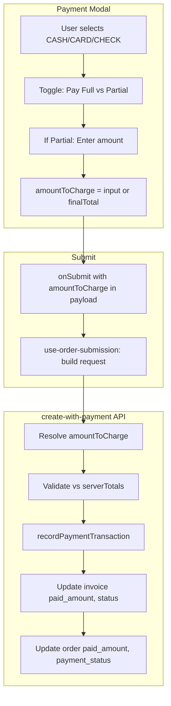

# Partial Payment in New Order

## Current State

- **Payment modal** ([payment-modal-enhanced-02.tsx](web-admin/src/features/orders/ui/payment-modal-enhanced-02.tsx)): Always passes `amountToCharge: totals.finalTotal` on submit (line 395). No UI for partial amount.
- **Schema** ([new-order-payment-schemas.ts](web-admin/lib/validations/new-order-payment-schemas.ts)): `amountToCharge` already validated as `<= totals.finalTotal` (lines 44-51).
- **create-with-payment API** ([route.ts](web-admin/app/api/v1/orders/create-with-payment/route.ts)): Does **not** accept `amountToCharge`; always uses `serverTotals.finalTotal` for `paid_amount`, invoice status, and order `payment_status` (lines 263, 293-294, 306-307).
- **Invoice/order status**: `payment-service`, `invoice-service`, and Prisma already support `partial` status when paid_amount < total.
- **Submission hook** ([use-order-submission.ts](web-admin/src/features/orders/hooks/use-order-submission.ts)): Receives `payload.amountToCharge` but does not pass it to the API (request body only includes `clientTotals` for mismatch validation).

---

## Target Behavior

When the user selects an **immediate payment method** (CASH, CARD, or CHECK):

1. **Default**: Pay full amount (current behavior).
2. **Option**: Toggle "Pay partial amount" and enter the amount to charge now (0 to final total).
3. **Display**: Show "Remaining due: X" when partial.
4. **API**: Record the entered amount as `paid_amount`; set invoice/order status to `partial` when amount < total, `paid` when amount >= total.

---

## Implementation Plan

### 1. API: Add amountToCharge Support

**File**: [web-admin/app/api/v1/orders/create-with-payment/route.ts](web-admin/app/api/v1/orders/create-with-payment/route.ts)

- Add `amountToCharge` to `createWithPaymentRequestSchema` in [new-order-payment-schemas.ts](web-admin/lib/validations/new-order-payment-schemas.ts) (optional, defaults to `clientTotals.finalTotal` for backward compatibility).
- In `create-with-payment` route:
  - Resolve `amountToCharge` = `input.amountToCharge ?? clientTotals.finalTotal`.
  - Add validation: `amountToCharge <= serverTotals.finalTotal + TOLERANCE` and `amountToCharge >= 0`.
  - For `hasImmediatePayment` block: use `amountToCharge` instead of `serverTotals.finalTotal` for:
    - `recordPaymentTransaction` `paid_amount`
    - Invoice `paid_amount` and `status` (paid vs partial)
    - Order `paid_amount` and `payment_status` (paid vs partial)
  - If `amountToCharge === 0` with CASH/CARD/CHECK: treat as deferred (no payment transaction; order/invoice remain pending). Or disallow 0 for CASH/CARD/CHECK—recommend requiring > 0 for immediate methods.

**Validation schema addition**:

```ts
// In createWithPaymentRequestSchema, add:
amountToCharge: z.number().min(0).optional(),  // defaults to clientTotals.finalTotal
```

---

### 2. UI: Partial Payment Section in Payment Modal

**File**: [web-admin/src/features/orders/ui/payment-modal-enhanced-02.tsx](web-admin/src/features/orders/ui/payment-modal-enhanced-02.tsx)

- Add state: `payPartial: boolean` (default `false`) and `amountToCharge: number` (default `totals.finalTotal`).
- **When**: Show partial-payment controls only when `paymentMethod` is CASH, CARD, or CHECK (immediate payment methods).
- **UI layout** (after Payment Methods, before Check fields):
  - Toggle: "Pay in full" | "Pay partial amount" (or checkbox "I want to pay partial amount").
  - When partial: number input for "Amount to pay now" with:
    - Min 0, max `totals.finalTotal`, step per `decimalPlaces`
    - Placeholder or default = `totals.finalTotal` (or half, but full is clearer)
  - Display: "Remaining due: {currencyCode} {formatAmount(totals.finalTotal - amountToCharge)}" when partial and amount < total.
- **onSubmitForm**: Use `amountToCharge` state (or `totals.finalTotal` when pay full) instead of always `totals.finalTotal`.
- **Submit button text**: Show "Submit - {currencyCode} {formatAmount(amountToCharge)}" when partial, otherwise current "Submit - {currencyCode} {formatAmount(totals.finalTotal)}".
- **Reset**: When modal opens or payment method changes to non-immediate, reset `payPartial` to false and `amountToCharge` to `totals.finalTotal`.
- Use `currencyCode` and `formatAmount` for consistency; support RTL via `isRTL` and existing patterns.

---

### 3. Submission Hook: Pass amountToCharge to API

**File**: [web-admin/src/features/orders/hooks/use-order-submission.ts](web-admin/src/features/orders/hooks/use-order-submission.ts)

- Include `amountToCharge` in `createWithPaymentBody` when present: `amountToCharge: payload.amountToCharge` (only when it differs from `payload.totals.finalTotal` or always for clarity—recommend always passing it for immediate payment methods so API has explicit value).
- Ensure `clientTotals` remains for mismatch validation.

---

### 4. i18n

**Files**: [web-admin/messages/en.json](web-admin/messages/en.json), [web-admin/messages/ar.json](web-admin/messages/ar.json)

Add under `newOrder.payment`:

| Key                             | EN                                    | AR (example)                         |
| ------------------------------- | ------------------------------------- | ------------------------------------ |
| `partialPayment.payInFull`      | Pay in full                           | الدفع كاملاً                         |
| `partialPayment.payPartial`     | Pay partial amount                    | الدفع جزئياً                         |
| `partialPayment.amountToPayNow` | Amount to pay now                     | المبلغ المطلوب دفعه الآن             |
| `partialPayment.remainingDue`   | Remaining due                         | المبلغ المتبقي                       |
| `partialPayment.hint`           | Pay some now, rest at pickup or later | ادفع جزءاً الآن والباقي عند الاستلام |
| `validation.amountExceedsTotal` | Amount cannot exceed total            | المبلغ لا يمكن أن يتجاوز الإجمالي    |

Search existing keys (e.g. `amountDue`, `remainingBalance` in `newOrder.payment.summary`) and reuse where applicable per i18n rules.

---

### 5. Edge Cases and Validation

- **amountToCharge > finalTotal**: Schema + API reject. Show inline error in modal.
- **amountToCharge = 0** with CASH/CARD/CHECK: Either disallow (require > 0) or treat as "pay later"—recommend disallow and show validation message.
- **Amount mismatch**: Existing flow—`amountToCharge` must be <= `clientTotals.finalTotal`; server will re-check against `serverTotals`. If client sends partial, server validates `amountToCharge <= serverTotals.finalTotal`.
- **PAY_ON_COLLECTION / INVOICE**: No change; partial-payment section hidden. Optional future: "Optional deposit" for these methods.

---

## Files to Modify

| File                                                                                                                             | Change                                                                                            |
| -------------------------------------------------------------------------------------------------------------------------------- | ------------------------------------------------------------------------------------------------- |
| [web-admin/lib/validations/new-order-payment-schemas.ts](web-admin/lib/validations/new-order-payment-schemas.ts)                 | Add `amountToCharge` to `createWithPaymentRequestSchema` (optional)                               |
| [web-admin/app/api/v1/orders/create-with-payment/route.ts](web-admin/app/api/v1/orders/create-with-payment/route.ts)             | Use `amountToCharge` for paid_amount, invoice/order status when provided                          |
| [web-admin/src/features/orders/ui/payment-modal-enhanced-02.tsx](web-admin/src/features/orders/ui/payment-modal-enhanced-02.tsx) | Add partial payment toggle, amount input, remaining-due display; pass `amountToCharge` in payload |
| [web-admin/src/features/orders/hooks/use-order-submission.ts](web-admin/src/features/orders/hooks/use-order-submission.ts)       | Include `amountToCharge` in create-with-payment request body                                      |
| [web-admin/messages/en.json](web-admin/messages/en.json)                                                                         | Add `newOrder.payment.partialPayment.` keys                                                       |
| [web-admin/messages/ar.json](web-admin/messages/ar.json)                                                                         | Add Arabic translations                                                                           |

---

## Duplicate Payment Modal

There is a copy at [web-admin/app/dashboard/orders/new/components/payment-modal-enhanced-02.tsx](web-admin/app/dashboard/orders/new/components/payment-modal-enhanced-02.tsx). The active import in [new-order-modals.tsx](web-admin/src/features/orders/ui/new-order-modals.tsx) uses `@features/orders/ui/payment-modal-enhanced-02`. Confirm whether the app/dashboard copy is used elsewhere; if yes, apply the same UI changes. If it is legacy, consider removing it to avoid drift.

---

## Diagram: Data Flow



---

## Verification

1. **Full payment**: No change in behavior; `amountToCharge` defaults to finalTotal.
2. **Partial payment**: Create order with CASH, enter 50% of total; verify invoice/organization `paid_amount` and `partial` status.
3. **Build**: Run `npm run build` after changes (per CLAUDE.md).
4. **i18n**: Run `npm run check:i18n` after translation updates.
5. **RTL**: Test in Arabic; partial payment section respects RTL layout.
