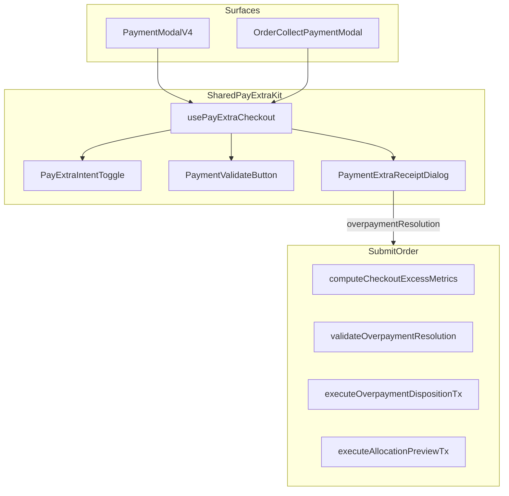

# Pay-Extra Overpayment — Production Implementation Plan (v2)

## Goals

- **Global toggle:** customer intentionally pays extra across any payment-leg combination; **one pooled excess** number.
- **Validate Payment → Extra Receipt loop** with clear cashier guidance (EN/AR, RTL-safe).
- **Cash tender surplus** enters disposition when intent ON (not auto-change).
- **SAVE_TO_CUSTOMER_WALLET** end-to-end (catalog + executor + UI + RBAC).
- **Reusable UI** shared by Payment Modal V4 and Collect Payment modal.
- **Backward compatible:** intent OFF = zero behavior change.
- **Per-phase progress docs** updated after every step.

---

## Mandatory compliance (CLAUDE.md / AGENTS.md)

Load skills **before writing** in each phase (no exceptions):

| Phase | Skills | Rules / agents |
|-------|--------|----------------|
| 0 | `/documentation`, `/database` | ADR in `docs/features/Order_Fin/ADR/` |
| 1 | `/database` | New migration only (`0366_*`); never edit applied migrations; STOP for user review |
| 2–3 | `/backend`, `/implementation`, `/multitenancy` | `tenant_org_id` on all org queries; constants mirror DB |
| 4–5 | `/frontend`, `/i18n`, `/code-documentation` | Cmx imports from `web-admin/.clauderc`; `npm run build` after UI |
| 6 | `/testing`, `/debugging` | Targeted tests then full build |
| 7 | `/documentation` | All new docs under `docs/features/Order_Fin/` |

Optional agents after major chunks: **code-reviewer** (backend + UI), **debugging-specialist** if tests fail.

---

## Gap register (bugs / holes found in review — must fix)

| # | Gap | Fix in plan |
|---|-----|-------------|
| G1 | Server cannot receive `payExtraIntent` toggle | Server derives excess from legs + resolution only; client/server share `computeCheckoutExcessMetrics()` — **same inputs, same output** |
| G2 | `validateOverpaymentResolution` has no `SAVE_TO_CUSTOMER_WALLET` branch | Add validator case + `customerId` + permission check |
| G3 | `executeOverpaymentDispositionTx` throws NOT_ALLOWED for unknown codes | Add wallet branch via `topUpWalletTx` |
| G4 | Voucher auto `change = tendered − amount` breaks wallet/advance path | Explicit `change_returned_amount` from plan when disposition routes surplus |
| G5 | Payment Modal V4 missing RBAC on Extra Receipt (collect has it) | Wire `useHasPermission` for allocate/advance/credit/wallet |
| G6 | Duplicate Extra Receipt UI (inline card + dialog) | **Intent OFF:** keep current inline card when excess appears. **Intent ON:** hide inline card; **only** show via Validate → `PaymentExtraReceiptDialog` |
| G7 | `validationPhase` stale after leg edits | Reset to `editing` when legs/tendered/toggle change after a prior `ready` |
| G8 | Submit error mapping missing wallet codes | Extend [`use-order-submission.ts`](web-admin/src/features/orders/hooks/use-order-submission.ts) EN/AR |
| G9 | Collect-payment route schema may reject wallet resolution | Update collect API Zod + [`order-settlement.service.ts`](web-admin/lib/services/order-settlement.service.ts) parity |
| G10 | Types drift after migration | Regenerate Prisma client + `settlement-catalog.test.ts` DB parity |
| G11 | Auto preview hides fallback meaning | Label fallback line + policy destination in drawer (allocation remainder UX) |
| G12 | Manual partial allocation message too terse | Actionable guidance banner + toast with next steps |
| G13 | Global toggle disable rule too strict | Enable toggle when **any** pay-now method has `supports_overpayment` OR cash with `supports_change_return` (cash extra via tender surplus) |
| G14 | `RETURN_CASH_CHANGE` resolution lines not built from UI today | Add builder + confirm in Validate flow when user picks “Return as cash change” |
| G15 | Progress not tracked | [`PAY_EXTRA_OVERPAYMENT_PROGRESS.md`](docs/features/Order_Fin/PAY_EXTRA_OVERPAYMENT_PROGRESS.md) updated after **each phase** |

---

## Cashier messaging standards (EN/AR — production UX)

All copy under `newOrder.payment.*`. Tone: **what happened → what to do next**. Use `CmxSummaryMessage` for banners; reuse `common.*` where possible.

### Message inventory (add to en.json + ar.json)

| Key area | Purpose | Example EN (guidance) |
|----------|---------|------------------------|
| `payExtraIntent.label` | Toggle | Customer is paying extra |
| `payExtraIntent.help` | Toggle help | Turn on to collect more than the order total across all payment methods. You will choose where the extra goes before submitting. |
| `payExtraIntent.disabledNoMethods` | Toggle disabled | No payment method on this order allows retained overpayment. |
| `validatePayment.button` | CTA | Validate payment |
| `validatePayment.requiredBeforeSubmit` | Block submit | Validate payment and choose what to do with the extra amount before submitting. |
| `validatePayment.noExcess` | Success | Payment amounts match the order total. You can submit now. |
| `validatePayment.excessFound` | Dialog title context | Extra amount to route: {amount} |
| `extraReceipt.guidance.title` | Dialog intro | This payment is {amount} more than the order total |
| `extraReceipt.guidance.pickOne` | Dialog intro | Choose one option below. Only one destination applies to the full extra amount. |
| `extraReceipt.adjustPaymentsHelp` | Option | Go back to payment lines and reduce amounts or set cash change. Then validate again. |
| `extraReceipt.returnCashChangeHelp` | Option | Return {amount} as cash change to the customer. |
| `extraReceipt.saveToWallet` / `saveToWalletHelp` | Option | Add {amount} to the customer's wallet for future payments. |
| `extraReceipt.allocation.autoFallbackHint` | Auto drawer | Remaining {amount} will go to {destination} based on your store's allocation policy. |
| `extraReceipt.allocation.manualRemaining` | Manual drawer | Still to allocate: {amount}. Allocate the full extra or choose another option. |
| `extraReceipt.allocation.manualBlockedReturn` | Manual fail | Could not confirm allocation. Return to Extra Receipt and pick Save as advance, Add to wallet, or Auto allocate. |
| `extraReceipt.walkInHint` | Walk-in | Link a customer account to save extra as wallet, advance, or credit. Otherwise adjust payment amounts or return cash change. |
| `extraReceipt.walletVsAdvanceHint` | Optional info | Wallet = spend on next order. Advance = prepaid deposit on account. |
| `rightRail.requiredAction.validatePayment` | Right rail | Validate payment — extra amount needs a destination |

Run `npm run check:i18n` after every i18n batch.

RTL: use existing `isRTL` / `textAlign` patterns from [`extra-receipt-handling-card.tsx`](web-admin/src/features/orders/ui/payment-modal/allocation/extra-receipt-handling-card.tsx).

---

## Reusable UI components (create once, use in V4 + Collect)

Location: [`web-admin/src/features/orders/ui/payment-modal/pay-extra/`](web-admin/src/features/orders/ui/payment-modal/pay-extra/)

| Component | Responsibility | Cmx imports |
|-----------|----------------|-------------|
| `pay-extra-intent-toggle.tsx` | Global `CmxSwitch` + label + help + disabled reason | `@ui/primitives`, `@ui/forms` |
| `payment-validate-button.tsx` | Validate CTA + loading; calls hook | `@ui/primitives` LoadingButton |
| `payment-extra-receipt-dialog.tsx` | Dialog shell: guidance banner + pooled excess summary + `ExtraReceiptHandlingCard` + Confirm/Back | `@ui/overlays`, `@ui/feedback` CmxSummaryMessage |
| `extra-receipt-guidance-banner.tsx` | Reusable guidance block (excess amount, pick-one, walk-in) | `@ui/feedback` |
| `pay-extra-workbench-hint.tsx` | Inline hint when `adjust_legs` focuses legs (cash tendered highlight) | `@ui/feedback` |

**Extend (do not duplicate):**

- [`extra-receipt-handling-card.tsx`](web-admin/src/features/orders/ui/payment-modal/allocation/extra-receipt-handling-card.tsx) — wallet + return-change options
- [`auto-allocation-preview-drawer.tsx`](web-admin/src/features/orders/ui/payment-modal/allocation/auto-allocation-preview-drawer.tsx) — fallback labels
- [`manual-allocation-drawer.tsx`](web-admin/src/features/orders/ui/payment-modal/allocation/manual-allocation-drawer.tsx) — remaining counter

**Hook (shared):** [`use-pay-extra-checkout.ts`](web-admin/src/features/orders/hooks/use-pay-extra-checkout.ts) — wraps [`use-overpayment-allocation.ts`](web-admin/src/features/orders/hooks/use-overpayment-allocation.ts); owns `payExtraIntent`, `validationPhase`, `runValidatePayment()`, reset on close/leg change.

**Consumers:** [`payment-modal-v4.tsx`](web-admin/src/features/orders/ui/payment-modal-v4.tsx), [`order-collect-payment-modal.tsx`](web-admin/src/features/orders/ui/collect-payment/order-collect-payment-modal.tsx).

---

## Architecture



### Excess formula

Module: [`checkout-excess-metrics.ts`](web-admin/lib/payments/checkout-excess-metrics.ts).

| Mode | `unresolvedExcess` |
|------|---------------------|
| Intent OFF | Legacy: applied excess minus cash change capacity |
| Intent ON | `appliedExcess + tenderSurplus − explicitChangeResolved` |

---

## Allocation remainder (unchanged rules, clearer UI)

- **Auto allocate:** remainder → tenant `fallback_destination` (default advance; can be wallet). Show in preview.
- **Manual allocate:** must cover 100%; else return to Extra Receipt with guidance (G12).
- **Direct wallet/advance/credit:** full excess via disposition, not allocation.

See mermaid in prior section — two wallet paths: `SAVE_TO_CUSTOMER_WALLET` vs allocation `WALLET_TOPUP` fallback.

---

## Phase 0 — ADR + progress shell

**Skills:** `/documentation`, `/database`

**Deliverables:**

- [`ADR-050-Global-Pay-Extra-Intent.md`](docs/features/Order_Fin/ADR/ADR-050-Global-Pay-Extra-Intent.md)
- [`PAY_EXTRA_OVERPAYMENT_PROGRESS.md`](docs/features/Order_Fin/PAY_EXTRA_OVERPAYMENT_PROGRESS.md) — checklist per phase with status table
- Gap register (this doc) copied into ADR appendix
- Touch: [`overpayment-change-contract.md`](docs/features/Order_Payment_Model/overpayment-change-contract.md) outline only (full sync in Phase 7)

**After Phase 0:** Update progress doc + [`overpayment-contract-implementation-tracker.md`](docs/features/Order_Payment_Model/overpayment-contract-implementation-tracker.md) → “Phase 0 complete”.

---

## Phase 1 — Migration

**Skills:** `/database`

**File:** `supabase/migrations/0366_fin_overpay_save_to_wallet.sql`

Seed `SAVE_TO_CUSTOMER_WALLET` in `sys_fin_overpay_res_cd` with `orders:overpayment_to_wallet`.

**STOP** — user reviews/applies migration (never apply via agent).

**After Phase 1:** Progress doc → migration file listed, awaiting apply.

---

## Phase 2 — Shared metrics + schema

**Skills:** `/backend`, `/implementation`

- `checkout-excess-metrics.ts` + tests
- `OVERPAYMENT_RESOLUTIONS.SAVE_TO_CUSTOMER_WALLET`
- Zod wallet line in [`new-order-payment-schemas.ts`](web-admin/lib/validations/new-order-payment-schemas.ts)
- [`build-overpayment-resolution.ts`](web-admin/src/features/orders/ui/payment-modal/allocation/build-overpayment-resolution.ts) wallet + RETURN_CASH_CHANGE builders

**After Phase 2:** Progress doc + [`tech_settlement_catalogs.md`](docs/features/Order_Fin/technical_docs/tech_settlement_catalogs.md) wallet row.

---

## Phase 3 — Backend execution

**Skills:** `/backend`, `/multitenancy`

- [`overpayment-disposition.service.ts`](web-admin/lib/services/overpayment-disposition.service.ts) — wallet
- [`overpayment-resolution-validator.service.ts`](web-admin/lib/services/overpayment-resolution-validator.service.ts) — wallet + metrics parity
- [`order-settlement-planner.service.ts`](web-admin/lib/services/order-settlement-planner.service.ts) — CASH retained excess; explicit change
- [`voucher-line.service.ts`](web-admin/lib/services/voucher-line.service.ts) — explicit change
- Collect path + [`use-order-submission.ts`](web-admin/src/features/orders/hooks/use-order-submission.ts) error mapping
- Cash drawer wiring verification

**After Phase 3:** Progress doc + tracker backend section.

---

## Phase 4 — Reusable UI + Payment Modal V4

**Skills:** `/frontend`, `/i18n`, `/code-documentation`

1. Create `pay-extra/` reusable components (table above)
2. Integrate into V4: toggle, Validate, dialog-only Extra Receipt when intent ON (G6)
3. RBAC (G5), validationPhase reset (G7)
4. Full message inventory (EN/AR)
5. `npm run build` until green

**After Phase 4:** Progress doc + walkthrough draft.

---

## Phase 5 — Collect-payment parity

Reuse **same** `pay-extra/` kit + hook in [`order-collect-payment-modal.tsx`](web-admin/src/features/orders/ui/collect-payment/order-collect-payment-modal.tsx).

**After Phase 5:** Progress doc collect row complete.

---

## Phase 6 — Tests + verification

**Skills:** `/testing`

| Suite | Focus |
|-------|--------|
| `checkout-excess-metrics.test.ts` | Intent OFF/ON, multi-leg, cash surplus |
| `build-overpayment-resolution.test.ts` | Wallet, RETURN_CASH_CHANGE |
| `overpayment-resolution-validator.service.test.ts` | Wallet, customer required |
| `overpayment-disposition` executor test | Wallet audit row |
| `order-settlement-planner.service.test.ts` | CASH + supports_overpayment |
| Regression | Intent OFF unchanged |

Manual QA scenarios **36–45** in [`test_guide.md`](docs/features/Order_Payment_Model/test_guide.md).

```bash
cd web-admin && npm run test -- --testPathPattern="overpayment|checkout-excess|payment-modal-v4.utils"
cd web-admin && npx tsc --noEmit
cd web-admin && npm run build
cd web-admin && npm run check:i18n
```

**After Phase 6:** Progress doc tests green + test_guide updated.

---

## Phase 7 — Documentation (mandatory `/documentation` skill)

Use [`/.claude/skills/documentation/SKILL.md`](.claude/skills/documentation/SKILL.md) to produce/update under `docs/features/Order_Fin/` and `docs/features/Order_Payment_Model/`:

| Doc | Action |
|-----|--------|
| [`PAY_EXTRA_OVERPAYMENT_PROGRESS.md`](docs/features/Order_Fin/PAY_EXTRA_OVERPAYMENT_PROGRESS.md) | Final status COMPLETE |
| [`overpayment-contract-implementation-tracker.md`](docs/features/Order_Payment_Model/overpayment-contract-implementation-tracker.md) | Pay-extra program section |
| [`overpayment-change-contract.md`](docs/features/Order_Payment_Model/overpayment-change-contract.md) | Pay-extra intent + metrics |
| [`walkthrough.md`](docs/features/Order_Payment_Model/walkthrough.md) | Validate loop + toggle |
| [`test_guide.md`](docs/features/Order_Payment_Model/test_guide.md) | Scenarios 36–45 |
| [`tech_settlement_catalogs.md`](docs/features/Order_Fin/technical_docs/tech_settlement_catalogs.md) | SAVE_TO_CUSTOMER_WALLET |
| [`tech_customer_receipt_allocation.md`](docs/features/Order_Fin/technical_docs/tech_customer_receipt_allocation.md) | Fallback vs direct wallet |
| **New** `docs/features/Order_Fin/user_guide_pay_extra_overpayment.md` | Cashier-facing guide (toggle, validate, options) |
| **New** `docs/features/Order_Fin/CHANGELOG_pay_extra.md` | Versioned changelog |
| [`docs/folders_lookup.md`](docs/folders_lookup.md) | Index new docs if required by documentation skill |

**After Phase 7:** Mark program **COMPLETE** in progress doc + tracker.

---

## Out of scope

- HQ feature flags (`overpayment_disposition_v1`)
- Multi-line split disposition UI
- Branch `supports_overpayment` overrides
- Online gateway overpayment (ADR-049)

---

## Implementation order

0 → 1 → 2 → 3 → 4 → 5 → 6 → 7, with **progress doc update after each phase**.
