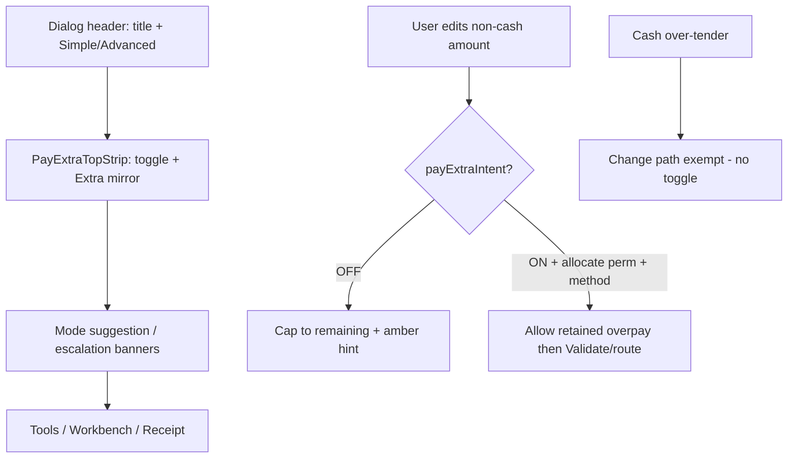

# Pay-Extra Top Strip + Hard Overpayment Gate (QA-R4.5)

## Scope & naming

Implement the **approved design** in [Manual_QA_Checklist.md](docs/features/Order_Fin/Payment_Modal_08_07_2026/Manual_QA_Checklist.md) (QA round 4 finding **4.5**, not table row 4.5 “Generic errors”). Label it **QA-R4.5 / strangler 4g**.

**In scope:** Payment Modal v4 (Simple + Advanced shared shell), Collect Payment modal, shared engine/utils, Split tender (via `updateLeg`), client RBAC UX, access contracts + inventories, tests/oracle, feature docs under `docs/features/Order_Fin/Payment_Modal_08_07_2026/`.

**Out of scope:** QA 4.2–4.4 open UX rulings; new DB permission (reuse `orders:overpayment_allocate`); adding `payExtraIntent` to submit payload / server schema (see Server trust model below).

---

## Plan audit — gaps closed (2026-07-10)

A production review found the following; each is now a **committed decision** in this plan (not optional).

### P0 — must ship

| ID | Gap | Decision |
|----|-----|----------|
| P0-1 | Collect Payment uses raw `setAmount` — no hard cap | Cap Collect amount with the **same** `resolveSupportsRetainedOverpayment` rule in Commit A (not UI-only) |
| P0-2 | Server has no `payExtraIntent` field; trusts method `supports_overpayment` + resolution | **UI toggle is not a security boundary.** Server keeps `METHOD_OVERPAYMENT_NOT_ALLOWED` + `OVERPAYMENT_RESOLUTION_*` + disposition perms. Spec documents this explicitly. No payload field this slice. |
| P0-3 | `CmxSwitch` ignores clicks when `disabled` — planned `aria-disabled` toast cannot work | Extend `CmxSwitch` with `ariaDisabled` (or equivalent): not native-disabled, still fires `onCheckedChange` / `onAttemptChange`; style as not-allowed. Storybook/a11y note. |
| P0-4 | Incomplete engine touch list | Central helper + **mandatory call-site checklist** (below). Grep gate in Spec. |

### P1 — high risk

| ID | Gap | Decision |
|----|-----|----------|
| P1-1 | Legacy `ExtraReceiptHandlingCard` stays parallel to strip+Validate | **Stuck-excess only:** show when `!payExtraIntent && excess > ε` (pre-existing / edge). Prefer strip+Validate for intentional pay-extra. Do not remove card this slice (needed for stuck legs without silent money rewrite). Spec + QA both paths. |
| P1-2 | `resetSignature` includes `payExtraIntent` — ON clears validation/allocation | Document: turning ON resets Validate phase (expected). OFF blocked while excess > ε so reset-on-OFF cannot wipe resolved state via toggle. QA: legacy selections → toggle ON → must re-Validate. |
| P1-3 | No runtime permission name resolver in payment UI | **Static i18n** in `payExtraIntent.json` EN+AR mirroring DB name for `orders:overpayment_allocate` (“Allocate Overpayment to Balances” / AR from migration). Message shows name + code. |
| P1-4 | `canEnablePayExtra` vs allocate perm underspecified | Decision table below. |
| P1-5 | Epsilon mismatch (UI `10^-(dp+1)` vs `SETTLEMENT_MONEY_EPSILON` 0.001) | All modal/Collect UI gates use engine `moneyEpsilon`. Server stays 0.001. Spec notes UI ε ≤ server ε. Pass `moneyEpsilon` into Collect’s `usePayExtraCheckout`. |
| P1-6 | Non-cash cap silent today | Extend `notifyIfLegAmountCapped` (or shared cap-hint state) for non-cash + `!payExtraIntent` → amber `cappedAtRemaining`; Full + Simple + Split + Collect. |

### P2 — completeness

| ID | Gap | Decision |
|----|-----|----------|
| P2-1 | Strip + banners + 94vh tablet squeeze | Shell order: **Header → PayExtraTopStrip → mode banners → body**. Strip once in shared chrome (visible Simple + Advanced). Tablet QA row. |
| P2-2 | Express | Badge/pricing only — one QA note for reconcile-on-repricing; no fork. |
| P2-3 | Legacy card far from top strip | When legacy card visible, strip mirror still shows Extra; optional “scroll to resolve” link if already patterned — otherwise leave card mid-workbench. |
| P2-4 | `reconcilePaymentLegAmounts` on totals change | Documented exception to money rule (totals change), not toggle/mode. |
| P2-5 | Access/inventory incomplete | `payExtraIntentEnable` on new-order + Collect host routes; Collect API in `apiDependencies`; `check --wire` + `sync` + platform-info inventories refresh. |
| P2-6 | Server guard → overpayment dialog | Regression: guard still opens routing dialog; strip state consistent. |
| P2-7 | Oracle | Non-overpay payloads byte-identical; fixture: toggle OFF + card at remaining = capped payload. |

---

## Current gaps (why this work exists)

| Gap | Today | Target |
|-----|--------|--------|
| Toggle placement | Mid-workbench only | Shared **top strip** under header |
| Hard gate | Non-cash `supports_overpayment` uncapped when intent OFF | Retained overpay only when `payExtraIntent && methodAllows` |
| Collect | Raw amount entry | Same hard gate + strip + hints |
| Toggle ON RBAC | Method capability only | Methods + `orders:overpayment_allocate`; click-through message |
| Toggle OFF | No guard | Block OFF while excess > ε; never re-cap legs |
| Cap feedback | Cash-no-change only | Amber non-cash cap hint pointing to strip |
| Dual UX | Legacy card always available with excess | Stuck-excess only; intentional path = strip + Validate |

---

## Chosen UX (committed)



**Placement:** Full-width strip under `CmxDialogHeader`, above mode banners. Not in the title/mode cluster.

**Strip:** `CmxSwitch` + label/help; read-only `Extra: {amount}` (+ destination when resolved); amber unresolved / emerald resolved; never red.

**Money rule:** Cap only on amount edit when intent OFF (documented hard-gate default) + amber explain. Never rewrite money on toggle/mode/dialog close — block OFF instead. Totals reconcile remains the documented exception.

---

## RBAC decision table (committed)

| User state | Toggle control | Message |
|------------|----------------|---------|
| No method allows retained overpay / cash-change | Native `disabled` | `disabledNoMethods` |
| Methods allow, missing `orders:overpayment_allocate` | `ariaDisabled` (clickable) | `permissionRequired` with static name + `orders:overpayment_allocate` |
| Methods allow + has allocate | Enabled | — |
| Intent ON, excess > ε, user tries OFF | `ariaDisabled` for OFF | `cannotDisableWhileExtra` (reduce legs **or** Validate & route) |
| Intent ON, excess ≤ ε | Can turn OFF | — |

**Toggle ON minimum permission:** `orders:overpayment_allocate` only (matches approved design). Destination options still use existing dispose/wallet/advance/credit/credit-note flags on the routing UI.

**Gate priority:** methods gate first (true disabled); else permission / OFF-lock via aria-disabled + message on attempt.

---

## Engine rule (commit A — freeze lift)

**Single helper** (required — no duplicated ternaries):

```ts
// overpayment-policy.ts or payment-modal-v4.utils.ts
resolveSupportsRetainedOverpayment({ payExtraIntent, policy }): boolean
// => payExtraIntent && (policy.isCash ? policy.supportsChangeReturn : policy.supportsOverpayment)
```

When intent OFF → always false for `deriveLegAppliedAmount` → non-cash capped even if method config allows overpayment.

**Cash change exempt:** tendered/change via `deriveCashTenderedAmount` + `supports_change_return` without toggle; applied stays order-capped.

### Mandatory call-site checklist (grep must be clean)

| Path | File |
|------|------|
| `updateLeg` / `upsertSettlementLeg` / `addLeg` | [use-payment-legs.ts](web-admin/src/features/orders/hooks/use-payment-legs.ts) |
| Keypad | [use-payment-engine.ts](web-admin/src/features/orders/hooks/use-payment-engine.ts) ~1307 |
| Amount editor | [payment-full-view.tsx](web-admin/src/features/orders/ui/payment-full-view.tsx) ~1695 |
| Cash-change / excess metrics | [use-money-derivations.ts](web-admin/src/features/orders/hooks/use-money-derivations.ts) ~221 — must use intent-aware retained flag where it affects OFF-block / excess |
| Cap notification | `notifyIfLegAmountCapped` — add non-cash + !intent branch |
| Collect amount onChange | [order-collect-payment-modal.tsx](web-admin/src/features/orders/ui/collect-payment/order-collect-payment-modal.tsx) |
| Split tender | Via `updateLeg` only — no second rule; add cap hint in dialog UI |

**Safe as-is (document only):** `fillLegRemaining`, `quickTender` (`supportsOverpayment: false`), `reconcilePaymentLegAmounts` (totals exception).

**Tests / oracle:** toggle OFF + card supports_overpayment → capped; toggle ON → uncapped; cash over-tender OFF → change not retained extra; Collect unit/integration; oracle non-overpay identical + capped-at-remaining fixture.

---

## UI + toggle gates (commit B)

1. **`PayExtraTopStrip`** — toggle + mirror + amber/emerald chrome.
2. **`CmxSwitch`** — add `ariaDisabled` path: `aria-disabled=true`, not `disabled`, still invokes change handler; visual not-allowed. Prefer small primitive extension over one-off hacks.
3. **`PayExtraIntentToggle` / strip** — `onAttemptChange(next)` with decision table; real `disabled` only for `!canEnablePayExtra`.
4. Remove mid-workbench toggle; strip is sole intent control in shared shell (Simple + Advanced).
5. Collect: same strip + gates + capped amount entry + amber hint.
6. Simple: amber cap hint in amount editor; Extra REQUIRED quick-action still registry-driven; Validate/route remains Advanced (existing needs-advanced — no new silent escalation).
7. Split dialog: surface same cap hint when `updateLeg` caps.

### i18n (EN+AR) — search before add

Extend `payExtraIntent.json`:

- `cappedAtRemaining`
- `permissionRequired` — `{permissionName}`, `{permissionCode}`
- `permissionNameAllocate` / `permissionCodeAllocate` (static DB-mirrored)
- `cannotDisableWhileExtra`
- `extraAmount`, `extraResolvedTo` (mirror)

---

## Legacy card policy (committed)

- **Keep** [extra-receipt-handling-card.tsx](web-admin/src/features/orders/ui/payment-modal/allocation/extra-receipt-handling-card.tsx) for `!payExtraIntent && excess > ε` (stuck excess after totals reconcile, historical legs, Collect edge cases).
- Intentional pay-extra: strip ON → Validate → `PaymentExtraReceiptDialog` (unchanged adapter).
- Do **not** auto-reduce legs to clear excess (money rule).
- Legacy card continues to honor existing per-destination RBAC props.
- Spec + Manual QA: both paths.

---

## Server trust model (committed)

| Layer | Enforces |
|-------|----------|
| Client hard gate | Cannot create retained non-cash overpay without toggle + allocate perm |
| Server planner | `METHOD_OVERPAYMENT_NOT_ALLOWED` if method cannot retain |
| Server resolution | `OVERPAYMENT_RESOLUTION_*` required for unresolved excess |
| Allocation APIs | `orders:overpayment_allocate` |
| Other dispositions | Existing wallet/advance/credit/dispose perms |

Crafted clients with method `supports_overpayment` + valid resolution can still submit without UI toggle — **accepted** this slice; document in Spec. Future hardening (payload `payExtraIntent` or always require allocate for any retained excess) is deferred, not silent scope creep.

---

## Access contract + inventories

- Add action `payExtraIntentEnable` with literal `'orders:overpayment_allocate'` on `/dashboard/orders/new` and Collect host routes (ready / order financial as applicable).
- Distinct from existing `payExtraAllocateOverpayment` (dialog allocate).
- Collect: ensure payment POST `apiDependencies` documented.
- After wire: `npm run check:ui-access-contract -- --wire` (scoped routes) → `sync:ui-access-contract` → refresh platform-info inventories (`surface=page` + `api` as needed).

---

## Documentation (feature folder)

| Doc | Action |
|-----|--------|
| **`Pay_Extra_Top_Strip_QA_R4_5_Spec.md`** (new) | Normative UX, engine helper, call-site checklist, money rule, RBAC table, legacy policy, server trust, epsilon, layout order, test matrix |
| STATUS / Plan / README | 4g progress + decisions log + link |
| Manual_QA_Checklist | **§6 QA-R4.5** rows (see below) |

**After each step:** update STATUS.

**Final:** `/documentation` skill — full feature doc refresh for this slice.

### Manual QA §6 (minimum rows)

1. Strip under header (Simple + Advanced), RTL
2. Card over-remaining with toggle OFF → capped + amber hint (Full, Simple, Split, Collect)
3. Cash over-tender OFF → change, no forced toggle
4. Toggle ON without allocate → message with name + code; state stays OFF
5. Toggle OFF while extra → blocked; message names two exits; amounts unchanged
6. Toggle ON + Validate + route → emerald mirror; submit works
7. Stuck excess + legacy card still usable; no silent leg rewrite
8. Tablet: strip + banners + keypad usable
9. Server overpayment guard still opens routing dialog
10. Express repricing + legs → reconcile toast only (not toggle rewrite)

---

## Implementation sequence

1. Docs bootstrap (Spec with audit decisions + STATUS in progress).
2. Commit A — helper + all call sites + Collect cap + money-derivations + notify + tests/oracle; STATUS.
3. Commit B — CmxSwitch ariaDisabled + PayExtraTopStrip + gates + remove mid toggle + hints + i18n; STATUS.
4. Legacy card policy wiring + QA notes; STATUS.
5. Access-contract + inventory refresh; STATUS.
6. Gates (tsc, eslint, tests, i18n, build, access --wire).
7. Manual QA §6 in checklist.
8. Documentation skill → STATUS done.

---

## Risks & mitigations

| Risk | Mitigation |
|------|------------|
| Missed call site still allows overpay | Central helper + Spec grep checklist + tests for Full/Simple/Split/Collect/keypad |
| Collect bypass | Cap in Commit A |
| aria-disabled toast dead | CmxSwitch primitive extension |
| Dual UX confusion | Stuck-excess-only legacy; strip is primary intentional path |
| Silent money on OFF | Block OFF; never re-cap on toggle |
| Oracle freeze | Commit A isolated; non-overpay fixtures unchanged |
| Tablet crowding | Fixed shell order + QA row |
| Server ≠ UI toggle | Documented trust model; no false security claims |

---

## Key files

- Engine: [use-payment-legs.ts](web-admin/src/features/orders/hooks/use-payment-legs.ts), [use-payment-engine.ts](web-admin/src/features/orders/hooks/use-payment-engine.ts), [use-pay-extra-checkout.ts](web-admin/src/features/orders/hooks/use-pay-extra-checkout.ts), [use-money-derivations.ts](web-admin/src/features/orders/hooks/use-money-derivations.ts), [payment-modal-v4.utils.ts](web-admin/src/features/orders/ui/payment-modal-v4.utils.ts), [overpayment-policy.ts](web-admin/lib/payments/overpayment-policy.ts)
- UI: [payment-full-view.tsx](web-admin/src/features/orders/ui/payment-full-view.tsx), [payment-simple-view.tsx](web-admin/src/features/orders/ui/payment-simple-view.tsx), [pay-extra-intent-toggle.tsx](web-admin/src/features/orders/ui/payment-modal/pay-extra/pay-extra-intent-toggle.tsx), [order-collect-payment-modal.tsx](web-admin/src/features/orders/ui/collect-payment/order-collect-payment-modal.tsx), [split-tender-dialog.tsx](web-admin/src/features/orders/payment/capabilities/split-tender/split-tender-dialog.tsx), [cmx-switch.tsx](web-admin/src/ui/primitives/cmx-switch.tsx)
- Legacy: [extra-receipt-handling-card.tsx](web-admin/src/features/orders/ui/payment-modal/allocation/extra-receipt-handling-card.tsx)
- RBAC: [orders-access.ts](web-admin/src/features/orders/access/orders-access.ts), [orders-perm.ts](web-admin/lib/constants/permissions/orders-perm.ts)
- i18n: `messages/{en,ar}/newOrder/payment/payExtraIntent.json`
- Docs: `docs/features/Order_Fin/Payment_Modal_08_07_2026/*`
