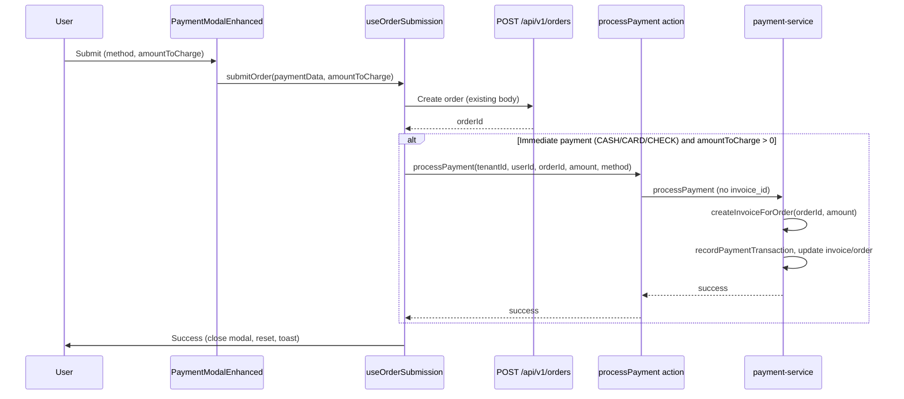

# Payment in New Order Page

## Current state

- **New Order page** ([web-admin/app/dashboard/orders/new](web-admin/app/dashboard/orders/new)): User selects customer, items, ready-by; clicks **Submit Order** which opens the **Payment** modal.
- **Payment modal** ([payment-modal-enhanced.tsx](web-admin/app/dashboard/orders/new/components/payment-modal-enhanced.tsx)): User selects payment method (pay_on_collection, cash, card, check, etc.), optional discounts, promo, gift card; sees `totals.finalTotal`; on submit calls `onSubmit(paymentData)`.
- **Submission** ([use-order-submission.ts](web-admin/src/features/orders/hooks/use-order-submission.ts)): `submitOrder(paymentData)` sends a single **POST /api/v1/orders** with `paymentMethod`, discounts, promo, gift card, etc. **OrderService.createOrder** only stores `payment_method` and `payment_status` on the order; **paid_amount** stays 0; **no invoice** and **no row in org_payments_dtl_tr** are created.
- **Existing payment flow**: [processPayment](web-admin/app/actions/payments/process-payment.ts) + [payment-service](web-admin/lib/services/payment-service.ts) already support creating an invoice for an order when `invoice_id` is missing (via `createInvoiceForOrder(orderId, amount)`) and recording a payment, then updating invoice and order `paid_amount`.

So the gap is: **no call to processPayment after order creation** when the user chooses immediate payment (CASH/CARD).

---

## Target behavior

When the user completes the Payment modal with an **immediate** payment method (CASH, CARD, or CHECK) and a positive amount:

1. Create the order (unchanged).
2. **Create an invoice** for the order and **record the payment** by calling the existing `processPayment` action with `orderId`, `amount` (payable total from the modal), and `paymentMethod`.
3. Order and invoice show correct `paid_amount` and payment history; invoice detail and order detail pages stay consistent.

When the user selects **Pay on collection** (or similar deferred method), do **not** call `processPayment`; behavior stays as today (order created with `payment_method` and `payment_status` only).

---

## Architecture (high level)

---

## Implementation plan

### 1. Pass payable amount from Payment modal

- **File**: [payment-modal-enhanced.tsx](web-admin/app/dashboard/orders/new/components/payment-modal-enhanced.tsx)
- On submit, the modal must pass the **amount to charge** (e.g. `totals.finalTotal`) so the submission hook can call `processPayment` with the correct amount.
- **Options** (pick one):
  - **A)** Extend the submit payload: change `onSubmit` to accept a second argument or an extended type that includes `amountToCharge: number` (e.g. `onSubmit(data, { amountToCharge: totals.finalTotal })`).
  - **B)** Add `amountToCharge` to the form data passed to `onSubmit` (e.g. pass `{ ...data, amountToCharge: totals.finalTotal }`). Parent and submission hook then use `paymentData.amountToCharge`.
- Ensure the amount is computed from the same `totals` used in the modal (subtotal, manual discount, promo, VAT, gift card) so it matches what the user sees.

### 2. Extend submission hook to call processPayment after order creation

- **File**: [use-order-submission.ts](web-admin/src/features/orders/hooks/use-order-submission.ts)
- After **POST /api/v1/orders** succeeds and `orderId` is available:
  - If payment method is **immediate** (CASH, CARD, or CHECK) and `amountToCharge > 0`:
    - Call the existing **processPayment** server action with:
      - `tenantOrgId`, `userId` (from auth),
      - `orderId`,
      - `amount: amountToCharge`,
      - `paymentMethod` normalized to uppercase (e.g. `CASH`, `CARD`, `CHECK`) to match [PaymentMethodCode](web-admin/lib/types/payment.ts),
      - `paymentKind: 'invoice'` (invoice-linked payment),
      - optional: `checkNumber`, `notes`, and any other fields the action accepts.
    - If **processPayment** fails: show an error message (e.g. "Order created but payment could not be recorded. You can complete payment on the order page."), still close the modal and reset the order so the user does not double-create; optionally revalidate order/invoice paths.
  - If payment method is **pay_on_collection** (or other deferred): do not call `processPayment`; keep current behavior.
- **Auth**: Use `useAuth()` (already used in the hook) to get `currentTenant.tenant_id` and `user.id` for the processPayment call.

### 3. Payment method normalization

- Modal and form use lowercase method ids (e.g. `cash`, `card`) from [PAYMENT_METHODS](web-admin/lib/constants/order-types.ts); [processPayment](web-admin/app/actions/payments/process-payment.ts) expects [PaymentMethodCode](web-admin/lib/types/payment.ts) (e.g. `CASH`, `CARD`).
- In the submission hook, map modal value to uppercase code before calling the action (e.g. `cash` → `CASH`, `card` → `CARD`, `pay_on_collection` → skip payment recording).

### 4. API and backend

- **No change** to **POST /api/v1/orders** or **OrderService.createOrder** for this feature. Invoice creation and payment recording are handled by the existing **processPayment** flow (which creates invoice when `invoice_id` is omitted and `order_id` is provided).

### 5. i18n and UX

- **Files**: [messages/en.json](web-admin/messages/en.json), [messages/ar.json](web-admin/messages/ar.json)
- Reuse existing keys where possible (e.g. `invoices.*`, `newOrder.payment.*`). If new copy is needed (e.g. "Order created but payment could not be recorded"), add under `newOrder` or `invoices` and mirror in Arabic; keep RTL in mind.

### 6. Edge cases and validation

- **Partial payment**: If later you support paying less than the full total at new order, pass that amount as `amountToCharge`; `processPayment` and invoice already support partial payments.
- **Tax/discount consistency**: [createInvoiceForOrder](web-admin/lib/services/payment-service.ts) currently creates an invoice with `subtotal = total = amount` (no separate tax/discount lines). Order total in DB may still be the pre-discount subtotal. This is acceptable for this phase; enhancing invoice with full breakdown (subtotal, discount, tax) from the modal can be a follow-up (would require passing those from frontend and possibly extending invoice creation).

---

## Files to touch (summary)

| Area             | File                                                                                                   | Change                                                                                                                             |
| ---------------- | ------------------------------------------------------------------------------------------------------ | ---------------------------------------------------------------------------------------------------------------------------------- |
| Modal            | [payment-modal-enhanced.tsx](web-admin/app/dashboard/orders/new/components/payment-modal-enhanced.tsx) | Pass `amountToCharge` (e.g. `totals.finalTotal`) on submit.                                                                        |
| Modals container | [new-order-modals.tsx](web-admin/src/features/orders/ui/new-order-modals.tsx)                          | If modal passes extended payload, ensure `handlePaymentSubmit` forwards `amountToCharge` to `submitOrder`.                         |
| Submission       | [use-order-submission.ts](web-admin/src/features/orders/hooks/use-order-submission.ts)                 | After order creation success, if immediate payment and amount > 0: call `processPayment`; normalize payment method; handle errors. |
| i18n             | [en.json](web-admin/messages/en.json) / [ar.json](web-admin/messages/ar.json)                          | Add or reuse keys for payment-after-order error message if needed.                                                                 |

---

## Out of scope (for later)

- Sending discount/tax breakdown from the modal to the API to persist on order/invoice (order total and invoice line items).
- Changing **when** the Payment modal is shown (e.g. inline payment section on the New Order page instead of modal); current UX remains modal-after-Submit.
- PDF invoice or gateway payments; existing payment method handling (CASH/CARD/CHECK) is sufficient for this plan.
