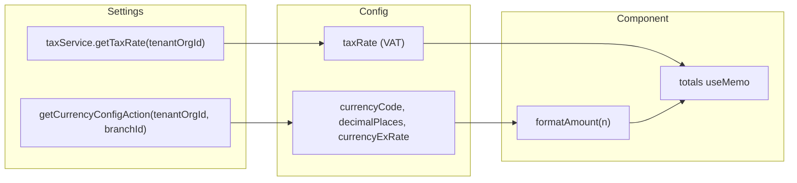
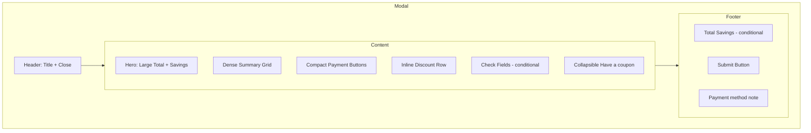

# Payment Modal Compact Layout Enhancement

## Approach

Create `[web-admin/app/dashboard/orders/new/components/payment-modal-enhanced-02.tsx](web-admin/app/dashboard/orders/new/components/payment-modal-enhanced-02.tsx)` as a new component that mirrors the existing `[payment-modal-enhanced.tsx](web-admin/app/dashboard/orders/new/components/payment-modal-enhanced.tsx)` in functionality but implements the compact layout. This allows side-by-side comparison and easy rollback.

---

## Data Flow (Settings-Driven Values)



- **Currency**: From `getCurrencyConfigAction(tenantOrgId, branchId)` (already used). Fallback: `OMR`, 3 decimals.
- **Tax/VAT**: From `taxService.getTaxRate(tenantOrgId)`. Fallback: 0.05.
- **Decimal places**: Use `currencyConfig.decimalPlaces` for all amount formatting.

---

## Layout Structure



---

## Implementation Tasks

### 1. Create the new component file

Copy `[payment-modal-enhanced.tsx](web-admin/app/dashboard/orders/new/components/payment-modal-enhanced.tsx)` as the base. Preserve:

- Same props interface (`PaymentModalProps`)
- Same form schema and validation (`paymentFormSchema`, `PaymentFormData`)
- Same handlers: `handleValidatePromoCode`, `handleClearPromoCode`, `handleValidateGiftCard`, `handleClearGiftCard`, `onSubmitForm`
- Same `useMemo` totals calculation and all `useEffect` hooks
- Same currency/tax loading logic

### 2. Modal shell: fixed footer

Change the modal wrapper from a single scrollable div to a flex column:

```tsx
<div className="bg-white rounded-xl shadow-2xl max-w-3xl w-full max-h-[90vh] flex flex-col overflow-hidden">
  <header className="flex-shrink-0 p-4 border-b">...</header>
  <div className="flex-1 overflow-y-auto p-4">{/* scrollable content */}</div>
  <footer className="flex-shrink-0 p-4 border-t bg-gray-50">
    {/* submit - always visible */}
  </footer>
</div>
```

### 3. Dense summary grid

Replace the current VAT/Tax breakdown section with a compact 2-column grid:

- Row 1: Subtotal | VAT (6%)
- Row 2: Tax Rate % (editable) | Tax Amount (editable)
- Row 3: Full-width Total row with `bg-gray-50`, `text-lg font-bold`
- Move Currency and Exchange Rate to a subtle single line or omit from primary view (currency is already shown in hero)

Use `grid grid-cols-2 gap-x-4 gap-y-2 text-sm`. Preserve RTL via `flex-row-reverse` on label/value pairs where applicable.

### 4. Compact payment buttons

- Primary row (Cash, Card): `flex gap-2` with `flex-1` buttons; `min-h-[44px]`, `p-3`, icons `w-5 h-5`, labels `text-sm font-medium`
- Secondary row (Pay on Collection, Check, Invoice): Same compact style; use `grid grid-cols-3` (or 2 when retail-only)

### 5. Inline discount row

- Single flex row: `%` input | `{currencyCode}` amount input
- Use `gap-2`; label the inputs clearly (reuse `manualDiscount.percentPlaceholder` and `amountPlaceholder`)
- Remove the non-functional `%` button; use two labeled inputs side by side

### 6. Collapsible promo section

- Add state: `const [couponOpen, setCouponOpen] = useState(false)`
- Render a button/link: "Have a coupon?" (or "Add Promo / Gift Card") that toggles `couponOpen`
- When `couponOpen` or `appliedPromoCode || appliedGiftCard`: show the promo + gift card inputs
- When promo/gift card is applied: keep the success state visible even if collapsed (show a compact "Promo: -OMR X | Gift: -OMR Y" bar and allow expand to remove)
- Use ChevronDown/ChevronUp from lucide-react for the toggle icon
- No new dependencies; simple `useState`-based collapse

### 7. OMR as input prefix (optional refinement)

For discount amount input: wrap in `flex items-center border rounded` with `<span className="px-2 text-gray-500 text-sm">{currencyCode}</span>` as prefix. Use dynamic `currencyCode` from settings.

### 8. Typography and spacing

- Replace `space-y-6` with `gap-y-2` or `space-y-2` in compact sections
- Hero total: keep prominent (`text-4xl` or `text-3xl` instead of `text-5xl` to save space)
- Summary rows: `text-sm`; Total row: `text-lg font-bold`

### 9. i18n

Add to `[web-admin/messages/en.json](web-admin/messages/en.json)` under `newOrder.payment`:

```json
"haveCoupon": "Have a coupon?",
"promoOrGiftCard": "Promo code or gift card"
```

Add Arabic equivalents in `[web-admin/messages/ar.json](web-admin/messages/ar.json)`.

### 10. Integration

Update `[web-admin/src/features/orders/ui/new-order-modals.tsx](web-admin/src/features/orders/ui/new-order-modals.tsx)`:

- Change the dynamic import to load `payment-modal-enhanced-02` instead of `payment-modal-enhanced`
- Keep the same props (no `branchId` passed currently; optional prop remains for future use)

---

## Files to Create/Modify

| File                                                                          | Action                                                                |
| ----------------------------------------------------------------------------- | --------------------------------------------------------------------- |
| `web-admin/app/dashboard/orders/new/components/payment-modal-enhanced-02.tsx` | Create – new compact modal component                                  |
| `web-admin/messages/en.json`                                                  | Modify – add `haveCoupon`, `promoOrGiftCard` under `newOrder.payment` |
| `web-admin/messages/ar.json`                                                  | Modify – add Arabic translations for new keys                         |
| `web-admin/src/features/orders/ui/new-order-modals.tsx`                       | Modify – swap import to use `payment-modal-enhanced-02`               |

---

## RTL and Accessibility

- Preserve all `isRTL` conditionals and `flex-row-reverse` usage from the original
- Ensure collapsible toggle has `aria-expanded` and `aria-controls`
- Maintain min 44x44px touch targets for payment buttons
- Preserve `dir="ltr"` on numeric/code inputs (promo, gift card, amounts)

---

## Rollback

If issues arise: revert the import in `new-order-modals.tsx` to `payment-modal-enhanced`. The original component remains unchanged.
