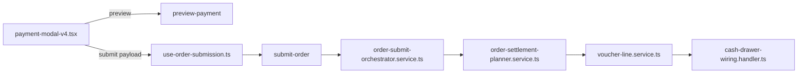

# Payment Modal V4 — Full Implementation Plan

## Scope

Close all audit gaps across V4 UI, submit hook, orchestrator, planner, voucher/cash-drawer services, schemas, i18n, and tests. Builds on recent fixes (reference validation, cash cap info, `CASH_OUT`, tax breakdown alignment).

## Architecture flow (target state)



Client validates early; server remains authoritative via `validateSettlementPlan`.

---

## Phase 1 — Critical money bugs (P0)

### 1.1 Price override on create submit

**File:** [`web-admin/src/features/orders/hooks/use-order-submission.ts`](web-admin/src/features/orders/hooks/use-order-submission.ts)

In `createWithPaymentBody.items` map (~195–241), mirror edit path (~358–360):

```ts
...(item.priceOverride != null && {
  priceOverride: item.priceOverride,
  overrideReason: item.overrideReason,
  overrideBy: item.overrideBy,
}),
```

**Test:** Add/extend test asserting create payload includes override fields when item has `priceOverride`.

---

### 1.2 Gift card + `outstandingPolicy: 'NONE'` server fix

**File:** [`web-admin/lib/services/order-submit-orchestrator.service.ts`](web-admin/lib/services/order-submit-orchestrator.service.ts) (~337–344)

Before `OUTSTANDING_POLICY_REQUIRED` check, subtract synthesized gift credit:

```ts
const giftApplied = input.giftCardId && serverTotals.giftCardApplied > 0
  ? serverTotals.giftCardApplied : 0;
const unpaidBalance = Math.max(0, serverSaleTotal - amountToCharge - giftApplied);
```

Add comment: gift leg is synthesized after this check; only `giftCardApplied` belongs here (wallet/advance/credit legs are already in `paymentLegs` / `amountToCharge`).

**Test:** New test in [`web-admin/__tests__/services/order-settlement-planner.service.test.ts`](web-admin/__tests__/services/order-settlement-planner.service.test.ts) or new orchestrator unit test file — sale 100, gift 30 + cash 70 with `NONE` must not throw; cash 60 must still fail.

---

### 1.3 Clamp `change_returned_amount` ≥ 0

**File:** [`web-admin/lib/services/voucher-line.service.ts`](web-admin/lib/services/voucher-line.service.ts) (~119–123)

```ts
changeReturned = Math.max(0, input.tendered_amount - input.amount);
```

**Test:** New voucher-line unit test for tendered &lt; amount → `0`.

---

## Phase 2 — Validation parity (P1)

### 2.1 Check due date — submit blocking

**File:** [`web-admin/src/features/orders/ui/payment-modal-v4.tsx`](web-admin/src/features/orders/ui/payment-modal-v4.tsx)

- Add `hasCheckLegWithInvalidDate` useMemo using existing `validateCheckDueDate`.
- Add to `validationItems` and `onSubmitForm` guard (parallel to check number ~1872).
- Extend `focusFirstBlockingIssue` to scroll/focus check date input.

---

### 2.2 Stored-value caps for all credit leg types

**File:** [`web-admin/src/features/orders/ui/payment-modal-v4.utils.ts`](web-admin/src/features/orders/ui/payment-modal-v4.utils.ts)

Add `getStoredValueCapForLeg(method, { walletBalance, advanceBalance, creditNoteBalance, loyaltyBalance })`:

| Method | Cap |
|--------|-----|
| `WALLET` | wallet balance |
| `ADVANCE` | advance balance |
| `CREDIT_NOTE` | selected note `remaining_balance` |
| `LOYALTY_POINTS` | option `available_balance` |

Wire cap into `updateLeg`, `handleKeypadPress`, `CmxMoneyField.onValueChange`, and leg reconciliation effect.

Add balance-exceeded flags parallel to `walletLegExceedsLiveBalance` for advance/loyalty/credit-note; include in `validationItems` and right-rail state.

**Tests:** Utils tests for each cap type.

---

### 2.3 Multi-cash-leg change policy

**File:** [`web-admin/src/features/orders/ui/payment-modal-v4.tsx`](web-admin/src/features/orders/ui/payment-modal-v4.tsx) (~1499)

Change `canReturnChangeFromCash` from `.some()` to `.every()` over cash legs — all cash legs must allow change for aggregate change display/settlement UX to match server per-leg rules.

**Test:** Utils/right-rail test — two cash legs, one without change return → unresolved overpayment.

---

### 2.4 Complete submit error mapping

**File:** [`web-admin/src/features/orders/hooks/use-order-submission.ts`](web-admin/src/features/orders/hooks/use-order-submission.ts) (~496–509)

Map additional `errorCode` values from [`submit-order/route.ts`](web-admin/app/api/v1/orders/submit-order/route.ts):

- `OUTSTANDING_POLICY_REQUIRED`, `B2B_CREDIT_HOLD`, `B2B_CREDIT_EXCEEDED`
- `SPLIT_AMOUNT_MISMATCH`, `DEFERRED_LEG_NOT_ALONE`, `CHECK_NUMBER_REQUIRED`
- `PAYMENT_TERMINAL_REQUIRED` (new, Phase 3.2)
- Zod 400: parse `details` for `checkDate` path → existing `splitPayment.checkDate*` keys

**i18n:** Add keys under `newOrder.payment.errors.*` in [`messages/en.json`](web-admin/messages/en.json) and [`messages/ar.json`](web-admin/messages/ar.json); search/reuse existing keys first; run `npm run check:i18n`.

---

## Phase 3 — Feature completion (P1)

### 3.1 Credit note reference selection

**New file:** `web-admin/src/features/orders/ui/payment-modal-v4-credit-note-picker.tsx`

- CmxDialog listing `storedValueSummary.creditNotes` (id, balance, currency).
- RTL + keyboard accessible; empty state when no notes.

**File:** [`payment-modal-v4.tsx`](web-admin/src/features/orders/ui/payment-modal-v4.tsx)

- Remove blanket disable on `requires_credit_reference_selection` (~2988).
- On CREDIT_NOTE select → open picker → upsert leg with `creditReferenceId` + capped amount.
- Leg workspace shows selected note; allow change note.
- Validation: CREDIT_NOTE leg requires `creditReferenceId`; amount ≤ note balance.

**Schema:** [`new-order-payment-schemas.ts`](web-admin/lib/validations/new-order-payment-schemas.ts) — superRefine: `CREDIT_NOTE` requires `creditReferenceId`.

**Critical orchestrator fix** (currently drops field at ~445–446):

```ts
terminalId: leg.terminalId ?? undefined,
creditReferenceId: leg.creditReferenceId ?? undefined,
```

in [`order-submit-orchestrator.service.ts`](web-admin/lib/services/order-submit-orchestrator.service.ts) `settlementLegs` mapping.

---

### 3.2 Payment terminal when `requires_terminal`

**Schema:** Add optional `terminalId: z.string().uuid().optional()` to `paymentLegSchema`.

**Modal:**

- Query `/api/v1/settings/payments/terminals` (filter by branch, active only) — same pattern as card brands (~634).
- Leg workspace: terminal dropdown when `activeLegOption.requires_terminal`; required `*` + inline error.

**Server:** [`order-settlement-planner.service.ts`](web-admin/lib/services/order-settlement-planner.service.ts) `validateSettlementPlan`:

```ts
if (leg.requiresTerminal && !leg.terminalId) throw new Error('PAYMENT_TERMINAL_REQUIRED');
```

Add to [`submit-order/route.ts`](web-admin/app/api/v1/orders/submit-order/route.ts) error mapping + hook i18n.

Forward `terminalId` from `paymentLegs` in orchestrator (3.1 fix).

---

### 3.3 Retail `PAY_ON_COLLECTION` modal filter

**File:** [`payment-modal-v4.tsx`](web-admin/src/features/orders/ui/payment-modal-v4.tsx) (~1080)

Filter `PAY_ON_COLLECTION` from real payment options when `isRetailOnlyOrder` (same as INVOICE). Aligns with hook block in [`use-order-submission.ts`](web-admin/src/features/orders/hooks/use-order-submission.ts) (~125–133).

---

### 3.4 Checkout options amount = sale total

**Files:**

- [`new-order-modals.tsx`](web-admin/src/features/orders/ui/new-order-modals.tsx) — pass `checkoutAmount` prop (use order summary `saleTotal` when available, fallback subtotal).
- [`payment-modal-v4.tsx`](web-admin/src/features/orders/ui/payment-modal-v4.tsx) — use `checkoutAmount ?? total` in checkout-options query key + `amount` param (~647–652); refetch when preview `saleTotal` changes.

---

### 3.5 CARD `requires_reference` parity (small server+client)

**Files:** [`payment-modal-v4.utils.ts`](web-admin/src/features/orders/ui/payment-modal-v4.utils.ts), [`order-settlement-planner.service.ts`](web-admin/lib/services/order-settlement-planner.service.ts)

Extend reference check to include `auth_code` when method is `CARD` (product expectation for terminal/card payments).

---

## Phase 4 — UX polish (P2)

### 4.1 `focusFirstBlockingIssue` coverage

**File:** [`payment-modal-v4.tsx`](web-admin/src/features/orders/ui/payment-modal-v4.tsx) (~2602)

Extend focus order to match [`payment-modal-v4.right-rail.ts`](web-admin/src/features/orders/ui/payment-modal-v4.right-rail.ts) priorities: overpayment → drawer → reference fields → check number/date → terminal → stored-value balance → credit note picker.

### 4.2 Preview loading / tax skeleton

- Ensure Order Value tax section shows skeleton until `serverTotals` loaded (avoid fallback tax flash).
- Verify `submitBusy` covers `totalsLoading`.

### 4.3 Documentation comment for `CASH_OUT`

Add brief comment in [`cash-drawer-wiring.handler.ts`](web-admin/lib/services/wiring/cash-drawer-wiring.handler.ts) explaining change-out row uses `fin_voucher_id` only (no `fin_voucher_trx_line_id` due to unique index).

---

## Phase 5 — Tests and docs

### Tests (minimum)

| Area | File |
|------|------|
| Price override create payload | New/extend submission test |
| Gift + NONE policy | orchestrator/planner test |
| Change clamp | voucher-line test |
| Stored-value caps | `payment-modal-v4.utils.test.ts` |
| Multi-cash change | utils/right-rail test |
| Terminal + credit note validation | `order-settlement-planner.service.test.ts` |
| Existing CASH_OUT | keep [`settlement.service.test.ts`](web-admin/__tests__/services/settlement.service.test.ts) green |

### Docs

- Update [`docs/features/Order_Payment_Model/overpayment-contract-implementation-tracker.md`](docs/features/Order_Payment_Model/overpayment-contract-implementation-tracker.md)
- Add manual QA scenarios to [`docs/features/Order_Payment_Model/test_guide.md`](docs/features/Order_Payment_Model/test_guide.md): gift+cash NONE, credit note pick, terminal required, price override create

### Validation gate

- `npm test` (targeted suites above)
- `npm run build` in web-admin
- `npm run check:i18n`

---

## Implementation order

1. Phase 1 (all P0) — unblocks money correctness
2. Phase 2.4 + 2.1 — error UX + check date
3. Phase 2.2 + 2.3 — stored-value + multi-cash
4. Phase 3.1 orchestrator forward fix + credit note picker
5. Phase 3.2 terminal + 3.3 retail + 3.4 checkout amount + 3.5 CARD auth
6. Phase 4 polish
7. Phase 5 tests/docs + full build

## Risks

- **Credit note picker scope:** MVP = single-note selection per leg; no multi-note split in one checkout.
- **Orchestrator forward fix:** Required for credit note and terminal; must ship with 3.1/3.2.
- **No DB migrations** unless terminal validation needs a new error code seed (not expected).
