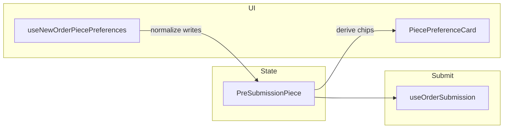

# New Order: Edit Items Preferences (dynamic chip cards)

## Status (implementation vs plan)

**Done (shipped in repo):**

| Area | Notes |
|------|--------|
| Types / mappers | `selected-piece-preference.ts` + Jest (`__tests__/selected-piece-preference.test.ts`), including `condition_damag` path (`delicate`). |
| Hook | `use-new-order-piece-preferences.ts` — add/remove/copy; syncs charges with item service prefs pattern. |
| UI | `piece-preferences/*` + wizard tab in `new-order-content.tsx`; `usePreferenceCatalog` wired. |
| Decision A | Notes tab slimmed (`order-pieces-notes-section.tsx`); `PreferencesPanel` removed from that tab. |
| `prefs_source` / `prefs_no` | `OrderPieceService` + `updateOrder` → **`ORDER_EDIT`**; Prisma **`createOrderInTransaction`** piece rows use named `prefsSourceOnCreate` (`ORDER_CREATE`). |
| Edit API parity | `updateOrderPieceSchema` + `use-order-submission` edit payloads. |
| i18n | `npm run check:i18n` passes. |
| Tests | `__tests__/services/order-piece-service.test.ts` mocks fixed (Supabase head-count chain, `syncItemQuantityReady` spy where needed). |
| Docs | PRD **§11–12** — implementation summary + **QA checklist** + DB note on `prefs_source` column. |

**Optional (human or follow-up PR):**

- Run **PRD §12** steps on staging/production DB and confirm rows visually (`ORDER_CREATE` vs `ORDER_EDIT`).
- Cross-browser / screen-reader pass on the new tab.
- **`useNewOrderPiecePreferences` RTL tests** — not added (medium effort); optional.
- **Supabase `createPiecesForItem`** — pref insert failures still warn-only vs strict fail (product decision).
- **`use-order-submission` strict `tsc`** — cleanup pre-existing typing if desired.

---

## Locked UI decision: Option A (recommended)

- **Edit Items Preferences** tab owns **all** preference kinds (service, packing, stains, damage, special care, patterns, materials, color, etc.) via chip cards + action bar.
- **Edit Item Notes** tab is **notes-first**: per-piece **notes** text and **copy row** affordance; **no** stain/damage/upcharge/color spreadsheet columns.
- **Remove** the bottom [`PreferencesPanel`](../../web-admin/src/features/orders/ui/preferences-panel.tsx) from the Notes tab to eliminate duplicate entry paths.
- **Edit mode (`isEditMode`):** Same step tabs and the new preferences tab when `trackByPiece` — staff use the same flow as create.

---

## Technical approach (summary)

- **Wizard:** Extend [`new-order-content.tsx`](../../web-admin/src/features/orders/ui/new-order-content.tsx) — new tab `piecePreferences` between `details` and `pieces`, gated by `trackByPiece && items.length > 0`; renumber steps (3 prefs, 4 notes, 5 customer when applicable). Include this tab when **`state.isEditMode`** under the same gate so edit/create parity.
- **State:** **Single source of truth** remains [`PreSubmissionPiece`](../../web-admin/src/features/orders/model/new-order-types.ts). Chips are a **derived view** + **normalized writes** via pure mappers.
- **Submit:** [`use-order-submission.ts`](../../web-admin/src/features/orders/hooks/use-order-submission.ts) — create and **edit** payloads must both carry piece-level `conditions`, `servicePrefs`, and `packingPrefCode` where applicable.
- **Catalog:** Reuse [`use-preference-catalog.ts`](../../web-admin/src/features/orders/hooks/use-preference-catalog.ts) for kind buttons and existing selectors in dialogs/sheets.

---

## Backend: `prefs_source` — `ORDER_CREATE` vs `ORDER_EDIT`

**Requirement:** Rows inserted into `org_order_preferences_dtl` must use `prefs_source = 'ORDER_EDIT'` when preferences are created or copied during **order update** flows; use `'ORDER_CREATE'` (or existing item-level `pref.source` / `packingPrefSource`) for **new order create** flows.

**Recommended implementation (server is source of truth):**

- Add a parameter such as `preferencesSourceDefault: 'ORDER_CREATE' | 'ORDER_EDIT'` to internal service methods that insert into `org_order_preferences_dtl`, replacing hardcoded `'ORDER_CREATE'` literals in [`order-service.ts`](../../web-admin/lib/services/order-service.ts) (both Supabase `createOrder` path and Prisma `createOrderInTransaction` / `updateOrder` / piece creation).
- **Call sites:**
  - `OrderService.createOrder` (Supabase) → pass `ORDER_CREATE`.
  - `OrderService.createOrderInTransaction` (Prisma, create-with-payment) → `ORDER_CREATE`.
  - `OrderService.updateOrder` / transactional add-items path that calls [`OrderPieceService.createPiecesForItemWithTx`](../../web-admin/lib/services/order-piece-service.ts) → pass **`ORDER_EDIT`** for all inserts from that operation. **Implemented.**
  - [`OrderPieceService.createPiecesForItem`](../../web-admin/lib/services/order-piece-service.ts) (Supabase) → caller passes source; create-order uses `ORDER_CREATE`, any future update caller uses `ORDER_EDIT`. **Implemented via optional parameter (default `ORDER_CREATE`).**

**Optional explicit API field:** Only add a body field like `preferencesSource` if a route must support mixed semantics; otherwise **infer from operation** (`POST create-with-payment` vs `PATCH .../update`) to avoid client spoofing. Default plan: **infer from operation** inside `OrderService` / route handler.

**Piece-level rows** that today use fixed `'ORDER_CREATE'` (e.g. conditions, packing rows in Prisma block) must use the same parameterized default. **Implemented for `OrderPieceService` paths used by update + Supabase create pieces;** Prisma inline create loop still literals `ORDER_CREATE` (see Status).

**Alignment:** Confirm `'ORDER_EDIT'` is allowed by DB constraints / `sys_preference_kind_cd` / any `prefs_source` check constraints (add migration only if required). **Still an environment-specific verification item.**

---

## API payloads and validation (edit parity)

**Resolved in code:** [`updateOrderPieceSchema`](../../web-admin/lib/validations/edit-order-schemas.ts) now includes `conditions`, `servicePrefs`, and `packingPrefCode`. Edit `updateBody` in [`use-order-submission.ts`](../../web-admin/src/features/orders/hooks/use-order-submission.ts) maps pieces with those fields aligned to create.

**Plan items:**

1. Extend `updateOrderPieceSchema` — **done.**
2. **`PATCH .../update`** → `OrderService.updateOrder` maps piece fields into transactional piece creation + **`ORDER_EDIT`** on new pref rows from `createPiecesForItemWithTx` — **done.**
3. **`use-order-submission`** `updateBody` — **done** (incl. payment + save flows where applicable).
4. **OrderPieceService** — **done** (`prefs_no` ordering + source parameter + packing dtl row on Supabase path).

---

## OrderService insert logic (scope)

- **All** `org_order_preferences_dtl` inserts in [`order-service.ts`](../../web-admin/lib/services/order-service.ts) and [`order-piece-service.ts`](../../web-admin/lib/services/order-piece-service.ts) that currently hardcode `'ORDER_CREATE'` for piece/item packing/conditions/service must use the **operation-scoped** default above. **Piece service + update path done;** full `order-service.ts` sweep optional (see Status).
- Treat **failed** preference inserts in `OrderPieceService.createPiecesForItem` consistently with production bar: either fail the operation or surface error (align with transactional Prisma behavior where applicable). **Open:** Supabase path still warns on partial pref failure.

---

## Quality bar: production-ready (non-negotiable)

Implementation is not complete until **all** of the following are satisfied.

### Data integrity and correctness

- **Round-trip tests:** Mappers covered for every `preference_sys_kind` exposed in the action bar. **Partial:** core round-trip tests exist; exhaustive per-kind matrix optional.
- **No duplicate truth:** Chips derived from `items[].pieces[]` only. **Intended in design.**
- **Charge parity:** `servicePrefCharge` after service pref changes matches [`preferences-panel.tsx`](../../web-admin/src/features/orders/ui/preferences-panel.tsx) logic. **Verify in QA.**
- **prefs_no:** Stable ordering; fix Supabase/Tx piece paths to match Prisma create ordering. **Done in `OrderPieceService`.**
- **Packing:** Single `packingPrefCode` on piece unless product explicitly allows multiple (document rule). **Rule unchanged;** document in PRD if needed.

### UI / UX

- Cmx primitives; `cmxMessage` for copy actions; loading state for catalog; empty chip zone = no extra height; 44px targets; Order Summary still correct. **Spot-check in QA.**

### Accessibility and i18n

- WCAG-oriented keyboard/labels/live regions; full `en`/`ar`; RTL logical layout; `check:i18n`. **i18n parity done;** formal WCAG pass still manual.

### Security

- Prefer server-inferred `prefs_source`; authenticated routes only. **Inference used on server paths above.**

---

## Definition of Done (release checklist)

- [x] Mapper tests green (round-trip + `delicate` / `condition_damag`).
- [x] Decision A: no duplicate pref UI between Preferences and Notes tabs.
- [ ] **Create** submit: DB `prefs_source` spot-check — follow **PRD §12** on a live/staging DB.
- [ ] **Edit** submit: `ORDER_EDIT` on new piece pref rows — follow **PRD §12**.
- [x] Edit API payload includes piece `conditions` / prefs in code paths (`updateOrderPieceSchema`, `use-order-submission`); end-to-end manual still §12.
- [ ] Cross-browser smoke (human).
- [x] `order-piece-service` Jest suite green (mock fixes).
- [x] `npm run check:i18n` passes.

## Documentation

- PRD **§11–12** — [`docs/features/orders/new_order_piece_notes_preferences_ui_prd.md`](../../docs/features/orders/new_order_piece_notes_preferences_ui_prd.md) (implementation + QA checklist + DB note).

---

## Out of scope

- SaaS / tenant admin changes outside `prefs_source` validation.
- Mobile app booking flows (unless they share the same API contract later).
