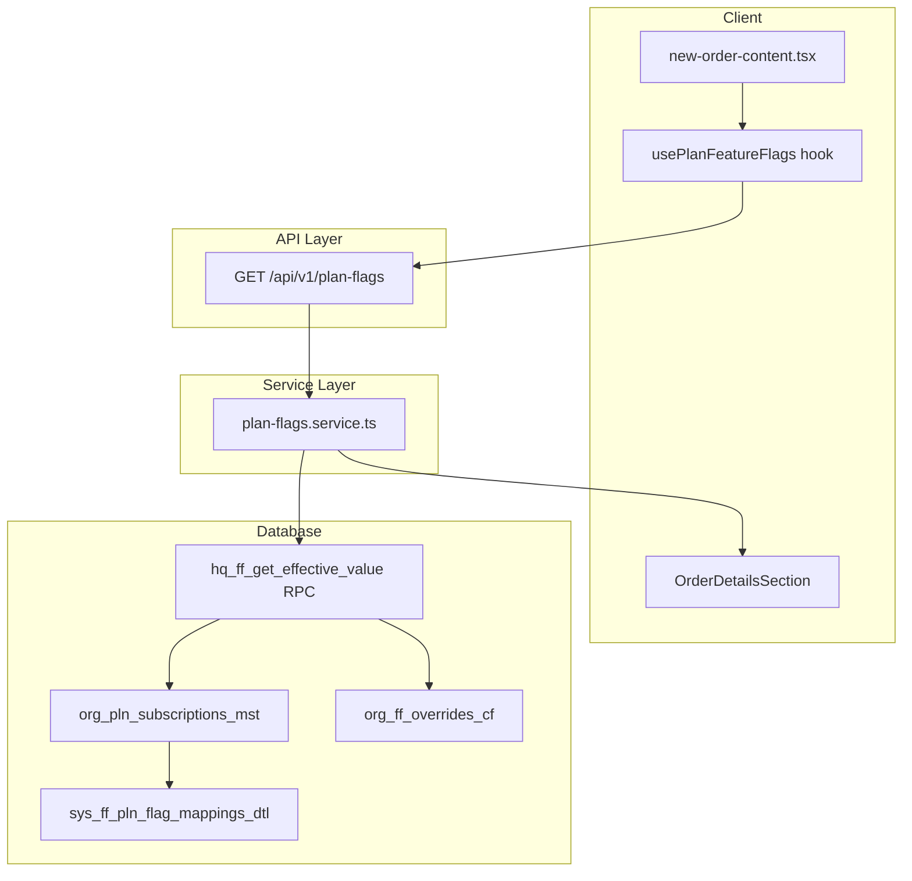

# Plan-Bound Feature Flags Implementation

## Context

The new order Items Details tab uses `bundlesEnabled`, `repeatLastOrderEnabled`, and `smartSuggestionsEnabled` to gate Care Packages, Repeat Last Order, and Smart Suggestions panels. These flags are **plan-bound** (from `hq_ff_feature_flags_mst` + `sys_ff_pln_flag_mappings_dtl`), not tenant settings. The existing `useTenantSettingsWithDefaults` reads from `sys_tenant_settings_cd` only.

**Existing infrastructure:**

- RPC `hq_ff_get_effective_value(p_tenant_id, p_flag_key)` in [supabase/migrations/0062_hq_feature_flags_management_system.sql](supabase/migrations/0062_hq_feature_flags_management_system.sql) — resolves override > plan > default
- Migration [0140_order_service_preferences_flags_settings.sql](supabase/migrations/0140_order_service_preferences_flags_settings.sql) — seeds `bundles_enabled`, `repeat_last_order`, `smart_suggestions` with plan mappings (STARTER, GROWTH, PRO, ENTERPRISE)
- [web-admin/app/api/feature-flags/route.ts](web-admin/app/api/feature-flags/route.ts) — returns `FeatureFlags` from `org_tenants_mst` / `sys_plan_limits` (coarse-grained); does NOT include plan-bound flags

## Architecture



## Implementation Tasks

### 1. Plan Flags Service

**File:** `web-admin/lib/services/plan-flags.service.ts` (new)

- Call Supabase RPC `hq_ff_get_effective_value(tenantId, flagKey)` for each flag: `bundles_enabled`, `repeat_last_order`, `smart_suggestions`
- Parse JSONB `value` to boolean (handle `true`, `"true"`, `1`)
- Export:
  - `getPlanFlags(tenantId: string): Promise<PlanFlags>` — fetches all three
  - `checkPlanFlag(tenantId: string, flagKey: PlanFlagKey): Promise<boolean>` — single flag
- Define `PlanFlags` type and `PLAN_FLAG_KEYS` constant
- Use server Supabase client; accept `SupabaseClient` for server actions or create with `createClient()`

**Constants:** Add to `web-admin/lib/constants/plan-flags.ts`:

- `PLAN_FLAG_KEYS = ['bundles_enabled', 'repeat_last_order', 'smart_suggestions'] as const`
- `type PlanFlagKey = (typeof PLAN_FLAG_KEYS)[number]`
- `interface PlanFlags { bundlesEnabled: boolean; repeatLastOrderEnabled: boolean; smartSuggestionsEnabled: boolean }`

### 2. API Route

**File:** `web-admin/app/api/v1/plan-flags/route.ts` (new)

- `GET` — require auth, resolve tenant via `getTenantIdFromSession()` or `get_user_tenants` RPC
- Call `PlanFlagsService.getPlanFlags(tenantId)`
- Return `{ bundlesEnabled, repeatLastOrderEnabled, smartSuggestionsEnabled }`
- Handle 401/403/500 with structured error response

### 3. Client Hook

**File:** `web-admin/src/features/orders/hooks/use-plan-flags.ts` (new)

- Use `useQuery` from `@tanstack/react-query` with key `['plan-flags', tenantId]`
- Fetch from `GET /api/v1/plan-flags`
- Return `{ bundlesEnabled, repeatLastOrderEnabled, smartSuggestionsEnabled, isLoading, error }`
- Use `useAuth()` to get `currentTenant?.tenant_id`; skip query when no tenant
- Stale time: 5 minutes (align with feature-flags cache)

### 4. Wire New Order UI

**File:** [web-admin/src/features/orders/ui/new-order-content.tsx](web-admin/src/features/orders/ui/new-order-content.tsx)

- Import `usePlanFeatureFlags` (or `usePlanFlags`)
- Destructure `{ bundlesEnabled, repeatLastOrderEnabled, smartSuggestionsEnabled }` from hook
- Pass to `OrderDetailsSection`:

```tsx
<OrderDetailsSection
  trackByPiece={trackByPiece}
  packingPerPieceEnabled={packingPerPieceEnabled}
  bundlesEnabled={bundlesEnabled}
  repeatLastOrderEnabled={repeatLastOrderEnabled}
  smartSuggestionsEnabled={smartSuggestionsEnabled}
  enforcePrefCompatibility={enforcePrefCompatibility}
/>
```

**File:** [web-admin/src/features/orders/ui/order-details-section.tsx](web-admin/src/features/orders/ui/order-details-section.tsx)

- Already has props with defaults; ensure parent passes real values when available
- No change needed if defaults remain for loading/error states

### 5. API Gating (apply-bundle)

**File:** [web-admin/app/api/v1/orders/[id]/items/[itemId]/apply-bundle/[bundleCode]/route.ts](web-admin/app/api/v1/orders/[id]/items/[itemId]/apply-bundle/[bundleCode]/route.ts)

- After `requirePermission('orders:update')`, add:
  - `const bundlesEnabled = await PlanFlagsService.checkPlanFlag(tenantId, 'bundles_enabled')`
  - If `!bundlesEnabled`, return `403 { error: 'Care Packages not available on your plan' }`
- Ensures server-side enforcement even if UI is bypassed

### 6. Repeat Last Order & Smart Suggestions APIs

- Search for APIs that serve repeat-last-order and smart-suggestions data
- Add `repeat_last_order` / `smart_suggestions` checks if those endpoints exist and should be gated
- Document in PERMISSIONS_BY_API if new gates are added

### 7. Documentation

**Create/Update:**

| Document                                                                                                                                         | Action                                                                                                                        |
| ------------------------------------------------------------------------------------------------------------------------------------------------ | ----------------------------------------------------------------------------------------------------------------------------- |
| [docs/platform/feature_flags/FEATURE_FLAGS_USAGE.md](docs/platform/feature_flags/FEATURE_FLAGS_USAGE.md)                                         | Add section "Plan-Bound Flags (Service Prefs)" with plan-flags.service, API route, usePlanFlags, OrderDetailsSection          |
| [docs/platform/feature_flags/FEATURE_FLAGS_REFERENCE.md](docs/platform/feature_flags/FEATURE_FLAGS_REFERENCE.md)                                 | Already documents bundles_enabled, repeat_last_order, smart_suggestions; add "Resolution" note: use hq_ff_get_effective_value |
| [docs/features/Order_Service_Preferences/implementation_requirements.md](docs/features/Order_Service_Preferences/implementation_requirements.md) | Add "Plan Flags Resolution" subsection: plan-flags.service, /api/v1/plan-flags, usePlanFlags                                  |
| [docs/platform/permissions/PERMISSIONS_BY_API.md](docs/platform/permissions/PERMISSIONS_BY_API.md)                                               | Document apply-bundle 403 when bundles_enabled=false                                                                          |
| New: `docs/platform/feature_flags/PLAN_FLAGS_IMPLEMENTATION.md`                                                                                  | Implementation guide: service, API, hook, UI wiring, API gating, fallback behavior                                            |

**Implementation requirements template:** [docs/features/templates/implementation_requirements.md](docs/features/_templates/implementation_requirements.md) — already has Feature Flags section; ensure it references plan-bound vs tenant settings distinction.

### 8. Error Handling & Fallbacks

- **No tenant:** Hook returns `bundlesEnabled: false` etc.; UI hides panels
- **API error:** Hook `error` state; use defaults `false` so UI does not crash
- **RPC not found:** plan-flags.service catches, returns `false` for that flag
- **Tenant has no org_pln_subscriptions_mst:** RPC returns `default_value` (false) — safe

### 9. Testing Checklist

- Items Details tab loads without error when plan has no bundles
- Care Packages panel visible when tenant on GROWTH/PRO/ENTERPRISE
- Repeat Last Order panel visible when tenant on STARTER+
- Smart Suggestions panel visible when tenant on GROWTH+
- apply-bundle API returns 403 when bundles_enabled=false
- apply-bundle API succeeds when bundles_enabled=true
- Build passes: `npm run build` in web-admin

### 10. Migration Verification

- Confirm migration 0140 has been applied (bundles_enabled, repeat_last_order, smart_suggestions in hq_ff_feature_flags_mst and sys_ff_pln_flag_mappings_dtl)
- If not applied, user runs migrations manually (per CLAUDE.md)

## File Summary

| Path                                                                                 | Action |
| ------------------------------------------------------------------------------------ | ------ |
| `web-admin/lib/constants/plan-flags.ts`                                              | Create |
| `web-admin/lib/services/plan-flags.service.ts`                                       | Create |
| `web-admin/app/api/v1/plan-flags/route.ts`                                           | Create |
| `web-admin/src/features/orders/hooks/use-plan-flags.ts`                              | Create |
| `web-admin/src/features/orders/ui/new-order-content.tsx`                             | Edit   |
| `web-admin/app/api/v1/orders/[id]/items/[itemId]/apply-bundle/[bundleCode]/route.ts` | Edit   |
| `docs/platform/feature_flags/FEATURE_FLAGS_USAGE.md`                                 | Edit   |
| `docs/platform/feature_flags/PLAN_FLAGS_IMPLEMENTATION.md`                           | Create |
| `docs/features/Order_Service_Preferences/implementation_requirements.md`             | Edit   |
| `docs/platform/permissions/PERMISSIONS_BY_API.md`                                    | Edit   |

## Out of Scope (Future)

- `org_ff_overrides_cf` tenant overrides (HQ approval workflow) — RPC already supports; no UI changes
- Extending `useTenantSettingsWithDefaults` to merge plan flags — keeps concerns separate (tenant settings vs plan flags)
- Zustand deprecation warning — separate dependency update
