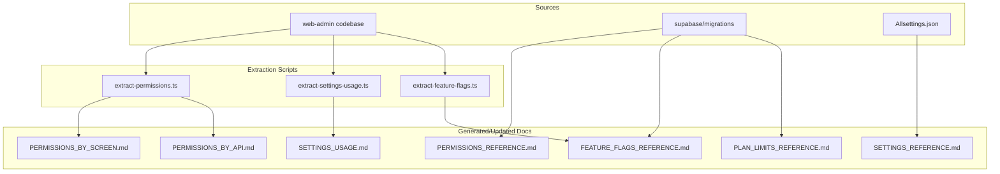

# Platform Documentation Build Plan

## Goal

Create and maintain documentation that captures:

- **Permissions** — required/used per module, screen, API route, and navigation item
- **Settings** — tenant settings catalog, resolution, usage
- **Feature flags** — flag definitions, plan mappings, usage
- **Plan limits/constraints** — limits, constraints, usage

Cover the full codebase and provide tooling to regenerate or validate docs when code changes.

---

## Current State

| Area          | Existing Docs                                                  | Source of Truth                                                   |
| ------------- | -------------------------------------------------------------- | ----------------------------------------------------------------- |
| Permissions   | RBAC docs, scattered `implementation_requirements.md`          | Code (RequirePermission, requirePermission, sys_components_cd)    |
| Settings      | `.claude/docs/Allsettings.md`, `.claude/docs/Allsettings.json` | `sys_tenant_settings_cd`, `tenant-settings.service.ts`            |
| Feature flags | None centralized                                               | `hq_ff_feature_flags_mst`, `feature-flags.service.ts`, migrations |
| Plan limits   | None centralized                                               | `sys_plan_limits`, `usage-tracking.service.ts`                    |

---

## Documentation Structure

```
docs/
├── platform/                          # NEW: Platform-level reference docs
│   ├── README.md                      # Index and overview
│   ├── permissions/
│   │   ├── PERMISSIONS_REFERENCE.md   # All permission codes, descriptions, role assignments
│   │   ├── PERMISSIONS_BY_MODULE.md   # Grouped by module (orders, customers, etc.)
│   │   ├── PERMISSIONS_BY_SCREEN.md   # Per screen/route with required permissions
│   │   ├── PERMISSIONS_BY_API.md      # Per API route with required permissions
│   │   ├── NAVIGATION_PERMISSIONS.md  # sys_components_cd main_permission_code, roles
│   │   ├── WORKFLOW_SCREEN_CONTRACTS.md # org_ord_screen_contracts_cf required_permissions
│   │   ├── WORKFLOW_ROLES.md          # Workflow roles (ROLE_ADMIN, ROLE_RECEPTION, etc.)
│   │   ├── ROLE_BASED_GUARDS.md       # withRole, role-based vs permission-based
│   │   ├── API_AUTH_GAPS.md           # Routes with auth-only (no permission check)
│   │   ├── SERVER_ACTIONS_AND_RLS.md  # Server actions, RLS, resource-scoped
│   │   ├── CMX_API_PERMISSIONS.md     # cmx-api NestJS guards
│   │   └── ADMIN_APIS.md             # Navigation, roles, permissions APIs
│   ├── settings/
│   │   ├── SETTINGS_REFERENCE.md      # Human-readable catalog (extends Allsettings.md)
│   │   ├── SETTINGS_BY_CATEGORY.md    # Grouped by stng_category_code
│   │   ├── SETTINGS_USAGE.md          # Where each setting is used in code
│   │   ├── PLAN_BOUND_SETTINGS.md     # sys_plan_setting_constraints
│   │   └── SETTINGS_HQ_API.md         # HQ API, settings-client
│   ├── feature_flags/
│   │   ├── FEATURE_FLAGS_REFERENCE.md # All flags, plan mappings, descriptions
│   │   ├── FEATURE_FLAGS_USAGE.md     # Where each flag is checked in code
│   │   ├── NAVIGATION_FEATURE_FLAGS.md # sys_components_cd.feature_flag
│   │   └── TENANT_AND_PLAN_FLAGS.md   # org_tenants_mst, sys_plan_limits JSON flags
│   └── plan_limits/
│       ├── PLAN_LIMITS_REFERENCE.md   # Plans, limits, constraints
│       ├── PLAN_LIMITS_USAGE.md       # Where limits are enforced
│       ├── PLAN_CONSTRAINTS.md        # sys_plan_setting_constraints
│       └── SUBSCRIPTION_UI.md         # Subscription page, upgrade flow
```

---

## Phase 1: Permissions Documentation

### 1.1 Create `docs/platform/permissions/PERMISSIONS_REFERENCE.md`

- Extract all permission codes from:
  - [docs/master_data/Permissions_To_InsertTo_DB.sql](docs/master_data/Permissions_To_InsertTo_DB.sql)
  - [supabase/migrations](supabase/migrations) (sys_auth_permissions inserts)
- For each: code, name, name2, category, description, typical roles
- Cross-reference with `sys_auth_role_default_permissions` (from DB or migrations)

### 1.2 Create `docs/platform/permissions/PERMISSIONS_BY_MODULE.md`

- Group by resource prefix: `orders:*`, `customers:*`, `payments:*`, `config:*`, etc.
- List screens, APIs, and UI elements per module

### 1.3 Create `docs/platform/permissions/PERMISSIONS_BY_SCREEN.md`

- One row per screen/route in `web-admin/app/dashboard/**`
- Source: [RequirePermission](web-admin/src/features/auth/ui/RequirePermission.tsx), [useHasPermission](web-admin/lib/hooks/usePermissions.ts)
- Format: `| Route | Required Permission(s) | Component/Hook |`

### 1.4 Create `docs/platform/permissions/PERMISSIONS_BY_API.md`

- One row per API route in `web-admin/app/api/**`
- Source: [require-permission.ts](web-admin/lib/middleware/require-permission.ts) usage
- Format: `| Method | Route | Permission(s) |`

### 1.5 Create `docs/platform/permissions/NAVIGATION_PERMISSIONS.md`

- Extract from `sys_components_cd` (migrations: 0059, 0141, add_sys_comp.sql)
- Columns: comp_code, comp_path, main_permission_code, roles, feature_flag

### 1.6 Create `docs/platform/permissions/WORKFLOW_SCREEN_CONTRACTS.md`

- Source: [org_ord_screen_contracts_cf](supabase/migrations/0077_workflow_config_tables.sql), [cmx_ord_screen_pre_conditions](supabase/migrations/0075_screen_contract_functions_simplified.sql), [0130](supabase/migrations/0130_cmx_ord_canceling_returning_functions.sql)
- Document `required_permissions` per screen_key: preparation, processing, assembly, qa, packing, ready_release, driver_delivery, new_order, workboard, cancel, return
- Include [workflow-service-enhanced.ts](web-admin/lib/services/workflow-service-enhanced.ts) usage, [use-screen-contract.ts](web-admin/lib/hooks/use-screen-contract.ts)

### 1.7 Create `docs/platform/permissions/WORKFLOW_ROLES.md`

- Document workflow roles (ROLE_ADMIN, ROLE_RECEPTION, etc.) from [RequireWorkflowRole](web-admin/src/features/auth/ui/RequirePermission.tsx), [use-has-workflow-role.ts](web-admin/lib/hooks/use-has-workflow-role.ts)
- Source: org_auth_user_workflow_roles, workflow config

### 1.8 Create `docs/platform/permissions/ROLE_BASED_GUARDS.md`

- Document [withRole](web-admin/lib/auth/with-role.tsx) — role-based (admin, super_admin, tenant_admin, operator, viewer)
- Document layout/page guards that use role checks
- Distinguish role-based vs permission-based access

### 1.9 Create `docs/platform/permissions/API_AUTH_GAPS.md`

- Document API routes that use **auth-only** (no explicit permission check):
  - Assembly: [tasks/route.ts](web-admin/app/api/v1/assembly/tasks/route.ts), tasks/[taskId]/* (getAuthContext only)
  - Delivery: routes, stops, orders (no requirePermission found)
  - Receipts: [resend](web-admin/app/api/v1/receipts/[id]/resend/route.ts)
  - Customers: [merge](web-admin/app/api/v1/customers/merge/route.ts), [export](web-admin/app/api/v1/customers/export/route.ts) (custom getAuthContext, no permission)
- Document [requireTenantAuth](web-admin/lib/middleware/tenant-guard.ts) usage (preparation routes — uses hasPermissionServer)
- Flag routes that need permission checks added

### 1.10 Create `docs/platform/permissions/SERVER_ACTIONS_AND_RLS.md`

- Server actions: [payment-crud-actions](web-admin/app/actions/payments/payment-crud-actions.ts) (hasPermissionServer), [orders.ts](web-admin/lib/db/orders.ts) (pricing:override)
- RLS: cmx_can, has_permission in [0036_rbac_rls_functions.sql](supabase/migrations/0036_rbac_rls_functions.sql)
- Document resource-scoped: [RequireResourcePermission](web-admin/src/features/auth/ui/RequireResourcePermission.tsx), [use-has-resource-permission](web-admin/lib/hooks/use-has-resource-permission.ts)

### 1.11 Create `docs/platform/permissions/CMX_API_PERMISSIONS.md`

- Document [cmx-api](cmx-api/) NestJS guards: [jwt-auth.guard](cmx-api/src/common/guards/jwt-auth.guard.ts), [tenant.guard](cmx-api/src/common/guards/tenant.guard.ts)
- Document any permission decorators or guards in cmx-api
- Note: cmx-api is Phase 2; document current state and future permission model

### 1.12 Create `docs/platform/permissions/ADMIN_APIS.md`

- Navigation: [navigation/route.ts](web-admin/app/api/navigation/route.ts), [navigation/components](web-admin/app/api/navigation/components/)
- Roles: [roles/[id]/route.ts](web-admin/app/api/roles/[id]/route.ts), [roles/[id]/permissions](web-admin/app/api/roles/[id]/permissions/route.ts)
- Permissions: [permissions/route.ts](web-admin/app/api/permissions/route.ts)
- Document required permissions/roles for these admin APIs

---

## Phase 2: Settings Documentation

### 2.1 Extend `docs/platform/settings/SETTINGS_REFERENCE.md`

- Use [.claude/docs/Allsettings.json](.claude/docs/Allsettings.json) as base
- Add: stng_category_code, stng_scope, plan_bound, stng_depends_on_flags
- Link to [.claude/docs/Allsettings.md](.claude/docs/Allsettings.md) for human-readable table

### 2.2 Create `docs/platform/settings/SETTINGS_BY_CATEGORY.md`

- Group by `stng_category_code`: SYSTEM, GENERAL, ORDERS, SERVICE_PREF, etc.
- Include resolution hierarchy (7-layer) from [tenant-settings.service.ts](web-admin/lib/services/tenant-settings.service.ts)

### 2.3 Create `docs/platform/settings/SETTINGS_USAGE.md`

- Grep for `getSettingValue`, `fn_stng_resolve`, `SETTING_CODES`, setting codes in code
- Map each setting code to file(s) and context

### 2.4 Create `docs/platform/settings/PLAN_BOUND_SETTINGS.md`

- Source: [sys_plan_setting_constraints](supabase/migrations/0074_sys_plan_setting_constraints.sql)
- Document constraint_type (max_value, min_value, deny), constraint_value, plan_code per stng_code
- Link to [stng_edit_policy](supabase/migrations/0117_sys_tenant_settings_edit_policy.sql), [stng_required_min_layer](supabase/migrations/0115_sys_tenant_settings_cd_required_columns.sql)

### 2.5 Create `docs/platform/settings/SETTINGS_HQ_API.md`

- Document [SETTINGS_HQ_API_MIGRATION](web-admin/docs/SETTINGS_HQ_API_MIGRATION.md), [hq-api-client](web-admin/lib/api/hq-api-client.ts) settings calls
- Document [settings-client](web-admin/lib/api/settings-client.ts), tenant profile API

---

## Phase 3: Feature Flags Documentation

### 3.1 Create `docs/platform/feature_flags/FEATURE_FLAGS_REFERENCE.md`

- Extract from migrations: 0066, 0140, 0143
- Tables: `hq_ff_feature_flags_mst`, `sys_ff_pln_flag_mappings_dtl`
- Columns: flag_key, description, plan mappings, default value

### 3.2 Create `docs/platform/feature_flags/FEATURE_FLAGS_USAGE.md`

- Grep for `getFeatureFlags`, `canAccess`, `requireFeature`, `currentTenantCan`, `feature_flag` in code
- Map each flag to usage context

### 3.3 Create `docs/platform/feature_flags/NAVIGATION_FEATURE_FLAGS.md`

- Document `sys_components_cd.feature_flag` — navigation items gated by feature flags
- Source: [0059_navigation_seed](supabase/migrations/0059_navigation_seed.sql), [navigation.service](web-admin/lib/services/navigation.service.ts)
- Document [NavigationItemForm](web-admin/src/features/settings/ui/NavigationItemForm.tsx), [cmx-sidebar](web-admin/src/ui/navigation/cmx-sidebar.tsx)

### 3.4 Create `docs/platform/feature_flags/TENANT_AND_PLAN_FLAGS.md`

- Document `org_tenants_mst.feature_flags` (JSON) vs `hq_ff_*` tables
- Document `sys_plan_limits.feature_flags` (JSON)
- Document [subscriptions.service](web-admin/lib/services/subscriptions.service.ts), [SubscriptionSettings](web-admin/src/features/settings/ui/SubscriptionSettings.tsx)
- Document [Widget](web-admin/src/features/dashboard/ui/Widget.tsx) feature-flag usage

---

## Phase 4: Plan Limits Documentation

### 4.1 Create `docs/platform/plan_limits/PLAN_LIMITS_REFERENCE.md`

- Extract from `sys_plan_limits` schema and seed migrations
- Columns: plan_code, orders_limit, users_limit, branches_limit, storage_mb_limit, feature_flags
- Include `sys_plan_setting_constraints` for plan-bound settings

### 4.2 Create `docs/platform/plan_limits/PLAN_LIMITS_USAGE.md`

- Source: [usage-tracking.service.ts](web-admin/lib/services/usage-tracking.service.ts), [plan-limits.middleware.ts](web-admin/lib/middleware/plan-limits.middleware.ts)
- Document: canCreateOrder, canAddUser, canAddBranch, and where they are called

### 4.3 Create `docs/platform/plan_limits/PLAN_CONSTRAINTS.md`

- Document `sys_plan_setting_constraints` — plan-bound setting constraints (max_value, min_value, deny)
- Link to [subscription_limits](docs/features/002_tenant_management_dev_prd/subscription_limits.md)
- Document tenant initialization limits from [TENANT_INITIALIZATION](docs/dev/TENANT_INITIALIZATION.md)

### 4.4 Create `docs/platform/plan_limits/SUBSCRIPTION_UI.md`

- Document [subscription/page](web-admin/app/dashboard/subscription/page.tsx), [PlanLimitsSettings](web-admin/src/features/settings/ui/PlanLimitsSettings.tsx)
- Document upgrade flow: [subscriptions/upgrade](web-admin/app/api/v1/subscriptions/upgrade/route.ts)

---

## Phase 5: Extraction Scripts

### 5.1 Script: `scripts/docs/extract-permissions.ts`

- Parse `web-admin` for RequirePermission, useHasPermission, requirePermission
- Output: JSON or append to PERMISSIONS_BY_SCREEN / PERMISSIONS_BY_API
- Run via `npm run docs:extract-permissions` (add to package.json)

### 5.2 Script: `scripts/docs/extract-settings-usage.ts`

- Grep for setting codes and resolution calls
- Output: SETTINGS_USAGE.md or JSON

### 5.3 Script: `scripts/docs/extract-feature-flags.ts`

- Parse feature flag checks in code
- Output: FEATURE_FLAGS_USAGE.md

### 5.4 Script: `scripts/docs/extract-api-auth-audit.ts`

- Scan all `web-admin/app/api/**/route.ts` files
- Detect: requirePermission, requireTenantAuth, getAuthContext, custom getAuthContext
- Output: API_AUTH_AUDIT.md — routes with explicit permission vs auth-only vs none
- Flag routes that may need permission checks added

### 5.5 Script: `scripts/docs/validate-docs.ts`

- Compare extracted data with docs
- Report drift (e.g., new API route without documented permission)

---

## Phase 6: Integration with Feature Docs

### 6.1 Template: `docs/features/_templates/implementation_requirements.md`

- Standard template aligning with [Order_Service_Preferences/implementation_requirements.md](docs/features/Order_Service_Preferences/implementation_requirements.md)
- Sections: Permissions, Navigation, Tenant Settings, Feature Flags, Plan Limits, i18n, API Routes, Migrations, Constants/Types

### 6.2 Update `.cursor/rules/documentationrules.mdc`

- Add link to `docs/platform/README.md` for platform-level reference
- Require new features to add entries to platform docs (or run extraction)

---

## Data Flow (Mermaid)



---

## Implementation Order

1. **Phase 1** — Permissions docs (highest demand from recent issues)
2. **Phase 2** — Settings docs (Allsettings exists; extend and add usage)
3. **Phase 3** — Feature flags docs
4. **Phase 4** — Plan limits docs
5. **Phase 5** — Extraction scripts (can be built incrementally per phase)
6. **Phase 6** — Template and rules update

---

## Key Files to Modify/Create

| File                                                      | Action                       |
| --------------------------------------------------------- | ---------------------------- |
| `docs/platform/README.md`                                 | Create — index               |
| `docs/platform/permissions/*.md`                          | Create — 12 files            |
| `docs/platform/settings/*.md`                             | Create — 5 files             |
| `docs/platform/feature_flags/*.md`                        | Create — 4 files             |
| `docs/platform/plan_limits/*.md`                          | Create — 4 files             |
| `scripts/docs/extract-permissions.ts`                     | Create                       |
| `scripts/docs/extract-settings-usage.ts`                  | Create                       |
| `scripts/docs/extract-feature-flags.ts`                   | Create                       |
| `scripts/docs/extract-api-auth-audit.ts`                  | Create — find API routes without permission checks |
| `scripts/docs/validate-docs.ts`                           | Create                       |
| `docs/features/_templates/implementation_requirements.md` | Create                       |
| `web-admin/package.json`                                  | Add `docs:extract-*` scripts |
| `.cursor/rules/documentationrules.mdc`                    | Add platform docs link       |

---

## Maintenance

- Run extraction scripts after significant permission/API/settings changes
- Add `docs:validate` to CI (optional) to catch doc drift
- When adding new features, update both feature-level `implementation_requirements.md` and platform docs (or rely on extraction)

---

## Comprehensive Coverage Checklist

Ensure no area is missed. Document all of:

**Permissions:**
- [ ] RequirePermission, RequireAnyPermission, RequireAllPermissions (UI)
- [ ] useHasPermission, useHasAnyPermission, useHasAllPermissions (hooks)
- [ ] requirePermission, requireTenantAuth (API middleware)
- [ ] hasPermissionServer (server actions)
- [ ] org_ord_screen_contracts_cf.required_permissions (workflow screens)
- [ ] sys_components_cd.main_permission_code (navigation)
- [ ] withRole (role-based guards)
- [ ] RequireWorkflowRole, useHasWorkflowRole (workflow roles)
- [ ] RequireResourcePermission (resource-scoped)
- [ ] cmx_can, has_permission (RLS/database)
- [ ] getAuthContext-only routes (assembly, delivery, receipts)
- [ ] Custom getAuthContext routes (customers/merge, export)
- [ ] cmx-api guards (NestJS)
- [ ] Navigation, roles, permissions admin APIs

**Settings:**
- [ ] sys_tenant_settings_cd (catalog)
- [ ] fn_stng_resolve_* (resolution)
- [ ] tenant-settings.service, useTenantSettings
- [ ] sys_plan_setting_constraints (plan-bound)
- [ ] stng_edit_policy, stng_required_min_layer
- [ ] HQ API, settings-client

**Feature flags:**
- [ ] hq_ff_feature_flags_mst, sys_ff_pln_flag_mappings_dtl
- [ ] org_tenants_mst.feature_flags, sys_plan_limits.feature_flags
- [ ] sys_components_cd.feature_flag (navigation)
- [ ] feature-flags.service, canAccess, requireFeature
- [ ] Widget, SubscriptionSettings

**Plan limits:**
- [ ] sys_plan_limits (orders_limit, users_limit, branches_limit)
- [ ] usage-tracking.service (canCreateOrder, canAddUser, canAddBranch)
- [ ] plan-limits.middleware
- [ ] sys_plan_setting_constraints
- [ ] Subscription UI, upgrade flow
