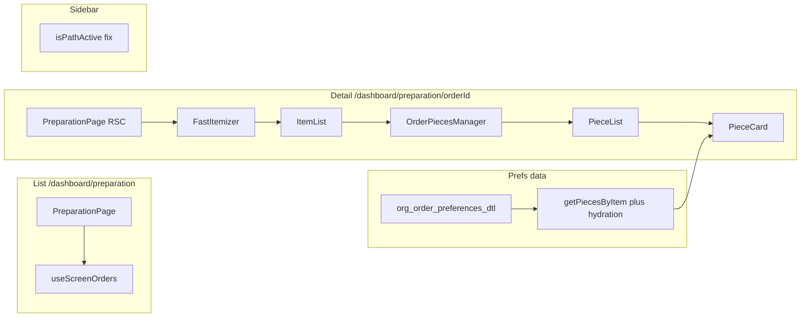

# Preparation screen enhancements

**Plan:** completed **2026-05-12**. Authoritative progress table and implementation pointers: **[`docs/features/Customer_Order_Item_Pieces_Preferences/preparation-workflow-ui-status.md`](../../docs/features/Customer_Order_Item_Pieces_Preferences/preparation-workflow-ui-status.md)** (repo-relative from this file: `docs/features/Customer_Order_Item_Pieces_Preferences/preparation-workflow-ui-status.md`).

> **Scope note (unchanged from original plan):** bulk **preference** apply via batch piece PATCH remains **out of scope**; bulk **rack/step** (and selection UX) is in scope and shipped.

## Scope

Two user-facing surfaces:

| Route | Current behavior | Enhancement focus |
|-------|------------------|-------------------|
| [`/dashboard/preparation`](web-admin/app/dashboard/preparation/page.tsx) | KPI cards + order cards grid | Search/sort (hook already supports `search`, `sortBy`, `sortOrder` in [`use-screen-orders.ts`](web-admin/lib/hooks/use-screen-orders.ts)); optional compact table toggle later |
| [`/dashboard/preparation/[orderId]`](web-admin/app/dashboard/preparation/[orderId]/page.tsx) | Header shows `order_no` only; body is [`FastItemizer`](web-admin/src/features/workflow/ui/FastItemizer.tsx) | Richer **order context** (customer, phone, received date, bags); piece UX density and IDs; **editable unified prefs** on each piece (see § Preferences) |

The screenshot (Piece N, Step, Ready, Notes, Rack) maps to [`PieceCard.tsx`](web-admin/src/features/orders/ui/PieceCard.tsx), embedded from [`ItemList.tsx`](web-admin/src/features/workflow/ui/ItemList.tsx) via [`OrderPiecesManager`](web-admin/src/features/orders/ui/OrderPiecesManager.tsx).

## Preferences (unified model) — inclusion in this work

**Authority:** [`docs/dev/preferences-architecture-reference.md`](docs/dev/preferences-architecture-reference.md) — all preference *facts* live in **`org_order_preferences_dtl`**; piece/item columns are operational or denormalized, not a second source of truth for new UI.

**Gap today:** [`OrderPieceService.getPiecesByItem`](web-admin/lib/services/order-piece-service.ts) returns DB-mapped pieces only. **`getPiecesByOrder`** already joins `org_order_preferences_dtl` for **`service_prefs`** and condition kinds (`condition_stain`, `condition_damag`, `condition_special`). The preparation flow loads pieces via **GET** [`/api/v1/orders/.../items/.../pieces`](web-admin/app/api/v1/orders/[id]/items/[itemId]/pieces/route.ts), which calls **`getPiecesByItem`** — so **operators may see no prefs on preparation even when prefs exist** (unlike processing UI, which uses enriched shapes elsewhere).

**Backend (required for load + edit):**

- Extract a **shared helper** (e.g. `attachPiecePreferencesFromDtl(supabase, tenantId, pieces: OrderItemPiece[])`) used by both `getPiecesByItem` and `getPiecesByOrder`, or reuse the same query block for an item’s piece IDs — avoid duplicated mapping rules.
- Extend enrichment as needed for **`packing_prefs`** at PIECE scope (per doc §5–7) so UI and DTL stay aligned; if `packing_pref_code` on the piece row is the display source, still reconcile with `org_order_preferences_dtl` on read.

**UI (preparation) — editable (product requirement):**

- **Interaction pattern:** Prefer an **expandable row** on [`PieceCard`](web-admin/src/features/orders/ui/PieceCard.tsx) or **“Preferences”** trigger opening [`CmxDialog`](web-admin/src/ui/overlays) so the main card stays compact; operators edit in one place without endlessly tall cards on large layouts.
- **Reuse components** (same behavior as New Order / edit where possible): [`ServicePreferenceSelector`](web-admin/src/features/orders/ui/), [`PackingPreferenceSelector`](web-admin/src/features/orders/ui/preferences-panel.tsx) (or equivalent), condition toggles such as [`StainConditionToggles`](web-admin/src/features/orders/ui/stain-condition-toggles.tsx) / patterns from [`PreferencesForSelectedPiecePanel`](web-admin/src/features/orders/ui/preferences/PreferencesForSelectedPiecePanel.tsx). Load catalog via existing hooks (e.g. `usePreferenceCatalog`) — pass **branch** from the parent order context (thread `branchId` from [`FastItemizer`](web-admin/src/features/workflow/ui/FastItemizer.tsx) / [`ItemList`](web-admin/src/features/workflow/ui/ItemList.tsx) props from [`getOrderForPrep`](web-admin/app/actions/orders/get-order.ts) data if not already available on the client).
- **Writes (no new parallel model):**
  - **Service prefs:** **GET/POST/DELETE** [`/api/v1/orders/.../items/.../pieces/.../service-prefs`](web-admin/app/api/v1/orders/[id]/items/[itemId]/pieces/[pieceId]/service-prefs/route.ts) backed by [`OrderPiecePreferenceService`](web-admin/lib/services/order-piece-preference.service.ts).
  - **Packing / operational fields on piece row:** **PATCH** [`/api/v1/orders/.../items/.../pieces/...`](web-admin/app/api/v1/orders/[id]/items/[itemId]/pieces/[pieceId]/route.ts) (`orders:update`) via existing [`OrderPieceService.updatePiece`](web-admin/lib/services/order-piece-service.ts) — only pass fields the service persists correctly; if packing must be **only** DTL per architecture doc, use the same code paths as edit-order / preference services (discover during implementation; do not duplicate DTL writes in the client).
  - **Conditions:** follow the same API paths used by edit flows (piece prefs DTL); if only POST service-prefs covers conditions, align with existing validation schemas in [`service-preferences-schemas`](web-admin/lib/validations/service-preferences-schemas.ts).
- **After save:** refresh local state from **GET pieces** (or merge PATCH response), call **PricePreview** refetch ([`/api/v1/preparation/.../preview`](web-admin/app/api/v1/preparation/[id]/preview/route.ts) or existing hook) so line totals stay correct when `extra_price` changes.
- **Bulk preference apply:** still **not** in the batch piece PATCH contract — **out of scope** for this iteration unless extended later; bulk rack/step remains as planned.

**Permissions:** editable flows require whatever the existing routes enforce (e.g. **`orders:update`** on piece PATCH; confirm service-prefs route alignment with [`orders-access`](web-admin/src/features/orders/access/orders-access.ts) / linked APIs).

**Memo:** Update [`PieceCard` `React.memo`](web-admin/src/features/orders/ui/PieceCard.tsx) comparison to include `service_prefs`, `conditions`, `packing_pref_code` (and any fields rendered/edited) so stale UI does not occur.

## 1. Fix sidebar: Dashboard wrongly active under `/dashboard/preparation`

**Cause:** [`isPathActive`](web-admin/config/navigation.ts) returns true for any path starting with `itemPath + '/'`. For `itemPath === '/dashboard'`, `/dashboard/preparation/...` matches.

**Change:** Make `/dashboard` active only when the pathname is exactly `/dashboard` or `/dashboard/` (no extra segment), *or* use path-segment logic: active if `itemPath` equals current path or current path is a direct child **only when** the next segment does not belong to another top-level nav item—simplest robust fix: special-case `itemPath === '/dashboard'` to require exact match (and optionally locale-prefixed variants if you use them—verify `usePathname()` in app).

Child items under Orders already use `pathname === child.path` in flyout mode ([`cmx-sidebar.tsx`](web-admin/src/ui/navigation/cmx-sidebar.tsx) ~428); nested preparation detail `/dashboard/preparation/:id` must mark **Preparation** child active via `isPathActive(pathname, child.path)` for children—confirm expanded (non-collapsed) branch uses the same helper for child highlighting; align with fixed parent logic.

## 2. Preparation detail: order context header

In [`PreparationContent`](web-admin/app/dashboard/preparation/[orderId]/page.tsx), `order` from `getOrderForPrep` already includes customer relations (used elsewhere). Add a compact **summary bar**: order number (existing), customer name + phone, received date, bag/item counts if present on `OrderWithDetails`.

- Reuse existing i18n under `workflow` / `preparation` where possible; search for keys before adding ([`en.json`](web-admin/messages/en.json) / [`ar.json`](web-admin/messages/ar.json)).
- Optional: match the permissions label **“Preparation Details”** from [`orders-access.ts`](web-admin/src/features/orders/access/orders-access.ts) via a translation key for screen readers / subtitle consistency.

## 3. Piece cards: readability, placeholder, density

**Long `piece_code`:** Today shown in full next to “Piece N” ([`PieceCard.tsx`](web-admin/src/features/orders/ui/PieceCard.tsx) ~82–84). **Change:** show a short label (e.g. last 6–8 chars) or truncate with ellipsis; full value in `title` / tooltip for hover/focus (a11y).

**Rack placeholder appearing cut off:** English string is short, but **narrow `col-span-2`** can clip native placeholder. **Change:** add `min-w-0` / `w-full` on the input wrapper, or use a shorter placeholder key (e.g. reuse `e.g., Rack A-12` pattern from other namespaces—grep for existing keys first).

**Density:** Add an optional `density?: 'comfortable' | 'compact'` on `PieceCard`/`PieceList` (tighter padding, single-row layout on `md+` via grid tweaks), controlled by a toggle in `OrderPiecesManager` or `ItemList` header so operators can switch when many pieces exist. Pagination already exists in `PieceList` (`pageSize` 20).

## 4. Bulk actions: enable and complete selection UX

[`PieceBulkOperations`](web-admin/src/features/orders/ui/PieceBulkOperations.tsx) exists, but [`ItemList`](web-admin/src/features/workflow/ui/ItemList.tsx) instantiates `OrderPiecesManager` **without** `enableBulkOperations` (defaults false). Per-piece **subset selection is not wired**: there are no checkboxes on `PieceCard` tied to `selectedPieces`.

**Changes:**

- Pass `enableBulkOperations={true}` from `ItemList` for preparation (or always when `trackByPiece`).
- Extend `PieceList` / `PieceCard`: when bulk mode on, show a selection checkbox; toggle updates `selectedPieces` in `OrderPiecesManager` (already holds this state).
- When `selectedPieces.size === 0`, keep “Select all” behavior; when partial selection, show bulk toolbar as today.
- Verify batch PATCH [`/api/v1/orders/.../pieces`](web-admin/app/api/v1/orders) supports the fields you apply (step / rack / status)—align with existing `handleBatchUpdate`.

Optional: `enableBarcodeScanner`—only if preparation workflow benefits; API wiring already exists on `OrderPiecesManager`.

## 5. Replace raw `<button>` in `FastItemizer` (follow-up quality)

[`FastItemizer`](web-admin/src/features/workflow/ui/FastItemizer.tsx) uses plain `<button>` for primary/secondary actions. Per project rules, prefer **`CmxButton`** from `@ui/primitives` with snippets from [`web-admin/.clauderc`](web-admin/.clauderc) for consistency and a11y.

## 6. Production readiness — engineering, UI/UX, no gaps

This deliverable is **done** only when behavior is **consistent, tenant-safe, and shippable**. Follow repo rules: `CLAUDE.md`, `AGENTS.md`, `.cursor/rules/uiuxrules.mdc`, `.cursor/rules/web-admin-ui-imports.mdc`, `.cursor/rules/web-admin-typecheck-patterns.mdc`, and load `.claude/skills/frontend/SKILL.md` + `.claude/skills/i18n/SKILL.md` when implementing UI and copy.

**Data model — zero ambiguity:**

- **Single hydration path** for piece prefs from **`org_order_preferences_dtl`** (shared helper); **`getPiecesByItem`** and **`getPiecesByOrder`** must not drift in field mapping or kind filters.
- **Writes** only through existing server routes/services (no client-only “shadow” pref state that never syncs). After any pref save, **refetch pieces** (and **PricePreview**) so UI matches DB and pricing reflects `extra_price`.

**UI / UX (Cmx design system):**

- **Components:** **`@ui/primitives`**, **`@ui/forms`**, **`@ui/overlays`**, **`@ui/feedback`** only — snippets from [`.clauderc`](web-admin/.clauderc); no raw buttons on primary flows except where primitives wrap them.
- **States:** Loading skeletons or inline spinners for piece list and pref dialog saves; **disable** submit while saving; **empty** pref catalog vs empty selections handled without dead ends.
- **Feedback:** [`useMessage`](web-admin/src/ui/feedback/useMessage.ts) / toasts for success and structured errors; failed saves **rollback** optimistic updates (match [`OrderPiecesManager`](web-admin/src/features/orders/ui/OrderPiecesManager.tsx) patterns).
- **Preferences dialog:** Avoid massive scroll — grouped sections; **keyboard** operable; **`CmxDialog`** guard `onOpenChange` while busy; if form is dirty, confirm discard on dismiss (production-grade UX).
- **Density:** Respect **§3 Piece cards** (readability, placeholder, density); responsive grid so placeholders and labels are not clipped at common breakpoints.

**i18n and RTL:**

- All new user-visible strings in **`en.json` / `ar.json`** — **grep for reuse first**; run **`npm run check:i18n`** after message changes.
- Layout uses existing **`useRTL`** / logical spacing patterns on new controls (bulk bar, dialog, search field).

**Accessibility:**

- Meaningful **labels** / **`aria-*`** on bulk checkboxes, pref triggers, and dialog sections; focus management when opening/closing dialog; don’t rely on color alone for status (pair with text/icons per UI rules).

**Permissions and contract:**

- Align linked UI with **[`orders-access.ts`](web-admin/src/features/orders/access/orders-access.ts)** and API requirements (`orders:read` / `orders:update` / etc.). If new user-visible actions depend on permissions, update **[`PERMISSIONS_BY_API.md`](docs/platform/permissions/PERMISSIONS_BY_API.md)** and screen/contract docs per **`.codex/skills/rebuild-ui-access-contract/SKILL.md`** when applicable.

**Quality gates (must pass before merge):**

- `cd web-admin && npx tsc --noEmit`
- `cd web-admin && npm run build`
- Targeted **tests** (see `prep-targeted-tests` todo); fix any regressions in existing preparation/order-piece tests.

**Bug-avoidance checklist:**

- **`React.memo` on `PieceCard`:** comparator includes every prop that affects render (`notes`, prefs, packing, conditions).
- **Concurrent edits:** last-write-wins acceptable if documented; prefer refetch-after-save to avoid stale chips.
- **Sidebar:** regression pass on `/dashboard`, `/dashboard/orders`, `/dashboard/preparation`, `/dashboard/preparation/:id`, `/dashboard/settings` highlights.

## 7. Verification checklist

- `cd web-admin && npx tsc --noEmit` and `npm run build`.
- `npm run check:i18n` if any message keys changed.
- Manual: open `/dashboard/preparation`, open an order, confirm **Dashboard** is not highlighted; **Preparation** child is active; bulk select 2 pieces and apply rack/step; **add/change/remove a service pref and packing/condition** on a piece, save, reload list — values persist and **PricePreview** updates if totals change.
- Manual **RTL + AR**: spot-check preparation list, piece cards, and pref dialog layout.
- Manual **a11y**: keyboard-only pass on list → detail → open prefs dialog → save/cancel.
- If navigation docs are part of your release checklist: update [`PERMISSIONS_BY_SCREEN.md`](docs/platform/permissions/PERMISSIONS_BY_SCREEN.md) / [`PERMISSIONS_BY_API.md`](docs/platform/permissions/PERMISSIONS_BY_API.md) when permissions or linked APIs change.

## Architecture sketch

## Risks / notes

- **`isPathActive` change** is global: smoke-test other `/dashboard/*` sections (orders, settings) so no item loses highlight incorrectly.
- **`PieceCard` `React.memo`:** keep comparator in sync with every rendered field (**§6 bug-avoidance** — include `notes`, prefs, packing, conditions); remove memo if it becomes error-prone.
- **Preferences hydration + edits**: shared helper must stay filter-safe (`tenant_org_id`) and aligned with RLS; kind list must match the architecture doc (`condition_damag` spelling). **Edit** paths must not introduce client-only preference state — every persisted change goes through existing services/routes so **`org_order_preferences_dtl`** stays authoritative.
- **Scope creep:** full “preferences panel parity” with New Order (bundles, repeat-last, compatibility matrix) may be unnecessary for prep; implement **service + packing + conditions** sufficient for operators, using the same validators as edit-order where possible.
- **`verify-build` todo** subsumes automated gates; **`prep-production-quality`** is the explicit UX/a11y/i18n/permissions bar — both must be satisfied for “production-ready.”
