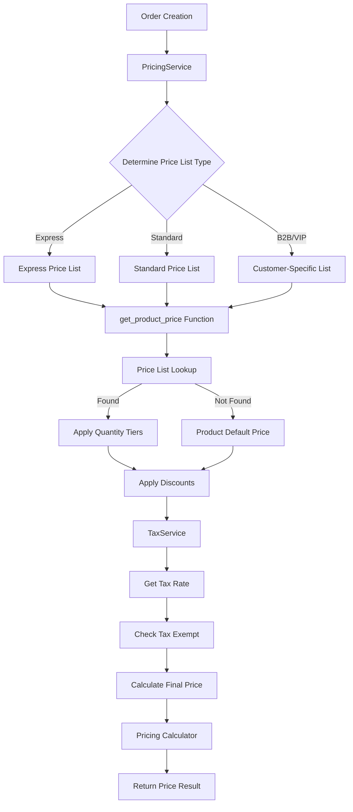

# Pricing Feature Imp

lementation Plan

## Overview

This plan implements a complete, production-ready pricing system that integrates price lists into order creation, supports multiple pricing strategies, tax calculation, and comprehensive price management.

## Current State Analysis

### Verified Components

- Database tables: `org_price_lists_mst`, `org_price_list_items_dtl` (verified via Supabase MCP)
- Database function: `get_product_price()` (functional, returns base price only)
- Pricing calculator: `web-admin/lib/utils/pricing-calculator.ts` (exists, handles tax/discounts)
- Price list APIs: `web-admin/app/api/v1/price-lists/route.ts` (CRUD operations exist)
- Tenant settings system: `web-admin/lib/services/tenant-settings.service.ts` (pattern to follow)

### Current Gaps

- Order creation uses hardcoded tax rate (0.05) in `web-admin/lib/db/orders.ts:128`
- Price lists not integrated into order flow
- No customer-specific pricing (B2B/VIP)
- No tax rate configuration per tenant
- No price history/audit tracking
- No bulk pricing operations

## Architecture




## Implementation Phases

### Phase 1: Core Pricing Service (P0 - Critical)

**Goal**: Integrate price lists into order creation flow

#### 1.1 Create Pricing Service

**File**: `web-admin/lib/services/pricing.service.ts` (NEW)**Responsibilities:**

- Price lookup using `get_product_price()` function
- Price list type determination (standard/express/vip/b2b)
- Integration with tax service
- Price result formatting

**Key Methods:**

```typescript
class PricingService {
  async getPriceForOrderItem(
    tenantId: string,
    productId: string,
    quantity: number,
    isExpress: boolean,
    customerId?: string
  ): Promise<PriceResult>
  
  async calculateOrderTotals(
    tenantId: string,
    items: OrderItem[],
    customerId?: string
  ): Promise<OrderTotals>
}
```

**Dependencies:**

- Uses existing `get_product_price()` database function
- Integrates with `TaxService` (to be created)
- Uses `pricing-calculator.ts` utilities

#### 1.2 Create Tax Service

**File**: `web-admin/lib/services/tax.service.ts` (NEW)**Responsibilities:**

- Retrieve tax rate from tenant settings
- Check product tax exemption
- Calculate tax amounts

**Implementation:**

- Use `sys_tenant_settings_cd` system (setting code: `TAX_RATE`)
- Follow pattern from `TenantSettingsService`
- Default tax rate: 0.05 (5% VAT) if not configured

**Key Methods:**

```typescript
class TaxService {
  async getTaxRate(tenantId: string): Promise<number>
  async isTaxExempt(tenantId: string, productId: string): Promise<boolean>
  calculateTax(amount: number, taxRate: number): number
}
```


#### 1.3 Database Migration: Tax Rate Configuration

**File**: `supabase/migrations/XXXX_add_tax_rate_setting.sql` (NEW)**Action:**

- Add `TAX_RATE` setting to `sys_tenant_settings_cd` (preferred over adding column to org_tenants_mst)
- Seed default tax rate (0.05) for existing tenants
- Add setting to FINANCE category

#### 1.4 Integrate into Order Creation

**File**: `web-admin/lib/db/orders.ts` (MODIFY)**Changes:**

- Replace hardcoded tax rate (line 128) with `TaxService.getTaxRate()`
- Replace direct product price lookup with `PricingService.getPriceForOrderItem()`
- Update `addOrderItems` function to use pricing service

**Before:**

```typescript
const basePrice = Number(product.default_sell_price || 0);
const taxRate = 0.05; // TODO: fetch from tenant settings
```

**After:**

```typescript
import { PricingService } from '@/lib/services/pricing.service';
const pricingService = new PricingService();
const priceResult = await pricingService.getPriceForOrderItem(
  tenantOrgId,
  item.productId,
  item.quantity,
  input.isExpressService,
  order.customer_id
);
```


#### 1.5 Type Definitions

**File**: `web-admin/lib/types/pricing.ts` (NEW)**Interfaces:**

- `PriceResult` - Full pricing breakdown
- `PriceLookupParams` - Parameters for price lookup
- `OrderTotals` - Order-level totals

### Phase 2: Enhanced Database Function (P1 - High)

**Goal**: Enhance database function to return full pricing breakdown

#### 2.1 Enhanced Function

**File**: `supabase/migrations/XXXX_enhance_get_product_price.sql` (NEW)**Function**: `get_product_price_with_tax()`**Returns:**

- base_price, discount_percent, final_price
- tax_rate, tax_amount, total
- price_list_id, price_list_item_id
- source ('price_list' or 'product_default')

**Note**: Keep existing `get_product_price()` for backward compatibility

#### 2.2 Customer-Specific Pricing Support

**Enhancement**: Add customer_id parameter to function

- Check customer type (B2B/VIP) from `org_customers_mst`
- Map to appropriate price list type
- Support customer-to-price-list mapping table (future)

### Phase 3: Customer-Specific Pricing (P1 - High)

**Goal**: Support B2B and VIP customer pricing

#### 3.1 Customer Type Detection

**File**: `web-admin/lib/services/pricing.service.ts` (MODIFY)**Logic:**

- Check customer type from `org_customers_mst.type` or `preferences`
- Map to price list type: B2B → 'b2b', VIP → 'vip'
- Fallback to standard/express if no customer-specific pricing

#### 3.2 Customer-to-Price-List Mapping (Optional)

**Future Enhancement**: Table `org_customer_price_lists_cf`

- Direct mapping of customers to specific price lists
- Higher priority than customer type-based selection

### Phase 4: Price History & Audit (P2 - Medium)

**Goal**: Track price changes for audit and reporting

#### 4.1 Price History Table

**File**: `supabase/migrations/XXXX_add_price_history.sql` (NEW)**Table**: `org_price_history_audit`

- Track price changes in price lists
- Track product default price changes
- Include change reason and user

#### 4.2 Audit Triggers

**File**: `supabase/migrations/XXXX_price_history_triggers.sql` (NEW)**Triggers:**

- On `org_price_list_items_dtl.price` update
- On `org_product_data_mst.default_sell_price` update
- Log to `org_price_history_audit`

### Phase 5: Bulk Operations (P2 - Medium)

**Goal**: Enable bulk price management

#### 5.1 CSV Import/Export

**Files:**

- `web-admin/lib/services/pricing-bulk.service.ts` (NEW)
- `web-admin/app/api/v1/pricing/import/route.ts` (NEW)
- `web-admin/app/api/v1/pricing/export/route.ts` (NEW)

**Features:**

- Export price lists to CSV
- Import price updates from CSV
- Validation and error reporting
- Template download

### Phase 6: Price Override & Permissions (P2 - Medium)

**Goal**: Support manual price overrides with audit trail

#### 6.1 Price Override Support

**Enhancement**: Add override fields to order items

- `price_override` (NUMERIC)
- `override_reason` (TEXT)
- `override_by` (UUID)

#### 6.2 Permission Checks

**Integration**: Use existing RBAC system

- Permission: `pricing:override`
- Check in order creation flow
- Log override in audit table

### Phase 7: Seasonal Pricing Automation (P3 - Low)

**Goal**: Automate seasonal price list activation

#### 7.1 Scheduled Job

**File**: `web-admin/lib/jobs/seasonal-pricing.job.ts` (NEW)**Functionality:**

- Check active date ranges daily
- Activate/deactivate seasonal price lists
- Send notifications on activation

### Phase 8: Frontend UI Implementation (P0 - Critical)

**Goal**: Create comprehensive UI for price list management, pricing display in orders, and configuration

#### 8.1 Price List Management UI Enhancement

**Files:**

- `web-admin/app/dashboard/catalog/pricing/page.tsx` (MODIFY - enhance existing)
- `web-admin/app/dashboard/catalog/pricing/[id]/page.tsx` (NEW - detail/edit page)
- `web-admin/app/dashboard/catalog/pricing/components/price-list-item-modal.tsx` (NEW)
- `web-admin/app/dashboard/catalog/pricing/components/price-list-form.tsx` (NEW)

**Features:Price List List Page (`/dashboard/catalog/pricing`):**

- Enhanced table using `CmxDataTable` component
- Filter by price list type (standard, express, VIP, B2B, seasonal, promotional)
- Filter by active/inactive status
- Filter by date range (effective_from/effective_to)
- Search by name (bilingual)
- Bulk actions: activate/deactivate, delete
- Export to CSV
- Create new price list button
- Display item count, effective dates, priority, default status
- Quick actions: Edit, Duplicate, View History

**Price List Detail/Edit Page (`/dashboard/catalog/pricing/[id]`):**

- Header with price list name (bilingual), type badge, status toggle
- Tabs: Items, Settings, History
- **Items Tab:**
- Table of price list items with columns:
    - Product name (bilingual)
    - Price (OMR)
    - Discount %
    - Quantity range (min-max)
    - Status (active/inactive)
    - Actions (Edit, Delete)
- Add Item button opens modal
- Bulk edit: select multiple items, update price/discount
- Import from CSV button
- Export to CSV button
- **Settings Tab:**
- Form fields: name, name2, description, description2
- Price list type selector (disabled if items exist)
- Effective date range (from/to)
- Priority number input
- Default checkbox (only one default per type)
- Active status toggle
- **History Tab:**
- Timeline of price changes (if Phase 4 implemented)
- Audit log with user, timestamp, change reason

**Price List Item Modal:**

- Product search/select (autocomplete with product name)
- Price input (NUMERIC, step 0.001)
- Discount % input (0-100)
- Quantity tier configuration:
- Min quantity (default 1)
- Max quantity (optional, null = unlimited)
- Visual indicator showing tier range
- Active toggle
- Save/Cancel buttons
- Validation: price >= 0, discount 0-100, min_quantity > 0, max_quantity >= min_quantity

**UI Components to Use:**

- `CmxDataTable` for tables
- `CmxForm`, `CmxFormField` for forms
- `CmxButton` for actions
- `CmxCard` for sections
- `CmxConfirmDialog` for delete confirmations
- `showSuccessToast`, `showErrorToast` for feedback
- Dialog component for modals

**Bilingual Support:**

- All labels use translation keys from `en.json` and `ar.json`
- RTL support for Arabic
- Product names display bilingual
- Form fields support name/name2

#### 8.2 Order Creation Pricing Display

**Files:**

- `web-admin/app/dashboard/orders/new/components/order-summary-panel.tsx` (MODIFY)
- `web-admin/app/dashboard/orders/new/components/item-cart-item.tsx` (MODIFY)
- `web-admin/app/dashboard/orders/new/components/pricing-breakdown.tsx` (NEW)
- `web-admin/app/dashboard/orders/new/hooks/useOrderState.ts` (MODIFY)

**Features:Pricing Breakdown Component:**

- Display item-level pricing:
- Base price per unit
- Quantity
- Subtotal
- Discount (if any)
- Tax amount
- Item total
- Price source indicator (badge: "Price List", "Product Default", "B2B", "VIP", "Express")
- Display order-level totals:
- Items subtotal
- Order discount (if any)
- Total tax
- Grand total
- Expandable breakdown for each item showing:
- Price list name (if from price list)
- Quantity tier applied (if applicable)
- Tax rate used
- Calculation details

**Item Cart Item Enhancement:**

- Show price per unit with source badge
- Display discount badge if item has discount
- Show tax-exempt indicator if applicable
- Tooltip on hover showing full pricing breakdown

**Order Summary Panel Enhancement:**

- Replace simple total with detailed breakdown
- Show subtotal, tax, discount, total separately
- Add "View Pricing Details" expandable section
- Display active price list type (Standard/Express/VIP/B2B)
- Show tax rate being applied

**Real-time Price Updates:**

- When express toggle changes, recalculate all item prices
- When customer changes, recalculate if customer has B2B/VIP pricing
- When quantity changes, check for quantity tier pricing
- Show loading state during price recalculation

**Price Override UI (if Phase 6 implemented):**

- Edit button on each item in cart
- Modal with:
- Current calculated price (read-only)
- Override price input
- Reason field (required)
- Permission check (only users with `pricing:override`)
- Save/Cancel buttons
- Visual indicator (badge) on overridden items
- Audit trail display

#### 8.3 Tax Configuration UI

**Files:**

- `web-admin/app/dashboard/settings/finance/page.tsx` (NEW or MODIFY existing settings)
- `web-admin/app/dashboard/settings/finance/components/tax-settings-form.tsx` (NEW)

**Features:Tax Settings Page:**

- Tax rate input (decimal, 0-1 range, e.g., 0.05 for 5%)
- Tax type selector (VAT, Sales Tax, GST, etc.)
- Tax exemption rules (future):
- Product-level exemptions (table)
- Customer-level exemptions (table)
- Save button
- Display current tax rate prominently
- Show last updated timestamp and user

**UI Components:**

- `CmxForm` with `CmxFormField`
- `CmxInput` for tax rate
- `CmxSelect` for tax type
- `CmxButton` for save
- `showSuccessToast` on save

#### 8.4 Bulk Pricing Operations UI

**Files:**

- `web-admin/app/dashboard/catalog/pricing/components/bulk-import-modal.tsx` (NEW)
- `web-admin/app/dashboard/catalog/pricing/components/bulk-export-modal.tsx` (NEW)

**Features:Bulk Import Modal:**

- File upload (CSV)
- Template download button
- Validation preview:
- Show rows that will be imported
- Highlight errors (invalid product, invalid price, etc.)
- Summary: X valid, Y errors
- Progress indicator during import
- Error report download after import
- Success/error toast notifications

**Bulk Export Modal:**

- Select price list(s) to export
- Select fields to include
- Format options (CSV, Excel)
- Export button
- Download automatically starts

**UI Components:**

- File upload component
- `CmxDataTable` for validation preview
- Progress bar component
- `CmxButton` for actions

#### 8.5 Price History UI

**Files:**

- `web-admin/app/dashboard/catalog/pricing/[id]/components/price-history-timeline.tsx` (NEW)
- `web-admin/app/dashboard/catalog/products/[id]/components/price-history.tsx` (NEW - optional)

**Features:Price History Timeline:**

- Timeline view of price changes
- Filter by date range
- Filter by user
- Filter by change type (price list, product default)
- Display:
- Date/time
- User who made change
- Old price → New price
- Change reason (if provided)
- Price list name (if applicable)
- Export to CSV

**UI Components:**

- Timeline component (custom or use existing)
- `CmxDataTable` for list view
- Date range picker
- Filter dropdowns

#### 8.6 UI Component Patterns

**Following Existing Patterns:**Based on codebase analysis, use these patterns:

1. **Modal Pattern:**

- Use Dialog component from `@/components/ui/dialog`
- Header with title and close button
- Form content with validation
- Footer with Cancel/Save buttons
- Example: `web-admin/app/dashboard/orders/new/components/describe-item-modal.tsx`

2. **Form Pattern:**

- Use `CmxForm` with `CmxFormField` from `@ui/forms`
- React Hook Form with Zod validation
- Bilingual labels using `useTranslations`
- RTL support using `useRTL` hook
- Example: `web-admin/app/dashboard/catalog/services/components/product-form.tsx`

3. **Table Pattern:**

- Use `CmxDataTable` from `@ui/data-display` for server-side pagination
- Or use simple table for client-side data
- Actions column with edit/delete buttons
- Example: `web-admin/app/dashboard/catalog/pricing/page.tsx` (current basic implementation)

4. **Card/Layout Pattern:**

- Use `CmxCard` for sections
- Use grid layout for forms
- Responsive design with Tailwind classes
- Example: `web-admin/app/dashboard/orders/new/components/order-summary-panel.tsx`

5. **Toast Notifications:**

- Use `showSuccessToast`, `showErrorToast` from `@ui/feedback`
- Example: Used throughout codebase

6. **Loading States:**

- Use `CmxSpinner` or loading skeleton
- Disable buttons during operations
- Example: `web-admin/app/dashboard/orders/new/components/loading-skeletons.tsx`

**Translation Keys to Add:**Add to `web-admin/messages/en.json` and `ar.json`:

```json
{
  "pricing": {
    "priceList": "Price List",
    "priceLists": "Price Lists",
    "createPriceList": "Create Price List",
    "editPriceList": "Edit Price List",
    "priceListName": "Price List Name",
    "priceListType": "Type",
    "effectiveFrom": "Effective From",
    "effectiveTo": "Effective To",
    "priority": "Priority",
    "isDefault": "Default",
    "items": "Items",
    "addItem": "Add Item",
    "editItem": "Edit Item",
    "price": "Price",
    "discount": "Discount",
    "quantityRange": "Quantity Range",
    "minQuantity": "Min Quantity",
    "maxQuantity": "Max Quantity",
    "unlimited": "Unlimited",
    "priceSource": "Price Source",
    "fromPriceList": "From Price List",
    "fromProductDefault": "Product Default",
    "bulkImport": "Bulk Import",
    "bulkExport": "Bulk Export",
    "priceHistory": "Price History",
    "taxRate": "Tax Rate",
    "taxSettings": "Tax Settings",
    "overridePrice": "Override Price",
    "overrideReason": "Reason for Override"
  }
}
```

**Accessibility & UX:**

- All interactive elements keyboard accessible
- ARIA labels on icons and buttons
- Focus management in modals
- Loading states for async operations
- Error messages clearly displayed
- Success feedback on actions
- Confirmation dialogs for destructive actions
- Tooltips for complex features
- Responsive design (mobile-friendly)

## File Structure

### New Files

```javascript
web-admin/lib/services/
  ├── pricing.service.ts          # Core pricing service
  ├── tax.service.ts              # Tax configuration service
  └── pricing-bulk.service.ts    # Bulk operations (Phase 5)

web-admin/lib/types/
  └── pricing.ts                 # Pricing type definitions

web-admin/app/api/v1/pricing/
  ├── calculate/route.ts         # Price calculation endpoint
  ├── import/route.ts            # CSV import (Phase 5)
  └── export/route.ts            # CSV export (Phase 5)

web-admin/app/dashboard/catalog/pricing/
  ├── [id]/page.tsx              # Price list detail/edit page (Phase 8)
  └── components/
      ├── price-list-item-modal.tsx      # Add/edit item modal (Phase 8)
      ├── price-list-form.tsx            # Price list form component (Phase 8)
      ├── bulk-import-modal.tsx          # Bulk import UI (Phase 8)
      ├── bulk-export-modal.tsx          # Bulk export UI (Phase 8)
      └── price-history-timeline.tsx      # Price history component (Phase 8)

web-admin/app/dashboard/orders/new/components/
  └── pricing-breakdown.tsx      # Pricing breakdown component (Phase 8)

web-admin/app/dashboard/settings/finance/
  ├── page.tsx                   # Tax settings page (Phase 8)
  └── components/
      └── tax-settings-form.tsx  # Tax configuration form (Phase 8)

supabase/migrations/
  ├── XXXX_add_tax_rate_setting.sql
  ├── XXXX_enhance_get_product_price.sql
  ├── XXXX_add_price_history.sql
  └── XXXX_price_history_triggers.sql
```


### Modified Files

```javascript
web-admin/lib/db/orders.ts                    # Integrate pricing service
web-admin/lib/services/catalog.service.ts      # Enhance price list methods
web-admin/lib/types/catalog.ts                 # Add pricing types
web-admin/app/dashboard/catalog/pricing/page.tsx              # Enhance price list list page (Phase 8)
web-admin/app/dashboard/orders/new/components/order-summary-panel.tsx  # Add pricing breakdown (Phase 8)
web-admin/app/dashboard/orders/new/components/item-cart-item.tsx        # Show price source (Phase 8)
web-admin/app/dashboard/orders/new/hooks/useOrderState.ts              # Integrate pricing service (Phase 8)
web-admin/messages/en.json                    # Add pricing translation keys (Phase 8)
web-admin/messages/ar.json                    # Add pricing translation keys (Phase 8)
```


## Key Implementation Details

### 1. Price Lookup Flow

```typescript
// Determine price list type
let priceListType: PriceListType = isExpress ? 'express' : 'standard';

// Check customer-specific pricing
if (customerId) {
  const customer = await getCustomer(customerId);
  if (customer.type === 'b2b' || customer.preferences?.pricing_tier === 'b2b') {
    priceListType = 'b2b';
  } else if (customer.preferences?.pricing_tier === 'vip') {
    priceListType = 'vip';
  }
}

// Call database function
const basePrice = await supabase.rpc('get_product_price', {
  p_tenant_org_id: tenantId,
  p_product_id: productId,
  p_price_list_type: priceListType,
  p_quantity: quantity,
  p_effective_date: new Date()
});

// Get tax rate
const taxService = new TaxService();
const taxRate = await taxService.getTaxRate(tenantId);
const isExempt = await taxService.isTaxExempt(tenantId, productId);

// Calculate final price
const taxAmount = isExempt ? 0 : basePrice * taxRate;
const total = basePrice + taxAmount;
```


### 2. Tax Rate Configuration

**Option A (Preferred)**: Use `sys_tenant_settings_cd`

- Setting code: `TAX_RATE`
- Category: `FINANCE`
- Data type: `DECIMAL`
- Default: 0.05 (5% VAT)

**Option B**: Add column to `org_tenants_mst`

- `default_tax_rate NUMERIC(5,4) DEFAULT 0.05`
- Simpler but less flexible

**Recommendation**: Use Option A to follow existing settings pattern

### 3. Error Handling

- Price not found: Fallback to product default
- Tax rate not configured: Use default 0.05
- Invalid price list type: Use 'standard'
- Database errors: Log and return safe defaults

### 4. Performance Considerations

- Cache tax rates (5-minute TTL)
- Batch price lookups where possible
- Use database function for efficiency
- Index optimization already in place

### 5. Testing Strategy

**Unit Tests:**

- `pricing.service.test.ts` - Price lookup logic
- `tax.service.test.ts` - Tax calculation
- `pricing-calculator.test.ts` - Already exists, enhance

**Integration Tests:**

- Order creation with price lists
- Tax calculation with different rates
- Customer-specific pricing

**E2E Tests:**

- Complete order flow with pricing
- Price list management UI
- Price list CRUD operations
- Bulk import/export
- Tax configuration
- Price override workflow

## Migration Strategy

1. **Phase 1**: Core service (non-breaking, adds functionality)
2. **Phase 2**: Enhanced function (backward compatible)
3. **Phase 3-7**: Progressive enhancements

## Success Criteria

- [ ] Order creation uses price lists instead of only product defaults
- [ ] Tax rate configurable per tenant
- [ ] Express orders use express price lists
- [ ] Quantity tiers work correctly
- [ ] Customer-specific pricing (B2B/VIP) functional
- [ ] Price history tracked
- [ ] Bulk operations available
- [ ] All existing functionality preserved
- [ ] Price list management UI fully functional
- [ ] Order creation displays accurate pricing breakdown
- [ ] Tax configuration UI accessible
- [ ] Bulk import/export UI working
- [ ] Price history viewable (if Phase 4 implemented)
- [ ] All UI components bilingual (EN/AR) and RTL-compatible

## Dependencies

- Existing `get_product_price()` function
- Existing `pricing-calculator.ts` utilities