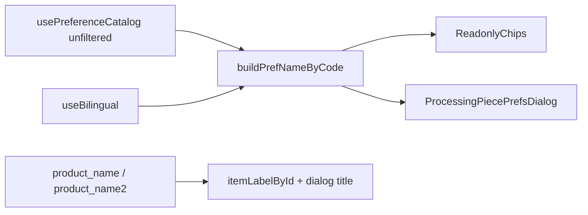

# Processing Prefs Bilingual Labels

## Why Arabic still shows English

UI chrome is translated (`next-intl`), but **data labels** are rendered from **machine codes** / English-only fields:

| Surface | Today | Should be |
|---------|--------|-----------|
| Product title (list + dialog) | `product_name` only | `getBilingual(product_name, product_name2)` |
| Service / packing / color chips | `ECO_WASH` → `"ECO WASH"` | Catalog `name` / `name2` via `useBilingual` |
| Dialog section headers | `service_prefs` → `"SERVICE PREFS"` | Kind row `getBilingual(kind.name, kind.name2)` |
| `prefs_source` badges | `ORDER_CREATE` / `manual` raw | i18n labels + code as `title` |
| Kind toolbar | Already bilingual | Keep |
| Prefs API rows | Codes only (correct) | Resolve labels **client-side** from catalog |

Canonical pattern: New Order [`piece-preference-card.tsx`](web-admin/src/features/orders/ui/piece-preferences/piece-preference-card.tsx) (`nameByCode`). Catalog: [`use-preference-catalog.ts`](web-admin/src/features/orders/hooks/use-preference-catalog.ts).

**Fallback (locked):** empty `name2` → English `name` (`useBilingual`). Empty map / unknown code → humanized code (never blank). Missing Arabic in catalog = data gap, not UI bug.



## Production gaps closed (audit)

| Gap | Lock |
|-----|------|
| Dialog uses `usePreferenceCatalog(..., orderQuickBarPrefs=true)` which **filters** prefs — labels for off–quick-bar codes can miss | Build **label** map from **unfiltered** catalog (`orderQuickBarPrefs=false`). Picker add lists may stay quick-bar filtered. |
| `processing-piece-row` has no catalog today | Build `nameByCode` once in [`processing-modal.tsx`](web-admin/src/features/workflow/ui/processing-modal.tsx) (already calls catalog) → pass `nameByCode` through `ProcessingItemRow` → `ProcessingPieceRow` → chips. **Do not** call `usePreferenceCatalog` per row. |
| Simple dialog only used `conditionCatalog` for hex | Use full catalog return (`servicePrefs`, `packingPrefs`, stains/damages/colors) for `nameByCode`. |
| Case mismatch `ECO_WASH` vs `eco_wash` / UI condition codes | Index map with `code`, `toUpperCase()`, `toLowerCase()`; `labelForPrefCode` tries all. |
| Catalog still loading | Show humanized code until map fills; no empty string flash. |
| `prefs_source` left “optional” | **Required:** i18n under `processing.simpleModal.prefsDialog.sources.*` for `ORDER_CREATE`, `ORDER_EDIT`, `ORDER_PROCESSING`, `ORDER_PREPARE`, `ORDER_UPDATE`, `manual`, plus fallback raw code. |
| Product title order vs ItemList | Match [`ItemList.itemDisplayName`](web-admin/src/features/workflow/ui/ItemList.tsx): item fields first, then `org_product_data_mst`. |
| Soft “optional polish” | Removed — all display strings above are in scope. |

## Implementation

### 1. Shared helper + tests

Add [`web-admin/src/features/orders/ui/piece-preferences/pref-display-labels.ts`](web-admin/src/features/orders/ui/piece-preferences/pref-display-labels.ts):

- `buildPrefNameByCode(inputs, getBilingual)` → `Map<string, string>` (multi-case keys)
- `labelForPrefCode(code, nameByCode)` → mapped or humanized (`_` → space); never `""` if code present
- `labelForPrefKind(kindCode, preferenceKinds, getBilingual)` → bilingual kind or humanized kind_code

Refactor [`piece-preference-card.tsx`](web-admin/src/features/orders/ui/piece-preferences/piece-preference-card.tsx) to call `buildPrefNameByCode` (behavior unchanged).

Unit tests [`web-admin/__tests__/features/orders/pref-display-labels.test.ts`](web-admin/__tests__/features/orders/pref-display-labels.test.ts): AR picks `name2`; EN picks `name`; case-insensitive lookup; unknown code humanizes.

### 2. Readonly chips

Update [`piece-preference-readonly-chips.tsx`](web-admin/src/features/orders/ui/piece-preferences/piece-preference-readonly-chips.tsx):

- Prop `nameByCode?: Map<string, string>`
- Service / packing / color values via `labelForPrefCode`; keep i18n prefixes (`processing.modal.color` / `packing`)
- Stain/damage flags stay on existing i18n keys

### 3. Wire call sites

| Caller | Wiring |
|--------|--------|
| [`simple-processing-dialog.tsx`](web-admin/src/features/workflow/ui/simple-processing-dialog.tsx) | `usePreferenceCatalog()` unfiltered → `nameByCode` → chips |
| [`processing-modal.tsx`](web-admin/src/features/workflow/ui/processing-modal.tsx) | Expand catalog usage beyond colors → `nameByCode` → `ProcessingItemRow` → row → chips |
| [`processing-piece-prefs-dialog.tsx`](web-admin/src/features/workflow/ui/processing-piece-prefs-dialog.tsx) | Separate unfiltered catalog (or second hook / `orderQuickBarPrefs=false`) for labels; keep picker lists as today if needed |

Dialog:

- Row label: notes → `preference_content`; else `labelForPrefCode`
- Section header: `labelForPrefKind`
- Source badge: `t(\`sources.${code}\`)` with fallback to code; `title={code}`

### 4. Product / piece title

In Simple Processing `itemLabelById` (mirror ItemList):

```ts
getBilingual(item.product_name, item.product_name2)
  || getBilingual(product?.product_name, product?.product_name2)
  || t('unnamedItem')
```

List piece suffix: `t('pieceLabel', { n: piece.pieceNumber })` instead of `#n` (dialog title already does this).

### 5. Validation gates

- Jest pref-display-labels
- `npm run check:i18n` (EN/AR `sources.*` keys aligned)
- eslint on touched files
- Smoke AR: product, ECO_WASH, HANG, RED, section headers, source badges; EN unchanged
- If still English after fix → verify tenant catalog `name2` for that code

## Out of scope

- Prefs GET API joining catalog names
- Backfilling empty `name2` in DB
- Sidebar / page title “Processing” nav i18n (separate)
