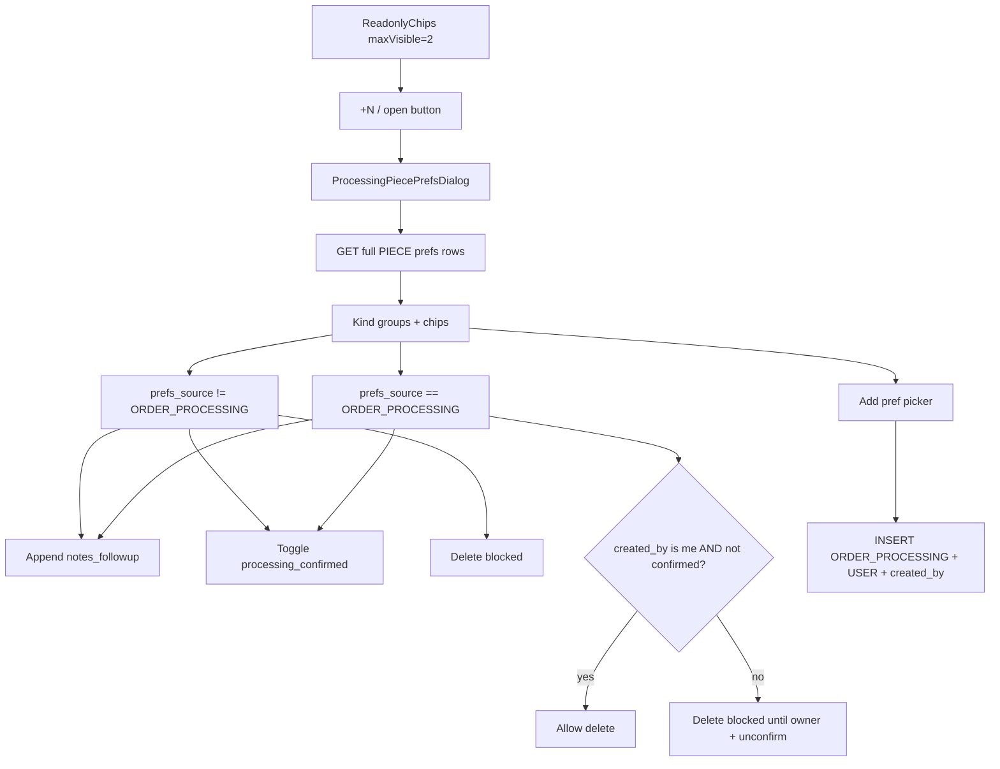

# Processing Piece Preferences Dialog

## Locked product rules

### Delete eligibility (all three required — server + UI)

A preference row may be deleted **only when**:

1. `prefs_source === 'ORDER_PROCESSING'`
2. `created_by === currentUserId` (the operator who created that row)
3. `processing_confirmed` is **not** true (`false` or null) — if already confirmed, operator must set `processing_confirmed` to **false** first (clears `confirmed_by` / `confirmed_at`), then delete

Otherwise delete is **blocked** (hide/disable delete control; API returns clear error code e.g. `PREF_DELETE_NOT_ALLOWED`).

| Pref row | Delete | Add follow-up note | Add new pref | Confirm |
|----------|--------|--------------------|--------------|---------|
| `prefs_source != ORDER_PROCESSING` | **Blocked** | Append to `notes_followup` | N/A | Checkbox → auto-fill `confirmed_by` / `confirmed_at` |
| `ORDER_PROCESSING` + `created_by` is me + not confirmed | **Allowed** | Append to `notes_followup` | N/A | Same checkbox (confirm blocks delete until unchecked) |
| `ORDER_PROCESSING` but other user created it | **Blocked** | Append to `notes_followup` | N/A | Same checkbox |
| `ORDER_PROCESSING` + confirmed | **Blocked** until unconfirm | Append to `notes_followup` | N/A | Uncheck → clear confirm stamps → delete then allowed |
| New prefs from Processing UI | — | — | Insert with `prefs_source=ORDER_PROCESSING`, `prefs_owner_type=USER`, `created_by=currentUserId` | Optional after create |

**Overflow UX (Simple Processing):** `maxVisible={2}` → show up to 2 chips + `+N` when overflow. **Always show a small prefs open button** (even when 0–2 prefs) so operators can add prefs / open the dialog — not only when `+N` exists. Nested `CmxDialog` (New Order visual: kind tabs + left-border chips). Phase 1: Simple Processing; full modal can reuse later.

**Not in scope:** Reusing New Order client-only `PiecePreferenceCard` mutate path. Build a **Processing-specific** dialog that **looks** like New Order but persists via piece-pref APIs with the rules above. Do **not** use `replacePieceConditions` (delete-all) from this dialog.



## Gap today (must fix)

- No `notes_followup` column on [`org_order_preferences_dtl`](web-admin/prisma/schema.prisma).
- Stage source `ORDER_PROCESSING` not in write paths; runtime CRUD uses `manual` / Zod `PREFERENCE_SOURCES` only ([`service-preferences.ts`](web-admin/lib/constants/service-preferences.ts), [`order-piece-preference.service.ts`](web-admin/lib/services/order-piece-preference.service.ts)).
- Delete / condition replace is unrestricted.
- Confirm exists only as piece-wide [`confirmPiecePrefs`](web-admin/lib/services/order-piece-preference.service.ts) — need **per-row** confirm for this dialog.

## 1. Schema + constants

**New migration** `supabase/migrations/0406_ord_pref_notes_followup.sql` (next after `0405`):

- `ALTER TABLE org_order_preferences_dtl ADD COLUMN notes_followup JSONB NOT NULL DEFAULT '[]'::jsonb;`
- Comment documenting append-only array shape.
- Prisma: add `notes_followup Json @default("[]")` on `org_order_preferences_dtl`.
- **Do not apply** migration — create file only for user review.

**Standard follow-up note entry** (append-only; never rewrite history):

```ts
{
  note_seq: number;          // 1-based within the array
  note_user_id: string;
  note_datetime: string;     // ISO timestamptz
  note_source: PrefsNoteSource; // ORDER_CREATE | ORDER_EDIT | ORDER_PREPARE | ORDER_PROCESSING | ...
  note_text: string;
}
```

**New constants** (DB-mirror stage codes) in e.g. [`web-admin/lib/constants/order-preferences.ts`](web-admin/lib/constants/order-preferences.ts):

- `PREFS_SOURCE_STAGE`: `ORDER_CREATE`, `ORDER_EDIT`, `ORDER_PREPARE`, `ORDER_PROCESSING`, … (keep existing `PREFERENCE_SOURCES` for legacy `manual`/`bundle`; processing writes use stage codes).
- `PREFS_OWNER_TYPE`: `CUSTOMER` | `USER` | `SYSTEM` (+ document `OVERRIDE` legacy).
- `PREFS_NOTE_SOURCE`: same stage vocabulary as `note_source` for all screens that append follow-ups later.

Helper: `appendNotesFollowup(existing, { note_text, note_source, note_user_id })` → sorted array with next `note_seq`.

## 2. Service / API (server is authority)

Extend [`OrderPiecePreferenceService`](web-admin/lib/services/order-piece-preference.service.ts) (+ dedicated routes under `app/api/v1/orders/[id]/items/[itemId]/pieces/[pieceId]/…` — prefer processing-specific route(s) or harden existing so prep editor cannot bypass rules).

| Operation | Behavior |
|-----------|----------|
| **List piece prefs (full)** | Dedicated GET (or enrich pieces attach). Return `id`, `prefs_source`, `prefs_owner_type`, `created_by`, `processing_confirmed`, `confirmed_*`, `notes_followup`, kind, code, `preference_id`, `extra_price`. Today [`attachPieceLevelPreferencesFromDtl`](web-admin/lib/services/order-piece-service.ts) omits these — **insufficient for UI rules**. |
| **Add pref** | Server stamps `ORDER_PROCESSING` + `USER` + `created_by` (ignore client source). Resolve `preference_id` from catalog when known. Reject duplicate `(piece, preference_sys_kind, preference_code)` for service/condition/color. **Packing:** replace-one only (`replacePiecePacking` / single row) — never second packing insert. |
| **Delete pref** | Triple guard in SQL `WHERE` + check rows affected; null `created_by` ⇒ non-deletable. Error code `PREF_DELETE_NOT_ALLOWED` + reason. |
| **Append follow-up note** | **Atomic** JSONB append in SQL (`\|\|` / RPC), server sets `note_seq`, `note_user_id`, `note_datetime`, `note_source=ORDER_PROCESSING`. Validate non-empty trimmed `note_text` + max length. Never client replace-array. |
| **Set processing_confirmed** | Per-row PATCH only. `true` → `confirmed_by`/`confirmed_at`; `false` → clear both. Gated by tenant setting `SERVICE_PREF_PROCESSING_CONFIRMATION` (hide UI + reject API when off). Keep existing piece-wide confirm for full modal separately. |

### Money policy (locked — no silent stale totals)

Today `addPieceServicePref` updates piece `service_pref_charge` but **does not** recompute order financial snapshot → paid/due can go stale (violates no-silent-money-mutation intent).

**Lock:** After every processing add/delete that changes `extra_price` sum:

1. Recalculate piece `service_pref_charge` (existing helper).
2. Roll into item/order financial snapshot via existing order-financial write path (same family as create/edit).
3. Return updated due/outstanding in API response; UI shows `cmxMessage` with amount impact (and pending-payment warning if due reopens).
4. If recompute cannot run safely for the order state → **fail the mutate** (do not leave partial piece charge).

Zero-price kinds (conditions, free notes, confirm-only) skip snapshot when charge delta is 0.

**Access:** `orders:update` for mutate; `orders:read` for GET. Document all new paths on [`/dashboard/processing`](web-admin/src/features/orders/access/orders-access.ts) `apiDependencies`; run wire check + platform inventories refresh after.

## 3. UI

### Readonly chips + entry

Update [`piece-preference-readonly-chips.tsx`](web-admin/src/features/orders/ui/piece-preferences/piece-preference-readonly-chips.tsx) + Simple dialog:

- `maxVisible={2}`; optional `onOpenPrefs` / always-visible icon button beside chips.
- `+N` click opens same dialog (not tooltip-only).
- Pass `pieceId`, `orderId`, `itemId`, piece title, `currentUserId` (for delete eligibility).

### New dialog

`web-admin/src/features/workflow/ui/processing-piece-prefs-dialog.tsx` (or under `orders/ui/piece-preferences/`):

- Visual parity with New Order: kind toolbar + grouped chips with left accent ([`piece-pref-kind-styles.ts`](web-admin/src/features/orders/ui/piece-preferences/piece-pref-kind-styles.ts)); Colors use hex border.
- Per chip: label + price; delete (triple rule); confirm checkbox (setting-gated); follow-up notes timeline + add field.
- Delete of confirmed row: disable + inline hint to unconfirm first; use `CmxConfirmDialog` before delete.
- Kind picker: patterns from [`piece-kind-picker-dialog.tsx`](web-admin/src/features/orders/ui/piece-preferences/piece-kind-picker-dialog.tsx) → processing add API only (never new-order client state; never prep editor unrestricted DELETE).
- On success: invalidate `['order-pieces', orderId]`, `['order-processing', orderId]`, and financial keys if totals changed; refresh chip list.
- Feedback via `cmxMessage` / `useMessage`.
- EN/AR under `processing.simpleModal.prefsDialog.*`.

## 4. Production readiness (audit closed)

### Must-fix (locked into this plan)

| Gap | Lock |
|-----|------|
| Zod/`PREFERENCE_SOURCES` block `ORDER_PROCESSING` | Processing schema + server stamp; do not trust client `source` |
| Insert omits `prefs_owner_type` → SYSTEM | Always set `USER` on processing add |
| Slim GET missing `id`/`created_by`/confirm/notes | Enriched list DTO or dedicated GET |
| Unrestricted DELETE / conditions replace | Triple-guard service; no `replacePieceConditions` in dialog |
| Bulk confirm only | Per-row confirm/unconfirm API |
| Stale order money after paid pref add | Recompute snapshot + surface due; fail mutate if recompute fails |
| Entry only when `+N` | Always-visible prefs button |
| Access contract missing prefs APIs | Wire `apiDependencies` + inventories |
| Notes RMW race | Atomic JSONB append SQL |
| Duplicate service prefs | Reject duplicate code+kind per piece |
| Packing multi-row | Replace-one packing only |
| Confirm when setting off | Gate UI + API on `SERVICE_PREF_PROCESSING_CONFIRMATION` |

### `created_by` comparison

- Column `VARCHAR(120)`; auth UUID string OK when set.
- Historical rows with `created_by: null` → **never deletable** (correct).
- Compare trimmed string equality; owner check server-side only.

### RLS

- Tenant `FOR ALL` on `org_order_preferences_dtl` covers new column; ownership/delete rules are **app-layer**, not RLS.

### Tests (required)

- Delete: wrong source / wrong owner / confirmed / null created_by → reject; all three OK → allow.
- Append: seq increments; concurrent-safe shape.
- Add: stamps source/owner/created_by; dup reject; packing single-row.
- Money: non-zero add triggers recompute path (unit/integration as feasible).

### Validation gates

- Migration file only — user applies (never run migrate from agent).
- eslint, `check:i18n`, `check:ui-access-contract --wire` for processing route, `npm run build`.

## Out of scope (this slice)

- Rewriting New Order / Preparation to use `notes_followup` yet (constants + helper ready).
- Migrating legacy `manual` / null-`created_by` rows to `ORDER_PROCESSING`.
- Separate RBAC permission beyond `orders:update` / `orders:read`.
- Changing full-modal bulk confirm behavior (keep; dialog uses per-row).
