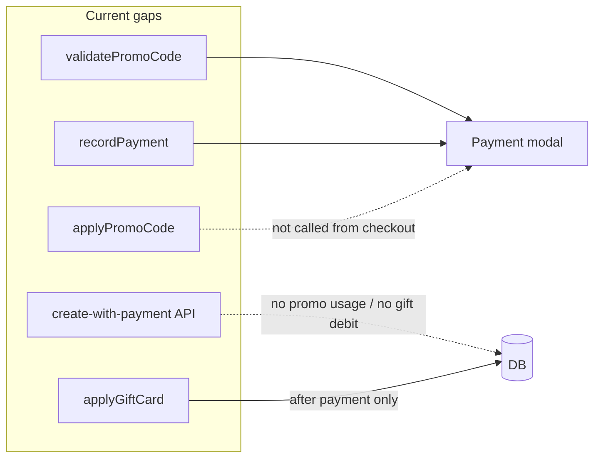

# Promotions and gift cards — production-ready implementation plan

## Current foundation (reuse, do not reinvent)

- **Schema** (RLS-enabled): [`supabase/migrations/0029_payment_enhancement_tables.sql`](f:/jhapp/cleanmatex/supabase/migrations/0029_payment_enhancement_tables.sql) — `org_promo_codes_mst`, `org_promo_usage_log`, `org_gift_cards_mst`, `org_gift_card_transactions`, `org_discount_rules_cf`; later migrations adjust RLS ([`0081_comprehensive_rls_policies.sql`](f:/jhapp/cleanmatex/supabase/migrations/0081_comprehensive_rls_policies.sql)), `branch_id` on gift transactions ([`0106_add_branch_id_to_transaction_tables.sql`](f:/jhapp/cleanmatex/supabase/migrations/0106_add_branch_id_to_transaction_tables.sql)).
- **Services**: [`web-admin/lib/services/discount-service.ts`](f:/jhapp/cleanmatex/web-admin/lib/services/discount-service.ts) (`validatePromoCode`, `applyPromoCode`, `evaluateDiscountRules`), [`web-admin/lib/services/gift-card-service.ts`](f:/jhapp/cleanmatex/web-admin/lib/services/gift-card-service.ts) (validate, apply, refund, CRUD helpers, `generateGiftCardNumber`).
- **Server totals**: [`web-admin/lib/services/order-calculation.service.ts`](f:/jhapp/cleanmatex/web-admin/lib/services/order-calculation.service.ts) — promo + gift card in one server-side total (gift applied after VAT/additional tax; keep this as the single definition of “amount before gift”).
- **POS UI**: [`web-admin/src/features/orders/ui/payment-modal-enhanced-02.tsx`](f:/jhapp/cleanmatex/web-admin/src/features/orders/ui/payment-modal-enhanced-02.tsx) — validates promo/gift via actions.

## Critical gaps to fix first (correctness and money safety)

### 1. Promo usage must run on every successful redemption path

- **`applyPromoCode` is only referenced from** [`web-admin/app/actions/payments/validate-promo.ts`](f:/jhapp/cleanmatex/web-admin/app/actions/payments/validate-promo.ts) (`applyPromoCodeAction`); **nothing in the repo calls `applyPromoCodeAction`**, so `org_promo_usage_log` and `current_uses` are not updated when staff pay with a promo.
- **Fix**: After server-side re-validation of the promo (same inputs as `calculateOrderTotals`), call promo application inside the **same database transaction** as payment/order writes for:
  - [`web-admin/app/actions/payments/process-payment.ts`](f:/jhapp/cleanmatex/web-admin/app/actions/payments/process-payment.ts) (today: empty promo block; gift apply runs **after** `processPaymentService` — risk of paid order without gift debit if gift step fails).
  - [`web-admin/app/api/v1/orders/create-with-payment/route.ts`](f:/jhapp/cleanmatex/web-admin/app/api/v1/orders/create-with-payment/route.ts) (records `promo_code_id` / amounts but never increments usage or debits gift balance).

**Implementation approach**: Extract **transactional** helpers that accept a Prisma `tx` (e.g. `applyPromoCodeTx`, `applyGiftCardTx`) from the existing service logic, and invoke them from both `processPaymentService` / `recordPaymentTransaction` path and the create-with-payment `prisma.$transaction` block. Remove the post-hoc `applyGiftCard` from `process-payment.ts` once the unified transaction path exists.

### 2. Gift card security and consistency

- **PIN**: In [`gift-card-service.ts`](f:/jhapp/cleanmatex/web-admin/lib/services/gift-card-service.ts), if `card_pin` is set and `input.card_pin` is missing, validation should **fail** (today PIN check is skipped when PIN not sent).
- **Normalization**: Decide and enforce one rule for `card_number` (trim, case, optional prefix) consistently in validate/apply/list to avoid duplicate-looking cards.
- **Idempotency**: For retries (network double-submit), use a deterministic idempotency key on payment or gift transaction metadata (or dedicated column if you add one) so the same checkout cannot debit twice.

### 3. Client vs server totals alignment

- Payment modal gift preview uses `Math.min(balance, totals.afterDiscounts)` ([`payment-modal-enhanced-02.tsx`](f:/jhapp/cleanmatex/web-admin/src/features/orders/ui/payment-modal-enhanced-02.tsx) ~478) while [`calculateOrderTotals`](f:/jhapp/cleanmatex/web-admin/lib/services/order-calculation.service.ts) applies the gift to **post-VAT** `amountBeforeGiftCard`. **Fix**: drive preview from the same preview API / `calculateOrderTotals` response the create-with-payment route already uses, so staff never see a different “applied gift” than the server charges.

### 4. Automated discount rules (`org_discount_rules_cf`)

- `evaluateDiscountRules` exists in [`discount-service.ts`](f:/jhapp/cleanmatex/web-admin/lib/services/discount-service.ts) but is **not** wired into `calculateOrderTotals`. **Fix**: define a **stacking policy** (documented in code: e.g. manual discount → auto rules → promo code → tax → gift card, with caps) and merge rule discounts into server totals; persist applied rule IDs on order/invoice/payment metadata JSON if you need audit (add columns only if reporting requires relational filters).

---

## Admin and operations (no navigation or CRUD exists today)

- **Navigation**: No entries in [`web-admin/config/navigation.ts`](f:/jhapp/cleanmatex/web-admin/config/navigation.ts) for promos/gifts — add a **Marketing** or **Pricing** submenu (your IA choice) with routes for:
  - Promotions: list/create/edit/archive `org_promo_codes_mst`; usage report from `org_promo_usage_log`.
  - Gift cards: list/issue/adjust/cancel; detail with `getGiftCardTransactions` / summary from [`gift-card-service.ts`](f:/jhapp/cleanmatex/web-admin/lib/services/gift-card-service.ts).
  - Discount campaigns: CRUD `org_discount_rules_cf` with JSON **conditions** editor and validation against a documented schema version.
- **Permissions + contracts**: New dashboard pages require the workflow in [`.codex/skills/rebuild-ui-access-contract/SKILL.md`](f:/jhapp/cleanmatex/.codex/skills/rebuild-ui-access-contract/SKILL.md) — feature-local contracts under `web-admin/src/features/<feature>/access/`, registry in [`web-admin/src/features/access/page-access-registry.ts`](f:/jhapp/cleanmatex/web-admin/src/features/access/page-access-registry.ts), and updates to `docs/platform/permissions/*` as that skill specifies. Add granular permissions (e.g. `promotions.read`, `promotions.write`, `gift_cards.issue`, `gift_cards.redeem_adjust`).
- **Server actions / API**: Thin actions calling services with `requirePermission`; reuse Prisma patterns from existing modules. Add Zod schemas for create/update payloads (bilingual names, amounts, dates, category arrays).
- **i18n**: Extend [`web-admin/messages/en.json`](f:/jhapp/cleanmatex/web-admin/messages/en.json) / [`ar.json`](f:/jhapp/cleanmatex/web-admin/messages/ar.json) after searching for existing keys per your convention.

---

## Refunds and cancellations (ledger integrity)

- **`refundToGiftCard`** exists — wire it from the same place **order cancellation / payment reversal** is implemented (search refund flows in [`payment-service.ts`](f:/jhapp/cleanmatex/web-admin/lib/services/payment-service.ts) and order status transitions). Rules: restore gift balance up to `original_amount`; reverse promo usage (decrement `current_uses`, soft-delete or annotate usage log row) only when business rules allow reuse after void.

---

## Testing and production readiness

- **Unit tests**: Discount math (percentage cap, fixed amount, min/max order, category filter), per-customer `max_uses_per_customer`, stacking order.
- **Integration tests**: Single transaction commits order + invoice + payment + promo usage + gift debit; failure rolls back all; idempotent retry.
- **E2E** (Playwright if present): Payment modal path with promo + partial gift + cash.
- **Ops**: Schedule or document [`expireGiftCards`](f:/jhapp/cleanmatex/web-admin/lib/services/gift-card-service.ts) (Supabase cron or external scheduler); optional nightly reconciliation report (issued vs redeemed vs liability).

---

## Optional later scope (not required for “gift cards + promos”)

- **Non-monetary “gifts”** (free service line, BOGO): new product/promo engine tied to order line items — only add if product explicitly needs it; it is separate from `org_gift_cards_mst`.

---

## Key files to touch (summary)

| Area | Files |
|------|--------|
| Atomic checkout | [`process-payment.ts`](f:/jhapp/cleanmatex/web-admin/app/actions/payments/process-payment.ts), [`payment-service.ts`](f:/jhapp/cleanmatex/web-admin/lib/services/payment-service.ts), [`create-with-payment/route.ts`](f:/jhapp/cleanmatex/web-admin/app/api/v1/orders/create-with-payment/route.ts) |
| Domain logic | [`discount-service.ts`](f:/jhapp/cleanmatex/web-admin/lib/services/discount-service.ts), [`gift-card-service.ts`](f:/jhapp/cleanmatex/web-admin/lib/services/gift-card-service.ts), [`order-calculation.service.ts`](f:/jhapp/cleanmatex/web-admin/lib/services/order-calculation.service.ts) |
| UI | [`payment-modal-enhanced-02.tsx`](f:/jhapp/cleanmatex/web-admin/src/features/orders/ui/payment-modal-enhanced-02.tsx), new `web-admin/app/dashboard/...` pages + feature components |
| Access | [`navigation.ts`](f:/jhapp/cleanmatex/web-admin/config/navigation.ts), `src/features/*/access/*`, permissions docs |

This sequence — **fix money + usage atomicity first**, then **admin + permissions**, then **refund symmetry and tests** — minimizes production risk while delivering the “full” feature set on top of your existing schema.
