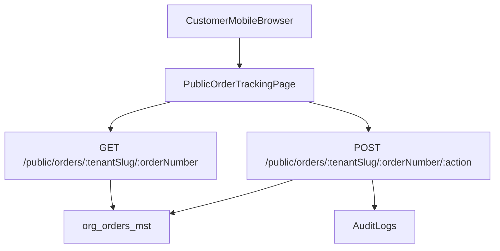

# Public Order Tracking Page (No-Login Link)

### 1. Goals & Scope

- **Goal**: Allow customers to open a shared link on mobile and see their order status and key details without authentication.
- **Access model**: **Order number in the URL only** (no extra secret), as requested; anyone with the link can view and perform basic actions.
- **Scope**: View order summary, timeline/status, items, and support a few **basic actions** (e.g. confirm pickup/delivery, mark as received), with full EN/AR + RTL support.

### 2. URL Design & Routing

- **Public URL pattern**: e.g. `https://tenant-cleanmatex.com/track-order/[orderNumber]` or `https://app.cleanmatex.com/t/[tenantSlug]/order/[orderNumber]` (exact base path aligned with existing routing strategy).
- **Next.js route**: Add a new public route in web admin, such as:
- `[web-admin/src/app/t/[tenantSlug]/public/order/[orderNumber]/page.tsx](web-admin/src/app/t/[tenantSlug]/public/order/[orderNumber]/page.tsx)` **or** a similar structure that matches your existing tenant-aware routing.
- **Link generation**: In order details/admin UI (e.g. [`web-admin/src/features/orders/ui/order-details-section.tsx`](web-admin/src/features/orders/ui/order-details-section.tsx) or related components), add a small "Share tracking link" control that copies this public URL for the selected order.

### 3. Backend/API Design

- **New endpoint**: Implement a public, read-only order endpoint in the backend (NestJS) such as:
- `GET /public/orders/:tenantSlug/:orderNumber` (or equivalent) in something like [`backend/src/orders/public-orders.controller.ts`](backend/src/orders/public-orders.controller.ts).
- **Tenant & RLS handling**:
- Resolve `tenant_org_id` from `tenantSlug` (using existing tenant context helpers) and always query `org_orders_mst` with `tenant_org_id` + `order_number`.
- Ensure all queries use **`withTenantContext()`** and `getTenantIdFromSession()`-compatible logic, but allow this endpoint without customer auth while still enforcing tenant isolation.
- **Response shape** (example):
- Core fields: order number, current status, timestamps (created, expected ready, last updated), branch, payment status.
- Customer-facing info only: masked phone/email if needed, no internal-only notes.
- Items summary: either full items or a compact summary (count, total amount, main categories) based on performance.
- Status timeline: derived from status history if available (e.g. `intake → processing → ready → delivered`).
- **Basic actions API** (optional endpoints):
- `POST /public/orders/:tenantSlug/:orderNumber/confirm-pickup`.
- `POST /public/orders/:tenantSlug/:orderNumber/confirm-delivery` or `mark-received`.
- Each endpoint:
    - Validates that the order is in a state where this action makes sense.
    - Writes an audit entry (who = "public_link", source = "public_tracking").
    - Returns updated order state.

### 4. Data & Security Considerations

- **Lookup key**: Use `order_number` + `tenant_org_id` as the search key; do **not** expose internal IDs.
- **Privacy**:
- Expose only fields necessary for the customer view; hide cost breakdown if that’s tenant preference (we can add a `feature_flag` or setting later).
- Mask sensitive contact details (e.g. show `+968-XXXX-1234`).
- **Rate limiting / abuse control** (future-friendly, can be phased):
- Apply basic rate-limiting middleware to `/public/orders/*`.
- Log accesses for monitoring but without PII.
- **Feature flag**:
- Add a `"public_order_tracking"` flag under `feature_flags` in `org_tenants_mst` to allow per-tenant enable/disable; backend checks it before serving public endpoints.

### 5. Frontend UI/UX (Next.js + EN/AR)

- **New feature module**: Under `web-admin/src/features/orders` add a `public` or `tracking` sub-feature, e.g.:
- [`web-admin/src/features/orders/public/order-tracking-page.tsx`](web-admin/src/features/orders/public/order-tracking-page.tsx) for the main UI.
- **Data fetching**:
- Use a lightweight client or server component to call the new `/public/orders/...` endpoint, with loading and error states.
- **Layout & sections** (mobile-first):
- **Header**: Tenant brand/logo + order number.
- **Status badge & timeline**: Visual current status (e.g. badge) and horizontal/vertical timeline with steps like "Received", "In progress", "Ready", "Out for delivery", "Delivered".
- **Key info cards**: Pickup/delivery type, branch, expected ready time, payment status, total amount (respecting localization & currency).
- **Items summary**: Simple list of items with quantity and optional total; reuse styles and formatting concepts from `OrderDetailsSection` where appropriate, but simplified for read-only.
- **Actions section**: Contextual buttons for allowed public actions, e.g.:
    - "Confirm pickup" if status is `out_for_delivery`.
    - "Mark as received" if status is `delivered_pending_confirmation`.
    - Each action shows confirmation modals and success/error toasts.
- **Bilingual support**:
- Add message keys for this page into `en.json` and `ar.json` under a new namespace like `publicOrderTracking`, reusing any existing shared keys (`common.status.*`, etc.) where possible.
- Use `useTranslations` and `useRTL` (as in `order-details-section.tsx`) to support RTL layout and translated labels.

### 6. Integration with Existing Orders Flow

- **Admin UI**:
- In the main order details screen (e.g. `order-details-section` container or parent), add a **"Public tracking link"** subsection showing:
    - A read-only input with the generated URL.
    - A "Copy link" button and optional "Share via WhatsApp" deep link (future enhancement).
- **Lifecycle alignment**:
- Ensure public status values match internal workflow states defined in existing PRDs (e.g. mapping internal codes to user-friendly labels).
- If there’s an order history model, use it to populate the timeline; otherwise derive from current status and known timestamps.

### 7. Validation, Testing & Localization QA

- **Unit tests (backend)**:
- Tests for `GET /public/orders/:tenantSlug/:orderNumber` covering: found/not-found, disabled-by-feature-flag, tenant isolation, and status/action validation.
- Tests for basic action endpoints, ensuring correct state transitions and audit logging.
- **Frontend tests**:
- Component tests for the public order tracking page: render with sample data, show correct status, and invoke actions.
- Basic E2E scenario: open public link → see order → click "mark received" → status updates.
- **Localization & RTL checks**:
- Verify EN and AR strings on the page, including date/number formatting and RTL alignment for the main layout.

### 8. Deployment & Rollout

- **Configuration**:
- Ensure environment variables or config for the public API base URL are wired into `web-admin` if needed.
- Enable `public_order_tracking` feature flag for selected tenants for pilot.
- **Build & verification**:
- Run `npm run build` in `web-admin` and backend build/tests; resolve any TypeScript and lint issues introduced by new modules.
- **Observability**:
- Add basic structured logs for public tracking accesses and actions to help monitor usage and detect abuse.

### 9. High-Level Flow Diagram

