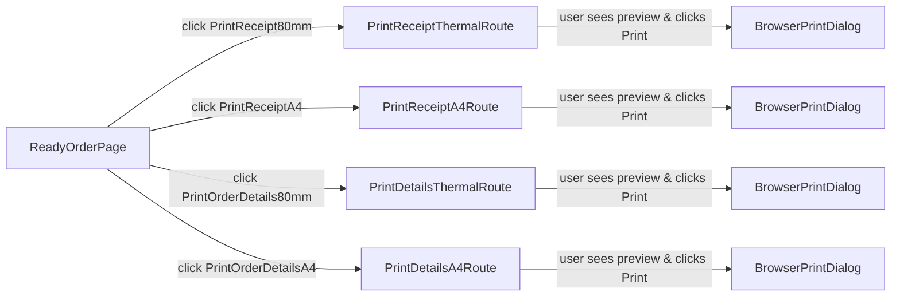

## Ready Order Print Preview & Buttons

### 1. Reuse Existing Patterns & Identify Targets

- **Target pages/components**
  - Enhance the Ready order details page at `[web-admin/app/dashboard/ready/[id]/page.tsx](web-admin/app/dashboard/ready/[id]/page.tsx)` where the current `Print Receipt` button simply calls `window.print()`.
  - Reuse the label-printing implementation at `[web-admin/app/dashboard/orders/components/print-label-button.tsx](web-admin/app/dashboard/orders/components/print-label-button.tsx)` for the "open new window with @page + @media print" pattern.
  - Reuse or extend receipt generation from `[web-admin/lib/services/receipt-service.ts](web-admin/lib/services/receipt-service.ts)` and any existing receipt UI at `[web-admin/src/features/receipts/ui/receipt-preview.tsx](web-admin/src/features/receipts/ui/receipt-preview.tsx)`.
- **No backend/schema changes**
  - Use the same order and payment fetching logic already used in the Ready details and invoice pages (e.g., `/api/v1/orders/{orderId}/state`), keeping tenant handling exactly as in existing code.

### 2. Routing & Architecture for Print Preview

- **Create dedicated print routes for Ready orders**
  - Add an App Router segment like `[web-admin/app/dashboard/ready/[id]/print/[type]/page.tsx](web-admin/app/dashboard/ready/[id]/print/[type]/page.tsx)` where `type` is `"receipt"` or `"order-details"`.
  - Accept a `layout` search param (`"thermal" | "a4"`) to switch between 80mm receipt and A4 layouts without multiplying routes.
- **Page responsibilities**
  - Server component: fetch the order, customer, payment, and item details using existing services/API, reusing the same tenant-aware helpers as the main Ready page.
  - Compose feature UI components (see next section) and wrap in a minimal print-optimized layout that hides app chrome (sidebar, header, notifications) and focuses on the printable content.
- **Navigation behavior**
  - The Ready details page will open these print routes in a new tab/window (`target="_blank"`) so users can visually confirm the preview, then trigger browser print.
  - Inside the print routes, use a small client component that can call `window.print()` on mount or via an explicit "Print" button, plus an optional "Close" or "Back to order" control.

### 3. Print-Optimized UI Components

- **New feature UI components**
  - Under `src/features/orders/ui/`, add:
    - `OrderReceiptPrint.tsx` – renders a printable receipt view (totals, payments, customer, QR, short item list), designed to work in both thermal and A4 modes.
    - `OrderDetailsPrint.tsx` – renders more detailed order information (all items, services, timestamps, notes, rack, status history) for back-office or customer A4 prints.
  - Each component receives a fully-hydrated `order`/`invoice`-style object and a `layout` prop (`"thermal" | "a4"`).
- **Layout switching**
  - Use conditional container classes for width and typography:
    - Thermal: narrow max-width (e.g., `max-w-[80mm]`), compact fonts, minimal borders.
    - A4: full-width container with sections, headings, and optional table borders.
  - For both layouts, support English and Arabic using `useTranslations` with the appropriate namespace (e.g., `"orders"` or `"receipts"` plus `"common"` for shared labels).

### 4. CSS & Print Behavior

- **Print-specific styles**
  - Follow the `print-label-button.tsx` pattern to define `@page` and `@media print` styles in the print routes:
    - For thermal layout: `@page { size: 80mm auto; margin: <appropriate values>; }`.
    - For A4 layout: `@page { size: A4; margin: <appropriate values>; }`.
  - Use Tailwind `print:` variants to control visibility:
    - `print:hidden` for navigation bars, buttons, and non-essential UI.
    - `hidden print:block` for elements that should appear only on the printed page (e.g., QR code hints, store policies).
- **Print triggering**
  - Wrap the print content in a client component that:
    - Calls `window.print()` in a `useEffect` after first render (for auto-print behavior), or
    - Renders a `CmxButton` "Print" at the top that calls `window.print()` when clicked.
  - Ensure this behavior is guarded so it doesn’t run on the server and works correctly when opened in a new tab.

### 5. Buttons & UX on Ready Details Page

- **Replace/extend existing print button**
  - In `[web-admin/app/dashboard/ready/[id]/page.tsx](web-admin/app/dashboard/ready/[id]/page.tsx)`, locate the current `Print Receipt` button that calls `window.print()`.
  - Replace it with a `CmxButton` (or small split-button/dropdown using Cmx primitives) that offers:
    - **Print Receipt (80mm)** → opens `/dashboard/ready/{id}/print/receipt?layout=thermal` in a new tab.
    - **Print Receipt (A4)** → opens `/dashboard/ready/{id}/print/receipt?layout=a4` in a new tab.
  - Add a second `CmxButton` near the existing "Delivery Actions" for **Print Order Details**, also with:
    - **Order Details (80mm)** and **Order Details (A4)**, mapped to `/dashboard/ready/{id}/print/order-details?...`.
- **i18n and RTL-aware labels**
  - Use `useTranslations('orders')` or an appropriate `"receipts"` namespace plus `tCommon()` for reusable text (e.g., `print`, `close`, `back`, `receipt`, `orderDetails`).
  - Before adding new keys, search in `messages/en.json` and `messages/ar.json` to reuse existing ones where possible; only add new keys when necessary and update both files.
  - Ensure buttons and layouts use RTL-aware Tailwind classes (`rtl:flex-row-reverse`, `rtl:mr-4`, `text-left rtl:text-right`, etc.) so the print preview looks correct in both languages.

### 6. Data & Business Logic Considerations

- **Data shape**
  - Reuse the same order DTO/type used by the Ready page and invoices (e.g., from `src/features/orders/model/`), ensuring it includes:
    - Order number, rack, status, created/completed timestamps.
    - Customer name, contact, and address (if available).
    - Line items: service, quantity, price, discounts.
    - Totals: subtotal, tax, discounts, net total, and amount paid/balance.
  - For receipts, also include any existing QR/short URL capabilities via `ReceiptService` if already used for digital receipts.
- **No extra tenant logic**
  - All data fetching must follow existing multi-tenant patterns (e.g., `withTenantContext`, `getTenantIdFromSession()`), but since we are reusing the Ready page services, no new tenant-specific code should be needed.

### 7. Testing & Verification

- **Functional testing**
  - From the Ready details page, verify that each button opens the correct print route in a new tab and that the URL reflects `type` and `layout`.
  - On the print page, confirm that clicking "Print" shows the browser print dialog and the preview shows the right layout.
- **Layout and i18n testing**
  - Test thermal and A4 layouts in both English and Arabic:
    - Check alignment, text direction, and fonts.
    - Confirm that important fields (totals, balance due, rack, payment status) are clearly visible and not cut off.
  - Print to PDF and to an 80mm thermal printer (or simulator) to validate margins and page breaks.
- **Build & quality checks**
  - Run `npm run lint` (if configured) and `npm run build` in `web-admin` to ensure no TypeScript or compile-time errors.
  - Fix any issues related to strict TypeScript types, missing imports, or unused variables.

### 8. High-Level Flow Diagram

