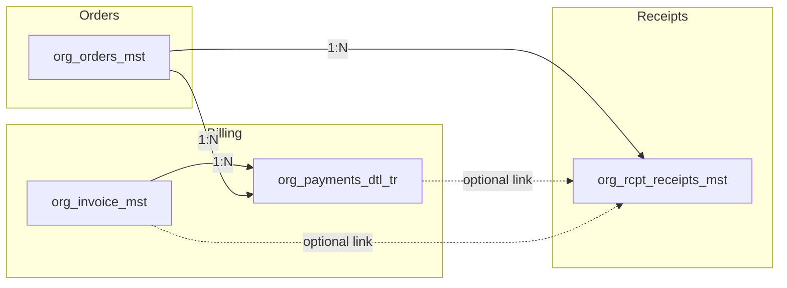
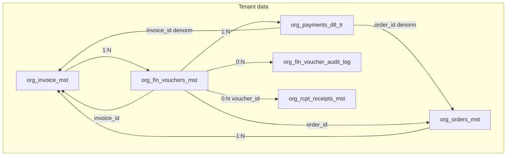

# Receipt Voucher Feature Plan

## Primary approach: Enhanced (full feature)

This plan implements the Enhanced design as the main path. Key elements: “”

- **Core relational model**: Order → Invoice → **Voucher** → 1..N payment rows (org_fin_vouchers_mst; org_payments_dtl_tr.voucher_id). Voucher is the parent of payment rows; invoice paid amount is derived from vouchers.
- **Lifecycle**: Draft → Issued → Voided, with audit log (org_fin_voucher_audit_log) and void reason.
- **Voucher types**: RECEIPT, PAYMENT, CREDIT, ADJUSTMENT (code table sys_fin_voucher_type_cd or equivalent).
- **Sequential numbering**: Tenant-scoped voucher_no (UNIQUE(tenant_org_id, voucher_no)); configurable format (e.g. RCP-2025-00001) for GCC compliance.
- **Truth rules**: Invoice = what is owed; Voucher total = SUM(payment rows); invoice payment status derived from vouchers.
- **Void**: Issued vouchers can be voided with reason; cannot void if settled unless REVERSAL voucher exists.
- **Templates**: Tenant voucher templates (EN/AR, RTL) for print layout.
- **Print + optional delivery**: Print (A4/thermal) from voucher/payment/invoice; optional send via org_rcpt_receipts_mst (email/WhatsApp).
- **Optional later**: Cash-up link, batch/daily voucher, accounting export, feature flags.

Implementation follows the core relational model (voucher as parent of payment rows) and Enhanced design throughout.

---

## Current state

- **Invoices** ([org_invoice_mst](web-admin/prisma/schema.prisma)): Linked to orders; `paid_amount` is the sum of successful payment transactions.
- **Payment transactions** ([org_payments_dtl_tr](web-admin/prisma/schema.prisma)): Optional `invoice_id`, `order_id`, `customer_id`; `payment_kind` (invoice, deposit, advance, pos); no voucher number or receipt link.
- **Receipts** ([org_rcpt_receipts_mst](supabase/migrations/0064_org_rcpt_receipts_system.sql)): **Order-only** (`order_id` NOT NULL); types: whatsapp_text, whatsapp_image, in_app, pdf, print; used for digital/order receipts via [receipt-service.ts](web-admin/lib/services/receipt-service.ts).
- **Order receipt print**: [OrderReceiptPrint](web-admin/src/features/orders/ui/order-receipt-print.tsx) used from ready order page (thermal/A4) — order summary, not payment-specific.
- **Billing UI**: [Payment detail](web-admin/app/dashboard/billing/payments/[id]/payment-detail-client.tsx) has cancel/refund but no “Print receipt voucher”. [Invoice detail](web-admin/app/dashboard/billing/invoices/[id]/page.tsx) shows payment history and record-payment; no voucher print.

There is a [PaymentReceipt](web-admin/lib/types/payment.ts) interface (invoice_no, order_id, payment_date, amount_paid, etc.) used for display; no stored “voucher” entity tied to a payment transaction yet.

---

## What is a receipt voucher?

A **receipt voucher** is a formal proof-of-payment document that:

1. Evidences **one payment transaction** (or optionally all payments for one invoice).
2. Shows: voucher number (or payment ref), date, amount, method, invoice no, order no, customer, tenant branding.
3. Can be **printed** (A4 and/or thermal) from payment detail, invoice detail, or right after recording a payment.
4. Optionally **stored** for audit, re-print, or future delivery (e.g. email/WhatsApp).

---

## Integration with payments, transactions, and invoices

- **Payment transaction** → can have 0 or 1 receipt voucher record (one voucher per payment).
- **Invoice** → “Print receipt voucher” can mean: (a) one voucher per selected payment, or (b) one “invoice payment summary” voucher listing all payments.
- **Order** → existing order receipt remains; receipt voucher is **payment-centric** (triggered from payment/invoice, not from order flow).

---

## Core relational model (canonical target)

This section defines the **target finance spine** and cardinalities. Key architectural choice: **Voucher is the parent of payment rows** (payment rows reference voucher_id), not the other way around.

### 1) Entity map

**A) Order → Invoice → Voucher (finance spine)**

- **org_orders_mst**: 1 Order → **0..N** Invoices (policy: invoice-at-ready, split/merge, B2B).
- **org_invoice_mst**: 1 Invoice → **0..N** Vouchers (e.g. one invoice paid in 2 parts → 2 Receipt Vouchers; one refund → 1 Refund Voucher).
- **org_fin_vouchers_mst**: Belongs to one tenant; links to one order and/or one invoice (edge: invoice-only for B2B, order-only for deposit before invoice).

**B) Voucher → Voucher payments (how it was paid)**

- **org_fin_vouchers_mst**: 1 Voucher → **1..N** payment rows. Split tender = 1 voucher, 2+ rows (CASH + CARD). Single cash = 1 voucher, 1 row.
- **org_payments_dtl_tr**: Each row = one payment instrument + amount + reference. Rows reference **voucher_id** (FK to org_fin_vouchers_mst).

**C) Voucher → Audit log**

- **org_fin_vouchers_mst**: 1 Voucher → **0..N** audit rows. **org_fin_voucher_audit_log**: Immutable append-only (issued, voided, reversed, edited, approved).

**Optional**: org_customers_mst (1) —— (0..N) org_fin_vouchers_mst (customer_id on voucher) for fast customer finance view.

### 2) Cardinalities (canonical)

| From                 | To                        | Cardinality                           |
| -------------------- | ------------------------- | ------------------------------------- |
| org_orders_mst       | org_invoice_mst           | 1 —— 0..N                             |
| org_invoice_mst      | org_fin_vouchers_mst      | 1 —— 0..N                             |
| org_fin_vouchers_mst | org_payments_dtl_tr       | 1 —— 0..N (1..N for CASH_IN/CASH_OUT) |
| org_fin_vouchers_mst | org_rcpt_receipts_mst     | 1 —— **0..N**                         |
| org_fin_vouchers_mst | org_fin_voucher_audit_log | 1 —— 0..N                             |

**org_fin_vouchers_mst (1) —— (0..N) org_rcpt_receipts_mst:** A voucher may have zero to many receipt/delivery records (print, email, WhatsApp). Add **voucher_id (UUID NULL)** to org_rcpt_receipts_mst with FK to org_fin_vouchers_mst.(id, tenant_org_id). Keep order_id for order-level receipts; voucher_id for voucher-level receipts.

**Critical flip vs current CleanMateX**: Today org_payments_dtl_tr points to invoice/order; no voucher. In the target model **payment rows point to voucher** (voucher_id on org_payments_dtl_tr). Flow: create **Voucher first**, then attach 1..N payment rows. Invoice paid amount is **derived** from vouchers.

### 3) Foreign keys (multi-tenant composite pattern)

- **org_fin_vouchers_mst**: (order_id, tenant_org_id) → org_orders_mst; (invoice_id, tenant_org_id) → org_invoice_mst; (customer_id, tenant_org_id) → org_customers_mst; branch_id → org_branches_mst (composite if applicable).
- **org_payments_dtl_tr**: **(voucher_id, tenant_org_id)** → org_fin_vouchers_mst.(id, tenant_org_id). Keep invoice_id/order_id/customer_id as denormalized for queries or derive from voucher.
- **org_fin_voucher_audit_log**: (voucher_id, tenant_org_id) → org_fin_vouchers_mst.

### 4) Truth rules (no finance drift)

- **Invoice = “what is owed”**: org_invoice_mst.total (or total_due) is canonical payable.
- **Voucher = “one financial event”**: Receipt collected, refund paid, credit issued, adjustment made.
- **Voucher total = SUM(payment rows)**: Enforce with trigger or constraint. **Exception:** CREDIT vouchers (e.g. pure credit note) may have **0 payment rows**; then voucher.total_amount is the credit amount and no payment rows are required.
- **Invoice payment status is derived**: paid amount = SUM(vouchers voucher_type=RECEIPT, status=ISSUED) − SUM(vouchers voucher_type=PAYMENT, status=ISSUED) − SUM(vouchers voucher_type=CREDIT, status=ISSUED) as applied; payment_status = UNPAID | PARTIALLY_PAID | PAID | OVERPAID (computed).

### 5) Lifecycle examples

- **Simple cash**: Invoice 10 OMR → Create Voucher RV#1 (10 OMR) → One org_payments_dtl_tr (CASH 10) → Invoice PAID.
- **Split tender**: Voucher RV#2 (10 OMR) → Two org_payments_dtl_tr: CASH 5, CARD 5 → Invoice PAID.
- **Refund**: Voucher PV#1 (refund, 3 OMR) → One payment row → Invoice paid amount decreases.

### 5b) voucher_type: classification of the financial event

**org_fin_vouchers_mst** must have a column **voucher_type**. It is the **classification of the financial event** the voucher represents — the **business meaning** of the document — not “how it was paid” (that is **payment_method** on payment rows).

**Key distinction**

- **voucher_type** = what happened financially (receipt vs payout vs credit).
- **payment_method** (on org_payments_dtl_tr) = how it happened (CASH, CARD, ONLINE, WALLET, etc.).

So: a Receipt voucher can have payment_method = CASH or CARD or ONLINE; a Payment voucher (refund) can have payment_method = CASH or gateway refund ref; a Credit voucher may have **no payment rows** (pure credit note) or a wallet transaction depending on design.

---

**1) RECEIPT**

- **Meaning:** Money **received by the laundry** from the customer (or B2B client).
- **Use cases:** Customer pays at counter (cash/card), online (gateway), on delivery; advance/deposit.
- **Business impact:** Increases paid amount; reduces invoice outstanding; drives cash reconciliation (shift close).
- **Example:** Invoice 10 OMR → customer pays 10 → Receipt voucher = 10.

**2) PAYMENT**

- **Meaning:** Money **paid out by the laundry** (money leaving the business). In CleanMateX mainly **refunds** or payouts.
- **Use cases:** Refund after dispute/issue, overpayment, cancellation; cash payout to customer (rare).
- **Business impact:** Decreases net paid amount; increases invoice outstanding (or creates credit); must be auditable and usually approval-gated.
- **Example:** Customer paid 10, later refund 3 → Payment voucher = 3.

**3) CREDIT**

- **Meaning:** A **non-cash value** granted to the customer; the business acknowledges a reduction in what is owed or grants store credit.
- **Flavors:** (a) **Credit note** — reduces invoice total due, VAT/accounting traceability; (b) **Store credit / wallet credit** — adds value to internal wallet, no cash movement now.
- **Business impact:** Adjusts receivable without paying cash; often used to settle disputes.
- **Example:** Invoice 10, customer complains → give 2 OMR credit note → Credit voucher = 2.
- **Note:** Credit voucher may have **no payment rows** (pure credit note) or may create a wallet transaction; design choice.

**4) ADJUSTMENT (optional)**

- **Meaning:** Internal adjustment or write-off (e.g. rounding, manual correction). Keep in CHECK constraint if used; otherwise RECEIPT/PAYMENT/CREDIT only.

**5) ADVANCE (optional)**

- **Meaning:** Customer pays before service is fully priced; later consumed by invoice. Can be modeled as RECEIPT; explicit ADVANCE improves reporting and clarity. Valuable for B2B.

**6) DEPOSIT (optional)**

- **Meaning:** Refundable deposit (bags, uniforms, reusable items); later refunded or forfeited. Difference vs ADVANCE: Advance → applied to invoice; Deposit → refundable, not service revenue.

**7) PENALTY (optional)**

- **Meaning:** Late pickup fee, lost item charge, no-show delivery. Can be modeled as RECEIPT; separate type improves analytics and disputes.

**8) WRITE_OFF (optional)**

- **Meaning:** Finance cleanup — small irrecoverable balances, customer never returned. No cash movement; closes invoice.

**9) TRANSFER / 10) COMMISSION (Tier-3, rare)**

- **TRANSFER:** Money moved between branches; franchise internal settlements. Only if multi-branch cash management is in scope.
- **COMMISSION:** Marketplace commission settlements (platform ↔ tenant). Tier-3; usually not needed for SaaS laundries.

---

### 5c) Voucher category + subtype (scalable model)

For long-term scalability use **voucher_category + voucher_subtype** instead of a single large voucher_type enum.

| Field                | Type | Purpose |
| -------------------- | ---- | ------- |
| **voucher_category** | enum | **Stable:** CASH_IN (money received), CASH_OUT (money paid out), NON_CASH (balance adjusted without cash). Drives enforcement (payment lines required or not). |
| **voucher_subtype**  | text | **Flexible:** SALE_PAYMENT, ADVANCE, DEPOSIT, REFUND, CREDIT_NOTE, WALLET_COMP, WRITE_OFF, PRICE_CORRECTION, PENALTY_FEE, etc. Feature-flag-driven per tenant. |
| **reason_code**      | text | Optional; required for CREDIT/WRITE_OFF/ADJUSTMENT per rule matrix. Examples: QUALITY_ISSUE, LOST_ITEM, LATE_PICKUP, MANUAL_CORRECTION. |

**Mapping: voucher_type → voucher_category + voucher_subtype**

| voucher_type | voucher_category | voucher_subtype                              |
| ------------ | ---------------- | -------------------------------------------- |
| RECEIPT      | CASH_IN          | SALE_PAYMENT                                 |
| PAYMENT      | CASH_OUT         | REFUND                                       |
| CREDIT       | NON_CASH         | CREDIT_NOTE (or WALLET_COMP if wallet-based) |
| ADJUSTMENT   | NON_CASH         | PRICE_CORRECTION                             |
| ADVANCE      | CASH_IN          | ADVANCE                                      |
| DEPOSIT      | CASH_IN          | DEPOSIT                                      |
| PENALTY      | CASH_IN          | PENALTY_FEE                                  |
| WRITE_OFF    | NON_CASH         | WRITE_OFF                                    |

**Enforcement using category:** voucher_category = CASH_IN or CASH_OUT → require 1..N payment lines, SUM = voucher.total_amount; voucher_category = NON_CASH → require 0 payment lines, invoice_id + reason_code where applicable.

---

### 5d) Allowed payment methods per voucher type

| voucher_type   | Allowed payment_method                                                |
| -------------- | --------------------------------------------------------------------- |
| RECEIPT       | CASH, CARD, ONLINE, WALLET, BANK_TRANSFER                             |
| PAYMENT       | CASH, ONLINE, BANK_TRANSFER (CARD refunds = ONLINE with provider_ref)  |
| CREDIT        | None (0 lines) OR WALLET (if store credit = wallet top-up)           |
| ADJUSTMENT    | None (0 lines)                                                        |
| ADVANCE       | CASH, CARD, ONLINE, WALLET, BANK_TRANSFER                             |
| DEPOSIT       | CASH, CARD, ONLINE, BANK_TRANSFER                                    |
| PENALTY       | CASH, CARD, ONLINE                                                    |
| WRITE_OFF     | None (0 lines)                                                        |

Enforce in application (or DB trigger): payment_method_code on org_payments_dtl_tr must be in the allowed set for the voucher’s voucher_type.

---

### 5e) Voucher type → cash direction + invoice impact

| voucher_type   | Cash direction | Payment lines? | Invoice total_due changes? | Invoice paid_amount changes? | Typical link requirement |
| -------------- | -------------- | -------------- | -------------------------- | ---------------------------- | ------------------------- |
| RECEIPT       | IN             | Yes (1..N)     | No                         | Yes (+)                      | invoice_id recommended; order_id optional |
| PAYMENT       | OUT            | Yes (1..N)     | No                         | Yes (−)                      | invoice_id or reversed_by_voucher_id |
| CREDIT        | NONE           | Usually 0      | Yes (−) if credit note     | No (or optional)             | invoice_id + reason_code |
| ADJUSTMENT    | NONE           | No (0)         | Depends                    | Depends                      | invoice_id or order_id + approval |
| ADVANCE       | IN             | Yes (1..N)     | No                         | Yes (+) when applied         | order_id or customer_id |
| DEPOSIT       | IN/OUT later   | Yes (1..N)     | No                         | No (keep off invoice)        | customer_id; optionally order_id |
| PENALTY       | IN             | Yes (1..N)     | No (or Yes if fee line)    | Yes (+)                      | invoice_id or order_id |
| WRITE_OFF     | NONE           | No (0)         | Yes (−)                    | No                           | invoice_id + approval |

---

**Rule matrix (allowed links + required fields)**

| voucher_type | invoice_id                               | order_id | customer_id | Required / optional                                         | Notes                                                          |
| ------------ | ---------------------------------------- | -------- | ----------- | ----------------------------------------------------------- | -------------------------------------------------------------- |
| RECEIPT      | Optional or required by policy           | Optional | Optional    | At least one of invoice_id, order_id, customer_id (policy). | Advance may have order_id or customer_id only.                 |
| PAYMENT      | Required (or reference original receipt) | Optional | Optional    | Must reference original receipt/invoice for traceability.   | reversed_by_voucher_id or metadata.                           |
| CREDIT       | Required                                 | Optional | Optional    | Must reference invoice and **reason_code** (or metadata).   | Credit note / store credit; reason for audit.                  |
| ADJUSTMENT   | Optional                                 | Optional | Optional    | invoice_id or order_id + approval/meta.                      | Internal only.                                                 |
| ADVANCE      | Optional (later)                         | Optional | Optional    | order_id or customer_id; later allocated to invoice.         |                                                                |
| DEPOSIT      | No                                       | Optional | Required    | customer_id.                                                | Refundable; keep off invoice.                                  |
| PENALTY      | Optional                                 | Optional | Optional    | invoice_id or order_id.                                     | Fee.                                                           |
| WRITE_OFF    | Required                                 | Optional | Optional    | invoice_id + approval.                                      | Closes invoice.                                                |

**Invoice paid amount formula (truth rule):**

- paid amount = SUM(vouchers where **voucher_type = RECEIPT** and status = ISSUED) − SUM(vouchers where **voucher_type = PAYMENT** and status = ISSUED) − SUM(vouchers where **voucher_type = CREDIT** and status = ISSUED) as applied to that invoice (or derived per policy).

### 6) Recommended constraints

- CHECK (total_amount > 0); voucher_category IN ('CASH_IN','CASH_OUT','NON_CASH'); voucher_type IN ('RECEIPT','PAYMENT','CREDIT','ADJUSTMENT','ADVANCE','DEPOSIT','PENALTY','WRITE_OFF') if using voucher_type; UNIQUE (tenant_org_id, voucher_no); for CASH_IN/CASH_OUT: SUM(payment rows) = voucher.total_amount (trigger); for NON_CASH: 0 payment rows; cannot VOID if settled unless REVERSAL voucher exists.

### 7) Migration from current CleanMateX state

- **Current**: org_payments_dtl_tr has invoice_id, order_id, customer_id; no voucher; processPayment creates payment row(s) and updates invoice paid_amount directly. org_rcpt_receipts_mst is order-only (no voucher_id).
- **Target**: org_fin_vouchers_mst exists; org_payments_dtl_tr has **voucher_id** (FK to voucher); **org_rcpt_receipts_mst** has **voucher_id** (FK to voucher) so voucher 0..N receipts; flow = create Voucher → attach 1..N payment rows; invoice paid amount derived from vouchers.
- **Migration path**: See **Full migration plan** section below for step-by-step DDL, backfill, RLS, Prisma, and rollout.

---

## Full migration plan

Execute in order; use next migration version after latest in `supabase/migrations/` (e.g. after `0087` use `0088`).

### Step 1 — Create migration file

- New file: `supabase/migrations/0088_org_fin_vouchers_and_receipt_voucher_id.sql` (or next available version).
- All DDL in a single transaction (BEGIN; ... COMMIT;).

### Step 2 — Code tables (optional)

- **sys_fin_voucher_category_cd**: code (CASH_IN, CASH_OUT, NON_CASH), name, name2, description, description2, is_active, rec_status, audit. INSERT seed rows.
- **sys_fin_voucher_subtype_cd** (optional): code (SALE_PAYMENT, ADVANCE, DEPOSIT, REFUND, CREDIT_NOTE, WRITE_OFF, PRICE_CORRECTION, PENALTY_FEE, etc.), name, name2, voucher_category_code (FK), is_active, rec_status. Seed core subtypes; extend later without new migration.

### Step 3 — Create org_fin_vouchers_mst

- Columns: id (UUID PK default gen_random_uuid()), tenant_org_id (UUID NOT NULL), branch_id (UUID NULL), voucher_no (VARCHAR, UNIQUE(tenant_org_id, voucher_no)), **voucher_category** (VARCHAR NOT NULL: CASH_IN, CASH_OUT, NON_CASH), **voucher_subtype** (VARCHAR NULL or FK to sys_fin_voucher_subtype_cd), **voucher_type** (VARCHAR NULL: RECEIPT, PAYMENT, CREDIT, ADJUSTMENT, ADVANCE, DEPOSIT, PENALTY, WRITE_OFF for backward compat), invoice_id (UUID NULL), order_id (UUID NULL), customer_id (UUID NULL), total_amount (DECIMAL(19,4) NOT NULL), currency_code (VARCHAR(3)), status (VARCHAR: draft, issued, voided), issued_at (TIMESTAMP NULL), voided_at (TIMESTAMP NULL), void_reason (TEXT NULL), **reason_code** (VARCHAR NULL), reversed_by_voucher_id (UUID NULL), content_html (TEXT NULL), content_text (TEXT NULL), metadata (JSONB NULL), rec_status, is_active, created_at, created_by, created_info, updated_at, updated_by, updated_info.
- Composite FKs: (tenant_org_id) → org_tenants_mst; (order_id, tenant_org_id) → org_orders_mst(id, tenant_org_id); (invoice_id, tenant_org_id) → org_invoice_mst(id, tenant_org_id); (customer_id, tenant_org_id) → org_customers_mst (if composite); branch_id → org_branches_mst if applicable.
- CHECK (total_amount > 0); CHECK (voucher_category IN ('CASH_IN','CASH_OUT','NON_CASH')); UNIQUE (tenant_org_id, voucher_no).
- Indexes: (tenant_org_id, created_at DESC), (tenant_org_id, status), (invoice_id), (order_id), (customer_id), (voucher_no).

### Step 4 — Create org_fin_voucher_audit_log

- Columns: id (UUID PK), voucher_id (UUID NOT NULL), tenant_org_id (UUID NOT NULL), action (VARCHAR: issued, voided, reversed, edited, approved), snapshot_or_reason (TEXT NULL), changed_at (TIMESTAMP), changed_by (VARCHAR/UUID NULL).
- FK (voucher_id, tenant_org_id) → org_fin_vouchers_mst(id, tenant_org_id).
- Indexes: (voucher_id), (tenant_org_id, changed_at DESC).

### Step 5 — Voucher number sequence

- Option A: Global sequence `seq_fin_voucher_no` (e.g. NEXTVAL per tenant prefix in application).
- Option B: Per-tenant sequence or table `org_fin_voucher_seq` (tenant_org_id, next_val). Prefer application-level generation (e.g. RCP-2025-00001) using tenant-scoped counter or sequence.

### Step 6 — Alter org_payments_dtl_tr

- ADD COLUMN voucher_id UUID NULL.
- ADD CONSTRAINT fk_org_payments_voucher FOREIGN KEY (voucher_id, tenant_org_id) REFERENCES org_fin_vouchers_mst(id, tenant_org_id) ON DELETE SET NULL (or RESTRICT).
- Index: (voucher_id).
- Do **not** make NOT NULL yet (backfill first).

### Step 7 — Alter org_rcpt_receipts_mst

- ADD COLUMN voucher_id UUID NULL.
- ADD CONSTRAINT fk_org_rcpt_receipts_voucher FOREIGN KEY (voucher_id, tenant_org_id) REFERENCES org_fin_vouchers_mst(id, tenant_org_id) ON DELETE SET NULL.
- Index: (voucher_id).
- Make order_id nullable if not already (voucher receipts may have voucher_id only), or keep order_id and set from voucher’s order_id when creating receipt from voucher.

### Step 8 — RLS policies

- **org_fin_vouchers_mst**: CREATE POLICY tenant_isolation ON org_fin_vouchers_mst FOR ALL USING (tenant_org_id::text = (auth.jwt() ->> 'tenant_org_id')); ENABLE ROW LEVEL SECURITY.
- **org_fin_voucher_audit_log**: Same tenant_org_id policy; ENABLE ROW LEVEL SECURITY.
- **org_payments_dtl_tr**: Existing RLS remains; ensure tenant_org_id used.
- **org_rcpt_receipts_mst**: Existing RLS remains; ensure policy allows rows where voucher_id is set (same tenant).

### Step 9 — Backfill existing payments

- Single SQL or application script (run once after migration):
  - For each row in org_payments_dtl_tr where voucher_id IS NULL and status indicates successful payment:
    - INSERT into org_fin_vouchers_mst (tenant_org_id, voucher_no, voucher_category, voucher_subtype, voucher_type, invoice_id, order_id, customer_id, total_amount, currency_code, status, issued_at, created_at, ...) VALUES (..., 'CASH_IN', 'SALE_PAYMENT', 'RECEIPT', invoice_id, order_id, customer_id, paid_amount, currency_code, 'issued', paid_at, created_at, ...); get new voucher id; assign voucher_no from sequence (e.g. RCP-YYYY-NNNNN).
    - UPDATE org_payments_dtl_tr SET voucher_id = new_voucher_id WHERE id = current_payment_id.
- Handle duplicates per tenant (voucher_no unique); use next value from sequence.

### Step 10 — (Optional) Enforce voucher_id for new rows

- Either: keep voucher_id nullable for legacy/import; application always sets voucher_id for new payments.
- Or: ALTER org_payments_dtl_tr ALTER COLUMN voucher_id SET NOT NULL (only after backfill 100% complete and application creates voucher first).

### Step 11 — Triggers (optional but recommended)

- Trigger on org_payments_dtl_tr: when voucher_id is set and voucher_category in (CASH_IN, CASH_OUT), ensure SUM(paid_amount) for that voucher_id = org_fin_vouchers_mst.total_amount; raise exception if not.
- Trigger on org_fin_vouchers_mst: when status changes to issued/voided, INSERT into org_fin_voucher_audit_log.

### Step 12 — Prisma schema

- In `web-admin/prisma/schema.prisma`: Add model org_fin_vouchers_mst with all fields; add model org_fin_voucher_audit_log; add voucher_id to org_payments_dtl_tr; add voucher_id to org_rcpt_receipts_mst; add relations (org_fin_vouchers_mst has many org_payments_dtl_tr, many org_rcpt_receipts_mst, many org_fin_voucher_audit_log). Run `npx prisma generate`.

### Step 13 — Feature flags and rollout

- Add feature flag `receipt_voucher` (or use existing) to enable voucher flow in UI/API.
- Rollout order: (1) Deploy migration + backfill; (2) Deploy application code (voucher service, processPayment creates voucher then payment rows); (3) Enable feature flag per tenant; (4) Optional: receipt_voucher_delivery for email/WhatsApp; receipt_voucher_sequence for strict voucher_no.

---

## Enhanced data model (Phase 2: dedicated vouchers)

When moving to the **core relational model** (org_fin_vouchers_mst as parent of payment rows), the relationships look like this:

- **org_fin_vouchers_mst**: id, tenant_org_id, branch_id, voucher_no, **voucher_category** (CASH_IN, CASH_OUT, NON_CASH), **voucher_subtype** (text), **voucher_type** (RECEIPT, PAYMENT, CREDIT, ADJUSTMENT, ADVANCE, DEPOSIT, PENALTY, WRITE_OFF) — classification of financial event; invoice_id, order_id, customer_id, total_amount, currency_code, status (draft/issued/voided), voided_at, void_reason, **reason_code**, reversed_by_voucher_id, content_*, audit fields. **Payment rows reference voucher_id (1 voucher → 1..N for CASH_IN/CASH_OUT; 0 for NON_CASH).** **org_rcpt_receipts_mst.voucher_id**: 1 voucher → 0..N receipt/delivery records (print, email, WhatsApp).
- **org_payments_dtl_tr**: Add **voucher_id** (FK to org_fin_vouchers_mst); keep invoice_id/order_id/customer_id as denormalized.
- **org_rcpt_receipts_mst**: Add **voucher_id** (FK to org_fin_vouchers_mst); voucher may have 0..N receipts.
- **org_fin_voucher_audit_log**: voucher_id, tenant_org_id, action (issued, voided, reversed, edited, approved), snapshot/reason, timestamp, user.
- **Delivery**: When voucher is sent by email/WhatsApp, create a row in org_rcpt_receipts_mst with **voucher_id** set and use existing delivery pipeline.

---

## Design choices

### Alternative: minimal path (MVP) — not the primary plan

| Area               | Recommendation                                                                                                                                                                                                    | Alternative                                                                       |
| ------------------ | ----------------------------------------------------------------------------------------------------------------------------------------------------------------------------------------------------------------- | --------------------------------------------------------------------------------- |
| **Storage**        | Extend `org_rcpt_receipts_mst` with optional `payment_id`, `invoice_id`; make `order_id` nullable when `receipt_type_code = 'receipt_voucher'`. Add receipt type `receipt_voucher` in `sys_rcpt_receipt_type_cd`. | New table `org_rcpt_vouchers_mst` (payment*id, invoice_id, voucher_no, content*). |
| **Voucher number** | Either payment `id` (short form) or a tenant-scoped sequence (e.g. `RCP-2025-00001`) stored in receipt metadata or new column.                                                                                    | Use transaction id only (no human-readable voucher no).                           |
| **When to create** | On-demand when user clicks “Print receipt voucher”; optionally also auto-create one record per payment when payment is recorded (for audit list).                                                                 | Only on-demand print (no DB record).                                              |

### Enhanced (primary — full feature)

| Area               | Recommendation                                                                                                                                                                                                                                                                                                                                                                                                                                                                                                                                     |
| ------------------ | -------------------------------------------------------------------------------------------------------------------------------------------------------------------------------------------------------------------------------------------------------------------------------------------------------------------------------------------------------------------------------------------------------------------------------------------------------------------------------------------------------------------------------------------------- |
| **Storage**        | **Dedicated table** `org_fin_vouchers_mst`: id, tenant*org_id, branch_id, voucher_no (unique per tenant), voucher_type_code (RECEIPT, PAYMENT, CREDIT, ADJUSTMENT), invoice_id, order_id, customer_id, **total_amount** (must equal SUM of payment rows), currency_code, status (draft, issued, voided), voided_at, void_reason, content*, audit fields. **org_payments_dtl_tr gets voucher_id** (FK to org_fin_vouchers_mst): 1 voucher → 1..N payment rows (split tender). Optional link to org_rcpt_receipts_mst for delivery (email/WhatsApp). |
| **Voucher number** | Tenant-scoped sequence (e.g. `seq_voucher_no` per tenant or global with tenant prefix). Format configurable (e.g. RCP-{YYYY}-{NNNNN}). **Required** for issued vouchers; supports void and renumbering policy (e.g. do not reuse voided numbers).                                                                                                                                                                                                                                                                                                  |
| **Voucher types**  | Column **voucher_type** = classification of financial event (not how it was paid). Values: RECEIPT (money received), PAYMENT (money paid out / refunds), CREDIT (credit note / store credit), ADJUSTMENT (optional). Code table sys_fin_voucher_type_cd for labels. Rule matrix: RECEIPT (invoice_id optional by policy), PAYMENT (must reference original receipt/invoice), CREDIT (must reference invoice + reason_code).                                                                                                                        |
| **When to create** | Configurable per tenant: (1) Auto-issue on payment record (with optional “Print now”); (2) On-demand “Issue & print” from payment/invoice detail; (3) “Issue” then “Send” (email/WhatsApp) later. Refund voucher auto-created (or optional) when refund is recorded.                                                                                                                                                                                                                                                                               |
| **Void**           | Issued vouchers can be voided with reason and timestamp; voided vouchers excluded from normal listing but kept for audit.                                                                                                                                                                                                                                                                                                                                                                                                                          |
| **Delivery**       | Reuse `org_rcpt_receipts_mst` + ReceiptService: when user sends voucher by email/WhatsApp, create a receipt record linked to voucher (e.g. `metadata.voucher_id`) and use existing delivery pipeline.                                                                                                                                                                                                                                                                                                                                              |
| **Cash-up**        | Optional `cashup_session_id` (or link table) on voucher so “Daily collection” report can list vouchers per session; supports reconciliation.                                                                                                                                                                                                                                                                                                                                                                                                       |

---

## Implementation plan (Enhanced)

### 1. Data model (migration + Prisma)

- **Migration** (new file, next version after latest in `supabase/migrations/`):
  - **Create org_fin_vouchers_mst**: id, tenant_org_id, branch_id, voucher_no (UNIQUE(tenant_org_id, voucher_no)), **voucher_category** (CASH_IN, CASH_OUT, NON_CASH), **voucher_subtype** (text), **voucher_type** (RECEIPT, PAYMENT, CREDIT, ADJUSTMENT, ADVANCE, DEPOSIT, PENALTY, WRITE_OFF), invoice_id, order_id, customer_id, total_amount, currency_code, status, issued_at, voided_at, void_reason, **reason_code**, reversed_by_voucher_id, content_html, content_text, metadata, audit fields. Composite FKs. CHECK (total_amount > 0), CHECK (voucher_category IN (...)).
  - **Create org_fin_voucher_audit_log**: id, voucher_id, tenant_org_id, action, snapshot/reason, changed_at, changed_by. FK to org_fin_vouchers_mst.
  - **Alter org_payments_dtl_tr**: Add voucher_id (nullable) with FK to org_fin_vouchers_mst. Trigger: for CASH_IN/CASH_OUT, SUM(paid_amount) = voucher.total_amount.
  - **Alter org_rcpt_receipts_mst**: Add voucher_id (nullable) with FK to org_fin_vouchers_mst. Voucher 0..N receipts.
  - **Voucher number**: Tenant-scoped sequence for voucher_no (e.g. RCP-2025-00001).
  - **Backfill**: For each existing org_payments_dtl_tr row, create one org_fin_vouchers_mst (voucher_category CASH_IN, voucher_type RECEIPT), set voucher_id, assign voucher_no.
  - **RLS**: Policies on org_fin_vouchers_mst and org_fin_voucher_audit_log by tenant_org_id.
  - **Prisma**: Add org_fin_vouchers_mst, org_fin_voucher_audit_log; add voucher_id to org_payments_dtl_tr and org_rcpt_receipts_mst; run `npx prisma generate`.
  - **Full step-by-step**: See **Full migration plan** section above.

### 2. Backend: voucher service and processPayment (Enhanced)

- **Voucher service** (new e.g. voucher-service.ts or extend payment-service):
  - `createVoucher(tenantId, input)`: Create org_fin_vouchers_mst (type RECEIPT), assign voucher_no, return voucher id.
  - `attachPaymentRows(voucherId, tenantId, rows)`: Insert 1..N org_payments_dtl_tr rows with voucher_id; enforce SUM(paid_amount) = voucher.total_amount.
  - `issueVoucher(voucherId, tenantId)`, `voidVoucher(voucherId, tenantId, reason)`: Status + audit log.
  - `getVoucherData(voucherId, tenantId)` / `getVoucherDataByPaymentId(paymentId, tenantId)`: Load payment + invoice + order + customer + tenant; return a DTO (voucher number, date, amount, method, invoice no, order no, customer, currency, etc.) for a single payment.
  - `getInvoicePaymentVouchersData(invoiceId, tenantId)`: Return list of voucher DTOs for all completed payments for that invoice (for “print all” or list).
  - Optional: `createReceiptVoucherRecord(paymentId, tenantId, options)`: Insert into `org_rcpt_receipts_mst` with `receipt_type_code = 'receipt_voucher'`, `payment_id`, `invoice_id`, `order_id` (from payment), and generated `content_html`/`content_text` (and optional `voucher_no` in metadata).
- **Voucher number**: Prefer tenant-scoped sequence (e.g. sequence per tenant or `voucher_no` column) for human-readable ref; otherwise use payment `id` for uniqueness.
- All queries **must** filter by `tenant_org_id` (and use `withTenantContext` / `getTenantIdFromSession()` where applicable).

### 3. Server actions and API

- **Actions** (e.g. under `app/actions/payments/` or `app/actions/receipts/`):
  - `getReceiptVoucherDataAction(paymentId)`: For payment detail page print.
  - `getInvoiceReceiptVouchersDataAction(invoiceId)`: For invoice detail page (print one or all).
  - Optional: `createReceiptVoucherRecordAction(paymentId)` when user requests “Save voucher” or when auto-create is enabled.
- No change to `processPayment` / `recordPaymentTransaction` required; Enhanced flow: create voucher first, then attach 1..N payment rows.

### 4. Print UI (report naming)

- **Component**: New print component following report naming: e.g. `**billing-receipt-voucher-print-rprt.tsx**` (or `payments-receipt-voucher-print-rprt.tsx`) under `app/dashboard/billing/` or `components/reports/`. Renders one voucher (single payment) or multiple (invoice summary) with layout for A4 and thermal (reuse layout patterns from [order-receipt-print](web-admin/src/features/orders/ui/order-receipt-print.tsx)).
- **Routes**: e.g. `/dashboard/billing/payments/[id]/print/receipt-voucher` and `/dashboard/billing/invoices/[id]/print/receipt-vouchers` (or single print page with query `?paymentId=...` or `?invoiceId=...`).
- Use centralized theme/fonts/layout as per [report-implement-or-build rule](.cursor/rules/report-implement-or-build.mdc).

### 5. Billing UI entry points

- **Payment detail** ([payment-detail-client.tsx](web-admin/app/dashboard/billing/payments/[id]/payment-detail-client.tsx)): Add “Print receipt voucher” button (and optional “Email receipt” later); link to print route or open print preview with voucher data.
- **Invoice detail** ([invoices/[id]/page.tsx](web-admin/app/dashboard/billing/invoices/[id]/page.tsx) or client block): Add “Print receipt voucher(s)” — either per payment in history table or one “Print all payment vouchers” that opens the multi-voucher print view.
- **After record payment** (invoice record-payment flow): Optional “Print receipt voucher now” checkbox or post-success action to open print for the newly created payment.

### 6. i18n and constants

- **Messages**: Reuse existing keys where possible (e.g. [payments.receipt](web-admin/messages/en.json) title, date, amount, method); add keys under `billing.receiptVoucher` or `payments.receiptVoucher` for “Print receipt voucher”, “Receipt voucher”, “Voucher #”, etc. Add same keys to [ar.json](web-admin/messages/ar.json); search before adding ([i18n rule](.cursor/rules/uiuxrules.mdc)).
- **Constants**: If voucher number format or receipt type code is shared, add to `lib/constants/` and derive types in `lib/types/` as per project conventions.

### 7. Reports (optional)

- If voucher records are stored: a **billing-receipt-vouchers-rprt** (list/filter by date range, payment, invoice, tenant) reusing the same table and naming convention. Not required for MVP if you only do on-demand print.

---

## Phased implementation (Enhanced primary)

### Phase 1 – Enhanced (primary implementation)

- **org_fin_vouchers_mst** and **org_fin_voucher_audit_log**; **voucher_id** on org_payments_dtl_tr; backfill existing payments.
- **Voucher service**: createVoucher, attachPaymentRows, issueVoucher, voidVoucher, getVoucherData, getInvoiceVouchersData.
- **processPayment** flow: create voucher first, then attach 1..N payment rows; invoice paid amount derived (or cached via trigger).
- **Sequential voucher_no** (UNIQUE(tenant_org_id, voucher_no)); voucher types RECEIPT, PAYMENT, CREDIT, ADJUSTMENT.
- **Print**: billing-receipt-voucher-print-rprt (single voucher or invoice summary); routes from payment/invoice detail.
- **Report**: billing-receipt-vouchers-rprt (list/filter by date, type, payment, invoice, status).
- **Templates**: Tenant voucher template (EN/AR, RTL) for layout.
- **Void** with reason and audit log.

### Phase 2 – Advanced (optional)

- **Multi-channel delivery**: “Send voucher” via email / WhatsApp using existing receipt delivery; link delivery record to voucher.
- **Batch voucher**: “Daily collection voucher” or “Cash-up session voucher” listing multiple payments; link to cash-up session for reconciliation.
- **Accounting export**: Export issued vouchers (PDF/CSV) by date range for bookkeeping.
- **Feature flags**: receipt_voucher, receipt_voucher_sequence, receipt_voucher_delivery gated by plan.
- **Customer vs internal**: Optional second layout or “Internal copy” with extra audit info.

---

## Refund voucher and other voucher types

- **Refund voucher**: When a refund is recorded (existing refund flow in payment-service), optionally create a voucher of type `refund` linked to the refund transaction (and original_payment_id in metadata). Same print/send flows as payment receipt voucher; shows refund amount, date, reason.
- **Invoice summary voucher**: One document listing all payments for an invoice (invoice no, total, paid, list of payments with date/method/amount). Useful for “one paper” for the whole invoice.
- **Batch / daily collection voucher**: List of payments in a date range or cash-up session; optional totals by payment method. Supports cash-up reconciliation and accounting.

---

### 8. Testing and build

- After implementation: run `npm run build` in `web-admin` and fix any errors; ensure tenant filters and RLS are correct for new receipt rows and voucher data APIs.

---

## Summary: flows

| Flow                                         | Trigger                                                 | Data                                                | Output                              |
| -------------------------------------------- | ------------------------------------------------------- | --------------------------------------------------- | ----------------------------------- |
| Record payment                               | Invoice/order → Record payment                          | createVoucher → attachPaymentRows(1..N)             | Voucher issued; payment rows linked |
| Print voucher for one payment                | Payment detail → “Print receipt voucher”                | `getReceiptVoucherData(paymentId)`                  | Single-voucher print (A4/thermal)   |
| Print vouchers for invoice                   | Invoice detail → “Print receipt voucher(s)”             | `getInvoicePaymentVouchersData(invoiceId)`          | Multi-voucher or per-payment print  |
| Void voucher                                 | Voucher detail → Void                                   | voidVoucher(voucherId, reason)                      | Status voided                       |
| Optional: save voucher on payment (MVP only) | After `recordPaymentTransaction` or user “Save voucher” | Same as above + insert into `org_rcpt_receipts_mst` | Stored record for re-print/audit    |

---

## Files to add or touch (Enhanced)

- **DB**: New migration: create org_fin_vouchers_mst, org_fin_voucher_audit_log; add voucher_id to org_payments_dtl_tr; voucher_no sequence; backfill; RLS.
- **Prisma**: [web-admin/prisma/schema.prisma](web-admin/prisma/schema.prisma) (org_fin_vouchers_mst, org_fin_voucher_audit_log; voucher_id on org_payments_dtl_tr).
- **Types**: [web-admin/lib/types/payment.ts](web-admin/lib/types/payment.ts) (e.g. ReceiptVoucherData, VoucherDTO); lib/constants/ for voucher_type if shared.
- **Service**: New [voucher-service.ts](web-admin/lib/services/voucher-service.ts) (createVoucher, attachPaymentRows, issueVoucher, voidVoucher, getVoucherData, getInvoiceVouchersData); update [payment-service.ts](web-admin/lib/services/payment-service.ts) processPayment to create voucher first then payment rows.
- **Actions**: New server actions (getVoucherDataAction, getInvoiceVouchersDataAction, voidVoucherAction); update processPayment action to use voucher flow.
- **Print component**: `billing-receipt-voucher-print-rprt.tsx` (single voucher or invoice summary); routes for payment/invoice print.
- **UI**: [payment-detail-client.tsx](web-admin/app/dashboard/billing/payments/[id]/payment-detail-client.tsx), invoice detail — Print receipt voucher; optional Void voucher.
- **Report**: billing-receipt-vouchers-rprt (list/filter vouchers by date, type, payment, invoice, status).
- **i18n**: [en.json](web-admin/messages/en.json) / [ar.json](web-admin/messages/ar.json) (billing.receiptVoucher, payments.receiptVoucher).

---

## Templates and feature flags (enhanced)

- **Templates**: Reuse or extend `org_rcpt_templates_cf` with template_type `receipt_voucher` (and optionally `refund_voucher`, `invoice_summary_voucher`) for EN/AR; placeholders: `{{voucherNo}}`, `{{paymentDate}}`, `{{amount}}`, `{{invoiceNo}}`, `{{orderNo}}`, `{{customerName}}`, `{{paymentMethod}}`, tenant branding. Support RTL for AR.
- **Feature flags**: Add tenant/plan flags (e.g. in `sys_ff_*` or tenant settings): `receipt_voucher` (enable feature), `receipt_voucher_sequence` (sequential numbering), `receipt_voucher_delivery` (email/WhatsApp send), `receipt_voucher_auto_issue` (auto-issue on payment). Gate UI and backend by these flags so rollout and plan tiers are controllable.

---

## Plan coherence and readiness

- **Coherent:** Single finance spine (Order → Invoice → Voucher → payment rows); voucher_type/category/subtype define business meaning; payment_method defines how cash moved; org_rcpt_receipts_mst.voucher_id links delivery to voucher.
- **Integrated:** Allowed payment methods per type, cash direction and invoice impact tables, rule matrix, and enforcement by category are aligned; **full migration plan** (13 steps) and backfill specified.
- **Complete:** Core + extended voucher types (RECEIPT, PAYMENT, CREDIT, ADJUSTMENT, ADVANCE, DEPOSIT, PENALTY, WRITE_OFF; optional TRANSFER, COMMISSION); category+subtype for scalability; voucher ↔ receipts 0..N.
- **Best practice:** Category (CASH_IN/CASH_OUT/NON_CASH) for stable logic; subtype for extensibility without DB enum churn; reason_code and approval for audit; tenant isolation and RLS throughout.
- **Full feature, not MVP:** Implements full voucher lifecycle, void, audit log, sequential voucher_no, templates, print, report, and optional delivery; supports partial payments, refunds, credit notes, advances, deposits, penalties, write-offs.
- **Ready to use:** Plan can be implemented as-is; subtypes and optional types (ADVANCE, DEPOSIT, PENALTY, WRITE_OFF) can be gated by feature flags for gradual rollout.

---

## Summary

- **Primary (Enhanced)**: org_fin_vouchers_mst as parent of payment rows (org_payments_dtl_tr.voucher_id); org_rcpt_receipts_mst.voucher_id (0..N receipts per voucher); voucher_category + voucher_subtype + voucher_type; voucher_no, status (draft/issued/voided), audit log, void; processPayment creates voucher first then 1..N payment rows; invoice paid amount derived from vouchers; print, report, templates.
- **Advanced (Phase 2)**: Multi-channel delivery (email/WhatsApp), batch/daily voucher, cash-up link, accounting export, feature flags.

The plan implements the **Enhanced (full-feature)** design as the main path: **voucher is the parent of payment rows**, with truth rules, sequential numbering, void, and audit.
