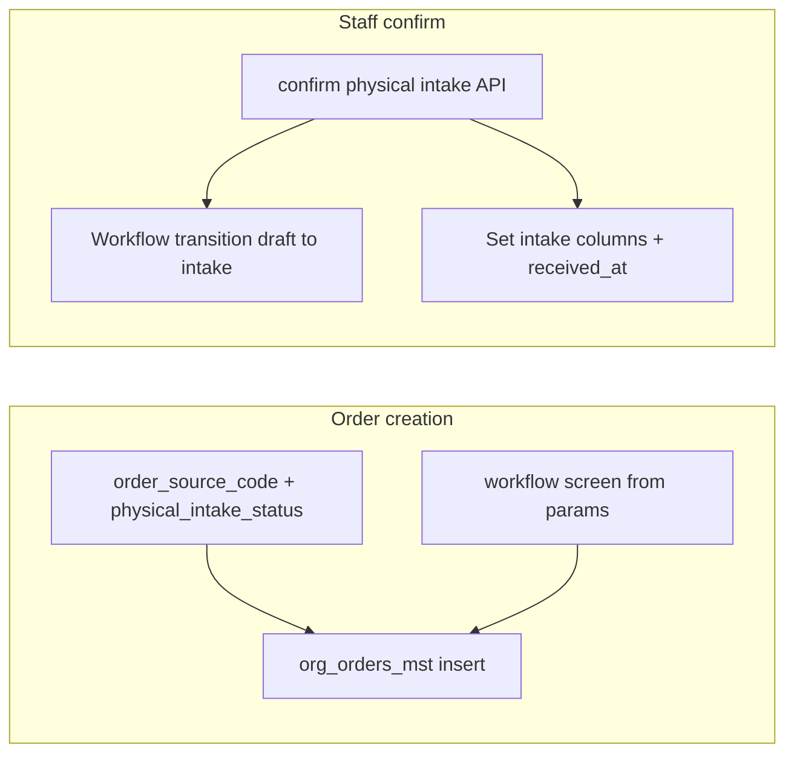

# Production-ready: order source + physical intake (mobile vs shop)

## Problem statement

Mobile bookings today become full [`OrderService.createOrder`](f:/jhapp/cleanmatex/web-admin/lib/services/order-service.ts) rows with the **`processing`** contract screen by default, while [`received_at`](f:/jhapp/cleanmatex/web-admin/prisma/schema.prisma) defaults to `now()` at insert—so the system can imply garments are on-site before they are. The fix is **two axes**: **channel** (`order_source_code` → configurable [`sys_order_sources_cd`](f:/jhapp/cleanmatex/web-admin/prisma/schema.prisma) pattern, same family as [`sys_order_type_cd`](f:/jhapp/cleanmatex/web-admin/prisma/schema.prisma)) and **physical intake** (explicit status + timestamps), plus an **early workflow status** that already participates in your transition graph.

## Key design decisions (no gaps)

1. **Reuse existing status `draft` for “booked remotely, not received at branch”**  
   The RPC [`cmx_ord_screen_pre_conditions`](f:/jhapp/cleanmatex/supabase/migrations/0130_cmx_ord_canceling_returning_functions.sql) already defines **`new_order` → `['draft']`** as the first contract status. That avoids inventing a new `current_status` value (which would ripple through [`OrderStatus`](f:/jhapp/cleanmatex/web-admin/lib/types/workflow.ts), UI meta, tenant JSON transitions, and tests).  
   **Important:** Do **not** use screen `preparation` for this: its first status is **`preparing`**, not `intake` (see [`0075_screen_contract_functions_simplified.sql`](f:/jhapp/cleanmatex/supabase/migrations/0075_screen_contract_functions_simplified.sql)).

2. **Channel is an FK to a system code table, not only JSON**  
   Keep `customer_details.source` for rich integration payload (and backward compatibility), but persist **`org_orders_mst.order_source_code`** → **`sys_order_sources_cd`** so sources are **configurable** (new POS variants, partner SaaS, WhatsApp, kiosk) without app deploys—seed core rows, add rows for third parties, deactivate via `is_active`. Align app constants with **stable codes** (e.g. `customer_mobile_app`, `pos`, `staff_mobile_app`, `driver_mobile_app`, `kiosk`, `whatsapp_bot`, `b2b_portal`, `legacy_unknown`, `api_partner_generic`—exact seed list in migration).

3. **Physical reality is explicit**  
   Add **`physical_intake_status`**, **`physical_intake_at`**, **`physical_intake_by`** (nullable), plus **free-text** **`physical_intake_info`** and **`received_info`** (`TEXT` NULL) for staff or integration notes (e.g. bag description, dock photo reference, partner payload summary)—writable at confirm-intake and optionally at order create/update where product allows.

4. **Fix `received_at` semantics for remote bookings**  
   The database column must **not** auto-populate: remove the column default so `received_at` stays **NULL** until application logic sets it (remote booking on insert; POS/confirm-intake sets timestamp explicitly). In the same migration as the new columns, run **`ALTER TABLE org_orders_mst ALTER COLUMN received_at DROP DEFAULT`** (column remains nullable `timestamp without time zone` / whatever the live type is—match production). Then: for mobile-created orders **set `received_at` to `NULL` on insert**; on staff confirm, set **`received_at` to now** together with intake fields and transition to **`intake`** (matches [`WORKFLOW_TRANSITIONS`](f:/jhapp/cleanmatex/web-admin/lib/services/workflow-constants.ts) `DRAFT → INTAKE` pattern; verify tenant-specific `org_workflow_settings_cf.status_transitions` in seeded tenants still allows `draft → intake`—document a one-time data check for production tenants). **Regression check:** every create path must **explicitly** set `received_at` when the business means “goods received at branch” so legacy behavior (implicit now) is preserved after dropping the default.

5. **Single code path for “initial workflow screen”**  
   Today [`createOrder`](f:/jhapp/cleanmatex/web-admin/lib/services/order-service.ts) and [`createOrderInTransaction`](f:/jhapp/cleanmatex/web-admin/lib/services/order-service.ts) duplicate status/contract logic (and `total_items` differs: transaction path uses `items.length` vs sum of quantities in non-transaction path—**fix while touching** to prevent subtle bugs).

## Database (Supabase migration)

Add new migration (e.g. [`supabase/migrations/0245_org_orders_mst_order_source_physical_intake.sql`](f:/jhapp/cleanmatex/supabase/migrations/0245_org_orders_mst_order_source_physical_intake.sql)):

### A. `sys_order_sources_cd` (new reference table)

Follow the same conventions as [`sys_order_type_cd`](f:/jhapp/cleanmatex/web-admin/prisma/schema.prisma) (varchar natural key, bilingual labels, audit columns):

- **Primary key**: `order_source_code` `VARCHAR(64)` (stable identifier used in APIs and integrations).
- **Display**: `name_en`, `name_ar` (or `name` / `name2` to match sibling `_cd` tables—pick one naming style and stick to it in Prisma).
- **Operational flags** (recommended so confirm-intake and workflow defaults are data-driven, not hardcoded lists):
  - `requires_remote_intake_confirm` **BOOLEAN NOT NULL DEFAULT false** — when `true`, new orders from this source use the **remote** path (`new_order` / `draft`, `physical_intake_status = pending_dropoff`, `received_at` NULL) unless overridden by explicit API params. Set **`true`** for `customer_mobile_app` (and any future self-serve channel that books before drop-off). Set **`false`** for `pos`, `staff_mobile_app` at counter, etc.
  - Optional: `sort_order`, `rec_status`, `is_active` for admin/catalog behavior later.
- **Seed rows** (minimum): `legacy_unknown`, `pos`, `web_admin`, `customer_mobile_app`, `staff_mobile_app`, `driver_mobile_app`, `kiosk`, `whatsapp_bot`, `b2b_portal`, `api_partner` (placeholder for unknown integrations—split per partner later as needed). Third-party-specific codes (e.g. `partner_acme_crm`) can be **inserted by migration or admin** without schema change.
- **RLS / grants**: match other global `_cd` tables (typically readable by authenticated; writes restricted to service role / HQ—follow existing `_cd` pattern in repo).

### B. `org_orders_mst` changes

- **`order_source_code`**: `VARCHAR(64)` NOT NULL, **FK** to `sys_order_sources_cd(order_source_code)` `ON UPDATE CASCADE` / `ON DELETE RESTRICT` (prefer **restrict** so sources cannot be deleted if referenced). Default **`legacy_unknown`** after seed.
- **`physical_intake_status`**: `VARCHAR(30)` NOT NULL default **`'received'`** for backward compatibility, then **data migration** where appropriate (e.g. rows with `customer_details->>'source' = 'customer_mobile_app'` → set source FK + `pending_dropoff` per product rules).
- **`physical_intake_at`**: `timestamptz` NULL.
- **`physical_intake_by`**: `uuid` NULL (optional FK to user).
- **`physical_intake_info`**: `TEXT` NULL — notes/metadata for the **pre–physical-receipt** phase (or integration context).
- **`received_info`**: `TEXT` NULL — notes/metadata when goods are **received at branch** (populate on confirm-intake or counter intake flows as needed).
- **Indexes** (tenant-scoped): `(tenant_org_id, order_source_code, physical_intake_status)`; partial index for queue: `(tenant_org_id) WHERE physical_intake_status = 'pending_dropoff'` (optionally AND `requires_remote_intake_confirm` resolved via join in app, or duplicate a denormalized flag only if query perf requires it—**prefer join** on list API when filtering “awaiting drop-off”).
- **`received_at` default removal (required):** `ALTER TABLE org_orders_mst ALTER COLUMN received_at DROP DEFAULT` so the column is nullable **without** `DEFAULT CURRENT_TIMESTAMP` / `now()`. Align Prisma: remove `@default(now())` from `received_at` on [`org_orders_mst`](f:/jhapp/cleanmatex/web-admin/prisma/schema.prisma) so the schema matches the database. After this change, **all order-creation code paths** must set `received_at` when intake is immediate (POS, quick drop, etc.); remote bookings leave it null until confirm-intake.

Regenerate / update [`web-admin/prisma/schema.prisma`](f:/jhapp/cleanmatex/web-admin/prisma/schema.prisma) and generated types if your workflow uses them.

## Backend: `CreateOrderParams` + `OrderService`

Files: [`web-admin/lib/services/order-service.ts`](f:/jhapp/cleanmatex/web-admin/lib/services/order-service.ts), types next to `CreateOrderParams`.

- Extend **`CreateOrderParams`** with:
  - `orderSourceCode: string` (must exist in `sys_order_sources_cd`; validate at API boundary or rely on FK insert error with friendly mapping).
  - `physicalIntakeStatus?: 'pending_dropoff' | 'received' | 'not_applicable'` — or **derive** from joined `sys_order_sources_cd.requires_remote_intake_confirm` when callers omit it (recommended for consistency).
  - `initialWorkflowScreen?: string` (optional escape hatch; normally **derived** from `orderSourceCode` + intake flags).
- **TypeScript**: export a **`const` array / union** of known codes in [`web-admin/lib/constants/order-sources.ts`](f:/jhapp/cleanmatex/web-admin/lib/constants/order-sources.ts) (or similar) **mirroring seeds** for autocomplete and tests; document that **new codes** are added in DB first, then constants for first-class support.

- **Centralize** computation of `(screen, v_orderStatus, v_current_status, v_initialStatus, v_transitionFrom, v_current_stage)` in a **private static helper** used by **both** `createOrder` and `createOrderInTransaction`.

  **Rules (default):**

  | Condition (from `sys_order_sources_cd` + overrides)                  | `physicalIntakeStatus` (initial) | Contract `screen`                | Expected initial `current_status` | `received_at` on insert |
  | -------------------------------------------------------------------- | -------------------------------- | -------------------------------- | --------------------------------- | ----------------------- |
  | `requires_remote_intake_confirm = true` (e.g. `customer_mobile_app`) | `pending_dropoff`                | `new_order`                      | `draft`                           | **NULL**                |
  | `requires_remote_intake_confirm = false` (e.g. `pos`, `web_admin`)   | `received`                       | `processing` (normal items path) | contract (often `processing`)     | **now()** (explicit)    |

- **`insertPayload` / Prisma `create`**: include `order_source_code`, intake columns, optional **`physical_intake_info`** / **`received_info`** when callers supply them; **always** set `received_at` explicitly for new orders to avoid ambiguity.

- **Public booking** [`web-admin/app/api/v1/public/customer/booking/route.ts`](f:/jhapp/cleanmatex/web-admin/app/api/v1/public/customer/booking/route.ts): pass `orderSourceCode: 'customer_mobile_app'` (or derive from tenant config later); rely on **`requires_remote_intake_confirm`** from seed for workflow + intake defaults.

- **POS create** [`web-admin/app/api/v1/orders/create-with-payment/route.ts`](f:/jhapp/cleanmatex/web-admin/app/api/v1/orders/create-with-payment/route.ts): pass `orderSourceCode: 'pos'` (or `web_admin` if you distinguish staff browser vs terminal).

- **Legacy API** [`web-admin/app/api/v1/orders/route.ts`](f:/jhapp/cleanmatex/web-admin/app/api/v1/orders/route.ts): pass `orderSourceCode: 'web_admin'` for authenticated creates.

## Customer order history (MVP—not deferred)

The authenticated customer list **already exists**: [`web-admin/app/api/v1/public/customer/orders/route.ts`](f:/jhapp/cleanmatex/web-admin/app/api/v1/public/customer/orders/route.ts) (`GET`, Bearer + `tenantId`). **Extend it in this release** (do not defer):

- **Select** `order_source_code`, `physical_intake_status`, `physical_intake_at`, `physical_intake_info` (redact or omit internal-only substrings if any), `received_info` (customer-safe subset only), `received_at`, and **embed** `sys_order_sources_cd` for display names / flags the app needs (e.g. `requires_remote_intake_confirm` to show “Bring your items to the branch”).
- **Sort**: `received_at` may be NULL for remote bookings—use **`nulls last`** (or `created_at desc` as secondary) so the list does not mis-order.
- **Flutter** [`order_booking_service`](f:/jhapp/cleanmatex/cmx_mobile_apps/packages/mobile_services/lib/src/order_booking_service.dart) / customer order history UI: consume new fields and show **plain-language** status for `pending_dropoff` + `draft` (copy in `mobile_l10n`).

## HQ Platform: global `sys_order_sources_cd` CRUD (**CleanMateX SaaS**, not web-admin)

- **Location**: implement catalog **CRUD UI + backing API** in the **CleanMateX SaaS / HQ Platform** codebase at [`F:\jhapp\cleanmatexsaas\`](f:/jhapp/cleanmatexsaas/) (**outside** this repo’s `web-admin`). Web-admin must **not** ship full sys-table editors for sources.
- **Behavior**: HQ users manage rows (codes, EN/AR names, `is_active`, `requires_remote_intake_confirm`, `sort_order`, etc.), respecting the same DB constraints (no delete if referenced—prefer deactivate).
- **Cross-repo docs**: link HQ feature ↔ Supabase table in both repos’ docs; deployment order: migration applies table/seeds first; HQ CRUD follows.

## Web-admin: per-tenant source configuration (MVP)

- **Purpose**: each tenant enables which **`order_source_code`** values are allowed (e.g. enable `customer_mobile_app` + `kiosk`, disable `whatsapp_bot` until integrated).
- **Persistence**: add a tenant-scoped table (e.g. `org_tenant_order_sources_cf`: `tenant_org_id`, `order_source_code` FK, `is_allowed`, optional `rec_order`) **or** follow an existing tenant-settings JSON pattern if the repo already standardizes on it—pick one and document.
- **Web-admin UI**: settings / catalog screen under tenant dashboard to toggle allowed sources (read global list via read-only API or Supabase read of `sys_order_sources_cd` for active rows).
- **Enforcement**: **`POST` public customer booking** and **`POST` create-with-payment** (and legacy create order) **reject** `order_source_code` not allowed for the tenant (400 with clear error code). Optional: default new tenant to “all seeded internal sources allowed.”

## Backend: confirm physical intake (production UX + atomicity)

Add **`POST /api/v1/orders/[id]/confirm-physical-intake`** (new route file under [`web-admin/app/api/v1/orders/[id]/`](f:/jhapp/cleanmatex/web-admin/app/api/v1/orders/)):

- **Auth**: `requirePermission` — prefer **`orders:transition`** (reuse) **or** a dedicated permission (if you want stricter RBAC); document in permissions catalog if your repo uses the contract-first UI access pattern ([`.codex/skills/rebuild-ui-access-contract`](f:/jhapp/cleanmatex/.codex/skills/rebuild-ui-access-contract/SKILL.md) if applicable).

- **Validation (hard gates)**:
  - Tenant match, order exists.
  - Join `sys_order_sources_cd`: **`requires_remote_intake_confirm = true`** for this order’s `order_source_code` (so new partner codes work without code changes—only DB row + flag).
  - `physical_intake_status === 'pending_dropoff'`.
  - `current_status === 'draft'` (or allow only the statuses you consider “pre-shop”; keep strict to avoid double-confirm bugs).

- **Request body (optional)**: `physical_intake_info`, `received_info` (append or set staff notes at confirmation time; validate max length server-side).

- **Transaction**:
  1. Apply workflow transition **`draft` → `intake`** using existing [`WorkflowService`](f:/jhapp/cleanmatex/web-admin/lib/services/workflow-service.ts) / same primitives as [`transition/route.ts`](f:/jhapp/cleanmatex/web-admin/app/api/v1/orders/[id]/transition/route.ts) (avoid duplicating transition SQL if a service method exists).
  2. Update `physical_intake_status = 'received'`, `physical_intake_at = now()`, `physical_intake_by = userId`, `received_at = now()`, and merge **`received_info`** / **`physical_intake_info`** when provided (and keep `status` / `current_stage` consistent with transition result).

- **Idempotency**: if already `received`, return **200 with same order** (no-op) to support double taps.

## Backend: order list API filters (for dashboards)

[`web-admin/app/api/v1/orders/route.ts`](f:/jhapp/cleanmatex/web-admin/app/api/v1/orders/route.ts) GET:

- Add optional query params: **`order_source_code`**, `physical_intake_status` (comma-separated supported like existing `status_filter`).
- Extend `baseSelect` to include `order_source_code`, intake fields, and optionally **embed** `sys_order_sources_cd(name_en, name_ar, requires_remote_intake_confirm)` for list badges without N+1 client roundtrips.

## Web-admin UI/UX (best practices)

- **Orders list**: badges from **`sys_order_sources_cd`** labels (fallback to code) + `physical_intake_status`; **RTL-safe** per [`i18n` skill](f:/jhapp/cleanmatex/.claude/skills/i18n/SKILL.md).
- **Order detail** ([`order-details-full-client.tsx`](f:/jhapp/cleanmatex/web-admin/app/dashboard/orders/[id]/full/order-details-full-client.tsx) or primary detail surface): prominent **callout** when `pending_dropoff` with explanation and **primary action** “Mark received at branch”.
- **Dedicated queue page** (recommended for ops speed): e.g. pre-filter `physical_intake_status=pending_dropoff&current_status=draft` (and optionally `order_source_code` if you segment queues per channel).
- **Prevent confusion**: ensure default “Processing” boards **do not** treat `draft` remote orders as in-plant unless the user opts in (product: default `status_filter` on processing pages should exclude `draft`, or rely on screen-specific queries already in use).

## Mobile app (customer)

Covered under **Customer order history (MVP)** above: extend API + Flutter in the same release.

## Documentation deliverables

Update or add documentation wherever operators and developers will look—**same PR as the feature** where possible, so nothing ships undocumented.

- **Migration / database**: `COMMENT ON` **`sys_order_sources_cd`**, `org_orders_mst.order_source_code`, all `physical_intake_*`, **`physical_intake_info`**, **`received_info`**. Document **`received_at` has no DB default** after migration.
- **Cross-repo**: [`F:\jhapp\cleanmatexsaas\`](f:/jhapp/cleanmatexsaas/) HQ ↔ `cleanmatex` Supabase; web-admin tenant source settings ↔ public booking validation.
- **Architecture / business logic** (repo docs, e.g. [`.claude/docs/business_logic.md`](f:/jhapp/cleanmatex/.claude/docs/business_logic.md) or [`.claude/docs/architecture.md`](f:/jhapp/cleanmatex/.claude/docs/architecture.md) if present): short subsection “Remote booking vs POS intake”—two axes (channel vs physical intake), lifecycle diagram, link to `confirm-physical-intake` API.
- **API**: JSDoc on new route, extended `GET /api/v1/orders`, and **`GET /api/v1/public/customer/orders`** response shape; Postman/catalog examples for filters, confirm-intake, and customer history.
- **Permissions / access contract**: if using contract-first UI ([`.codex/skills/rebuild-ui-access-contract`](f:/jhapp/cleanmatex/.codex/skills/rebuild-ui-access-contract/SKILL.md)), update permissions definitions, page-linked API docs, and any inspector popup copy; otherwise document which existing permission covers confirm-intake.
- **Ops runbook** (short `docs/` or `.claude/docs/` ops note): how to use the “Awaiting drop-off” queue, `draft → intake` prerequisite on tenant workflow settings, backfill behavior, and troubleshooting (order stuck in `pending_dropoff`).
- **Navigation / documentation map**: if [`.claude/docs/documentation_map.md`](f:/jhapp/cleanmatex/.claude/docs/documentation_map.md) (or equivalent) exists, add an entry for the new screen and API.
- **Mobile**: if customer-facing copy or in-app help strings are owned in a doc, note the booking state messaging and which API fields drive it.
- **Changelog / release notes**: one paragraph for the release describing behavior change for existing mobile bookings (if backfill changes inferred state).

## Testing and verification

- **Unit tests**: helper that chooses `(screen, received_at, intake status)` from `orderSourceCode` + `requires_remote_intake_confirm` (mock catalog row).
- **API/integration tests**: booking + tenant allowlist; customer `GET .../public/customer/orders` returns new fields; confirm-intake persists `received_info`; POS explicit `received_at`.
- **Manual QA script**: create booking → appears in awaiting queue → confirm → appears in intake/processing boards → `received_at` populated.

## Rollout / risk controls

- Ship migration + API + UI behind a **tenant setting** or feature flag only if you need gradual rollout; otherwise ship with safe defaults (`order_source_code = legacy_unknown`, `physical_intake_status = received` for backfilled historical rows).
- Communicate to ops: **tenant workflow JSON** must allow `draft → intake`; if any tenant removed it, add a migration note / admin script.

## Out of scope (explicit)

- Changing global meaning of `order_type_id` (still fulfillment: DELIVERY/PICKUP/POS).
- Using `order_subtype` for channel (reserved for splits).

## Phase 2 (optional, not blocking MVP)

- Advanced HQ features (bulk import of partner codes, audit export) if needed later—not required for first release.
