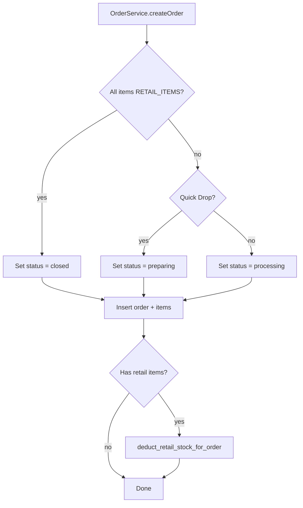

# Retail Order Terminal Status on Creation

## Context

Retail orders are POS sales where items are paid for and handed over immediately. They should not flow through the laundry workflow (preparation → processing → QA → packing → ready → delivered → closed). The enhancement sets retail orders to a terminal status at creation.

## Target Status: `closed`

From [web-admin/lib/types/workflow.ts](web-admin/lib/types/workflow.ts):

- **closed**: "Order completed and archived" — the terminal workflow state
- **delivered**: "Customer received items" — also valid for retail (handed over at POS)

**Recommendation**: Use `closed` as the terminal status for retail orders. It is the final workflow state and ensures orders do not appear on processing/ready screens. If you prefer `delivered` (e.g., for reporting "handed over" vs "archived"), this can be a single constant change.

## Current Flow

```
OrderService.createOrder() in [web-admin/lib/services/order-service.ts](web-admin/lib/services/order-service.ts)
├── Quick Drop (no/insufficient items) → preparing
├── Normal order                      → processing (or contract-based)
└── Retail orders (ALL items RETAIL_ITEMS) → currently processing (incorrect)
```

Both [create-with-payment/route.ts](web-admin/app/api/v1/orders/create-with-payment/route.ts) and [route.ts](web-admin/app/api/v1/orders/route.ts) call `OrderService.createOrder`, so one service change covers both entry points.

## Implementation

### 1. OrderService: Add Retail-Only Branch

In `OrderService.createOrder`, before the Quick Drop / Normal logic (~line 205), add:

```typescript
// Retail-only orders: skip workflow, go directly to closed
const isRetailOnlyOrder =
  items.length > 0 &&
  items.every((i) => i.serviceCategoryCode === "RETAIL_ITEMS");

if (isRetailOnlyOrder) {
  v_initialStatus = "closed";
  v_transitionFrom = "intake"; // from "intake" conceptually (order just created)
  v_orderStatus = "closed";
  v_current_status = "closed";
  v_current_stage = "closed";
  // Do NOT use workflow contract - retail skips workflow
}
```

Place this branch **before** the Quick Drop / Normal logic so it takes precedence when applicable.

### 2. Item Status for Retail

Order items use `item_status` and `item_stage`. For retail:

- `item_status`: `'closed'`
- `item_stage`: `'closed'` (or `'intake'` for audit clarity — items went from "intake" to "closed")

Recommended: use `'closed'` for both to reflect that items were handed over at POS.

### 3. Workflow Contract: Skip for Retail

Do **not** call `getInitialStatusFromContract` for retail orders. The new branch should set status and skip the `if (useOldWfCodeOrNew === false)` block for retail. Structure:

```typescript
if (isRetailOnlyOrder) {
  // ... set closed status ...
} else if (isQuickDrop === true && ...) {
  // Quick Drop path
} else {
  // Normal order path
}

// Contract fetch only for non-retail
if (!isRetailOnlyOrder && useOldWfCodeOrNew === false) {
  // ... existing contract logic ...
}
```

### 4. Constants (Optional)

Add to [web-admin/lib/constants/order-types.ts](web-admin/lib/constants/order-types.ts) or a workflow constant file:

```typescript
export const RETAIL_TERMINAL_STATUS = "closed" as const;
```

Use this constant in OrderService to keep the target status single-sourced.

### 5. Database Trigger Compatibility

The `trg_order_initial_status` trigger writes `NEW.status` to `org_order_status_history`. The inserted order will have `status: 'closed'`, so the trigger will create a correct history entry: `from_status: null, to_status: 'closed'`. No migration needed.

### 6. Documentation Updates

- [docs/features/010_advanced_orders/NEW_ORDER_QUICK_REFERENCE.md](docs/features/010_advanced_orders/NEW_ORDER_QUICK_REFERENCE.md): Under "Retail vs Services", add: "Status: Retail orders are created with status `closed` (skip workflow)."
- [docs/features/010_advanced_orders/NEW_ORDER_PAGE_DOCUMENTATION.md](docs/features/010_advanced_orders/NEW_ORDER_PAGE_DOCUMENTATION.md): In the Retail section, document that retail orders are created in `closed` status.

### 7. i18n (Optional)

If you add a success message like "Retail order created and closed", add keys to `en.json`/`ar.json`. Reuse existing keys (e.g. `newOrder.success`) if they already cover this case.

## Data Flow (Mermaid)



## Files to Modify

| File                                                                                                                                   | Change                                                                                                                                  |
| -------------------------------------------------------------------------------------------------------------------------------------- | --------------------------------------------------------------------------------------------------------------------------------------- |
| [web-admin/lib/services/order-service.ts](web-admin/lib/services/order-service.ts)                                                     | Add retail-only branch; set `closed` status; skip contract for retail; set item `item_status`/`item_stage` to `closed` for retail items |
| [web-admin/lib/constants/order-types.ts](web-admin/lib/constants/order-types.ts) or workflow constants                                 | (Optional) Add `RETAIL_TERMINAL_STATUS = 'closed'`                                                                                      |
| [docs/features/010_advanced_orders/NEW_ORDER_QUICK_REFERENCE.md](docs/features/010_advanced_orders/NEW_ORDER_QUICK_REFERENCE.md)       | Document retail order terminal status                                                                                                   |
| [docs/features/010_advanced_orders/NEW_ORDER_PAGE_DOCUMENTATION.md](docs/features/010_advanced_orders/NEW_ORDER_PAGE_DOCUMENTATION.md) | Document retail order terminal status                                                                                                   |

## Testing Checklist

- Create retail-only order via New Order → create-with-payment → verify `current_status === 'closed'`
- Create retail-only order via legacy POST `/api/v1/orders` → verify `current_status === 'closed'`
- Verify retail order does not appear on Processing, Preparation, QA, Ready screens
- Verify retail order appears in All Orders filtered by `closed`
- Verify stock deduction still runs for retail orders
- Verify mixed retail+service orders are rejected (existing validation)
- Verify status history has one entry: `from_status: null, to_status: closed`

## Alternative: `delivered` vs `closed`

If you prefer `delivered` ("customer received items") instead of `closed`:

- Change the target status to `'delivered'`
- Orders would still not appear on processing screens
- `delivered` is one step before `closed` in the workflow; some tenants may use this for "awaiting payment confirmation" before closing. For pure POS retail, `closed` is typically the better fit.
