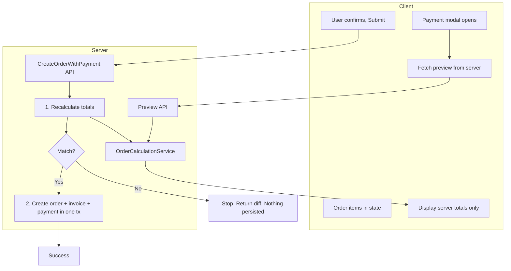

# Server-Side Payment Calculation - Full Implementation

## Architecture Overview

**Critical: Order + Invoice + Payment = One transaction. On mismatch, nothing is created.**



---

## Phase 1: Shared Order Calculation Service

### 1.1 Create `lib/services/order-calculation.service.ts`

A single service used by preview API, create-order flow, and payment processing.

**Responsibilities:**

- Accept items `[{ productId, quantity }]` + `customerId`, `isExpress`, `percentDiscount`, `amountDiscount`, `promoCode`, `giftCardNumber`
- Fetch item prices from `pricingService.getPriceForOrderItem` (catalog/price lists)
- Apply manual discount (percent or amount)
- Validate and apply promo via `validatePromoCodeAction` (or existing promo service)
- Validate and apply gift card via `validateGiftCardAction`
- Get VAT rate from `taxService.getTaxRate`
- Calculate: subtotal, afterDiscounts, taxAmount, vatValue, finalTotal
- Use tenant currency decimals for rounding
- Return `OrderCalculationResult` type

**Key function:**

```ts
export async function calculateOrderTotals(params: {
  tenantId: string;
  branchId?: string;
  items: { productId: string; quantity: number }[];
  customerId?: string;
  isExpress?: boolean;
  percentDiscount?: number;
  amountDiscount?: number;
  promoCode?: string;
  promoCodeId?: string;
  giftCardNumber?: string;
}): Promise<OrderCalculationResult>;
```

**Rounding:** Use `Number(x.toFixed(decimalPlaces))` with tenant decimals (e.g. 3 for OMR).

---

## Phase 2: Preview API (Order Not in DB)

### 2.1 Create `app/api/v1/orders/preview-payment/route.ts`

**POST** endpoint. Body:

```json
{
  "items": [{"productId": "uuid", "quantity": 2}, ...],
  "customerId": "uuid",
  "isExpress": false,
  "percentDiscount": 0,
  "amountDiscount": 0,
  "promoCode": "",
  "giftCardNumber": ""
}
```

**Logic:**

1. Validate auth, CSRF, permission `orders:create`
2. Call `calculateOrderTotals` from order-calculation.service
3. Validate promo (if provided) via existing promo validation
4. Validate gift card (if provided) via existing gift card validation
5. Return:

```json
{
  "success": true,
  "data": {
    "subtotal": 10.5,
    "manualDiscount": 0,
    "promoDiscount": 0,
    "afterDiscounts": 10.5,
    "taxRate": 0,
    "taxAmount": 0,
    "vatTaxPercent": 6,
    "vatValue": 0.63,
    "giftCardApplied": 0,
    "finalTotal": 11.13,
    "currencyCode": "OMR",
    "decimalPlaces": 3
  }
}
```

---

## Phase 3: Payment Modal - Display Server Totals

### 3.1 Refactor [payment-modal-enhanced-02.tsx](web-admin/app/dashboard/orders/new/components/payment-modal-enhanced-02.tsx)

**Current:** Totals computed in `useMemo` from client state.

**New behavior:**

1. On modal open: call `POST /api/v1/orders/preview-payment` with items, customerId, express, discount inputs, promo, gift card
2. Store server response in state: `serverTotals`
3. Display **only** `serverTotals` values (subtotal, VAT, finalTotal, etc.)
4. On input change (percent discount, amount discount, promo apply, gift card apply): **debounced** refetch (e.g. 300ms) to get new server totals
5. Show loading indicator while fetching
6. Pass `serverTotals` to `onSubmit` so submission includes what user saw

**Items source:** Payment modal receives `total` (subtotal) but not full items. We need to pass items to the modal. Add prop `items: { productId: string; quantity: number; pricePerUnit?: number }[]` to the modal. Parent (`new-order-modals`) gets items from `state.state.items` and passes them.

**Props update:**

```ts
interface PaymentModalProps {
  // ... existing
  items: { productId: string; quantity: number }[];
  isExpress?: boolean;
}
```

### 3.2 Update [new-order-modals.tsx](web-admin/src/features/orders/ui/new-order-modals.tsx)

Pass `items` and `isExpress` to `PaymentModalEnhanced02`:

```tsx
<PaymentModalEnhanced02
  items={state.state.items.map((i) => ({
    productId: i.productId,
    quantity: i.quantity,
  }))}
  isExpress={state.state.express}
  // ...
/>
```

---

## Phase 4: Create Order With Payment - Single Transaction API

### 4.1 Create new endpoint `POST /api/v1/orders/create-with-payment`

**Replaces:** Sequential calls to create order, then create invoice, then process payment.

**Request body:** Combines order data + payment data + client-reported totals:

```json
{
  "customerId": "uuid",
  "orderTypeId": "POS",
  "items": [...],
  "isQuickDrop": false,
  "express": false,
  "customerNotes": "",
  "readyByAt": "ISO string",
  "paymentMethod": "CASH",
  "percentDiscount": 0,
  "amountDiscount": 0,
  "promoCode": "",
  "promoCodeId": "",
  "promoDiscount": 0,
  "giftCardNumber": "",
  "giftCardAmount": 0,
  "checkNumber": "",
  "checkBank": "",
  "checkDate": "",
  "clientTotals": {
    "subtotal": 10.5,
    "manualDiscount": 0,
    "promoDiscount": 0,
    "vatValue": 0.63,
    "finalTotal": 11.13
  }
}
```

### 4.2 Server flow (atomic)

1. **Validate** request (schema, permissions, CSRF)
2. **Recalculate** totals via `calculateOrderTotals` (items from request, no order in DB yet)
3. **Compare** server totals with `clientTotals`:

- Tolerance: `0.001` for 3-decimal currencies
- Compare: subtotal, manualDiscount, promoDiscount, vatValue, finalTotal

1. **If mismatch:** Return immediately with `AMOUNT_MISMATCH` + differences. **No DB writes.**
2. **If match:** Start DB transaction:

- Create order (using existing OrderService.createOrder logic or equivalent)
- If INVOICE: create invoice
- If CASH/CARD/CHECK: create invoice + process payment
- Commit transaction

1. Return success with orderId, orderNo, etc.

### 4.3 Transaction scope (entities created)

**One DB transaction** wraps all writes. Entities created:

| Step | Entity              | Table                                    | When                                                                  |
| ---- | ------------------- | ---------------------------------------- | --------------------------------------------------------------------- |
| 1    | Order               | `org_orders_mst` + `org_order_items_dtl` | Always                                                                |
| 2    | Invoice             | `org_invoice_mst`                        | Always                                                                |
| 3a   | Receipt voucher     | `org_fin_vouchers_mst`                   | Only when payment method is CASH/CARD/CHECK                           |
| 3b   | Payment transaction | `org_payments_dtl_tr`                    | Only when payment method is CASH/CARD/CHECK (linked via `voucher_id`) |

**Flow for CASH/CARD/CHECK (from `payment-service.recordPaymentTransaction`):**

1. Create **receipt voucher** via `createReceiptVoucherForPayment` (voucher is parent)
2. Create **payment transaction** via `org_payments_dtl_tr.create` with `voucher_id`

**Flow for INVOICE (credit):** Only order + invoice; no receipt voucher, no payment transaction.

If any step fails, rollback everything. No orphan orders.

### 4.4 Service reuse and transaction strategy (best practice)

**Reuse existing services** — no duplication:

| Service                                                         | Function                         | Purpose                                                  |
| --------------------------------------------------------------- | -------------------------------- | -------------------------------------------------------- |
| [voucher-service.ts](web-admin/lib/services/voucher-service.ts) | `createReceiptVoucherForPayment` | Create receipt voucher (org_fin_vouchers_mst)            |
| [payment-service.ts](web-admin/lib/services/payment-service.ts) | `recordPaymentTransaction`       | Create payment row (org_payments_dtl_tr) with voucher_id |

**Transaction requirement:** These functions currently use `prisma.*` directly. To run inside the same Prisma transaction as order/invoice creation, refactor to accept an optional transaction client:

```ts
// voucher-service.ts - add optional tx (Prisma.TransactionClient from prisma.$transaction)
export async function createReceiptVoucherForPayment(
  input: CreateReceiptVoucherForPaymentInput,
  tx?: Prisma.TransactionClient
): Promise<{ voucher_id: string; voucher_no: string }> {
  const db = tx ?? prisma;
  // Use db.org_fin_vouchers_mst.create, db.org_fin_vouchers_mst.update, etc.
}

// payment-service.ts
export async function recordPaymentTransaction(
  input: CreatePaymentTransactionInput,
  tx?: Prisma.TransactionClient
): Promise<PaymentTransaction> {
  const db = tx ?? prisma;
  const { voucher_id } = await createReceiptVoucherForPayment({ ... }, db);
  // Use db.org_payments_dtl_tr.create, etc.
}
```

**Create-with-payment route** orchestrates one interactive transaction:

```ts
await prisma.$transaction(async (tx) => {
  const order = await orderService.createOrderInTx(orderInput, tx);
  const invoice = await invoiceService.createInvoiceInTx({ orderId: order.id, ... }, tx);
  if (paymentMethod !== 'INVOICE') {
    await recordPaymentTransaction(paymentInput, tx);
  }
});
```

**Best practices:**

- Single source of truth: voucher and payment logic stay in their services
- Backward compatible: when `tx` is omitted, use `prisma` (existing callers unchanged)
- Type-safe: use `Prisma.TransactionClient` or project-specific type for `tx`
- Order of operations: order → invoice → voucher → payment (respect FK constraints)

### 4.5 Refactor [use-order-submission.ts](web-admin/src/features/orders/hooks/use-order-submission.ts)

- Replace current flow (POST orders → createInvoiceAction → processPayment) with **single** `POST /api/v1/orders/create-with-payment`
- Pass full payload including `clientTotals` (from server preview the user saw)
- On `AMOUNT_MISMATCH` response: show AmountMismatchDialog, do not retry create. User refreshes and tries again.

---

## Phase 6: Amount Mismatch UI

### 6.1 Create `AmountMismatchDialog` component

A modal that:

- Shows title: "Amount Mismatch Detected"
- Lists differences in a table: Field | Your Value | Server Value
- Message: "Please refresh the page to get the correct values before proceeding."
- Buttons: [Refresh Page] [Cancel]

### 6.2 Add state and handler in new order flow

In `use-new-order-state` or new-order-reducer: add `amountMismatchDialog: { open: boolean; data?: MismatchData }`. When `AMOUNT_MISMATCH` is returned, set this and render `AmountMismatchDialog`.

---

## Phase 7: Create Order API - Return Server Totals (Optional Enhancement)

After order creation, optionally run `calculateOrderTotals` on the created order and return in response. This allows the client to confirm before opening payment modal. Lower priority; Phase 1-6 are the core.

---

## Files to Create

| File                                                             | Purpose                                         |
| ---------------------------------------------------------------- | ----------------------------------------------- | ---- | ------- |
| `lib/services/order-calculation.service.ts`                      | Shared calculation logic                        |
| `app/api/v1/orders/preview-payment/route.ts`                     | Preview endpoint                                |
| `app/api/v1/orders/create-with-payment/route.ts`                 | Single-transaction create order+invoice+payment |
| `app/dashboard/orders/new/components/amount-mismatch-dialog.tsx` | Mismatch alert UI (Field                        | Your | Server) |

## Files to Modify

| File                                             | Changes                                                                    |
| ------------------------------------------------ | -------------------------------------------------------------------------- |
| `voucher-service.ts`                             | Add optional `tx` param to `createReceiptVoucherForPayment`                |
| `payment-service.ts`                             | Add optional `tx` param to `recordPaymentTransaction`                      |
| `order-service.ts` / invoice logic               | Add tx-capable variants if needed for create-with-payment                  |
| `payment-modal-enhanced-02.tsx`                  | Fetch from preview API, display server totals only, pass items             |
| `payment-modal-enhanced.tsx`                     | Same if still in use                                                       |
| `new-order-modals.tsx`                           | Pass items, isExpress to payment modal                                     |
| `use-order-submission.ts`                        | Call create-with-payment (single API); handle AMOUNT_MISMATCH, show dialog |
| `new-order-reducer.ts` / `new-order-context.tsx` | Add amountMismatchDialog state                                             |
| `lib/types/`                                     | Add `OrderCalculationResult`, `AmountMismatchDiff` types                   |
| `messages/en.json`, `ar.json`                    | Add keys for mismatch dialog                                               |

**Files to refactor for transaction support (optional `tx` parameter):**

| File                                                            | Change                                                                                         |
| --------------------------------------------------------------- | ---------------------------------------------------------------------------------------------- |
| [voucher-service.ts](web-admin/lib/services/voucher-service.ts) | Add optional `tx` to `createReceiptVoucherForPayment`; use `tx ?? prisma` for DB calls         |
| [payment-service.ts](web-admin/lib/services/payment-service.ts) | Add optional `tx` to `recordPaymentTransaction`; pass `tx` to `createReceiptVoucherForPayment` |

Order and invoice creation: add `createOrderInTx` / `createInvoiceInTx` (or equivalent) that accept `tx` if not already supported. Existing `createOrder`, `createInvoiceAction` remain for other flows.

**Implementation order:** Refactor voucher-service → payment-service → order/invoice (if needed) before implementing create-with-payment route. Run existing tests after each refactor to ensure backward compatibility.

---

## i18n Keys

```json
"amountMismatch": {
  "title": "Amount Mismatch Detected",
  "message": "The amounts have changed. Please refresh to get the correct values before informing the customer.",
  "yourValue": "Your value",
  "serverValue": "Server value",
  "refreshPage": "Refresh Page",
  "cancel": "Cancel"
}
```

---

## Tolerance and Rounding

- OMR: 3 decimals, tolerance `0.001`
- Store tolerance in tenant settings or per-currency config
- All calculations use `Number((x).toFixed(decimalPlaces))` for consistency

---

## Error Flow Summary

1. User sees server-calculated totals in payment modal
2. User submits → single `POST /api/v1/orders/create-with-payment` with `clientTotals`
3. Server recalculates totals, compares with `clientTotals`
4. **If mismatch:** Return `AMOUNT_MISMATCH` + differences. **No DB writes. No order, invoice, or payment created.**
5. Client shows `AmountMismatchDialog` with diff details (Field | Your Value | Server Value)
6. User clicks **Refresh Page** → page reloads; nothing was created; user can retry with fresh totals
7. User clicks **Cancel** → stays on page; can refetch preview and retry (e.g. after fixing inputs)

**Transaction guarantee:** Order + invoice + payment are created atomically. On mismatch, nothing is persisted.
